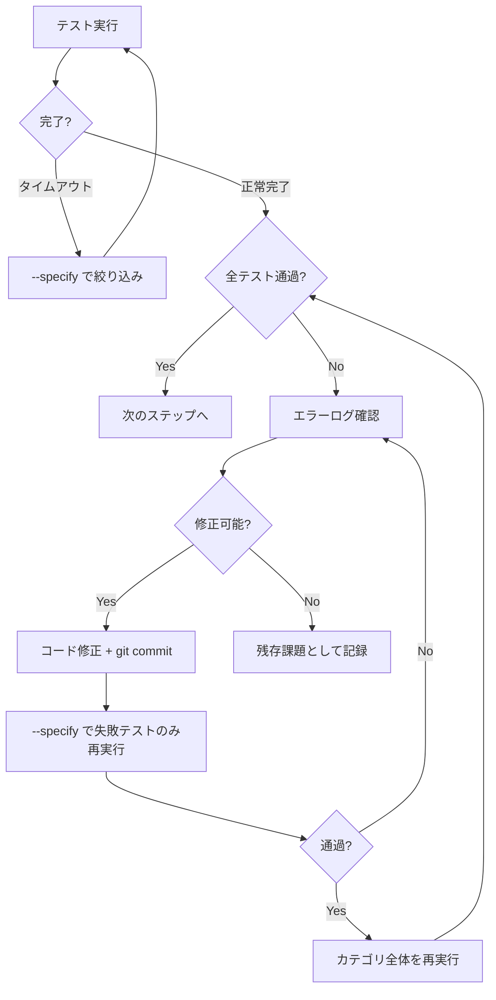

# Run All Tests

全てのビルドとテストを実行し、失敗があれば原因を調査して修正し、再度テストするループを回す。

> [!IMPORTANT]
> テスト実行の詳細ルール（Linux/Remote-SSH 対応、エラー修正フロー、タイムアウト方針等）は `prompts/rules/testing-rules.md` を参照すること。

## Phase 1: Full Build & Unit Test

// turbo
./scripts/process/build.sh

失敗した場合 → エラーログを確認し修正 → `build.sh` を再実行。全て通過するまで繰り返す。

## Phase 2: 選択的実行プランの作成

`integration_test.sh` は全カテゴリ一括実行すると非常に長時間かかるため、カテゴリ単位で分割実行する。

### 2.1 カテゴリの動的発見

```bash
./scripts/process/integration_test.sh --help   # Available categories を確認
ls -d features/backend/tests/*/                # バックエンドテストディレクトリを走査
```

`features/frontend/scripts/integration_test.sh` が存在すれば `gui` カテゴリも対象。
`features/backend/scripts/integration_test.sh` 内の `GO_CATEGORY_ORDER` から推奨順序を取得。

> **重要**: 常にこの動的発見の結果を使用すること。ハードコードされたカテゴリ名は使わない。

### 2.2 実行プランの策定

発見した全カテゴリについて実行順序を決定する。テストケースが多い場合は `--specify` で分割する。

## Phase 3: 選択的実行ループ



修正は最小限にとどめる。修正後はまず `--specify` で失敗テストのみ再実行 → 通過後にカテゴリ全体を再実行。

## Phase 4: 最終確認

Phase 3 で修正があった場合のみ実施（修正がなければスキップ可）。全カテゴリを通しで再確認する。

## Phase 5: 結果レポート & Push

全フェーズ完了後、以下をユーザーに報告する:

- **ビルド結果**: 成功 / 失敗回数
- **テスト結果**: カテゴリごとの成功 / 失敗テスト数
- **修正内容**: 修正したファイルと変更の概要
- **残存課題**: 解決できなかった問題の詳細

全テスト成功後に `git push` する。失敗状態ではプッシュしない。
