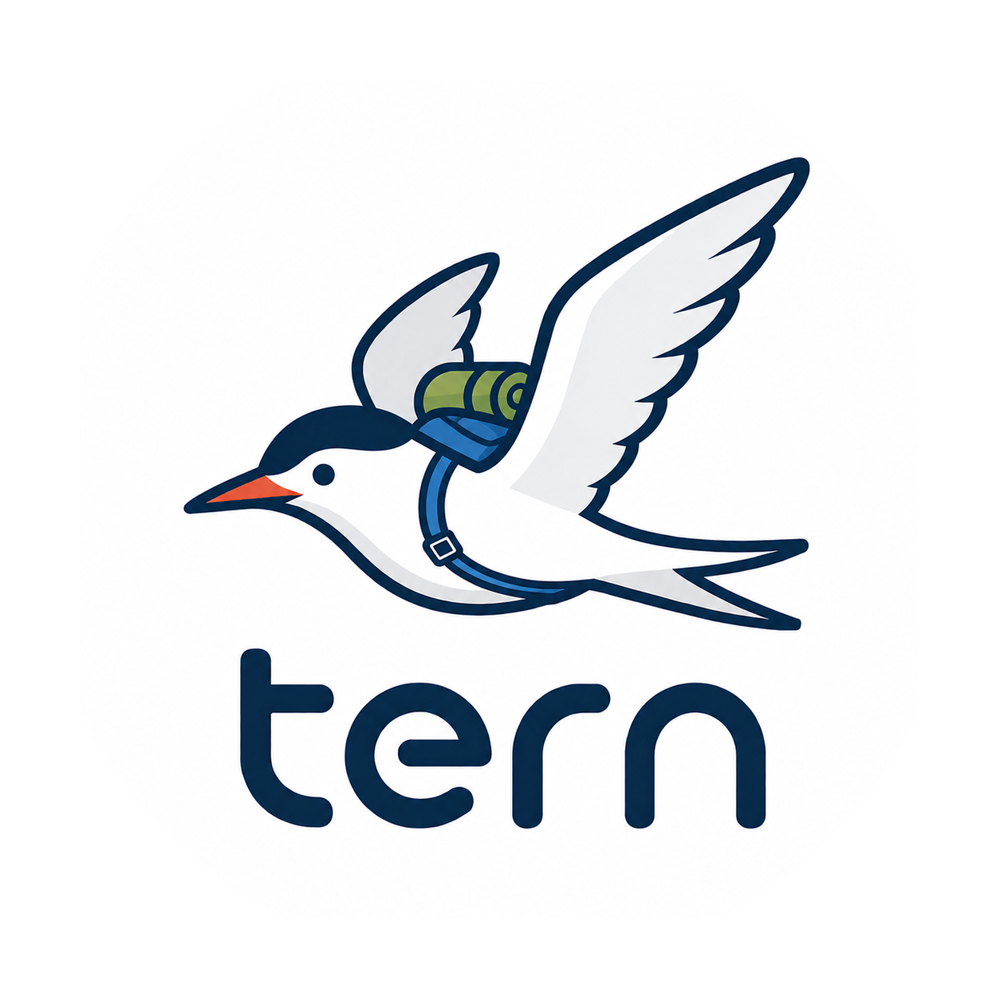

<p align="center">
  
</p>

# Tern

> Fly with the best agent. Anywhere. Anytime.

Tern is an open-source framework for running Coding Agents and Language Models through a common interoperability layer.

The project is built around a simple belief:

**The AI ecosystem evolves too quickly to commit to a single agent forever.**

New Coding Agents appear regularly.
New Language Models continuously redefine what is possible.
Local inference is becoming increasingly practical.
Deployment requirements vary across organizations and projects.

Developers should be able to adapt to these changes without rebuilding their workflows each time.

Tern aims to make that possible by enabling portable context, agent interoperability, and model interoperability.

---

## Why Tern?

The Arctic Tern is known for making one of the longest migrations on Earth.

Rather than remaining in one place, it continuously moves toward better conditions.

We believe software tooling should be able to evolve in a similar way.

A developer may prefer Claude Code today, Codex tomorrow, and a completely different agent next year. The same is true for Language Models, where capabilities, pricing, privacy requirements, and deployment options continue to change.

Tern is designed to help developers adapt to these changes while preserving the most important asset in an AI workflow: context.

---

## What Tern Provides

Tern focuses on three capabilities.

### Context Portability

Work performed in one environment should not become inaccessible when moving to another.

Tern is being designed around portable context that can move with the developer as tools evolve.

### Agent Interoperability

Coding Agents should be interchangeable.

Applications should not need to be rewritten whenever a new Coding Agent becomes available.

### Model Interoperability

Language Models should be interchangeable.

Developers should be free to choose between hosted services, private deployments, and local inference depending on their requirements.

---

## Example

The `examples/` directory contains working samples that demonstrate Tern's core concepts.

### Server (`examples/minimal-server`)

Start a tern server. All built-in coding agents and LLM providers are auto-registered by the `tern` package:

```go
package main

import (
	"context"
	"fmt"
	"log"
	"os"
	"os/signal"
	"syscall"

	"github.com/axsh/arctic-tern/tern"
)

func main() {
	srv, err := tern.New(tern.WithConfigPath("config.yaml"))
	if err != nil {
		log.Fatalf("failed to initialize: %v", err)
	}

	ctx := context.Background()
	if err := srv.Launch(ctx); err != nil {
		log.Fatalf("failed to launch: %v", err)
	}
	defer srv.Shutdown(ctx)

	fmt.Printf("tern server running on http://localhost:%d\n", srv.AgentService().Port())

	sigChan := make(chan os.Signal, 1)
	signal.Notify(sigChan, syscall.SIGINT, syscall.SIGTERM)
	<-sigChan

	fmt.Println("shutting down...")
}
```

### Client (`examples/minimal-client`)

Connect to a running tern server, create a session, and stream the response:

```go
package main

import (
	"context"
	"log"
	"os"

	"github.com/axsh/arctic-tern/client"
)

func main() {
	serverURL := "http://localhost:3100"
	if len(os.Args) > 1 {
		serverURL = os.Args[1]
	}

	ctx := context.Background()
	c := client.New(serverURL)

	session, err := c.CreateSession(ctx, client.SessionRequest{
		Agent:   "claudecode",
		Model:   "sonnet",
		WorkDir: ".",
	})
	if err != nil {
		log.Fatalf("create session: %v", err)
	}
	defer session.Terminate(ctx)
	log.Printf("Session: %s", session.ID)

	stream, err := session.SendMessage(ctx, "Create a file called hello.txt with the content 'Hello, World!'")
	if err != nil {
		log.Fatalf("send message: %v", err)
	}

	if err := stream.Output(os.Stdout); err != nil {
		log.Fatalf("stream output: %v", err)
	}
}
```

### Agent and Model Interoperability

The same client code works regardless of the underlying agent or model. Switching is a matter of changing the session parameters:

```go
// Use Claude Code with Sonnet
client.SessionRequest{Agent: "claudecode", Model: "sonnet"}

// Use Codex with GPT-5
client.SessionRequest{Agent: "codex", Model: "gpt-5.5"}
```

The surrounding application remains unchanged.

---

## Example Use Cases

### Maintain Existing Workflows

Organizations often standardize on a Coding Agent while allowing flexibility in model selection.

Examples include:

* Claude Code with hosted Anthropic models
* Claude Code with private Anthropic-compatible deployments
* Claude Code with local inference infrastructure

### Evaluate New Models

Teams should be able to experiment with new models without rebuilding integrations.

Examples include:

* GPT-5 → GPT-OSS
* Gemini → Gemma
* Hosted → Local
* Cloud → Private

### Reduce Migration Costs

The cost of changing tools often exceeds the cost of adopting them.

Tern aims to reduce that cost by providing common interfaces and portable context.

### Future: Context-Preserving Agent Migration

A long-term goal of the project is to support movement between Coding Agents while preserving context and workflow continuity.

```text
Claude Code
      ↓
    Codex
      ↓
 Gemini CLI
```

without requiring developers to start over.

---

## Vision

We envision a future where:

* Context is portable
* Coding Agents are interchangeable
* Language Models are interchangeable
* Local and cloud deployments coexist
* Vendor lock-in becomes optional

Tern is being built to support that future.

---

## Architecture Overview

Tern consists of three major components.

### CAWA

Coding Agent Web API.

CAWA defines a common interface for Coding Agents.

### LLMGP

LLM Gateway Protocol.

LLMGP defines a common interface for Language Models and inference backends.

### Integration Layer

The Integration Layer connects Coding Agents and Language Models through a unified abstraction.

Additional architectural details will be documented separately.

---

## Roadmap

### Phase 1

* [x] CAWA API specification v1
* [x] Key Vault support
* [x] Claude Code CLI adapter
* [x] Codex CLI adapter
* [ ] Gemini CLI adapter (replaced by Antigravity SDK?)
* [x] OpenAI LLM backend
* [x] Anthropic LLM backend
* [x] Google LLM backend
* [x] Ollama LLM backend

### Phase 2

* [ ] Agent interaction protocol
* [ ] MCP support
* [ ] Tern CLI
* [ ] Tern SDK
* [ ] Session portability
* [ ] Context export/import
* [ ] Agent switching
* [ ] Model switching

### Phase 3

* [ ] Context-preserving agent migration
* [ ] Live agent handoff
* [ ] Multi-agent orchestration
* [ ] Scale-out deployment
* [ ] Statistic / Prometheus

---

## Status

Tern is currently in the early design and implementation phase.

Contributors, reviewers, and early adopters are welcome.

---

## Installation

### Prerequisites

* Go 1.26 or later
* A supported Coding Agent CLI installed and available on PATH:
  * [Claude Code](https://docs.anthropic.com/en/docs/claude-code) (`claude`)
  * [Codex](https://github.com/openai/codex) (`codex`)
* API keys for at least one LLM provider (OpenAI, Anthropic, or Google)

### Build from Source

```bash
git clone https://github.com/axsh/arctic-tern.git
cd arctic-tern

# Build all features and examples
./scripts/process/build.sh
```

Built binaries are placed in the `bin/` directory:

| Binary | Description |
| --- | --- |
| `bin/tern` | Tern server (full-featured, production) |
| `bin/ternctl` | CLI client for interacting with a running tern server |
| `bin/vault-cli` | Key Vault management CLI |
| `bin/minimal-server` | Minimal server example |
| `bin/minimal-client` | Minimal client example |

---

## Quick Start

### 1. Store API keys in the vault

```bash
# Store an API key for a provider (e.g. Anthropic)
./bin/vault-cli set providers/anthropic/default
# Enter your API key when prompted
```

### 2. Configure the server

Create a `config.yaml`:

```yaml
llm_gateway:
  port: 14000
  model_profiles_path: "model_profiles.yaml"
vault:
  backend: "keyring"
agent_service:
  port: 3100
log:
  level: "info"
  outputs:
    - type: "stdout"
```

Create a `model_profiles.yaml`:

```yaml
default_profile:
  provider: anthropic
  model: claude-sonnet-4-20250514

providers:
  anthropic:
    keys:
      - name: default
        value: vault://providers/anthropic/default
        models:
          - name: claude-sonnet-4-20250514
          - name: claude-opus-4-20250514
  openai:
    keys:
      - name: default
        value: vault://providers/openai/default
        models:
          - name: gpt-4o
          - name: gpt-5.5
```

### 3. Start the server

In one terminal, start the tern server:

```bash
$ ./bin/tern --config ./features/tern/config.yaml
tern server started and running...
```

The server exposes:
* CAWA Agent Service on port `3100` (configurable via `agent_service.port`)
* LLM Gateway on port `14000` (configurable via `llm_gateway.port`)

### 4. Run a task with ternctl

Open another terminal and interact with the server:

```bash
# Check server health
$ ./bin/ternctl health

# List available agents and models
$ ./bin/ternctl agents
$ ./bin/ternctl models

# Run a coding task
$ ./bin/ternctl run \
    --agent claudecode \
    --prompt "Analyze the current directory structure and create a summary report in REPORT.md" \
    --work-dir ./tmp
```

When the task completes, ternctl outputs session details as JSON:

```json
{
  "agent_name": "claudecode",
  "id": "a95db64cb646901efb395a18d817a37d",
  "status": "completed",
  "work_dir": "tmp"
}
```

### 5. Continue an existing session

Use `--resume` with the session `id` from the previous output to continue the conversation:

```bash
$ ./bin/ternctl run \
    --resume a95db64cb646901efb395a18d817a37d \
    --prompt "Add a table of contents to REPORT.md"
```

The agent resumes the previous session with full context of the prior conversation.

### 6. Or use the Go client library

```go
c := client.New("http://localhost:3100")
session, _ := c.CreateSession(ctx, client.SessionRequest{
    Agent:   "claudecode",
    WorkDir: ".",
})
stream, _ := session.SendMessage(ctx, "Create hello.txt")
stream.Output(os.Stdout)
```

---

## Documentation

### Project Structure

```
tern/
  features/           # Deployable applications
    tern/             # Main server (CAWA + LLMGP)
    ternctl/          # CLI client
    vault-cli/        # Key Vault management CLI
  shared/libs/go/     # Shared Go libraries
    client/           # Go client library
    tern/             # Server framework
    codingagent/      # Coding Agent adapters
    llmgateway/       # LLM Gateway providers
    config/           # Configuration loading
    vault/            # Secret management
  examples/           # Working examples
    minimal-server/   # Minimal server setup
    minimal-client/   # Minimal client usage
  scripts/            # Build and test scripts
  docs/               # Documentation resources
```

Detailed API documentation and protocol specifications are planned for a future release.

---

## Design Documents

Tern is built around two core protocols:

* **CAWA (Coding Agent Web API)** -- A REST/WebSocket API that abstracts Coding Agent lifecycle and communication. Agents register themselves via Go `init()` imports, making it simple to add support for new agents.

* **LLMGP (LLM Gateway Protocol)** -- A reverse-proxy layer that routes LLM requests to configured providers (OpenAI, Anthropic, Google, Ollama). API keys are managed through a secure vault with support for keyring, environment variables, and encrypted storage.

Full protocol specifications are being developed and will be published as the project matures.

---

## Contributing

Ideas, experiments, implementation feedback, and specification discussions are welcome.

Please open an issue to start a conversation.

---

## License

Apache License 2.0. See [LICENSE](LICENSE) for details.
