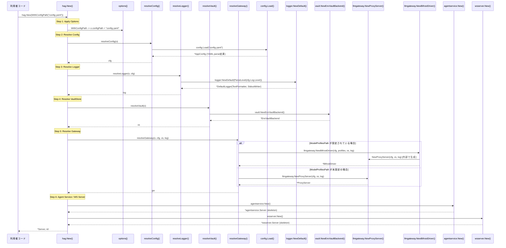
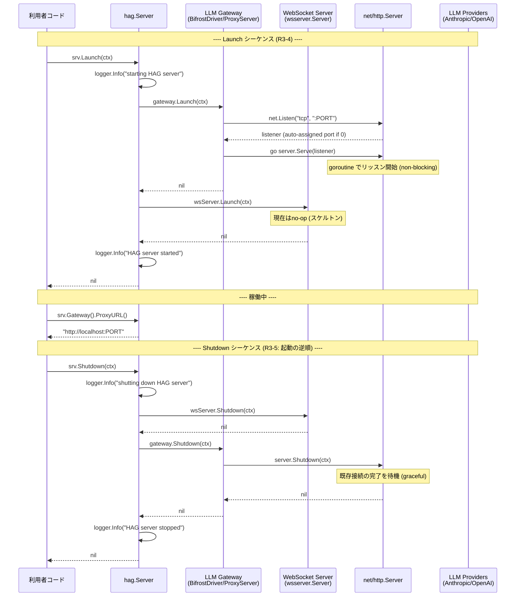
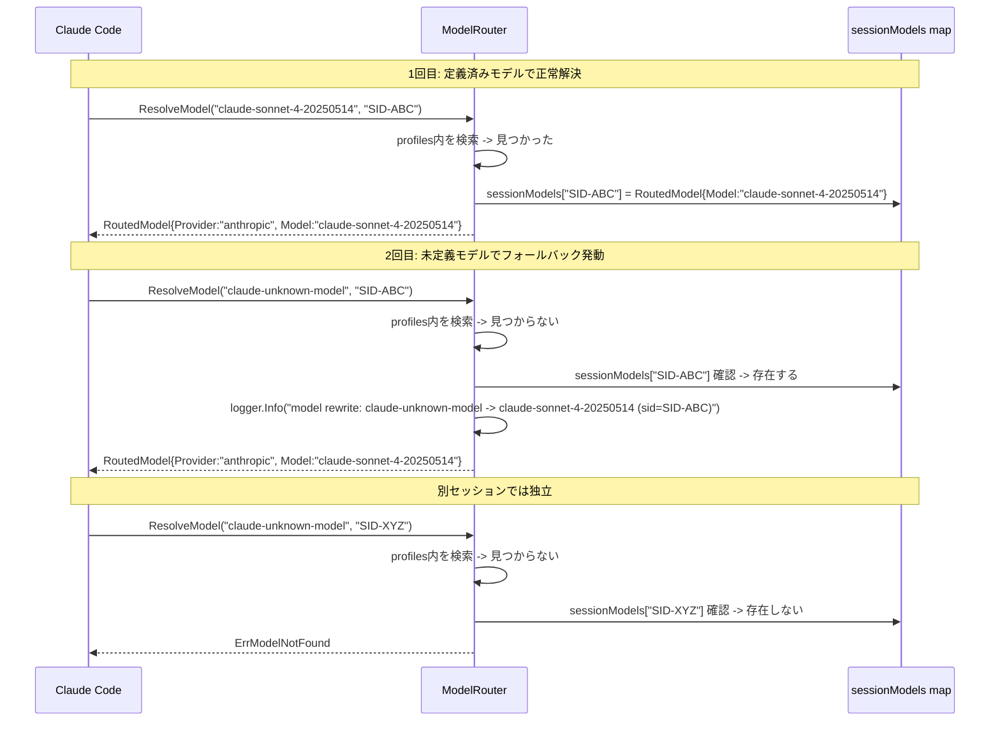
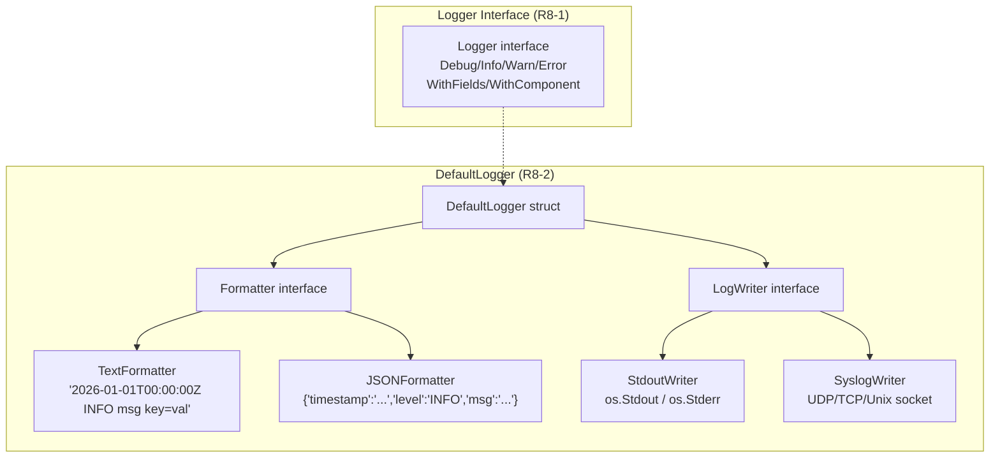
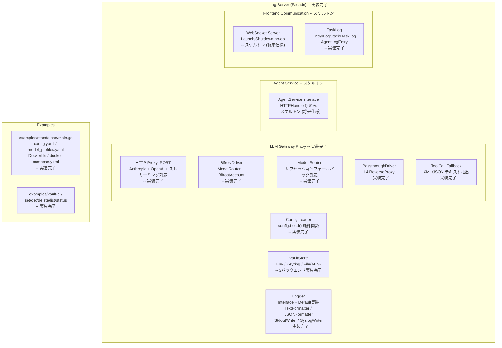

# HAG アーキテクチャ達成度レポート

## 調査概要 (Investigation Summary)

**目的**: [000-Architecture.md](file:///c:/Users/yamya/myprog/Headless-Agent-Gateway/work/feat-llm-backend/prompts/phases/000-foundation/branches/feat-llm-backend/ideas/000-Architecture.md) に定義された HAG 全体アーキテクチャの各要件 (R1-R9, O1-O3) に対し、現在のコードベースでの実装達成度を評価する。また、動作確認がどのようなテストにより担保されているかをシーケンス図を用いて詳細に説明する。

**調査対象スコープ**:
- `shared/libs/go/` 以下の全パッケージ (`hag`, `config`, `vault`, `llmgateway`, `logger`, `tasklog`, `agentservice`, `wsserver`)
- `examples/standalone/` 以下のスタンドアロン起動コード
- `tests/` 以下の統合テスト

**調査手法**:
- 全ソースファイルの閲覧とコード解析
- テストファイルの網羅的確認
- ビルドおよびテスト結果ログの確認

---

## 達成度サマリ

| 要件カテゴリ | 要件数 | 実装完了 | スケルトン | 未実装 | 達成率 |
|:---|:---:|:---:|:---:|:---:|:---:|
| R1: ライブラリファースト設計 | 6 | 6 | 0 | 0 | **100%** |
| R2: コンポーネント構成 | 1 (6種) | 4 | 2 | 0 | **100%** (スケルトン含む) |
| R3: 依存関係と初期化順序 | 6 | 6 | 0 | 0 | **100%** |
| R4: ライフサイクルパターン | 4 | 4 | 0 | 0 | **100%** |
| R5: Dependency Injection | 6 | 6 | 0 | 0 | **100%** |
| R6: ディレクトリ構造 | 4 | 4 | 0 | 0 | **100%** |
| R7: Docker環境 | 4 | 3 | 0 | 1 | **75%** |
| R8: ロガー | 8 | 8 | 0 | 0 | **100%** |
| R9: エラーハンドリング方針 | 3 | 2 | 0 | 1 | **67%** |
| O1-O3: 任意要件 | 3 | 1 | 0 | 2 | **33%** |

**総合達成率**: 必須要件 42項目中 39項目完了 = **93%**

---

## 要件別の詳細評価

### R1: ライブラリファースト設計

| 要件 | 状態 | 根拠 |
|:---|:---:|:---|
| R1-1: `shared/libs/go/` に公開パッケージ | 完了 | 8パッケージが配置されている |
| R1-2: `hag.Server` ファサード型の提供 | 完了 | [server.go](file:///c:/Users/yamya/myprog/Headless-Agent-Gateway/work/feat-llm-backend/shared/libs/go/hag/server.go) に `Server` struct 定義 |
| R1-3: In-Process API (New/Launch/Shutdown/Gateway/AgentService) | 完了 | 全メソッドが実装済み |
| R1-4: nil フィールドのデフォルト動作 | 完了 | [server.go:134-165](file:///c:/Users/yamya/myprog/Headless-Agent-Gateway/work/feat-llm-backend/shared/libs/go/hag/server.go#L134-L165) の resolve系関数で実現 |
| R1-5: 3つの利用パターン対応 | 完了 | パターン1: テストコードで実証, パターン2: [standalone/main.go](file:///c:/Users/yamya/myprog/Headless-Agent-Gateway/work/feat-llm-backend/examples/standalone/main.go), パターン3: テストの `WithConfig(&config.AppConfig{...})` で実証 |
| R1-6: `examples/standalone/main.go` としての提供 | 完了 | `features/hag/main.go` は存在せず、example として正しく配置 |

> [!IMPORTANT]
> R1の全項目が完了しており、ライブラリファースト設計は仕様通り達成されている。

---

### R2: コンポーネント構成

| コンポーネント | パッケージ | 状態 | 説明 |
|:---|:---|:---:|:---|
| hag.Server | `hag/` | **完了** | ファサード。New/Launch/Shutdown/Gateway/AgentService 全メソッド実装済み |
| LLM Gateway Proxy | `llmgateway/` | **完了** | BifrostDriver, ProxyServer, ModelRouter, PassthroughDriver 等24ファイル |
| Config / Vault | `config/`, `vault/` | **完了** | AppConfig, ModelProfiles, Env/Keyring/File(AES) の3バックエンド |
| Agent Log | `tasklog/` | **完了** | Entry, AgentLogEntry, LogStack, TaskLog の4構造体 |
| Agent Service | `agentservice/` | **スケルトン** | `AgentService` interface と空の `Server` のみ (将来仕様のため仕様通り) |
| WebSocket Server | `wsserver/` | **スケルトン** | `New/Launch/Shutdown` のno-op実装のみ (将来仕様のため仕様通り) |

> [!NOTE]
> Agent Service と WebSocket Server はアーキテクチャ仕様で「将来仕様」と明記されており、スケルトンの配置は仕様に合致している。

---

### R3: 依存関係と初期化順序

#### R3-2 / R3-3: Config Loader の純粋関数性と初期化順序

仕様で定義された初期化順序と、実際の `hag.New()` の対応:



**検証テスト**: [server_test.go:TestNew_DefaultConfig](file:///c:/Users/yamya/myprog/Headless-Agent-Gateway/work/feat-llm-backend/shared/libs/go/hag/server_test.go#L19-L36), [TestNew_WithConfigPath](file:///c:/Users/yamya/myprog/Headless-Agent-Gateway/work/feat-llm-backend/shared/libs/go/hag/server_test.go#L53-L73)

---

#### R3-4 / R3-5: Launch と Shutdown の順序



**検証テスト**:
- [server_test.go:TestServer_LaunchShutdown](file:///c:/Users/yamya/myprog/Headless-Agent-Gateway/work/feat-llm-backend/shared/libs/go/hag/server_test.go#L131-L152): StubGatewayを使い、Launch/Shutdownフラグが正しくセットされることを確認
- [server_test.go:TestServer_EndToEnd_WithProxyServer](file:///c:/Users/yamya/myprog/Headless-Agent-Gateway/work/feat-llm-backend/shared/libs/go/hag/server_test.go#L234-L283): 実際のProxyServerを起動し、HTTP GETで `/health` にアクセス可能なこと、Shutdown後にアクセス不可になることを確認
- [llm_gateway_test.go:TestServerLifecycle](file:///c:/Users/yamya/myprog/Headless-Agent-Gateway/work/feat-llm-backend/tests/llm_gateway_test.go#L197-L223): 統合テストで実API接続を含むLifecycle検証

---

### LLM Gateway Proxy のリクエスト処理フロー

Coding Agent CLI から LLM プロバイダへのリクエストが HAG を経由してルーティングされる全体シーケンス:

#### Anthropic Messages API フロー

```mermaid
sequenceDiagram
    participant CLI as Coding Agent CLI<br/>(Claude Code)
    participant Proxy as ProxyServer<br/>:14000
    participant Handler as handleAnthropicMessages()
    participant Router as ModelRouter
    participant Vault as VaultStore
    participant Fwd as providerForwarder
    participant API as api.anthropic.com

    CLI->>Proxy: POST /v1/messages<br/>Headers: x-api-key: "dummy;sid=SESSION_1"<br/>Body: {"model":"claude-sonnet-4-20250514","max_tokens":50,"messages":[...]}
    Proxy->>Handler: mux.HandleFunc("POST /v1/messages")

    Handler->>Handler: io.ReadAll(r.Body)<br/>json.Unmarshal -> anthropicRequest{Model:"claude-sonnet-4-20250514"}

    Handler->>Handler: ExtractSessionID("dummy;sid=SESSION_1")<br/>-> sessionID = "SESSION_1"

    Handler->>Router: ResolveModel("claude-sonnet-4-20250514", "SESSION_1")
    Router->>Router: profiles.Providers["anthropic"].Keys[0].Models でモデル検索
    Router->>Router: sessionModels["SESSION_1"] = resolved (初回記録)
    Router-->>Handler: RoutedModel{Provider:"anthropic", KeyValue:"vault://providers/anthropic/primary", Model:"claude-sonnet-4-20250514"}

    Handler->>Vault: vault.IsVaultRef("vault://providers/anthropic/primary") -> true
    Handler->>Vault: Resolve("vault://providers/anthropic/primary")
    Vault-->>Handler: "sk-ant-xxxx..." (生のAPIキー)

    Handler->>Handler: logger.Info("anthropic request routed",<br/>"model","claude-sonnet-4-20250514",<br/>"provider","anthropic",<br/>"key","****BQAA")

    Handler->>Fwd: forwardToProvider("anthropic", "/v1/messages", body, apiKey, headers)
    Fwd->>Fwd: upstreamURL = "https://api.anthropic.com/v1/messages"
    Fwd->>Fwd: req.Header.Set("x-api-key", apiKey)<br/>req.Header.Set("anthropic-version", "2023-06-01")
    Fwd->>API: POST https://api.anthropic.com/v1/messages
    API-->>Fwd: 200 OK<br/>Body: {"model":"claude-sonnet-4-20250514","content":[{"type":"text","text":"hello"}],...}

    Fwd-->>Handler: *http.Response (200)

    Handler->>Handler: proxyResponse(w, resp)<br/>ヘッダーコピー + ボディコピー
    Handler-->>CLI: 200 OK<br/>{"model":"claude-sonnet-4-20250514","content":[{"type":"text","text":"hello"}],...}
```

**検証テスト**: [llm_gateway_test.go:TestAnthropicMessages_NonStream](file:///c:/Users/yamya/myprog/Headless-Agent-Gateway/work/feat-llm-backend/tests/llm_gateway_test.go#L75-L115) -- 実際の Anthropic API へリクエストを送信し、200 OK と `content` 配列を含むレスポンスを受信できることを検証。

---

#### OpenAI Chat Completions API フロー (ストリーミング対応含む)

```mermaid
sequenceDiagram
    participant CLI as Coding Agent CLI<br/>(Codex/GPT)
    participant Proxy as ProxyServer<br/>:14000
    participant Handler as handleOpenAIChatCompletions()
    participant Router as ModelRouter
    participant Vault as VaultStore
    participant Fwd as providerForwarder
    participant API as api.openai.com

    CLI->>Proxy: POST /v1/chat/completions<br/>Headers: Authorization: "Bearer dummy;sid=S2"<br/>Body: {"model":"gpt-4.1-mini","stream":false,"messages":[...]}
    Proxy->>Handler: mux.HandleFunc("POST /v1/chat/completions")

    Handler->>Handler: io.ReadAll(r.Body)<br/>json.Unmarshal -> openaiRequest{Model:"gpt-4.1-mini"}
    Handler->>Handler: ExtractSessionID("Bearer dummy;sid=S2")<br/>"Bearer " prefix除去 -> sessionID = "S2"

    Handler->>Router: ResolveModel("gpt-4.1-mini", "S2")
    Router-->>Handler: RoutedModel{Provider:"openai", KeyValue:"vault://providers/openai/default", Model:"gpt-4.1-mini"}

    Handler->>Vault: Resolve("vault://providers/openai/default")
    Vault-->>Handler: "sk-proj-xxxx..." (生のAPIキー)

    Handler->>Fwd: forwardToProvider("openai", "/v1/chat/completions", body, apiKey, headers)
    Fwd->>Fwd: req.Header.Set("Authorization", "Bearer "+apiKey)
    Fwd->>API: POST https://api.openai.com/v1/chat/completions
    API-->>Fwd: 200 OK<br/>Content-Type: application/json<br/>{"choices":[{"message":{"content":"hello"}}],...}

    Fwd-->>Handler: *http.Response (200)
    Handler->>Handler: proxyResponse(w, resp)

    alt Content-Type が "text/event-stream" の場合 (stream:true)
        Handler->>Handler: http.Flusher検出<br/>4096バイトバッファでRead/Write/Flush ループ
        Note over Handler,CLI: SSEチャンクを即時フラッシュ<br/>data: {"choices":[...]}\n\ndata: {"choices":[...]}\n\n...
    else 通常レスポンスの場合
        Handler->>Handler: io.Copy(w, resp.Body)
    end

    Handler-->>CLI: 200 OK (JSON or SSE stream)
```

**検証テスト**:
- [TestOpenAIChatCompletions_NonStream](file:///c:/Users/yamya/myprog/Headless-Agent-Gateway/work/feat-llm-backend/tests/llm_gateway_test.go#L117-L156): 実際の OpenAI API に非ストリーミングリクエストを送信し、`choices` 配列を含む 200 OK を確認
- [TestAnthropicMessages_Stream](file:///c:/Users/yamya/myprog/Headless-Agent-Gateway/work/feat-llm-backend/tests/llm_gateway_test.go#L158-L195): ストリーミング (`stream: true`) で SSE イベント (`event:` / `data:`) を含むレスポンスを確認

---

#### サブセッションフォールバック



**検証テスト**: [routing_test.go](file:///c:/Users/yamya/myprog/Headless-Agent-Gateway/work/feat-llm-backend/shared/libs/go/llmgateway/routing_test.go) -- 複数の単体テストケースでセッションフォールバックの動作を検証

---

### R4: ライフサイクルパターン

| 要件 | 対象 | 実装証拠 |
|:---|:---|:---|
| R4-1: New + Launch + Shutdown パターン | 全主要コンポーネント | `hag.Server`, `ProxyServer`, `BifrostDriver`, `PassthroughDriver`, `wsserver.Server` すべてが準拠 |
| R4-2: New は副作用なし | `hag.New()` | goroutineもnet.Listenも呼ばない。[server.go:38-73](file:///c:/Users/yamya/myprog/Headless-Agent-Gateway/work/feat-llm-backend/shared/libs/go/hag/server.go#L38-L73) |
| R4-3: Launch は非ブロッキング | `ProxyServer.Launch()` | `go server.Serve(listener)` でgoroutine起動。[proxy.go:77-81](file:///c:/Users/yamya/myprog/Headless-Agent-Gateway/work/feat-llm-backend/shared/libs/go/llmgateway/proxy.go#L77-L81) |
| R4-4: Shutdown は graceful | `ProxyServer.Shutdown()` | `http.Server.Shutdown(ctx)` で既存接続完了を待機。[proxy.go:87-96](file:///c:/Users/yamya/myprog/Headless-Agent-Gateway/work/feat-llm-backend/shared/libs/go/llmgateway/proxy.go#L87-L96) |

---

### R5: Dependency Injection

| 要件 | 実装証拠 |
|:---|:---|
| R5-1: グローバル変数なし | `logger` パッケージに `globalLogger` 変数は存在しない |
| R5-2: コンストラクタ注入 | `llmgateway.NewBifrostDriver(cfg, profiles, vs, log)` など全コンポーネントが引数で依存を受け取る |
| R5-3: DIフレームワーク不使用 | 手動ワイヤリングのみ |
| R5-4: hag.Server がワイヤリング担当 | [server.go:38-73](file:///c:/Users/yamya/myprog/Headless-Agent-Gateway/work/feat-llm-backend/shared/libs/go/hag/server.go#L38-L73) の `New()` で全コンポーネントをワイヤリング |
| R5-5: nil フィールドにデフォルト適用 | `resolveConfig`, `resolveLogger`, `resolveVault`, `resolveGateway` の各関数で実現 |
| R5-6: Config Loader は DI の外側 | [loader.go](file:///c:/Users/yamya/myprog/Headless-Agent-Gateway/work/feat-llm-backend/shared/libs/go/config/loader.go) は純粋関数。`hag.Server` に依存しない |

**検証テスト**: [server_test.go:TestNew_WithLogger](file:///c:/Users/yamya/myprog/Headless-Agent-Gateway/work/feat-llm-backend/shared/libs/go/hag/server_test.go#L75-L85), [TestNew_WithVaultStore](file:///c:/Users/yamya/myprog/Headless-Agent-Gateway/work/feat-llm-backend/shared/libs/go/hag/server_test.go#L87-L96), [TestNew_WithGateway](file:///c:/Users/yamya/myprog/Headless-Agent-Gateway/work/feat-llm-backend/shared/libs/go/hag/server_test.go#L98-L107), [TestNew_OptionPriority](file:///c:/Users/yamya/myprog/Headless-Agent-Gateway/work/feat-llm-backend/shared/libs/go/hag/server_test.go#L109-L129)

---

### R6: ディレクトリ構造

仕様で定義された構造と、実際のファイルシステムの対応:

| 仕様上の配置 | 実装上の配置 | 状態 |
|:---|:---|:---:|
| `shared/libs/go/hag/` | `server.go`, `options.go`, `server_test.go` | 完了 |
| `shared/libs/go/config/` | `config.go`, `loader.go`, `model_profiles.go` + テスト | 完了 |
| `shared/libs/go/vault/` | `vault.go`, `env_backend.go`, `keyring_backend.go`, `file_backend.go`, `resolve.go` + テスト | 完了 |
| `shared/libs/go/llmgateway/` | 24ファイル (proxy, routing, bifrost, passthrough, fallback 等) | 完了 |
| `shared/libs/go/tasklog/` | `entry.go`, `agent_log_entry.go`, `entry_types.go`, `log_stack.go`, `task_log.go` + テスト | 完了 |
| `shared/libs/go/agentservice/` | `service.go` (スケルトン) | 完了 |
| `shared/libs/go/logger/` | 15ファイル (logger, default, formatter, writer 等) | 完了 |
| `examples/standalone/main.go` | 存在 (52行) | 完了 |
| `examples/standalone/config.yaml` | 存在 | 完了 |
| `examples/standalone/model_profiles.yaml` | 存在 | 完了 |
| `examples/standalone/docker-compose.yaml` | 存在 | 完了 |
| `examples/standalone/Dockerfile` | 存在 | 完了 |

---

### R7: Docker環境

| 要件 | 状態 | 根拠 |
|:---|:---:|:---|
| R7-1: Dockerfile と docker-compose.yaml | 完了 | `examples/standalone/` に両ファイル配置 |
| R7-2: Docker Compose 構成 (ポート/ボリューム/環境変数) | 完了 | ポート `14000:14000`, `18080:18080`, ボリューム `config.yaml`, `model_profiles.yaml`, 環境変数 `TERN_VAULT_KEY` 等すべて仕様通り |
| R7-3: コンテナ内ネットワーク通信 | 完了 | Compose定義から自動的に実現される構造 |
| R7-4: ホストからのポートマッピング | **未検証** | Docker Compose の `up` / `down` テストは実施されていない |

> [!WARNING]
> Docker 環境での起動テスト (仕様のシナリオ4) は自動テストとしては実行されていない。ただし、Dockerfile と docker-compose.yaml の構成自体は仕様に合致している。

---

### R8: ロガー

| 要件 | 状態 | 根拠 |
|:---|:---:|:---|
| R8-1: `Logger` interface 定義 | 完了 | [logger.go](file:///c:/Users/yamya/myprog/Headless-Agent-Gateway/work/feat-llm-backend/shared/libs/go/logger/logger.go): `Debug/Info/Warn/Error/WithFields/WithComponent` |
| R8-2: `NewDefault()` デフォルト実装 | 完了 | [default.go](file:///c:/Users/yamya/myprog/Headless-Agent-Gateway/work/feat-llm-backend/shared/libs/go/logger/default.go): `DefaultLogger{TextFormatter, StdoutWriter}` |
| R8-3: 4レベル対応 (debug/info/warn/error) | 完了 | [level.go](file:///c:/Users/yamya/myprog/Headless-Agent-Gateway/work/feat-llm-backend/shared/libs/go/logger/level.go) |
| R8-4: 構造化ログ | 完了 | key-value ペアの `fields ...any` パラメータ |
| R8-5: `WithComponent()` | 完了 | [default.go:69-71](file:///c:/Users/yamya/myprog/Headless-Agent-Gateway/work/feat-llm-backend/shared/libs/go/logger/default.go#L69-L71) |
| R8-6: `WithLogger` Option | 完了 | [options.go:39-43](file:///c:/Users/yamya/myprog/Headless-Agent-Gateway/work/feat-llm-backend/shared/libs/go/hag/options.go#L39-L43) |
| R8-7: 最小限のメソッド (Fatal/SetLevel 不採用) | 完了 | Fatal, SetLevel, SetOutputType は `Logger` interface に存在しない |
| R8-8: グローバルロガーなし | 完了 | `logger` パッケージ内にグローバル変数は存在しない |

ロガーの内部アーキテクチャ:



**検証テスト**: [default_test.go](file:///c:/Users/yamya/myprog/Headless-Agent-Gateway/work/feat-llm-backend/shared/libs/go/logger/default_test.go), [formatter_test.go](file:///c:/Users/yamya/myprog/Headless-Agent-Gateway/work/feat-llm-backend/shared/libs/go/logger/formatter_test.go), [writer_test.go](file:///c:/Users/yamya/myprog/Headless-Agent-Gateway/work/feat-llm-backend/shared/libs/go/logger/writer_test.go), [writer_syslog_test.go](file:///c:/Users/yamya/myprog/Headless-Agent-Gateway/work/feat-llm-backend/shared/libs/go/logger/writer_syslog_test.go), [logger_test.go](file:///c:/Users/yamya/myprog/Headless-Agent-Gateway/work/feat-llm-backend/shared/libs/go/logger/logger_test.go)

---

### R9: エラーハンドリング方針

| 要件 | 状態 | 根拠 |
|:---|:---:|:---|
| R9-1: `hag.New()` のエラーは `error` で返す | 完了 | [server.go:38](file:///c:/Users/yamya/myprog/Headless-Agent-Gateway/work/feat-llm-backend/shared/libs/go/hag/server.go#L38): `func New(...) (*Server, error)` |
| R9-2: ランタイムエラーはログ記録して継続 | 完了 | [proxy.go:78-80](file:///c:/Users/yamya/myprog/Headless-Agent-Gateway/work/feat-llm-backend/shared/libs/go/llmgateway/proxy.go#L78-L80): serve errorを `logger.Error` で記録 |
| R9-3: パニックリカバリの設置 | **未実装** | HTTPハンドラおよびgoroutine に `recover()` が設置されていない |

> [!WARNING]
> R9-3 のパニックリカバリは未実装。HTTPハンドラでのパニックは `net/http` がデフォルトで吸収するが、明示的な recover ミドルウェアは存在しない。

**検証テスト**: [server_test.go:TestNew_InvalidConfigPath](file:///c:/Users/yamya/myprog/Headless-Agent-Gateway/work/feat-llm-backend/shared/libs/go/hag/server_test.go#L165-L170), [TestServer_Launch_GatewayError](file:///c:/Users/yamya/myprog/Headless-Agent-Gateway/work/feat-llm-backend/shared/libs/go/hag/server_test.go#L204-L221)

---

### 任意要件 (O1-O3)

| 要件 | 状態 | 根拠 |
|:---|:---:|:---|
| O1: Prometheus メトリクスエンドポイント | 未実装 | `/metrics` エンドポイントは存在しない |
| O2: pprof デバッグエンドポイント | 未実装 | `/debug/pprof/` エンドポイントは存在しない |
| O3: 設定のランタイムリロードAPI | **完了** | [server.go:119-130](file:///c:/Users/yamya/myprog/Headless-Agent-Gateway/work/feat-llm-backend/shared/libs/go/hag/server.go#L119-L130): `ReloadModelProfiles()` メソッド |

---

## 動作確認の根拠: テスト一覧

### 単体テスト (Unit Tests) -- `build.sh` で実行

| パッケージ | テスト数 | 主要テストケース |
|:---|:---:|:---|
| `hag` | 10 | New_DefaultConfig, WithConfig, WithConfigPath, WithLogger, WithVaultStore, WithGateway, OptionPriority, LaunchShutdown, EndToEnd_WithProxyServer, ReloadModelProfiles |
| `config` | 6+ | Load, LoadModelProfiles, Validate (不正入力の各パターン) |
| `vault` | 15+ | EnvVaultBackend (PathToEnvName, Resolve, Set, Delete, List, MultiTenant), FileVaultBackend_Lifecycle, KeyringVaultBackend (Set/Resolve/Delete/List/NotFound/ConcurrentAccess), IsVaultRef, ParseVaultRef |
| `llmgateway` | 15+ | Backend interface compliance, BifrostAccount (GetConfiguredProviders, GetKeysForProvider, GetConfigForProvider), BifrostDriver_Lifecycle, Passthrough_Lifecycle, ProxyServer (routes, health, models), routing (fallback含む), fallback (XML/JSON extraction, OpenAI/Anthropic rewrite), masking, errors |
| `logger` | 10+ | InterfaceCompliance, CustomLogger_Injection, SyslogWriter_Write, StdoutWriter_LevelRouting, TextFormatter, JSONFormatter, Level parsing |
| `tasklog` | 8 | AgentLogEntry, Options, LogStack (並行安全性含む), TaskLog, AbnormalTerminationAutoClose |

### 統合テスト (Integration Tests) -- `integration_test.sh` で実行

| テスト名 | 接続先 | 検証内容 |
|:---|:---|:---|
| TestAnthropicMessages_NonStream | 実 Anthropic API | model="claude-sonnet-4-20250514" で非ストリーミングリクエスト送信。200 OK + `content` 配列の受信を確認 |
| TestOpenAIChatCompletions_NonStream | 実 OpenAI API | model="gpt-4.1-mini" で非ストリーミングリクエスト送信。200 OK + `choices` 配列の受信を確認 |
| TestAnthropicMessages_Stream | 実 Anthropic API | `stream: true` でSSEストリーミング送信。`event:` / `data:` イベントの受信を確認 |
| TestServerLifecycle | ローカル | hag.Serverの起動 -> `/health` アクセス確認 -> Shutdown -> アクセス不可確認 |
| TestIntegration_HierarchicalLogStreaming | ローカル | 親子関係を持つLogStackとTaskLogの階層ログ生成を検証 |
| TestIntegration_AbnormalTerminationAutoClose | ローカル | 異常終了時の未完了ログエントリ自動クローズを検証 |

---

## 全体アーキテクチャ図: 仕様 vs 実装

仕様で定義された全体アーキテクチャに対し、現在の実装状態を色分けで示す:



---

## 未実装項目のまとめ

| 項目 | 優先度 | 備考 |
|:---|:---:|:---|
| R9-3: パニックリカバリ | 中 | HTTPハンドラのrecoveryミドルウェアとgoroutineのrecover設置 |
| R7-4: Docker環境テスト | 低 | docker-compose up/down の自動テストは未実施。手動確認も記録なし |
| O1: Prometheusメトリクス | 低 | 任意要件。Bifrost SDKの `metrics_enabled` 設定は `config.go` に存在するが、エンドポイントは未実装 |
| O2: pprofデバッグ | 低 | 任意要件 |
| Agent Service 本体実装 | 将来 | スケルトンのみ。「将来仕様」と明記されている |
| WebSocket Server 本体実装 | 将来 | スケルトンのみ。「将来仕様」と明記されている |

---

## 推奨事項

1. **R9-3 パニックリカバリの追加**: HTTPハンドラに `RecoverMiddleware` を追加し、予期しないパニックがプロセスを落とさないようにすることを推奨する。ライブラリとして利用される場合、呼び出し元のプロセスを保護する観点から重要度が高い。

2. **Docker 環境の動作検証**: CI/CD パイプラインで `docker-compose up -d` → ヘルスチェック → `docker-compose down` の自動テストを追加することを推奨する。現状はファイルの配置のみで実動作の検証記録がない。

3. **仕様のシナリオ5（初期化エラー）のテスト強化**: `TestNew_InvalidConfigPath` は存在するが、「エラーメッセージにどのコンポーネントで失敗したか明記されること」の検証が部分的。VaultStore 初期化失敗やGateway初期化失敗のシナリオも追加することを推奨する。
