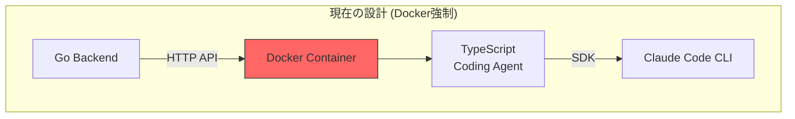
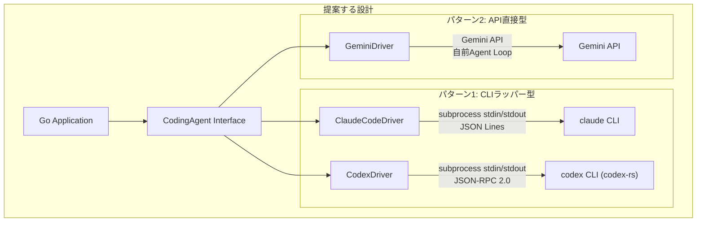

# Coding Agent 抽象化レイヤー: 既存プロジェクト調査

## 調査背景

現在のvv4 Coding Agent設計の問題点:
- **Docker強制**: コンテナ化が必須となり、コード再利用性が低い
- **TypeScript限定**: Claude Code SDKがTypeScriptのみ。vv4はGoで書かれている
- **結合度の高さ**: Coding Agent = Dockerコンテナという設計が、本質的なニーズを隠している

本質的なニーズ:
- Coding Agent CLI (Claude Code, Codex, Gemini等) を起動し、メッセージを送り、ストリーミングで応答を受け取り、セッション終了まで管理する
- 作業ディレクトリを指定し、そのスコープ内で作業させる
- バックエンドのAgent CLIとLLMモデルの両方を選択可能にする
- Dockerやコンテナに依存しない基礎レイヤーを構築する

---

## 既存プロジェクト調査結果

### 1. CLI Agent Orchestrator (CAO) - AWS Labs

**リポジトリ**: [github.com/awslabs/cli-agent-orchestrator](https://github.com/awslabs/cli-agent-orchestrator)

**アーキテクチャ**:
- Supervisor-Worker パターンで複数のCLI Agentを協調実行
- 各Agentをtmuxセッションのプロセスとして隔離
- MCP (Model Context Protocol) で通信
- Agent CLIの変更不要 -- 既存のCLIツールをそのまま利用

**HAGへの示唆**:
- CLIツールをサブプロセスとして管理する設計は参考になる
- ただし、tmux依存はライブラリとしての再利用には不向き
- MCPによるAgent間通信は将来的に有用

---

### 2. OpenCode

**サイト**: [opencode.ai](https://opencode.ai/)

**アーキテクチャ**:
- Go言語で実装されたプロバイダ非依存のCoding Agent
- クライアント-サーバーアーキテクチャ (TUI + コアロジック分離)
- `provider/model`形式のモデル指定 (例: `openai/gpt-5.2`)
- SQLiteベースのセッション永続化
- 75以上のLLMプロバイダ対応

**HAGへの示唆**:
- Go言語でプロバイダ非依存の設計を実現した先例
- `provider/model`形式はvv4のBifrostと同じパターン
- ただしOpenCode自体がAgentであり、他のAgent CLIのラッパーではない

---

### 3. Claude Code CLI のサブプロセスプロトコル

**発見**: Claude Code CLIは内部的にJSON Lines (NDJSON) プロトコルで通信しており、SDKはこのCLIのサブプロセスラッパーに過ぎない。

**キーポイント**:
- 公式SDKs (Python/TypeScript) はCLIをサブプロセスとして起動し、stdin/stdoutのJSON Linesで通信
- Go言語からも同じプロトコルで直接通信可能
- ヘッドレスモード: `-p` フラグで非対話実行
- `--output-format stream-json` で構造化ストリーミング出力
- `--bare` フラグで高速起動 (設定ファイル読み込みスキップ)

**非公式Go SDK** (コミュニティ):
- [dotcommander/agent-sdk-go](https://github.com/dotcommander/agent-sdk-go)
- [jrossi/claude-code-sdk-golang](https://github.com/jrossi/claude-code-sdk-golang)
- [schlunsen/claude-agent-sdk-go](https://github.com/schlunsen/claude-agent-sdk-go)

**HAGへの示唆**:
> [!IMPORTANT]
> TypeScript SDKを介さず、Go言語から直接Claude Code CLIをサブプロセスとして管理できる。これにより「TypeScriptのCoding Agentコンテナ」が不要になる可能性がある。

---

### 4. Codex CLI (OpenAI)

**特徴**:
- サンドボックス実行環境 (Docker/chroot)
- ヘッドレス実行対応
- stdin/stdout通信

---

### 5. Pi (Mario Zechner)

**特徴**:
- ミニマリスト設計のAgent harness
- シェルネイティブ: パイプ入出力に対応 (`cat data.csv | pi -p ...`)
- 軽量で組み込みやすい

---

### 6. OpenHarness / Ohmo

**特徴**:
- ヘッドレスワーカーモードで「サブプロセスチームメイト」として動作
- Python/TypeScript SDKで制御
- 明示的にAgent harnessとして設計されている

---

## 分析: vv4の問題に対する解決パターン

### 現在のvv4アーキテクチャの問題構造



問題: GoからClaude Code CLIを使うために、TypeScript SDK → Docker Container → HTTP APIという迂回が必要。

### 解決パターン: サブプロセス直接管理



### 設計の核心: 3層分離 + 2パターンDriver

```
Layer 1: CodingAgent Interface (純粋抽象)
  - Start(workDir, options) -> Session
  - Session.Send(message) -> StreamReader
  - Session.Close()

Layer 2: Driver (2パターンの実装方式)
  パターン1 - CLIラッパー型:
    - ClaudeCodeDriver: claude CLI + JSON Lines protocol (stdin/stdout)
    - CodexDriver: codex CLI + JSON-RPC 2.0 protocol (stdin/stdout or WebSocket)
  パターン2 - API直接型:
    - GeminiDriver: Gemini API直接呼び出し + 自前Agent Loop
    - (将来) カスタムAgentDriver: 任意のLLM API + 自前ツール実行

Layer 3: Deployment (任意の実行環境)
  - LocalDriver: ローカルサブプロセスとして実行 (CLIラッパー型)
  - ContainerDriver: Dockerコンテナ内で実行
  - RemoteDriver: リモートサーバーのAPIとして利用
```

### 各Agent CLI/SDK内部プロトコル詳細

| Agent | コアエンジン | SDKプロトコル | セッション管理 | マルチターン | MCP対応 |
|---|---|---|---|---|---|
| **Claude Code** | Node.js | JSON Lines (stdin/stdout) | session_id | 対応 | あり |
| **Codex** | Rust (codex-rs) | JSON-RPC 2.0 (stdin/stdout or WebSocket) | Thread (startThread/resumeThread) | 対応 | あり |
| **Gemini CLI** | TypeScript | **プログラマティックSDKなし** | CLIインタラクティブモードのみ | CLI内のみ | あり |

> [!IMPORTANT]
> Gemini CLIはClaude CodeやCodexとは根本的に異なり、プログラマティックSDKが存在しない。
> `@google/gemini-cli-core` は非公開APIであり安定性保証がない。
> GeminiをAgent Driverとして統合する場合は、CLIをラップするのではなく、
> Gemini API (`@google/genai` or REST) を直接呼び出して自前のAgent Loopを実装する必要がある。

---

## 推奨事項

### 1. HAGのコア設計方針の転換

現在の「TypeScript Coding Agent + Dockerコンテナ」を中心とする設計から、「Go言語によるAgent統合ライブラリ」を中心とする設計に転換すべき。

根拠:
- Claude Code CLIのプロトコルはJSON Linesであり、Go言語から直接制御可能
- Codex CLIのプロトコルはJSON-RPC 2.0であり、同様にGo言語から直接制御可能
- コミュニティのGo SDKが既に存在し (Claude Code)、実現可能性が証明されている
- Gemini CLIにはSDKがないが、Gemini APIを直接呼ぶ自前Agent Loopで対応可能
- Docker/TypeScript依存を排除することで、純粋なGoライブラリとして提供可能
- vv4がGoモジュールとして直接importできる

### 2. 段階的な設計

**Phase A: CodingAgent Interface定義**
- Go interfaceとして `CodingAgent` / `Session` / `StreamEvent` を定義
- vv4の `IAgent.ts` に相当するが、Go言語で統一
- CLIラッパー型とAPI直接型の両方を透過的に扱えるインターフェース

**Phase B: Claude Code Driver実装 (CLIラッパー型の第1弾)**
- `claude` CLIをサブプロセスとして管理するDriverを実装
- JSON Lines プロトコルでの通信
- セッション管理、ストリーミング応答

**Phase C: Codex Driver実装 (CLIラッパー型の第2弾)**
- `codex` CLI / codex-rs AppServerをサブプロセスとして管理
- JSON-RPC 2.0 プロトコルでの通信
- Thread管理、ストリーミング応答

**Phase D: Deployment層の分離**
- ローカル実行 (サブプロセス) をデフォルトに
- Docker実行はオプショナルなラッパーとして提供
- HTTP API (Web APIバウンダリ) もオプショナルなレイヤーとして提供

> [!NOTE]
> Gemini Driverは保留。Gemini CLIの公式SDKプロトコルが安定した時点で再検討する。
> コミュニティSDK (oneryalcin/gemini-cli-sdk) が存在するが、
> ワンショット中心で双方向セッション制御が制限的。

### 3. vv4との関係

```
vv4 (Go) --import--> HAG/shared/libs/go/codingagent
                      ├── interface.go      ... CodingAgent interface
                      ├── claudecode/       ... Claude Code Driver (CLIラッパー型)
                      ├── codex/            ... Codex Driver (CLIラッパー型)
                      ├── gemini/           ... Gemini Driver (API直接型)
                      └── options.go        ... WorkDir, AllowedPaths, Model設定
```

vv4は:
- `codingagent.New("claudecode", opts...)` でAgentを生成
- `session.Send("implement feature X")` でメッセージ送信
- `for event := range session.Stream() { ... }` でストリーミング受信
- Dockerコンテナが必要な場合は、vv4側で `ContainerDriver` を選択
- Driver実装がCLIラッパー型かAPI直接型かは、呼び出し側からは見えない
