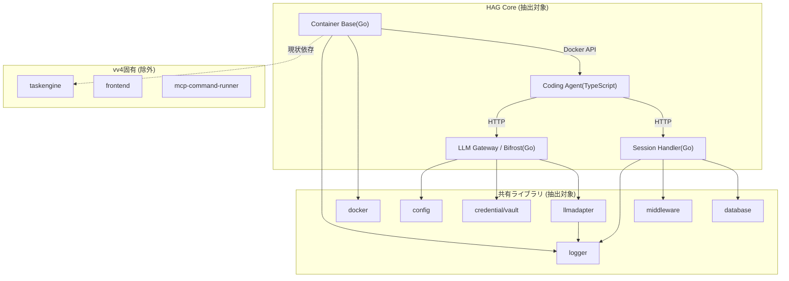
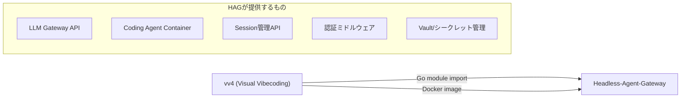

# vv4 Coding Agent アーキテクチャ調査レポート

## 調査概要

**目的**: vv4リポジトリの`feat-vibe-coding`ブランチからCoding Agent機能を切り出し、Headless-Agent-Gateway(以下HAG)として独立プロダクト化するために、抽出すべきアーキテクチャを明確にする。

**調査対象**: `reference_repo/vv4` (ブランチ: `feat-vibe-coding`)

**調査日**: 2026-06-03

---

## 調査結果: vv4の全体構造

```
vv4/
  features/
    backend/         ... Go バックエンド (Task Engine Editor)
    coding-agent/    ... TypeScript Coding Agent サービス
    frontend/        ... React フロントエンド
    image-inspector/ ... 画像検査ツール
    mcp-command-runner/ ... MCP コマンドランナー
    test-api-server/ ... テスト用APIサーバー
    test-kcp/        ... テスト用KCPサーバー
  shared/
    libs/go/         ... Go 共有ライブラリ群
  docker/            ... Docker 構成
  scripts/           ... ビルド・テスト・セットアップスクリプト
```

---

## コアアーキテクチャ: 抽出対象モジュール

### 1層: Coding Agent サービス (TypeScript)

| パス | 役割 | モジュール性 |
|------|------|-------------|
| `features/coding-agent/src/index.ts` | Express サーバーエントリポイント | 高 - 独立動作可能 |
| `features/coding-agent/src/agents/IAgent.ts` | Agent抽象インターフェース | 高 - プラグイン設計の核 |
| `features/coding-agent/src/agents/ClaudeAgent.ts` | Claude Agent SDK統合実装 | 高 - IAgentの具象実装 |
| `features/coding-agent/src/agents/factory.ts` | Agent生成ファクトリ | 高 - バックエンド切り替え |
| `features/coding-agent/src/routes/sessions.ts` | Session Web API (REST + SSE) | 高 - セッション管理の核 |
| `features/coding-agent/src/db/session.ts` | HTTPベースのセッション永続化クライアント | 高 |
| `features/coding-agent/src/middleware/bearerAuth.ts` | Bearer認証ミドルウェア | 高 |

**アーキテクチャ特徴**:
- `IAgent`インターフェースによるプラガブルなAgent実装
- SSE (Server-Sent Events) によるリアルタイムストリーミング
- `HttpSessionClient`がGoバックエンドのSession APIに委譲するアーキテクチャ (DBと疎結合)
- Bearer認証によるAPIセキュリティ
- `@anthropic-ai/claude-agent-sdk`を使用したClaude Code統合

---

### 2層: LLM Gateway / Bifrost (Go)

| パス | 役割 | モジュール性 |
|------|------|-------------|
| `shared/libs/go/llmadapter/gateway/backend.go` | `LLMGatewayBackend`インターフェース | 高 - コア抽象 |
| `shared/libs/go/llmadapter/gateway/bifrost.go` | Bifrostエンジンラッパー (745行) | 高 - 主要実装 |
| `shared/libs/go/llmadapter/gateway/proxy.go` | OpenAI/Anthropic互換HTTPプロキシ (1013行) | 高 |
| `shared/libs/go/llmadapter/gateway/config.go` | ゲートウェイ設定 | 高 |
| `shared/libs/go/llmadapter/gateway/account.go` | Bifrostアカウント管理 | 高 |
| `shared/libs/go/llmadapter/interfaces.go` | LLMClient/ProviderAdapterインターフェース | 高 |

**アーキテクチャ特徴**:
- [Bifrost SDK](https://github.com/maximhq/bifrost)によるマルチプロバイダLLM統合
- OpenAI Chat Completions API互換エンドポイント (`/v1/chat/completions`)
- Anthropic Messages API互換エンドポイント (`/v1/messages`) -- ストリーミング対応
- Responses API対応 (modelのmode設定で切り替え)
- `provider/model`形式のモデル指定による動的ルーティング
- モデルプロファイル設定 (`model_profiles.yaml`) によるプロバイダ・モデル管理

---

### 3層: Goバックエンド - セッション管理 & コンテナオーケストレーション

| パス | 役割 | モジュール性 |
|------|------|-------------|
| `features/backend/handler/session_handler.go` | Session CRUD API (Huma) | 高 |
| `shared/libs/go/taskengine/logics/claude_code.go` | ClaudeCodeLogic (1365行) | 中 - taskengine依存あり |
| `shared/libs/go/taskengine/logics/container_agent_base.go` | Dockerコンテナライフサイクル管理 | 高 - 独立抽出可能 |
| `features/backend/handler/agent_log_stream.go` | Agent実行ログSSEストリーム | 中 |

**アーキテクチャ特徴**:
- `BaseContainerAgentLogic`がDockerコンテナの起動・ヘルスチェック・停止を管理
- VFSマウントによるホスト-コンテナ間ファイル共有
- ダウンスコープJWT認証によるコンテナ-バックエンド間通信
- SSEを活用したリアルタイムAgent実行ログストリーミング

---

### 4層: 共有ライブラリ (Go)

| パス | 役割 | HAGへの必要性 |
|------|------|-------------|
| `shared/libs/go/logger/` | 構造化ロギング (stdout/syslog) | 必須 |
| `shared/libs/go/config/` | YAML設定ローダー + 構造体定義 | 必須 |
| `shared/libs/go/credential/` | Vault (APIキー/シークレット管理) | 必須 |
| `shared/libs/go/database/` | GORM DB初期化 + ヘルスチェック | 必須 |
| `shared/libs/go/middleware/` | Bearer/JWT/PEP認証ミドルウェア | 必須 |
| `shared/libs/go/docker/` | Docker操作ユーティリティ | 必須 |
| `shared/libs/go/llmadapter/` | LLMアダプタ全体 | 必須 |
| `shared/libs/go/cache/` | キャッシュストア | 任意 |
| `shared/libs/go/jwtutil/` | JWTユーティリティ | 必須 |
| `shared/libs/go/openapi/` | OpenAPIスキーマ | 任意 |

---

### 5層: Docker & インフラ構成

| パス | 役割 |
|------|------|
| `docker/coding-agent/Dockerfile` | Coding Agentコンテナイメージ |
| `docker/coding-agent/entrypoint.sh` | コンテナエントリポイント |
| `docker/docker-compose.yml` | サービス構成 (syslogd, postgres, ollama等) |

---

### 6層: ビルド・テスト・スクリプト

| パス | 役割 |
|------|------|
| `scripts/process/build.sh` | 全体ビルド + 単体テスト |
| `scripts/process/integration_test.sh` | 統合テストランナー |
| `scripts/setup/setup_containers.sh` | Dockerコンテナセットアップ |
| `scripts/setup/build_coding_agent_image.sh` | Coding Agentイメージビルド |
| `scripts/setup/setup_secrets.sh` | シークレットセットアップ |

---

## 依存関係マップ



---

## 分析: 抽出戦略

### コア (最優先抽出)

| コンポーネント | vv4パス | HAGパス案 | 依存の切り離し |
|-------------|--------|----------|-------------|
| Coding Agent サービス | `features/coding-agent/` | `features/coding-agent/` | そのまま移行可能 |
| LLM Gateway (Bifrost + Proxy) | `shared/libs/go/llmadapter/gateway/` | `shared/libs/go/llmgateway/` | llmadapterから分離 |
| Session API | `features/backend/handler/session_handler.go` | `features/gateway-server/handler/` | taskengineから独立化 |
| Container Orchestration | `shared/libs/go/taskengine/logics/container_agent_base.go` | `shared/libs/go/container/` | **taskengineから切り離しが必要** |
| ClaudeCode Logic | `shared/libs/go/taskengine/logics/claude_code.go` | `features/gateway-server/logic/` | taskengine依存を除去 |

### 共有ライブラリ (そのまま抽出可能)

以下は独立性が高く、そのまま移行可能:
- `logger` - 依存なし
- `config` - `database`パッケージのみ参照
- `credential` - 依存なし
- `database` - GORM + `config`
- `middleware` - 標準ライブラリ + JWT
- `docker` - 標準ライブラリのみ
- `cache` - 依存なし
- `jwtutil` - 依存なし

### 認証・キー管理 (フレキシブル設計が必要)

現在のvv4認証アーキテクチャ:

1. **Extension Bearer認証** (`middleware/auth.go`): UUIDトークンによるExtension-Server間認証
2. **JWT認証** (`middleware/jwt.go`): JWTベースのユーザー認証
3. **PEP (Policy Enforcement Point)** (`middleware/permissions.go`): 権限チェック
4. **SPI (Service Provider Interface)** (`features/backend/spi/`): PDP/TokenIssuer/Verifier抽象
5. **Vault** (`shared/libs/go/credential/`): APIキー・シークレットの暗号化保管
6. **Downscope JWT**: コンテナ向け最小権限トークン発行

HAG向けの設計方針:
- 認証はプラガブルにすべき (Bearer/JWT/API Key/OAuth2)
- Vault層はそのまま活用可能
- SPIパターンはローカル認証とプロダクション認証の切り替えに有効

---

## 除外対象 (vv4固有の機能)

以下はvv4のVisual Vibecoding固有であり、HAGには含めない:

- `taskengine/` の大部分 (graph, loader, editor, editorgraph, analyzer, validator等)
- `features/frontend/` (React Webview)
- `features/mcp-command-runner/`
- `features/image-inspector/`
- `features/backend/handler/` の多くのハンドラ (scaffold, kanban, logic, deployment等)
- `features/backend/service/` (RPC Registry, Function Groups等)
- `features/backend/adapter/` (KCP, MCP, WebAPI adapters)

---

## 推奨事項

### 1. アーキテクチャ設計方針

**HAGの目標構造** (提案):

```
Headless-Agent-Gateway/
  features/
    coding-agent/          ... TypeScript Coding Agentサービス (vv4からほぼそのまま)
    gateway-server/        ... Go APIサーバー (Session API + LLM Gateway Proxy)
      handler/             ... Session/Health/Auth ハンドラ
      logic/               ... ClaudeCodeLogic (taskengine依存除去版)
  shared/
    libs/go/
      config/              ... 設定ローダー
      container/           ... Dockerコンテナオーケストレーション (container_agent_base切り出し)
      credential/          ... Vault/シークレット管理
      database/            ... DB初期化・リポジトリ
      docker/              ... Docker操作ユーティリティ
      llmgateway/          ... Bifrost + Proxy (llmadapter/gateway切り出し)
      logger/              ... 構造化ロギング
      middleware/           ... 認証ミドルウェア
  docker/
    coding-agent/          ... Coding Agentコンテナ
    docker-compose.yml     ... 開発環境構成
  scripts/
    process/               ... ビルド・テストスクリプト
    setup/                 ... 環境セットアップ
```

### 2. 切り出し時の重要なリファクタリングポイント

> [!IMPORTANT]
> `container_agent_base.go`と`claude_code.go`は現在`taskengine/logics`パッケージに属しており、`graph.VFSMount`、`graph.Logic`、`tasklog.TaskLog`等のtaskengine型に依存している。HAGでは以下の対応が必要:
> - `graph.VFSMount`相当の型をHAG独自に定義
> - `graph.Logic`/`graph.FunctionLogic`インターフェースはHAGのコンテキストに合わせて再定義
> - `tasklog`依存はHAG独自のロギング抽象に置き換え

> [!IMPORTANT]
> `main.go`は1094行の巨大なエントリポイントで、多くのvv4固有初期化コードを含む。HAGのエントリポイントはCoding Agent関連の初期化のみに絞って新規作成すべき。

### 3. vv4からの再利用パス

最終的にvv4がHAGを利用する際のアーキテクチャ:



vv4は以下の方法でHAGを利用可能:
- **Go module依存**: `shared/libs/go/`配下のパッケージをGoモジュールとしてインポート
- **Dockerイメージ**: Coding Agentコンテナイメージを直接利用
- **API呼び出し**: LLM Gateway ProxyやSession APIをHTTP経由で利用

### 4. 優先度付き抽出順序

1. **Phase 1**: 共有ライブラリ群 (`logger`, `config`, `credential`, `database`, `middleware`, `docker`)
2. **Phase 2**: LLM Gateway (`llmadapter/gateway/` -> `llmgateway/`)
3. **Phase 3**: Container Orchestration (`container_agent_base.go`のtaskengine依存除去)
4. **Phase 4**: Coding Agent TypeScriptサービス + Session Handler
5. **Phase 5**: Docker構成 + ビルド/テストスクリプト
6. **Phase 6**: Gateway Serverエントリポイント (`main.go`新規作成)
