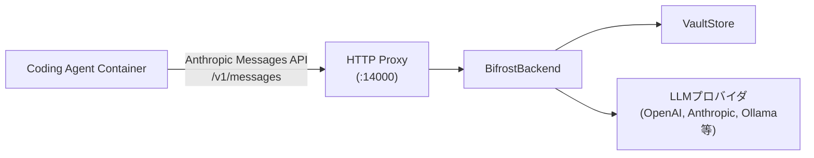
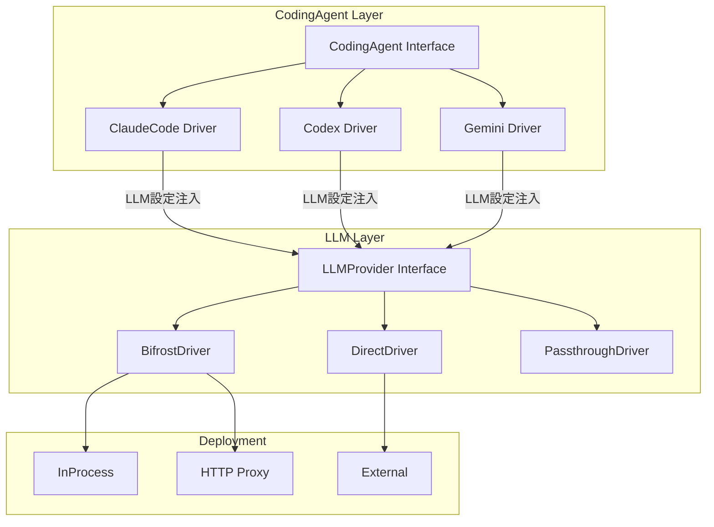

# LLM バックエンド設計: 多層アーキテクチャ検討

## 背景

vv4の現行設計ではLLM Gatewayとして[Bifrost SDK](https://github.com/maximhq/bifrost)を使い、OpenAI/Anthropic互換のHTTPプロキシを提供している。HAG(Headless-Agent-Gateway)として独立させる際に、LLM層も多層設計で再構築する必要がある。

本ドキュメントでは、Coding Agent層とLLM Provider層の関係を整理し、設計方針を記録する。

---

## vv4の現行LLM設計

### 構成要素

| コンポーネント | パス (reference_repo/vv4基準) | 役割 |
|---|---|---|
| `LLMGatewayBackend` interface | `shared/libs/go/llmadapter/gateway/backend.go` | LLMバックエンド抽象インターフェース |
| `BifrostBackend` | `shared/libs/go/llmadapter/gateway/bifrost.go` | Bifrost SDKラッパー (745行) |
| HTTP Proxy | `shared/libs/go/llmadapter/gateway/proxy.go` | OpenAI/Anthropic互換HTTPサーバー (1013行) |
| `GatewayConfig` | `shared/libs/go/llmadapter/gateway/config.go` | ゲートウェイ設定 |
| `KotoshiroAccount` | `shared/libs/go/llmadapter/gateway/account.go` | Bifrostアカウント (Vault連携) |
| `ModelProfilesConfig` | `shared/libs/go/config/structs.go` | プロバイダ/キー/モデル定義 |

### データフロー



### 対応するAPIフォーマット

- **OpenAI Chat Completions**: `/v1/chat/completions`
- **Anthropic Messages**: `/v1/messages` (ストリーミング対応)
- **OpenAI Responses**: Bifrostのmode設定でルーティング
- **モデル一覧**: `/v1/models`

### モデルプロファイル設定 (model_profiles.yaml)

```yaml
default_profile:
  provider: "ollama"
  model: "qwen2.5-coder:7b"
providers:
  ollama:
    keys:
      - name: "default"
        value: "vault:ollama_key"
        models:
          - name: "qwen2.5-coder:7b"
            mode: "chat"           # "chat" or "responses"
          - name: "gemma3:4b"
    network_config:
      base_url: "http://localhost:11434"
  openai:
    keys:
      - name: "primary"
        value: "vault:openai_key"
        models:
          - name: "gpt-4o"
            mode: "responses"
```

### 特徴

- `provider/model`形式のモデル指定 (例: `ollama/qwen2.5-coder:7b`)
- Bifrost SDKが内部でプロバイダ別のAPI変換を実行
- VaultStoreによるAPIキーの暗号化管理
- Chat Completions APIとResponses APIの両方に対応

---

## 問題分析: Agent CLIとLLM Gatewayの関係

### Agent CLIが持つ独自のLLM接続機構

各Agent CLIは、それぞれ独自のバックエンドモデル設定方法を持っている:

| Agent CLI | モデル/バックエンド切り替え方法 |
|---|---|
| **Claude Code** | `ANTHROPIC_BASE_URL` + `ANTHROPIC_API_KEY` 環境変数。`--model` フラグ。Anthropic API形式を前提とするため、他プロバイダ使用時はプロキシ(翻訳層)が必要 |
| **Codex** | `~/.codex/config.toml` の `[model_providers.<id>]` で `base_url`, `env_key`, `wire_api` を定義。プロファイル機能でランタイム切り替え可能 |
| **Gemini CLI** | `GOOGLE_GEMINI_BASE_URL` 環境変数でリダイレクト。LiteLLMやBifrostをプロキシとして使うパターンが主流 |

### 設計上の選択肢

```
選択肢A: Agent CLI内蔵のLLM接続をそのまま使う
  [HAG] --> [Agent CLI] ---直接---> [LLMプロバイダ]

選択肢B: LLM Gatewayを間に挟む (vv4の現行設計)
  [HAG] --> [Agent CLI] ---> [Bifrost/LLM Gateway] ---> [LLMプロバイダ]

選択肢C: Agent Driverが環境変数でLLM設定を注入
  [HAG] --> [Agent Driver] --env vars--> [Agent CLI] ---> [LLMプロバイダ or Gateway]
```

**選択肢Bの利点** (HAGでLLM Gateway層を維持する理由):
- プロバイダAPIキーをAgent CLIに直接渡さずVaultで管理できる
- ルーティング、フォールバック、レート制限を一元管理できる
- Agent CLIがどのプロバイダのAPIフォーマットを要求するかに関係なく、Gatewayが翻訳する
- 例: Claude Code (Anthropic API形式) が OpenAI のモデルを使いたい場合、GatewayがAnthropic形式をOpenAI形式に変換

**選択肢Cの柔軟性**:
- DriverがAgent CLI起動時の環境変数やconfig生成でLLM設定を注入する
- Gateway使用/不使用をDriver側で透過的に切り替えられる
- Agent CLIの設定機構を最大限活用できる

### 推奨: 選択肢B + Cの組み合わせ

Agent DriverがLLM設定を受け取り、必要に応じてGateway URLを環境変数としてAgent CLIに注入する。

```
[HAG Application]
    |
    ├── CodingAgent Interface + LLM設定
    |       |
    |       v
    ├── Agent Driver (Claude Code / Codex / Gemini)
    |       |
    |       +-- 環境変数注入: ANTHROPIC_BASE_URL=http://localhost:14000
    |       +-- 環境変数注入: ANTHROPIC_API_KEY=<vault-managed-key>
    |       |
    |       v
    ├── Agent CLI (サブプロセス)
    |       |
    |       v
    └── LLM Gateway (Bifrost HTTP Proxy)
            |
            v
        LLMプロバイダ (OpenAI, Anthropic, Ollama, etc.)
```

---

## 提案: LLM層の多層設計

CodingAgent層と同じ3層分離の考え方をLLM層にも適用する。

### Layer 1: LLMProvider Interface (純粋抽象)

```go
// LLMProvider はLLMバックエンドの抽象インターフェース
type LLMProvider interface {
    ChatCompletion(ctx context.Context, req *ChatRequest) (*ChatResponse, error)
    Stream(ctx context.Context, req *ChatRequest) (<-chan *StreamChunk, error)
    Shutdown()
    Name() string
}
```

vv4の `LLMGatewayBackend` インターフェースに相当。

### Layer 2: Backend Driver

| Driver | 説明 | 用途 |
|---|---|---|
| `BifrostDriver` | Bifrost SDKによるマルチプロバイダ統合 | プロダクション。複数プロバイダを統合管理 |
| `DirectDriver` | 特定プロバイダAPIへの直接HTTP接続 | シンプルな単一プロバイダ構成 |
| `PassthroughDriver` | Agent CLIに丸投げ (Gatewayなし) | Agent CLIの内蔵LLM接続をそのまま使う場合 |

### Layer 3: Deployment

| Deployment | 説明 | 用途 |
|---|---|---|
| `InProcess` | 同一プロセス内でBifrostエンジンを起動 | 組み込み用途、vv4のデフォルト |
| `HTTPProxy` | 別プロセスのLLM Gateway Proxyに接続 | マイクロサービス構成、Docker環境 |
| `External` | 外部LLMサービスURL | クラウドホスティング、SaaS |

### 全体の組み合わせ図



---

## Agent CLI別: LLM設定の注入方法

### Claude Code

```go
// ClaudeCode DriverがAgent CLI起動時に設定する環境変数
env := map[string]string{
    "ANTHROPIC_BASE_URL": gatewayURL,  // LLM Gateway URL
    "ANTHROPIC_API_KEY":  vaultKey,    // Vault管理のキー
}
// モデル指定
args := []string{"--model", modelName}
```

Claude CodeはAnthropic APIフォーマットを前提とするため、OpenAIやOllamaのモデルを使う場合はLLM Gatewayが翻訳レイヤーとして機能する。

### Codex

```go
// Codex DriverがAgent CLI起動前に設定ファイルを生成
configToml := fmt.Sprintf(`
model = "%s"
model_provider = "gateway"

[model_providers.gateway]
name = "HAG LLM Gateway"
base_url = "%s"
env_key = "OPENAI_API_KEY"
wire_api = "chat"
`, modelName, gatewayURL)
```

Codexは`config.toml`で柔軟にプロバイダを定義できるため、Gateway URLを直接設定可能。

### Gemini CLI

```go
// Gemini DriverがAgent CLI起動時に設定する環境変数
env := map[string]string{
    "GOOGLE_GEMINI_BASE_URL": gatewayURL,
    "GOOGLE_API_KEY":         vaultKey,
}
```

Gemini CLIは `GOOGLE_GEMINI_BASE_URL` でAPIエンドポイントをリダイレクト可能。ただしGemini APIフォーマットとの互換性が必要。

---

## Agent CLI別: Goクライアント通信の実現可能性

### 比較表

| Agent | コアエンジン | SDKプロトコル | マルチターン | Go制御 | 成熟度 |
|---|---|---|---|---|---|
| **Claude Code** | Node.js | JSON Lines (stdin/stdout) | 対応 (session_id) | Go SDKあり (3プロジェクト以上) | 高 |
| **Codex** | Rust (codex-rs) | JSON-RPC 2.0 (stdin/stdout or WebSocket) | 対応 (Thread: startThread/resumeThread) | JSON-RPCは汎用プロトコルでGo実装容易 | 高 |
| **Gemini CLI** | TypeScript | **プログラマティックSDKなし** | CLIインタラクティブモードのみ | CLIラップは不安定。**API直接型が必要** | 低 |

### Codex SDK内部アーキテクチャ詳細

Codex SDK (`@openai/codex-sdk`) は当初「単純なstdioパイプ」と想定していたが、実際にはClaude Code SDKと同等のリッチな双方向プロトコルを持つ:

- **トランスポート**: `codexExec` (ワンショット) と `codexAppServer` (永続セッション) の2種類
- **プロトコル**: JSON-RPC 2.0 (JSONL over stdio or WebSocket)
- **ライフサイクル**: `initialize` -> `thread/start` -> turn API -> ストリーミング通知
- **codex-rs (Rust)**: コアエンジンはRustで実装。tokio非同期ランタイム上でイベント駆動
- **MCP対応**: クライアント/サーバー両方として動作可能

### Gemini CLIの制約と代替アプローチ

> [!WARNING]
> Gemini CLI (`@google/gemini-cli`) はClaude CodeやCodexとは根本的に異なり、プログラマティックSDKが存在しない。
> `@google/gemini-cli-core` は非公開APIであり安定性保証がない。
> CLIをサブプロセスとして使う場合、ANSIエスケープコードのパースが必要で脆弱。

GeminiをAgent Driverとして統合する正しい方法:

1. **CLIを使わない**: Gemini API (`google-genai` SDK or REST API) を直接呼び出す
2. **自前Agent Loopを実装**: Tool定義 -> generateContent() -> Tool Call実行 -> 結果フィードバック
3. **Google ADK (Agent Development Kit)** も検討対象

### 設計への影響: 2パターンのDriver実装

Claude CodeとCodexはどちらもリッチな双方向セッションプロトコルを持つため、「最低公約数のワンショット」に合わせる必要はなく、**マルチターンセッションを基本設計として採用できる**。

```go
// CodingAgent は全てのDriver実装が満たすインターフェース
// CLIラッパー型 (Claude Code, Codex) と API直接型 (Gemini) の両方が実装可能
type CodingAgent interface {
    CreateSession(ctx context.Context, opts ...Option) (Session, error)
    Close() error
}

type Session interface {
    Send(ctx context.Context, message string) (<-chan StreamEvent, error)
    Close() error
    ID() string
}
```

Driver実装の2パターン:

```
パターン1: CLIラッパー型 (Claude Code, Codex)
  Driver --> subprocess (CLI binary) --> stdin/stdout プロトコル
  - Claude Code: JSON Lines
  - Codex: JSON-RPC 2.0

パターン2: API直接型 (Gemini, 将来の独自 Agent)
  Driver --> LLM API --> 自前Agent Loop (Tool呼び出し, ファイル操作)
```

呼び出し側からは `CodingAgent` interface の裏側がCLIラッパー型かAPI直接型かは見えない。

---

## 次のステップ

この設計検討を踏まえ、以下の順序で進めることを推奨:

1. `/create-specification` で CodingAgent Interface + LLM Provider Interface の仕様書を作成
2. Claude Code Driverを最初の実装対象として実装計画を策定 (CLIラッパー型の第1弾)
3. Codex DriverをCLIラッパー型の第2弾として実装
4. LLM Gateway (Bifrost) は既存のvv4コードをベースに分離・リファクタリング

> [!NOTE]
> Gemini Driverは保留とする。Gemini CLIにはClaude CodeやCodexのような公式プログラマティックSDKが存在せず、
> CLIラッパーとしての成熟度が低い。v0.6.1で `--output-format json` やセッション記録が追加され
> コミュニティSDK (oneryalcin/gemini-cli-sdk) も存在するが、ワンショット中心で双方向セッション制御が制限的。
> 将来的にGemini CLIの公式SDKプロトコルが安定した時点、または
> Gemini API直接型 (自前Agent Loop) の需要が明確になった時点で再検討する。
