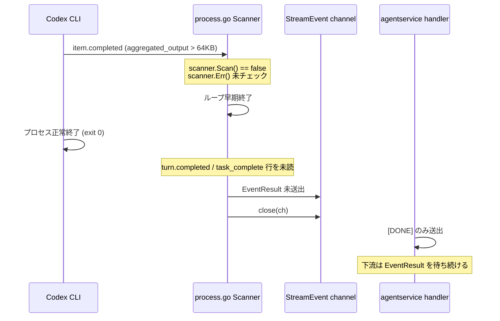
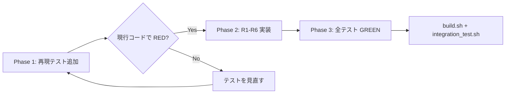

# 000-Codex-SSE-Terminal-Event-Fix

GitHub Issue: [axsh/arctic-tern#24](https://github.com/axsh/arctic-tern/issues/24)

## 背景 (Background)

arctic-tern **v0.1.4** において、Codex が **65536 バイト (~64 KiB) を超える stdout JSONL 1 行** (例: ripgrep 等の大出力ツール結果) を送出した後、Tern が Codex stdout の読み取りを停止し、ターミナル SSE イベント (`EventResult`) を送出しない。Codex 側のターンは完了し rollout JSONL には `task_complete` が記録されるが、SSE 購読者にはストリームが停止したままターミナルイベントが届かない。

### 環境 (Environment)

- arctic-tern: **v0.1.4**
- Agent: Codex (CLI integration via `codex/process.go`)
- 観測日: 2026-08-03

### 期待動作 (Expected)

- Tern は Codex stdout の読み取りを継続する (または失敗を明示する)
- Codex が正常終了した場合、大きな中間行があっても SSE 上で **`EventResult` をターンあたり 1 回** 送出する

### 実際の動作 (Actual)

- oversized ツール出力行の後、SSE イベントが停止する
- ターミナル **`EventResult` が送出されない**
- 同一ターンの rollout JSONL には **`task_complete` が記録される**

### 証拠 (Evidence)

- Rollout パス (セッションボリューム上): `.../rollout-2026-08-03T00-47-24-019fc516-f55e-75a1-b535-62bd0fd249e7.jsonl` に `task_complete` を含む
- 同一 session/turn の SSE 購読: 大出力ツール出力後に `EventResult` なし

### 根本原因 (Root Cause — v0.1.4)

`shared/libs/go/codingagent/codex/process.go` において、stdout はカスタムバッファなしのデフォルト `bufio.Scanner` で読み取られ、ループ後の `scanner.Err()` チェックもない。行がデフォルト max token size を超えると `Scan()` が `false` を返し、読み取りループがエラーを表に出さず終了する。正常終了した Codex プロセスに対しても `EventResult` を送出しない。

レビュー対象:

1. `shared/libs/go/codingagent/codex/process.go` — Scanner 上限、エラー処理、プロセス終了時のターミナル送出
2. `shared/libs/go/codingagent/codex/protocol.go` — rollout `task_complete` と stdout/SSE ターミナルイベントのマッピング (マッピング自体は実装済み。Scanner 停止により到達しない)
3. `shared/libs/go/agentservice/handler.go` — oversized ペイロードの SSE 中継 (切り詰め/チャンク化)



| 問題点 | 該当箇所 | 影響 |
|--------|----------|------|
| Scanner 64KB 上限 | `codex/process.go` L332-359 | 大出力 JSONL 行以降をすべて未読 |
| `scanner.Err()` 未処理 | 同上 | 読み取り失敗をログ・イベント化しない |
| exit 0 時に `EventResult` 未送出 | `codex/process.go` L378-381 | `turn.completed` を取り逃した場合、ターミナルイベントが永久欠落 |
| 大出力をそのまま SSE 中継 | `agentservice/handler.go` L549-551, `eventRelay` | メモリ圧迫・遅延の二次リスク |

### 補足: stdout と rollout のイベント形式差

- **stdout** (`codex exec --json`): `item.started` / `item.completed` 形式 (Codex CLI 0.139.0+)
- **rollout JSONL**: `event_msg` エンベロープ内の `task_complete`
- `protocol.go` は両形式を `EventResult` にマッピング可能だが、**Scanner が止まるとどちらも到達しない**

## 要件 (Requirements)

Issue #24 Requested fixes との対応:

| Issue #24 Requested fix | 本仕様 |
|-------------------------|--------|
| Scanner: バッファ拡大 / 大きい行対応、`scanner.Err()` チェック、失敗の明示 | R1 |
| Terminal guarantee: 正常終了時に `EventResult` 送出 (または明示的失敗 — サイレント停止不可) | R2 |
| Large payloads: SSE 中継前に truncate/chunk | R3 |
| claudecode への同型修正 | R5 |
| 上限値の設定可能化 | R6 |
| E2E による再現・回帰防止 | R7 |

### 必須要件

#### R1: Scanner バッファ拡張とエラー明示

- stdout / stderr 双方の `bufio.Scanner` に十分なバッファ上限を設定する (初期値: **4MB**、定数で集中管理)
- 読み取りループ終了後に `scanner.Err()` を必ず評価する
- エラー発生時は `EventError` を送出し、ログに原因を記録する
- 可能な限り残りの stdout を読み切る (例: `bufio.Reader` へのフォールバック、または次行以降の継続読み取り)

#### R2: 正常終了時のターミナルイベント保証

- **サイレント停止を禁止する** — stdout 解析が早期停止しても、ストリームを無言で止めてはならない
- Codex プロセスが **exit code 0** で終了した場合、ストリーム中に `EventResult` が未送出であれば **合成 `EventResult` を必ず 1 回送出** する (Issue #24 の Requested fix #2)
- 代替案として、解析不能を明示的に `EventError` で失敗させることも許容するが、**正常終了かつターミナルイベント欠落** のサイレント状態は不可
- 既に `EventResult` が送出済みの場合は重複送出しない
- exit code != 0 の場合は既存どおり `EventError` を送出 (既存動作を維持)

#### R3: 大出力ツール結果の SSE 向け制限

- `EventToolResult` の `content` が上限 (**初期値: 256KB**) を超える場合、SSE 中継前に切り詰める
- 切り詰め時は末尾に省略マーカー (例: `\n... [truncated, N bytes total]`) を付与する
- 切り詰めは **SSE / TaskLog 向け** とし、Codex CLI 自体の入出力には影響を与えない
- 切り詰め処理は `codex` パッケージ内 (Parse 時または process 送出前) に集約し、`claudecode` も同様のユーティリティを共有可能なら `codingagent` パッケージへ抽出する

#### R4: 機械的再現テストの追加 (Minimal local repro)

- Issue #24 の Minimal local repro パターンを **外部サービス不要の単体テスト** で再現・修正検証する
- 配置先: `shared/libs/go/codingagent/codex/scanner_test.go` (および `process_internal_test.go`)
- **修正実装前に追加し、現行コードで再現 (RED) することを確認してから本修正に着手する**

#### R5: claudecode への横展開

- `claudecode/process.go` も同一 Scanner パターンのため、本修正と同型の以下を **必ず** 適用する:
  - `NewLargeLineScanner` による stdout / stderr 読み取り
  - `scanner.Err()` チェックと `EventError` 送出
  - exit 0 かつ `EventResult` 未送出時の合成 `EventResult` フォールバック
  - `EventToolResult` の切り詰め (R3 と共通ユーティリティ)
- claudecode 向け単体テストを `shared/libs/go/codingagent/claudecode/process_internal_test.go` (または `scanner_test.go`) に追加する

#### R6: 設定可能な上限値

- Scanner バッファサイズ・ツール結果切り詰め上限を `model_profiles.yaml` の `coding_agents.<agent>` から上書き可能にする
- 追加フィールド (案):

```yaml
coding_agents:
  codex:
    scanner_max_token_bytes: 4194304   # default 4MB
    max_tool_result_bytes: 262144    # default 256KB
  claudecode:
    scanner_max_token_bytes: 4194304
    max_tool_result_bytes: 262144
```

- `config.AgentConfig` にフィールド追加し、`ResolveAgentConfig` → `SessionConfig` / `AdapterConfig` 経由で各 process に伝播する
- 未指定時は定数デフォルト (R1/R3 と同一) を使用する
- 設定読み込みの単体テストを `shared/libs/go/config/model_profiles_test.go` に追加する

#### R7: E2E 再現・回帰防止テスト

- AgentService の **実 SSE 経路** (HTTP `POST /messages` → `text/event-stream`) を通した E2E テストを追加する
- テスト名: `TestCodexE2E_LargeToolOutputTerminalEvent`
- 配置先: `tests/codex_large_output_e2e_test.go`
- 目的:
  1. **再現確認 (RED)**: 修正前は oversized JSONL 行の後に `EventResult` が届かないことを検証する
  2. **回帰防止 (GREEN)**: 修正後は `EventResult` が 1 回届き、セッション status が `completed` になることを検証する
- LLM / 実 Codex CLI に依存しない構成とする:
  - テスト専用の **stub agent** (`tests/testutil/large_output_agent.go` 等) を AgentService に登録
  - stub が Issue #24 の 3 行パターン (started → oversized aggregated_output → completed) 相当の StreamEvent 列を送出する
  - 修正前の process 層バグを E2E で再現する場合は、stub の代わりに **模擬 stdout を供給する test helper** で `codex.StartProcess` 経路を直接検証する統合テスト (`tests/codex_scanner_integration_test.go`) を併設してもよい
- `-short` 指定時はスキップしない (外部 API 非依存のため常時実行可能)

## 実装手順 (Repro-first Workflow)

**修正コードより先に再現テストを書き、バグを確認してから対策を実装する。**



| Phase | 内容 | 完了条件 |
|-------|------|----------|
| **Phase 1** | R4 単体 repro + R7 E2E/統合 repro テストを追加 | 現行コードで期待どおり **FAIL** (EventResult 欠落を検出) |
| **Phase 2** | R1–R6 の本修正を実装 | Phase 1 テストが **PASS** に転じる |
| **Phase 3** | 既存 E2E 非退行 + claudecode テスト + 設定テスト | `build.sh` および `integration_test.sh` 全 PASS |

Phase 1 で RED にならない場合は、テストがバグを捕捉できていないため実装に進まない。

## 実現方針 (Implementation Approach)

### 0. Phase 1 — 再現テスト (修正前)

1. `scanner_test.go` に Minimal local repro (3 行パターン) を追加 → RED 確認
2. `tests/codex_scanner_integration_test.go` に `StartProcess` + 模擬 stdout 統合テストを追加 → RED 確認
3. `tests/codex_large_output_e2e_test.go` に SSE 経路 E2E を追加 → RED 確認
4. 上記 3 点が現行コードで失敗することを `./scripts/process/build.sh` で確認してから Phase 2 へ

### 1. 共通定数とユーティリティ (`codingagent`)

```go
const (
    DefaultScannerMaxTokenSize = 4 * 1024 * 1024  // 4MB
    DefaultMaxToolResultBytes  = 256 * 1024       // 256KB
)

func NewLargeLineScanner(r io.Reader) *bufio.Scanner {
    s := bufio.NewScanner(r)
    buf := make([]byte, 0, 64*1024)
    s.Buffer(buf, DefaultScannerMaxTokenSize)
    return s
}

func TruncateToolResult(content string, maxBytes int) string { ... }
```

### 2. `codex/process.go` の stdout goroutine 改修

```
読み取りループ:
  scanner := NewLargeLineScanner(stdout)
  resultEmitted := false
  for scanner.Scan() {
      ev := ParseExecEvent(line)
      if ev != nil {
          if ev.Type == EventToolResult { ev.Content = TruncateToolResult(...) }
          if ev.Type == EventResult { resultEmitted = true }
          ch <- *ev
      }
  }
  if err := scanner.Err(); err != nil {
      log.Warn(...)
      ch <- EventError{Content: "stdout read error: ..."}
  }
  cmd.Wait()
  if exit 0 && !resultEmitted {
      ch <- EventResult{}
  }
```

stderr goroutine にも `NewLargeLineScanner` を適用する。

### 3. `codex/protocol.go`

- `parseItemEvent` の `command_execution` 完了時、`AggregatedOutput` を `TruncateToolResult` 経由で制限 (process 側で一括適用でも可。二重適用に注意)

### 4. `agentservice/handler.go`

- R6 で AgentService が上限設定を process 層へ渡す wiring を追加
- 二重防御として `streamSSERelay` 直前でのペイロードサイズ上限チェックを検討 (process 層切り詰めの補完)

### 5. `claudecode/process.go` (R5)

- codex と同一パターンで Phase 2 修正を適用
- claudecode 向け repro 単体テストを Phase 1 で追加し、RED → GREEN を確認

### 6. `config/model_profiles.go` (R6)

- `AgentConfig` に `ScannerMaxTokenBytes`, `MaxToolResultBytes` を追加
- `WithDefaults()` で R1/R3 の定数デフォルトを適用
- handler → `SessionConfig` への伝播

### 7. 設計上の決定事項

| 決定 | 選択 | 理由 |
|------|------|------|
| ターミナルイベントのソース・オブ・トゥルース | process exit 0 + 未送出時合成 | rollout は非同期で、ライブ SSE 消費者は stdout 経路のみ依存 |
| Scanner 上限 | 4MB デフォルト、R6 で YAML 上書き可 | ripgrep 級出力 + 運用調整 |
| 切り詰め位置 | `codingagent` 共通ユーティリティ、各 process 送出前 | codex / claudecode 両方で一貫 |
| claudecode | codex と同型修正 (R5 必須) | 同一 Scanner バグの潜在リスク |
| 実装順序 | Repro-first (Phase 1 RED → Phase 2 修正) | 対策がバグを実際に直すことを保証 |
| エラー時の振る舞い | EventError + 可能なら exit 判定 | サイレント失敗を禁止 |

### 変更対象ファイル (想定)

| ファイル | Phase | 変更内容 |
|----------|-------|----------|
| `shared/libs/go/codingagent/codex/scanner_test.go` | 1 | Minimal local repro (RED) |
| `tests/codex_scanner_integration_test.go` | 1 | StartProcess 統合 repro (RED) |
| `tests/codex_large_output_e2e_test.go` | 1 | SSE E2E repro (RED) |
| `tests/testutil/large_output_agent.go` | 1 | E2E 用 stub agent (新規) |
| `shared/libs/go/codingagent/stream_io.go` | 2 | Scanner / Truncate 共通関数 (新規) |
| `shared/libs/go/codingagent/codex/process.go` | 2 | Scanner 拡張、Err 処理、EventResult フォールバック |
| `shared/libs/go/codingagent/codex/process_internal_test.go` | 2 | フォールバック・切り詰めテスト |
| `shared/libs/go/codingagent/codex/protocol.go` | 2 | 大出力 item.completed の切り詰め |
| `shared/libs/go/codingagent/claudecode/process.go` | 2 | R5 同型修正 |
| `shared/libs/go/codingagent/claudecode/scanner_test.go` | 1–2 | claudecode repro + 修正検証 |
| `shared/libs/go/config/model_profiles.go` | 2 | R6 設定フィールド追加 |
| `shared/libs/go/config/model_profiles_test.go` | 2 | R6 設定テスト |
| `shared/libs/go/agentservice/handler.go` | 2 | R6 設定伝播 wiring |

## 検証シナリオ (Verification Scenarios)

### 再現手順 (Steps to Reproduce — Issue #24 より)

1. arctic-tern 経由で Codex ターンを開始する (session `SendText` → SSE イベントを購読)
2. **1 行が 65536 バイトを超える** stdout JSONL を生成するツール/コマンドを実行させる (例: 大規模リポジトリへの ripgrep、`aggregated_output` が 1 行に集約されるケース)
3. Codex ターンの完了を待つ (rollout JSONL に `task_complete` が記録される)
4. SSE イベントストリームを観察する

### Minimal local repro (Issue #24 より — 要約せず転記)

`codex/process.go` v0.1.4 と同一パターン: デフォルト Scanner、`Err` チェックなし。

```go
// Same pattern as codex/process.go v0.1.4: default Scanner, no Err check.
scanner := bufio.NewScanner(reader)
for scanner.Scan() {
    // process line
}
// If reader contains: small line, then >64KiB line, then small line —
// only the first small line is read; scanner.Err() == bufio.ErrTooLong
```

reader に以下を供給する:

1. `{"type":"item.started"}\n`
2. フィールドが **65537 バイト以上** の JSONL 1 行 (例: 模擬 `aggregated_output`)
3. `{"type":"item.completed"}\n`

Assert: ループは 1 行目の small line で停止する。`scanner.Err()` は non-nil。

### シナリオ 1: 64KB 超 JSONL 行の Scanner 再現 (機械的)

1. 上記 Minimal local repro の 3 行パターンでテストを実装する
2. デフォルト Scanner では 1 行目のみ読め、`scanner.Err() == bufio.ErrTooLong` となることを確認する (回帰防止用 negative test)
3. 修正後の `NewLargeLineScanner` では 3 行すべて読め、2 行目から `EventToolResult` (または相当イベント) が得られることを確認する

### シナリオ 2: 大出力後の正常終了で EventResult が届く

1. 模擬 stdout に以下を順に供給する:
   - `item.started` (command_execution)
   - `item.completed` (aggregated_output > 64KB)
   - (意図的に `turn.completed` を省略)
2. プロセス exit code 0 で終了させる
3. StreamEvent 列の末尾に `EventResult` が 1 件含まれることを確認する

### シナリオ 3: 通常完了 (turn.completed あり) で EventResult が重複しない

1. 模擬 stdout に `turn.completed` を含める
2. exit code 0
3. `EventResult` が **1 回のみ** 送出されることを確認する

### シナリオ 4: Scanner エラー時に EventError が送出される

1. Scanner 上限を超える行を意図的に発生させ、`scanner.Err() != nil` となる状況を再現する (テスト用に上限を小さくした Scanner を使用)
2. `EventError` が送出されることを確認する

### シナリオ 5: 大出力ツール結果の SSE 切り詰め

1. 300KB の `aggregated_output` を含む `item.completed` をパースする
2. 送出される `EventToolResult.Content` が 256KB 以下であることを確認する
3. 末尾に truncation マーカーが含まれることを確認する

### シナリオ 6: E2E — 大出力後も SSE で EventResult が届く (R7)

1. テスト専用 stub agent を AgentService に登録し、SSE でイベントを購読する
2. oversized `EventToolResult` (content > 64KB) を含むイベント列を送出させる
3. **修正前 (Phase 1)**: `EventResult` が届かずテスト FAIL
4. **修正後 (Phase 2)**: `EventResult` が 1 回届き、セッション status が `completed` になる

### シナリオ 7: 既存 Codex E2E の非退行

1. `tests/codex_e2e_test.go` の TC-Codex-001 (FileCreation) が引き続き PASS すること
2. SSE ストリームに `[DONE]` と `EventResult` (または text/tool_use) が含まれること

## テスト項目 (Testing)

### Phase 1: 再現テスト (修正前 — RED 確認)

| テスト名 | 対象要件 | 配置先 | 現行コードでの期待 |
|----------|----------|--------|-------------------|
| `TestScanner_DefaultLimitStopsAt64KB` | R4 | `shared/libs/go/codingagent/codex/scanner_test.go` | FAIL (`ErrTooLong` 再現) |
| `TestScanner_LargeLineReadsAllThreeLines` | R1, R4 | 同上 | FAIL (3 行目未到達) |
| `TestCodexScannerIntegration_LargeOutputMissingEventResult` | R4, R7 | `tests/codex_scanner_integration_test.go` | FAIL (EventResult 欠落) |
| `TestCodexE2E_LargeToolOutputTerminalEvent` | R7 | `tests/codex_large_output_e2e_test.go` | FAIL (SSE に EventResult なし) |

Phase 1 完了時: 上記が RED であることを `./scripts/process/build.sh` で確認する。

### Phase 2–3: 修正検証テスト (GREEN 確認)

#### 単体テスト

| テスト名 | 対象要件 | 配置先 |
|----------|----------|--------|
| `TestScanner_LargeLineReadsAllThreeLines` | R1, R4 | `shared/libs/go/codingagent/codex/scanner_test.go` |
| `TestStartProcess_EmitsEventResultOnExitZero` | R2 | `shared/libs/go/codingagent/codex/process_internal_test.go` |
| `TestStartProcess_NoDuplicateEventResult` | R2 | 同上 |
| `TestStartProcess_ScannerErrorEmitsEventError` | R1 | 同上 |
| `TestTruncateToolResult` | R3 | `shared/libs/go/codingagent/stream_io_test.go` |
| `TestClaudeScanner_LargeLineReadsAllThreeLines` | R5 | `shared/libs/go/codingagent/claudecode/scanner_test.go` |
| `TestClaudeStartProcess_EmitsEventResultOnExitZero` | R5 | `shared/libs/go/codingagent/claudecode/process_internal_test.go` |
| `TestAgentConfig_ScannerAndToolResultDefaults` | R6 | `shared/libs/go/config/model_profiles_test.go` |
| `TestAgentConfig_ScannerAndToolResultOverride` | R6 | 同上 |

#### 統合 / E2E テスト

| テスト名 | 対象要件 | 配置先 |
|----------|----------|--------|
| `TestCodexScannerIntegration_LargeOutputMissingEventResult` | R7 | `tests/codex_scanner_integration_test.go` — GREEN 化 |
| `TestCodexE2E_LargeToolOutputTerminalEvent` | R7 | `tests/codex_large_output_e2e_test.go` — GREEN 化 |
| 既存 `TestCodexE2E_*` 全件 | 非退行 | `tests/codex_e2e_test.go` |

### ビルド・全体検証

1. Phase 1 (RED 確認):
   ```bash
   ./scripts/process/build.sh
   # 再現テストが期待どおり FAIL することを確認
   ```

2. Phase 3 (GREEN 確認 — 修正後):
   ```bash
   ./scripts/process/build.sh
   ```

3. Codex / 大出力 E2E 統合テスト:
   ```bash
   ./scripts/process/integration_test.sh --specify "LargeToolOutput"
   ./scripts/process/integration_test.sh --specify "CodexScanner"
   ./scripts/process/integration_test.sh --specify "Codex"
   ```

4. AgentService 関連統合テスト (SSE relay 非退行):
   ```bash
   ./scripts/process/integration_test.sh --specify "AgentService"
   ```

## 関連資料

- GitHub Issue: [axsh/arctic-tern#24](https://github.com/axsh/arctic-tern/issues/24)

## スコープ外

- 下流 (agent-runner / Kanban 等) のタイムアウト値変更
- rollout JSONL からの事後復元 (バックフィル) — 本修正はライブ SSE 経路の修復に集中
- Codex CLI 自体の出力形式変更
