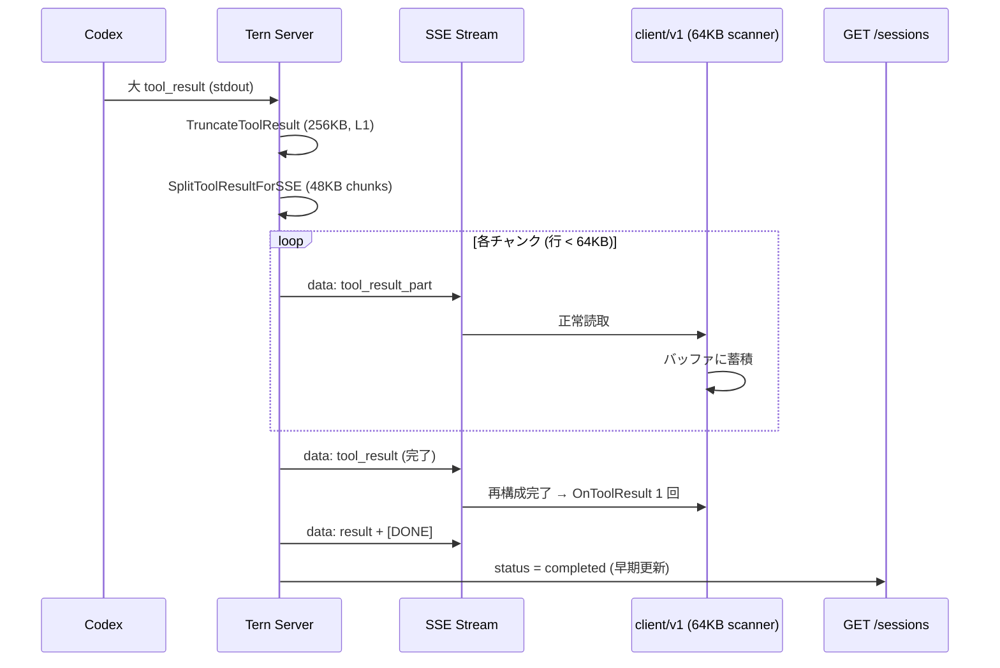
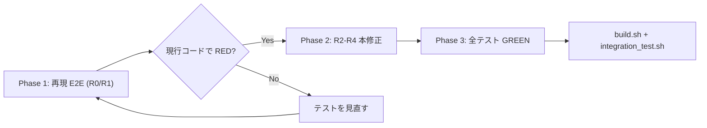

# 000-SSE-Client-Session-Status-Fix

GitHub Issue: [axsh/arctic-tern#26](https://github.com/axsh/arctic-tern/issues/26)

Related: [axsh/arctic-tern#24](https://github.com/axsh/arctic-tern/issues/24) (L1 修正は v0.1.5 / PR #25 で landing 済み)

## 背景 (Background)

arctic-tern **v0.1.5** では bugfix-#24 により **L1（Codex stdout スキャナ・ツール結果切り詰め・合成 EventResult）** が修正された。しかし Issue #26 で報告されたとおり、大出力ツール（ripgrep 等）を伴うターンにおいて、下流の SSE 消費者およびセッション API には **不整合が残存** する。

### 環境 (Environment)

- arctic-tern: **v0.1.5** 以降（L1 修正 landing 後）
- Agent: Codex (`codex exec --json`)
- 統合パターン: HTTP `SendText` → `client/v1` で SSE 消費、並行して `GET /api/v1/sessions/{id}` をポーリング
- 観測日: 2026-08-03

### 期待動作 (Expected)

1. Codex がターンを完了（rollout JSONL に `task_complete`）したら、SSE 購読者は必ず **`EventResult`** と **`[DONE]`** を受信する
2. ターン完了後、セッション API の `status` は **速やかに `completed`**（または `error`）を返す
3. L1 が SSE 中継する大きな `tool_result` ペイロードが、**64 KiB 行上限の SSE リーダー** を破壊しない

### 実際の動作 (Actual)

| 観測点 | 結果 |
|--------|------|
| Codex rollout JSONL | `task_complete` を含む |
| Tern SSE → 購読者 | `data:` イベントが停止。`EventResult` 未受信 |
| `GET /api/v1/sessions/{id}` | 長時間 **`active`** のまま |
| 下流ジョブ | ~120s サイレンス後にタイムアウト |

2 つの failure mode:

1. **即時失敗（数秒）**: 単一 SSE `data:` 行がクライアント `bufio.Scanner` 上限 (~64 KiB) を超過 → `stream read error: bufio.Scanner: token too long`
2. **遅延ストール（~100–120s）**: しばらくイベントは流れるが `data:` が止まる。keepalive (`: keepalive`) は HTTP 接続上は継続。セッション status は `active` のまま

### 根本原因 (Root Cause — v0.1.5 時点)

#### L3: 1 行 1 JSON の oversized SSE 行

```go
// server: handler.go
data, _ := json.Marshal(ev)
fmt.Fprintf(w, "data: %s\n\n", data)

// client: client/v1/stream.go
scanner := bufio.NewScanner(s.body) // default max token ~64 KiB
```

L1 は `TruncateToolResult`（デフォルト **256 KiB**）で agent 層の content を切り詰めるが、SSE 中継時は **1 つの `tool_result` を 1 行 JSON として送出** するため、切り詰め後でも `data:` 行は **~262 KiB** となり、デフォルト 64 KiB スキャナを超える。サーバー側 E2E ヘルパ `parseE2ESSEEvents` は `NewLargeLineScanner` を使用しており、**サーバー E2E は PASS するが `client/v1` 利用者は FAIL する** テスト盲点が存在する。

#### L2: セッション status が SSE relay 終了時のみ更新

`agentservice/handler.go` の `streamSSERelay` は、`EventResult` 送出時ではなく **`done:` ラベル**（relay チャネル close + `[DONE]` 送出後）でのみ `record.Status = completed` を設定する。加えて **クライアント切断 (`ctx.Done()`) 時は status を一切更新せず return** するため、エージェント Close 後も `active` が残るゾンビ状態が起きうる。

#### L2 補足: keepalive は `data:` イベントにならない

サーバーは 15 秒ごとに `: keepalive` SSE コメントを送出するが、`client/v1` は `data:` 行のみ処理する。接続は生きていても `data:` サイレンスは「ストール」と見なされる。

### 設計方針の決定: 案 A（アプリケーションレベル・チャンク化）を採用

Issue #26 の L3 対策として、クライアント側 `NewLargeLineScanner` 拡張（旧 R2 案）は **採用しない**。

代わりに **案 A: サーバーが oversized `tool_result` を複数 SSE イベント（チャンク）に分割して送出し、公式 Go クライアントが再構成する** 方式を採用する。

| 観点 | LargeLineScanner（不採用） | 案 A チャンク化（**採用**） |
|------|---------------------------|----------------------------|
| 64 KiB 固定 scanner 互換 | 拡張が必要 | **各 `data:` 行が 64 KiB 未満** |
| プロトコル | 変更なし | **拡張**（`tool_result_part` 追加） |
| 下流（Go 公式 client） | scanner 拡張のみ | 再構成ロジック追加（API 互換維持） |
| サードパーティ SSE 消費者 | 変更不要 | **`tool_result_part` 対応が必要**（文書化） |



| 問題点 | 該当箇所 | 本仕様での対策 |
|--------|----------|----------------|
| oversized 単一行 SSE | `handler.go` SSE 送出 | R2: チャンク分割送出 |
| クライアント再構成なし | `client/v1/stream.go` | R2: チャンク再構成 |
| status 更新が relay 終了時のみ | `handler.go` | R3: 早期 status 更新 |
| 切断時 status 未更新 | `handler.go` `ctx.Done()` | R3 |
| E2E が client/v1 経路を未検証 | `tests/` | R0/R1 |

### bugfix-#24 との関係

| レイヤ | bugfix-#24 (L1) | 本仕様 |
|--------|-----------------|--------|
| Codex stdout scanner | `NewLargeLineScanner` (4MB) | 変更なし |
| agent 層 tool_result 上限 | `TruncateToolResult` (256KB) | 変更なし（チャンク分割の入力） |
| SSE 中継 | 1 行 JSON そのまま送出 | **チャンク分割に変更** |
| 合成 EventResult | exit 0 フォールバック | 変更なし |
| セッション status タイミング | スコープ外 | **本仕様で対応** |

## 要件 (Requirements)

Issue #26 Requested fixes との対応:

| Issue #26 Priority | 本仕様 |
|--------------------|--------|
| P0: Large tool results must not break client SSE reader | **R2**（チャンク分割 + 再構成） |
| P1: Early session status on terminal relay events | **R3** |
| P2: Document max `data:` line size | **R5**（チャンクプロトコル文書化） |
| P2: Integration test | **R0, R1** |

### 必須要件

#### R0: 再現 E2E を修正実装より先に追加する（Repro-first）

> **本仕様の最優先要件。** 修正コードに着手する前に、Issue #26 の failure mode を **`client/v1` 経由** で機械的に再現する E2E テストを追加し、現行コードで **RED** であることを `./scripts/process/build.sh` で確認してから Phase 2（本修正）に進む。

- **Phase 1 完了条件**: 追加した再現 E2E が現行コードで期待どおり **FAIL** する
- **Phase 2 完了条件**: 本修正 (R2–R4) 適用後、再現 E2E が **PASS** する
- RED にならない場合はテスト設計を見直し、**実装に進まない**
- 既存 `TestCodexE2E_LargeToolOutputTerminalEvent` は L1 回帰防止として **維持**

#### R1: 再現 E2E — `client/v1` 経由の大出力 SSE ターミナルイベント

- **テスト名**: `TestCodexE2E_ClientV1_LargeToolOutputTerminalEvent`
- **配置先**: `tests/codex_client_v1_large_output_e2e_test.go`（新規）
- **経路**: AgentService 実 HTTP → **`client/v1`** の `CreateSession` / `SendText` / `Stream.Run()` で SSE 消費
- **禁止**: `parseE2ESSEEvents` / `NewLargeLineScanner` をテスト内で直接使用しない
- **stub**: `testutil.InstallFakeCodex` + 65537+ バイト `aggregated_output` を含む JSONL
- **現行コード (RED)**:
  1. `Stream.Run()` が `EventResult` 到達前にエラー終了、または
  2. `stream read error` / `token too long` / `without completion marker`
- **修正後 (GREEN)**:
  1. `EventResult` を **1 回** 受信
  2. 大出力 `tool_result` の **内容が欠損なく再構成** される（切り詰めマーカー含め L1 上限内で一致）
  3. ストリーム正常終了
  4. `GET /sessions/{id}` の `status` が **`completed`**
- LLM / 実 Codex CLI 非依存。`-short` でもスキップしない

#### R1b: 再現 E2E — ターミナルイベント到達前のセッション status（推奨）

- **テスト名**: `TestCodexE2E_SessionStatusOnTerminalEvent`
- **方式**: `EventResult` 送出直後・`[DONE]` 前に `GET /sessions/{id}` をポーリング
- **RED**: `status` が `active` のまま
- **GREEN**: `status=completed`

#### R2: SSE `tool_result` のチャンク分割とクライアント再構成 (P0)

##### R2a: プロトコル拡張

新イベント型 **`tool_result_part`** を追加する。

| フィールド | 型 | 説明 |
|-----------|-----|------|
| `type` | string | `"tool_result_part"` |
| `chunk_id` | string | 同一 tool_result のチャンク群を識別する UUID |
| `index` | int | 0 始まりのチャンク番号 |
| `total` | int | チャンク総数 |
| `content` | string | 当該チャンクの content 断片 |

**完了通知**: 全 `tool_result_part` 送出後、従来どおり **`tool_result`** を 1 回送出する。

- チャンク分割された場合: `tool_result` の `content` は **空文字** とし、完了マーカーとする
- チャンク不要（小ペイロード）の場合: 従来どおり単一 `tool_result` のみ送出（**後方互換**）

`codingagent.StreamEvent` に `ChunkID`, `ChunkIndex`, `ChunkTotal` フィールドを追加する。`client/v1.Event` にも同型フィールドを追加する。

##### R2b: サーバー側分割（SSE 送出直前）

- **配置**: `shared/libs/go/codingagent/sse_chunk.go`（新規）に分割ユーティリティを集約
- **関数**: `SplitStreamEventForSSE(ev StreamEvent, maxLineBytes int) []StreamEvent`
- **対象**: `EventToolResult` のみ（Phase 1）。`EventText` 等は別 Issue
- **上限定数**:
  - `DefaultMaxSSEDataLineBytes = 64 * 1024`（64 KiB — クライアント scanner 上限に合わせる）
  - `DefaultSSEChunkContentBytes = 48 * 1024`（48 KiB — JSON オーバーヘッド余裕）
- **分割アルゴリズム**:
  1. `json.Marshal` 後のサイズが `maxLineBytes` 未満 → 分割不要、元イベント 1 件を返す
  2. 超過 → `content` を `DefaultSSEChunkContentBytes` ごとに分割
  3. 共通 `chunk_id` を発行し、`tool_result_part` 列 + 完了 `tool_result`（content 空）を返す
  4. 各出力イベントについて `json.Marshal` 後サイズが `maxLineBytes` 未満であることを **単体テストで保証**
- **適用箇所**: `agentservice/handler.go` の `streamSSERelay` / `streamSSE` — `fmt.Fprintf(w, "data: ...")` の直前
- **relay / TaskLog**: agent からの **元イベント（未分割）** を relay に保持。分割は **SSE ワイヤー送出時のみ** 適用（relay 内部は従来 1 イベント = 1 tool_result）
- **JSON 応答** (`respondJSONRelay`): 分割せず元イベント列を返す（HTTP JSON は行制限なし）

##### R2c: クライアント側再構成

- **配置**: `client/v1/stream.go`（+ レガシー `client/stream.go`）
- **方針**: `events()` 内部でチャンクをバッファリングし、**再構成完了後に 1 つの `EventToolResult` として downstream に送出**
- **API 互換**: `Run()` / `OnToolResult` / `Output()` は従来どおり **tool_result 1 回** のコールバック。`tool_result_part` は外部に露出しない
- **`Events()` 低レベル API**: 再構成後の `EventToolResult` のみ送出（part は内部処理）
- **エラー処理**:
  - `index` 欠落・`total` 不一致・`chunk_id` 混在 → `EventError` を送出
  - ストリーム終了時に未完了チャンク → `EventError`（`incomplete tool_result chunks`）
- **scanner**: デフォルト `bufio.NewScanner`（64 KiB）のまま。各 `data:` 行が 64 KiB 未満であることをサーバー分割が保証

##### R2d: 単体テスト

| テスト | 配置 | 内容 |
|--------|------|------|
| `TestSplitStreamEventForSSE_SmallPayloadNoSplit` | `sse_chunk_test.go` | 小ペイロードは分割なし |
| `TestSplitStreamEventForSSE_LargePayloadChunksUnder64KB` | 同上 | 256KB content → 複数 part、各行 < 64KB |
| `TestSplitStreamEventForSSE_ReassemblyRoundTrip` | 同上 | 分割 → 結合で元 content 一致 |
| `TestStream_Events_ReassemblesToolResultParts` | `client/v1/stream_test.go` | httptest で part 列 → 1 tool_result |

#### R3: ターミナル relay イベント時の早期セッション status 更新 (P1)

- `EventResult` または terminal `EventError` が relay に append された時点（または SSE 送出直後）で `record.Status` を `completed` / `error` に更新
- `EventUserInputRequired` と同様、**SSE ストリーム存続中** でも status を反映
- **クライアント切断時** (`ctx.Done()`): relay 内 terminal イベントがあれば status 反映。なければ `error` 等で不整合を残さない
- `respondJSONRelay` にも同型の早期更新
- `done:` ラベルでの更新は idempotent に維持

#### R4: 設定・定数

- `DefaultSSEChunkContentBytes` / `DefaultMaxSSEDataLineBytes` を `codingagent` パッケージ定数として集中管理
- 将来、`model_profiles.yaml` から `sse_chunk_content_bytes` / `max_sse_data_line_bytes` を上書き可能にしてもよい（任意）
- L1 の `max_tool_result_bytes`（256KB）との関係: agent 層切り詰め → SSE チャンク分割の 2 段構成

### 任意要件

#### R5: チャンクプロトコルの文書化 (P2)

- `docs/` または API ドキュメントに以下を記載:
  - `tool_result_part` フィールド定義
  - 各 `data:` 行が 64 KiB 未満であることの保証
  - 公式 Go クライアントは自動再構成すること
  - **`client/v1` 以外の SSE 消費者** は `tool_result_part` を処理する必要があること

## 実装手順 (Repro-first Workflow)

**修正コードより先に再現 E2E を書き、RED で確認してからチャンク化実装に着手する。**



| Phase | 内容 | 完了条件 |
|-------|------|----------|
| **Phase 1** | R0/R1 再現 E2E（`client/v1` 経路） | 現行コードで **FAIL** |
| **Phase 2** | R2（チャンク分割 + 再構成）+ R3 + R4 | Phase 1 が **PASS** |
| **Phase 3** | 回帰テスト | `build.sh` / `integration_test.sh` 全 PASS |

## 実現方針 (Implementation Approach)

### 0. Phase 1 — 再現 E2E（修正前・最優先）

1. `tests/codex_client_v1_large_output_e2e_test.go` を新規作成
2. fake codex + `client/v1` `SendText` → `Stream.Run()` で RED 確認
3. （推奨）R1b status E2E も RED 確認
4. **RED 確認完了後にのみ Phase 2 へ**

### 1. サーバー SSE チャンク分割 (R2b)

```go
// shared/libs/go/codingagent/sse_chunk.go
func SplitStreamEventForSSE(ev StreamEvent, maxLineBytes int) ([]StreamEvent, error)
```

`streamSSERelay` 改修イメージ:

```go
for _, wireEv := range codingagent.SplitStreamEventForSSE(ev, codingagent.DefaultMaxSSEDataLineBytes) {
    data, _ := json.Marshal(wireEv)
    fmt.Fprintf(w, "data: %s\n\n", data)
    flusher.Flush()
}
```

### 2. クライアント再構成 (R2c)

`events()` 内に `chunkAssembler` を追加:

```go
type chunkAssembler struct {
    buffers map[string]*chunkBuffer // chunk_id → accumulating content
}
```

- `tool_result_part` 受信 → バッファに append
- `tool_result`（content 空 + 対応 chunk_id あり）→ 再構成完了、`EventToolResult` を ch に送出
- 単一 `tool_result`（小ペイロード）→ 従来どおり即座に送出

### 3. 早期 status 更新 (R3)

`eventRelay` append 時、または `streamSSERelay` で `EventResult` / `EventError` 送出直後に `s.sessions.Update`。

### 4. 変更対象ファイル（想定）

| ファイル | 変更内容 |
|----------|----------|
| `tests/codex_client_v1_large_output_e2e_test.go` | **新規** — Phase 1 再現 E2E |
| `shared/libs/go/codingagent/event.go` | `EventToolResultPart` 定数追加 |
| `shared/libs/go/codingagent/sse_chunk.go` | **新規** — 分割ユーティリティ |
| `shared/libs/go/codingagent/sse_chunk_test.go` | **新規** — 分割・行サイズ検証 |
| `shared/libs/go/agentservice/handler.go` | SSE 分割送出 + 早期 status |
| `client/v1/stream.go` | チャンク再構成 |
| `client/v1/stream_test.go` | part 再構成テスト |
| `client/stream.go` | 同上（レガシー） |

## 検証シナリオ (Verification Scenarios)

Issue #26 Steps to reproduce（要約せず転記）:

1. Create a Tern session with Codex and a workspace large enough for ripgrep to produce heavy output.
2. Send a prompt that runs ripgrep (or similar) across the codebase, then completes the turn.
3. Subscribe to SSE via `client/v1` (`Stream.Events()` or equivalent).
4. In parallel, poll `GET /api/v1/sessions/{id}` until timeout.
5. After the turn, inspect rollout JSONL under the session directory for `task_complete`.

**Pass criteria:** SSE delivers `EventResult` + `[DONE]`; session GET returns `completed`.

### 機械的検証（開発時）

```bash
# Phase 1: 再現 E2E が RED であることを確認（修正前）
./scripts/process/build.sh
# 期待: TestCodexE2E_ClientV1_LargeToolOutputTerminalEvent が FAIL

# Phase 2 完了後
./scripts/process/build.sh
./scripts/process/integration_test.sh --specify "TestCodexE2E_ClientV1"
./scripts/process/integration_test.sh --specify "TestCodexE2E_LargeToolOutput"
```

## テスト項目 (Testing)

### Phase 1 — 再現 E2E（修正前・必須）

| テスト | 期待 (現行コード) |
|--------|-------------------|
| `TestCodexE2E_ClientV1_LargeToolOutputTerminalEvent` | **FAIL** |
| `TestCodexE2E_SessionStatusOnTerminalEvent` | **FAIL**（推奨） |

```bash
./scripts/process/build.sh
./scripts/process/integration_test.sh --specify "TestCodexE2E_ClientV1"
```

### Phase 2 — 単体テスト（本修正と同時）

| テスト | 配置 | 内容 |
|--------|------|------|
| `TestSplitStreamEventForSSE_*` | `sse_chunk_test.go` | 分割・64KB 行上限・roundtrip |
| `TestStream_Events_ReassemblesToolResultParts` | `client/v1/stream_test.go` | クライアント再構成 |
| `TestStreamSSERelay_EarlyStatusUpdate` | `handler_test.go` | status タイミング |
| `TestStreamSSERelay_ChunkedToolResult` | `handler_test.go` | SSE 出力が複数 part + 完了 |

```bash
./scripts/process/build.sh
```

### Phase 3 — 回帰・統合

| テスト | 内容 |
|--------|------|
| `TestCodexE2E_ClientV1_LargeToolOutputTerminalEvent` | **PASS** — 再構成 + EventResult + completed |
| `TestCodexE2E_LargeToolOutputTerminalEvent` | **PASS** — L1 回帰（server parser 経路） |
| `TestCodexScannerIntegration_LargeOutputMissingEventResult` | **PASS** — L1 回帰 |

```bash
./scripts/process/build.sh
./scripts/process/integration_test.sh --specify "TestCodexE2E"
./scripts/process/integration_test.sh --specify "TestCodexScanner"
```

## スコープ外 (Out of Scope)

- L1（Codex stdout scanner / 合成 EventResult）の再修正
- クライアント側 `NewLargeLineScanner` 拡張（案 A 採用のため不採用）
- `EventText` / `EventToolUse` 等、tool_result 以外のチャンク分割
- Go 以外の公式 SDK への再構成ロジック移植（文書化のみ）
- SSE keepalive の `data:` 化
