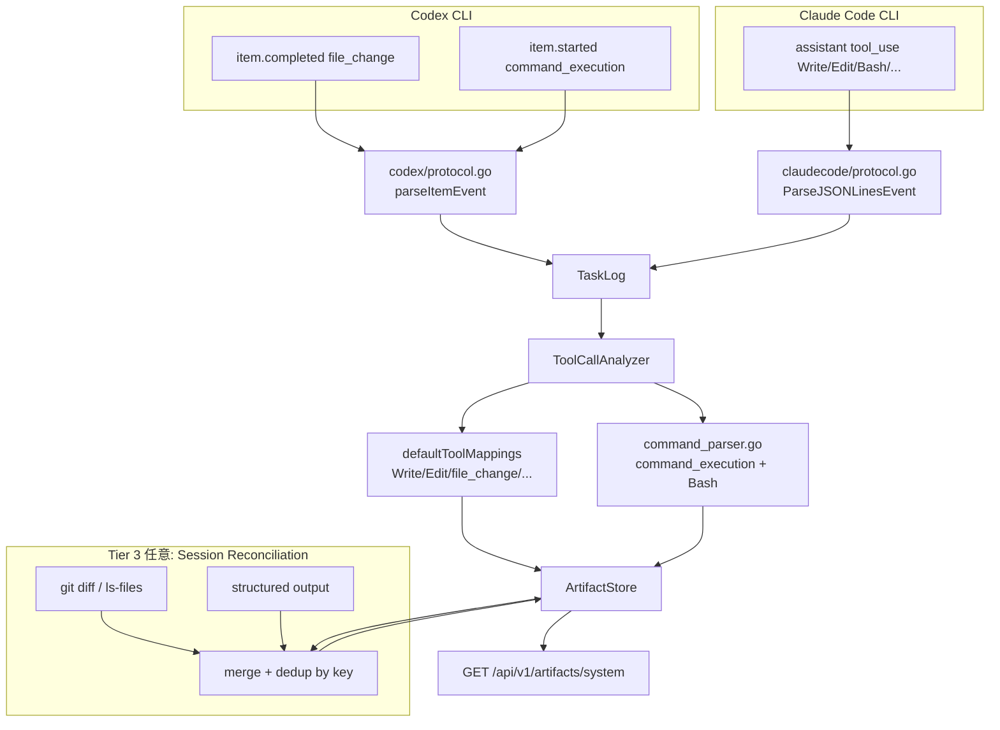
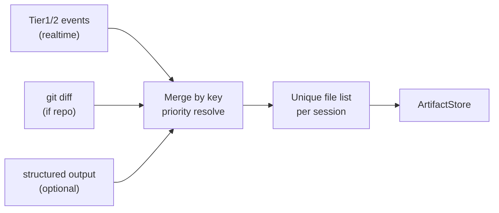

# 000 - Codex / Claude Code System Artifact 追跡対応

## 背景 (Background)

[Issue #28](https://github.com/axsh/arctic-tern/issues/28) にて、Codex エージェント利用時に **System Artifacts API** (`GET /api/v1/artifacts/system`) が常に空を返す問題が報告された。

追加調査の結果、以下が確認された:

### Codex 側

1. **`ToolCallAnalyzer`** は Cursor / Claude Code の構造化ファイルツール（`Write`, `StrReplace`, `Delete`, `Edit`, `MultiEdit`）のみを認識している。
2. Codex CLI (`codex exec --json`) は **複数種類の item イベント** を emit する（[非対話モード公式](https://learn.chatgpt.com/docs/non-interactive-mode)）:
   - **`file_change`**: `{path, kind: add|delete|update}` の配列 — **Write 相当の構造化イベント**
   - **`command_execution`**: シェルコマンド文字列のみ
   - その他: `mcp_tool_call`, `web_search`, `agent_message` 等
3. **`codex/protocol.go` の `parseItemEvent` は `command_execution` と `agent_message` のみ処理** し、`file_change` は `default` 分支で **破棄** されている（TaskLog に届かない）。
4. `command_execution` は TaskLog まで到達するが、analyzer 未対応のため **記録されない**。
5. Codex E2E はディスク確認のみで、System Artifacts API を検証していない。

### Claude Code 側

6. **`Write` / `Edit` / `MultiEdit` 経由の通常フローでは System Artifact が記録される**（`TestE2E_ArtifactPipeline_FullLifecycle` で検証済み）。
7. 以下の経路には **ギャップ** がある（Codex の `command_execution` と同型の問題）:
   - **`Bash` ツール**: `tool_input.command` のみ（path なし）
   - **`NotebookEdit` ツール**: analyzer 未 mapping
8. Claude Code コミュニティでは Hooks（PostToolUse）や transcript パースでファイル一覧を自力復元しているが、**公式の modified_files API は存在しない**（[Issue #9550](https://github.com/anthropics/claude-code/issues/9550) 要望中・未実装）。

### 設計方針

Codex と Claude Code は **同一の System Artifacts API** 経由で透過的にファイル変更を返すべきである。Hooks や transcript パースをユーザーに要求するのではなく、tern 内部（protocol → TaskLog → Analyzer）で **Agent 非依存の追跡** を実現する。

当初仕様 (`000-AgentFileListAPI.md` R12) は Cursor / Claude Code のみを対象とし Codex はスコープ外だった。本修正で **Codex を first-class 対応** とし、Claude Code の既知ギャップも **同時に解消** する。

---

## 要件 (Requirements)

### 必須要件

| # | 要件 |
|---|------|
| R1 | **`codex/protocol.go` で `file_change` item をパース** し、`EventToolUse` として TaskLog に流すこと。`item.completed` の `changes[]` から path と kind（add→create, update→update, delete→delete）を `ToolInput` に保持すること |
| R2 | **`ToolCallAnalyzer` が `file_change` イベント**（または R1 で正規化した tool 名）から System Artifact を記録すること |
| R3 | **Codex `command_execution` と Claude Code `Bash` を同一シェルコマンドパーサー** で処理し、command 文字列から path / operation を推定して System Artifact を記録すること |
| R4 | シェルパーサーの対象パターン（最低限）: リダイレクト（`>`, `>>`）、`tee`、`cat <<` / heredoc、`cp`、`mv`、`touch`、`rm`（Windows 向け `Set-Content` / `Out-File` 等は可能な範囲で） |
| R5 | **Claude Code `NotebookEdit` を analyzer mapping に追加** し、notebook パス（`file_path` / `notebook_path` 等、CLI 公式スキーマに合わせる）から update イベントを記録すること |
| R6 | 相対パスは既存と同様、セッション `WorkDir`（`WorkDirResolver`）を基準に絶対パスへ解決し、論理キー（`key`）へ正規化すること |
| R7 | パスを特定できない shell コマンド（例: `ls`, `git status`）は **イベントを生成しない**（誤検知より未記録を優先） |
| R8 | 既存の Cursor / Claude Code 向け `Write` / `Edit` / `MultiEdit` / `StrReplace` / `Delete` mapping の挙動を **退行させない** こと |
| R9 | 単体テストで `file_change` / `command_execution` / `Bash` / `NotebookEdit` から System Artifact が記録されることを、**実 CLI なしで** 検証すること |
| R10 | LLM E2E で **Codex** セッション後に System Artifacts API で `TotalCount >= 1` かつ対象ファイルの create イベントが存在することを検証すること |
| R11 | 既存 Claude Code E2E (`TestE2E_ArtifactPipeline_FullLifecycle`) が引き続き PASS すること |

### 任意要件

| # | 要件 |
|---|------|
| O1 | **セッション終了時リコンシリエーション**: Tier 1/2 でリアルタイム記録したイベントに加え、補助ソース（git diff、structured output 等）を **統合・重複排除** し、セッション単位のユニークな生成・更新ファイル一覧を確定すること（詳細は実現方針 §6） |
| O2 | **git diff 補助**: セッション `WorkDir` が Git リポジトリ配下の場合、`git diff --name-status` および `git ls-files --others --exclude-standard` で変更を検出し、Tier 1/2 で未記録の path を **補完** する。**`.gitignore` 対象ファイルは検出されない** 制約をドキュメント化すること |
| O3 | **structured output 補助**: セッション完了前後に JSON Schema 付きプロンプトで変更ファイル一覧を取得し、git / tool 経路で捕捉できなかった分を **補完** する（LLM 生成のため Tier 1/2 / git より優先度は低い） |
| O4 | Codex 旧 flat 形式（`function_call` + `shell` / `shell_command`）をシェルパーサー経由で処理 |
| O5 | `claudecode/protocol.go` で 1 行に複数 `tool_use` ブロックがある場合、**すべて emit** する（現状は最初の 1 件のみ） |
| O6 | `000-AgentFileListAPI.md` R12 の対応 Agent 一覧に Codex を追記 |
| O7 | Git 非対応 workDir（`t.TempDir()` 等）向けに、セッション開始時 snapshot と終了時 walk diff による **非 git 補助**（`.gitignore` 問題はないが、セッション外変更の混入リスクあり） |

---

## 実現方針 (Implementation Approach)

### 方針概要: 3 層追跡（Agent 透過）

Issue #28 および追加調査で、**Codex は `file_change` という構造化イベントを既に emit している** ことが判明した。シェルパースのみに頼るより、`file_change` を Primary とする。

| Tier | 対象 | Codex | Claude Code | 実装箇所 |
|------|------|-------|-------------|---------|
| **Primary** | 構造化 path イベント | `file_change` | `Write` / `Edit` / `MultiEdit` / `NotebookEdit` | protocol + analyzer |
| **Secondary** | シェル経路 | `command_execution` | `Bash` | 共通 `command_parser.go` + analyzer |
| **Tertiary（任意）** | 漏れ補完・統合 | git diff / structured output / snapshot diff | 同上 | セッション終了リコンシリエーション |

コミュニティ workaround（PostToolUse hook で path 追記、transcript JSONL パース）は、tern では **Tier 1/2 を analyzer 層に内包** する。ユーザーが Hooks を設定する必要はない。

**Tier 3 の位置づけ**: Primary / Secondary がリアルタイム追跡の本体。Tier 3 は **補助ソースの統合** で漏れを埋める。単一ソース（git diff のみ等）に依存せず、複数情報を **key 単位でユニーク化** して一覧を確定する。

### アーキテクチャ



### 1. Codex protocol 拡張（`file_change` — 最優先）

**配置**: `shared/libs/go/codingagent/codex/protocol.go` — `parseItemEvent`

- `header.Type == "file_change"` かつ `completed == true` のとき処理（`file_change` は通常 `item.completed` のみ）
- 入力例:

```json
{
  "type": "item.completed",
  "item": {
    "id": "item_4",
    "type": "file_change",
    "changes": [
      {"path": "docs/a.md", "kind": "add"},
      {"path": "docs/b.md", "kind": "update"}
    ],
    "status": "completed"
  }
}
```

- 各 `changes[]` エントリについて `EventToolUse` を emit（または 1 イベントに複数 change を載せ analyzer が展開）
- `ToolName`: `"file_change"`、`ToolInput`: `{path, kind}` または `{changes: [...]}`
- kind マッピング: `add`→create, `update`→update, `delete`→delete

### 2. 共通シェルコマンドパーサー（Secondary）

**配置**: `shared/libs/go/artifact/analyzer/command_parser.go`

- 入力: シェルコマンド文字列 1 行
- 出力: `[]ParsedFileOp{Path, Operation}`
- 呼び出し元:
  - Codex: `ev.ToolName == "command_execution"`, `ToolInput["command"]`
  - Claude Code: `ev.ToolName == "Bash"`, `ToolInput["command"]`
  - 任意 (O3): Codex 旧 `shell` / `shell_command` の `arguments` JSON 内 command

### 3. ToolCallAnalyzer 拡張

| ToolName | 処理 |
|----------|------|
| `Write`, `Edit`, `MultiEdit`, `StrReplace`, `Delete` | 既存 `defaultToolMappings`（変更なし） |
| `file_change` | path + kind から直接 SystemArtifactEvent 生成 |
| `NotebookEdit` | mapping 追加（path フィールドは CLI スキーマに合わせる） |
| `command_execution`, `Bash` | シェルパーサー経由 |
| `Read`, `Glob`, `Grep` 等 | 無視（既存どおり） |

1 コマンド / 1 change から複数ファイルが抽出された場合は **複数イベント** を保存。

### 4. 変更ファイル一覧

| ファイル | 変更内容 |
|---------|---------|
| `shared/libs/go/codingagent/codex/protocol.go` | **`file_change` パース追加** |
| `shared/libs/go/codingagent/codex/protocol_test.go` | `file_change` 単体テスト追加 |
| `shared/libs/go/artifact/analyzer/analyzer.go` | `file_change`, `Bash`, `NotebookEdit` 分岐 |
| `shared/libs/go/artifact/analyzer/command_parser.go` | **新規** 共通シェルパーサー |
| `shared/libs/go/artifact/analyzer/analyzer_test.go` | Codex + Claude Code 向けテスト |
| `shared/libs/go/artifact/analyzer/command_parser_test.go` | **新規** |
| `tests/codex_e2e_test.go` | System Artifact E2E 追加 |
| `shared/libs/go/codingagent/claudecode/protocol.go` | 任意 (O5): 複数 tool_use emit |

`agentservice` の TaskLog 配線は **変更不要**。

### 6. セッション終了時リコンシリエーション（Tier 3 — 任意 O1〜O3, O7）

Must-have（Tier 1/2）とは別に、セッション完了 hook で **複数ソースを統合** し、ユニークなファイル一覧を確定する。Codex / Claude Code 共通。

#### 6.1 入力ソースと優先度

| 優先度 | ソース | 信頼性 | 備考 |
|--------|--------|--------|------|
| 1（最高） | Tier 1: `file_change`, `Write`, `Edit`, `MultiEdit`, `NotebookEdit` | ◎ 構造化 | リアルタイム記録済みイベント |
| 2 | Tier 2: `command_execution`, `Bash`（シェルパーサー） | △ ヒューリスティック | 同上 |
| 3 | **git diff**（O2） | ◎ 決定論的（repo 内） | **`.gitignore` 対象は検出不可`**。Codex は repo 前提のため相性が良い |
| 4 | workDir snapshot diff（O7） | ○ git 不要 | gitignore 問題なし。セッション外変更の混入リスク |
| 5（最低） | structured output（O3） | △ LLM 依存 | hallucination / 漏れあり。補完のみ |

#### 6.2 git diff 補助（O2）の詳細

**適用条件**: セッション `WorkDir` が Git リポジトリ（`.git` 存在）の場合のみ。

**検出コマンド例**:

```bash
git diff --name-status HEAD          # tracked ファイルの変更
git ls-files --others --exclude-standard  # untracked（非 ignore）の新規
```

**既知の制約（仕様に明記）**:

| 制約 | 説明 |
|------|------|
| **`.gitignore` 対象外** | ignore された path（`tmp/`, `node_modules/`, ビルド成果物等）は git 経路では **一覧に出ない** |
| セッション外変更の混入 | `git diff HEAD` は Claude/Codex セッション外の手編集も含む |
| 非 git workDir | E2E の `t.TempDir()` 等では git 補助は **スキップ**（O7 または Tier 1/2 のみ） |

→ git diff は **補助** に留め、Primary/Secondary と **マージ** して使うのが望ましい。

#### 6.3 統合アルゴリズム（merge + dedup）

セッション ID をキーに、以下を実行:

1. **収集**: ArtifactStore 内の当該セッションイベント（Tier 1/2）+ git diff 結果（あれば）+ structured output 結果（あれば）
2. **正規化**: path を WorkDir 相対 key に統一（既存 `resolvePath` / `toRelativePath` を再利用）
3. **ユニーク化**: 同一 `key` に対し **最高優先度ソース** の operation を採用
4. **補完登録**: git / structured output のみに存在し Tier 1/2 に無い key を `SystemArtifactEvent` として追加（`tool_name`: `reconcile:git` / `reconcile:structured` 等）
5. **重複イベント**: 同一 session + key + operation の重複は最新 `occurred_at` を残す（O1 に内包）



#### 6.4 実装配置（任意フェーズ）

| コンポーネント | 配置案 |
|--------------|--------|
| Reconciler | `shared/libs/go/artifact/analyzer/reconcile.go` または `agentservice` セッション終了 hook |
| git 検出 | `shared/libs/go/artifact/analyzer/git_diff.go` |
| 呼び出しタイミング | `agentservice` のセッション `completed` / `CloseSession` 時 |

初回リリース（Must-have）では Tier 1/2 のみ実装し、Tier 3 は follow-up でもよい。

### 7. 設計上の決定事項

| 決定 | 選択 | 理由 |
|------|------|------|
| Codex Primary | **`file_change` パース** | 公式構造化 path。シェルパースより正確 |
| シェル経路 | **Codex + Claude Code 共通** | Agent 透過性。Bash と command_execution は同型 |
| Claude Code 同時対応 | **Bash + NotebookEdit を必須** | Write/Edit だけでは透過的でない |
| 一覧の確定 | **多ソース統合 + key dedup** | 単一ソース依存を避け、漏れと誤検知のバランスを取る |
| git diff | **補助（O2）** | repo 内では決定論的だが gitignore 盲点あり |
| structured output | **補助（O3）** | LLM 依存のため最優先にしない |
| 誤検知 vs 漏れ | 漏れ優先（保守的パース） | 誤 artifact より空に近い方が安全。git/structured は補完で漏れを減らす |

---

## 検証シナリオ (Verification Scenarios)

### シナリオ A: 単体 — Codex file_change（Primary）

1. `parseItemEvent` に `file_change` item.completed JSON を入力
2. `EventToolUse` が生成され、`ToolInput` に path=`docs/a.md`, kind=`add`
3. Analyzer 経由で `key=docs/a.md`, `operation=create`, `tool_name=file_change`

### シナリオ B: 単体 — Codex command_execution（Secondary）

1. inject `command_execution`: `echo hello > output.txt`
2. `key=output.txt`, `operation=create`, `tool_name=command_execution`

### シナリオ C: 単体 — Claude Code Bash（Secondary）

1. inject `Bash`: `echo hello > output.txt`
2. `key=output.txt`, `operation=create`, `tool_name=Bash`

### シナリオ D: 単体 — パス不明コマンドは無視

1. `command_execution` または `Bash`: `ls -la`
2. イベント件数 = 0

### シナリオ E: 単体 — Claude Code Write/Edit 回帰

1. 既存 `TestAnalyzer_CursorWrite` / `TestAnalyzer_ClaudeCodeEdit` が PASS

### シナリオ F: E2E — Codex ファイル作成 + System Artifacts API

1. `startCodexE2EServer` → Codex セッション → `hello.txt` 作成
2. `SystemArtifacts().List(session_id=...)` で **TotalCount >= 1**
3. basename `hello.txt` の create イベント存在
4. `Download()` で内容取得可能

### シナリオ G: E2E — Claude Code 回帰

1. `TestE2E_ArtifactPipeline_FullLifecycle` が PASS

---

## テスト項目 (Testing)

手動確認のみの計画は禁止。以下の自動テストを実装し、ビルドパイプラインで実行する。

### 単体テスト（`build.sh` で実行）

| テストファイル | テスト名（例） | 検証内容 |
|--------------|--------------|---------|
| `codex/protocol_test.go` | `TestParseExecEvent_ItemCompleted_FileChange` | file_change → EventToolUse |
| `codex/protocol_test.go` | `TestParseExecEvent_ItemCompleted_FileChange_Multiple` | 複数 changes |
| `command_parser_test.go` | `TestCommandParser_EchoRedirect` | リダイレクト → create |
| `command_parser_test.go` | `TestCommandParser_NoFileOp` | `ls` → 空 |
| `analyzer_test.go` | `TestAnalyzer_Codex_FileChange_Create` | file_change → Store |
| `analyzer_test.go` | `TestAnalyzer_Codex_CommandExecution_Create` | command_execution → Store |
| `analyzer_test.go` | `TestAnalyzer_ClaudeCode_Bash_Create` | Bash → Store |
| `analyzer_test.go` | `TestAnalyzer_ClaudeCode_NotebookEdit` | NotebookEdit → Store |
| `analyzer_test.go` | 既存 Cursor/Claude テスト | 回帰 |

**ビルドコマンド:**

```bash
./scripts/process/build.sh
```

### 統合 E2E テスト（`integration_test.sh` で実行）

| テスト名 | カテゴリ | 検証内容 |
|---------|---------|---------|
| `TestCodexE2E_SystemArtifact_FileCreation` | `llm` | Codex + System Artifacts API（シナリオ F） |
| `TestE2E_ArtifactPipeline_FullLifecycle` | `llm` | Claude Code 回帰（シナリオ G） |

**統合テスト実行コマンド:**

```bash
./scripts/process/build.sh

./scripts/process/integration_test.sh --categories llm --specify "TestCodexE2E_SystemArtifact_FileCreation"

./scripts/process/integration_test.sh --categories llm --specify "TestE2E_ArtifactPipeline_FullLifecycle"
```

### 受け入れ基準

- [ ] `./scripts/process/build.sh` が成功する
- [ ] `file_change` protocol テストおよび analyzer / command_parser テストがすべて PASS
- [ ] `TestCodexE2E_SystemArtifact_FileCreation` が PASS
- [ ] `TestE2E_ArtifactPipeline_FullLifecycle` が PASS
- [ ] Issue #28 再現手順（Codex → `GET /api/v1/artifacts/system`）で空でなくなる
- [ ] Claude Code `Write` 経路の既存動作に退行がない

---

## 参考

- Issue: https://github.com/axsh/arctic-tern/issues/28
- Codex JSONL item types: https://learn.chatgpt.com/docs/non-interactive-mode
- Codex file_change スキーマ例: https://littlebearapps.com/help/untether/exec-json-cheatsheet/
- Claude Code Hooks (PostToolUse workaround の背景): https://code.claude.com/docs/en/hooks.md
- Claude Code modified_files 要望: https://github.com/anthropics/claude-code/issues/9550
- 関連コード:
  - `shared/libs/go/codingagent/codex/protocol.go`
  - `shared/libs/go/codingagent/claudecode/protocol.go`
  - `shared/libs/go/artifact/analyzer/analyzer.go`
  - `tests/codex_e2e_test.go`
  - `tests/artifact_e2e_test.go`
- 当初仕様: `prompts/phases/000-foundation/branches/feat-file-list/ideas/000-AgentFileListAPI.md`
