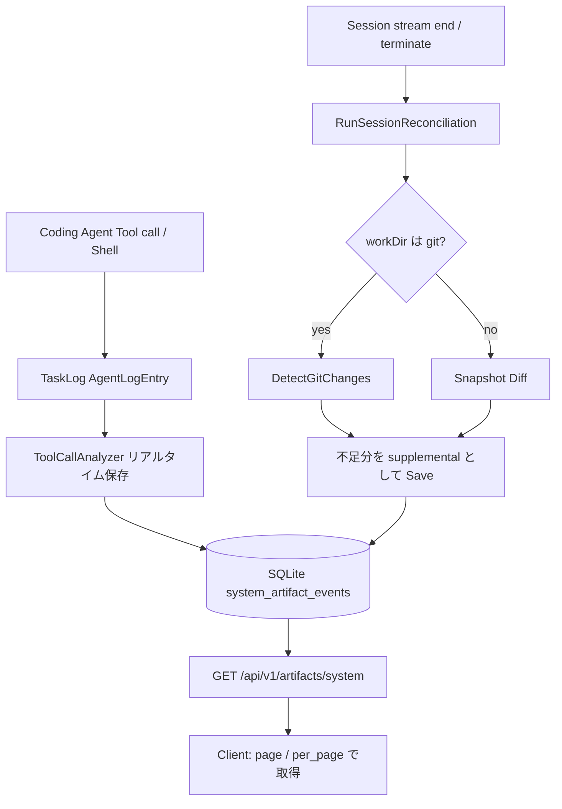

# 000 - System Artifact ファイル一覧の取得上限と大量変更時の挙動確認

## 背景 (Background)

Tern の Web API（`GET /api/v1/artifacts/system`）では、Coding Agent が編集したファイルを System Artifact として一覧取得できる。
本ブランチ（`check-atrifact-limitation`）では、次の運用上の疑問をコード調査と再現検証で確定し、仕様として固定する。

1. 一度に取得できるファイル数に上限があるか（Web API 側か、Coding Agent / 検知側か）
2. 大量変更時に Coding Agent / Tern がどう検知し、Web API がどうクライアントへ返すか
3. セッション再開後も、そのセッションで記録済みのファイルを引き続き検知・取得できるか
4. 約 50 件のファイル変更を、漏れなく一覧取得できるか

先行仕様: `prompts/phases/000-foundation/branches/feat-file-list/ideas/000-AgentFileListAPI.md`

> **契約の正（2026-08-13 レビュー後）**: ページネーションの未指定時デフォルトは **100**（安全弁）、明示 `per_page` はハード上限でクランプしない。本ドキュメント調査時点の「デフォルト30 / 最大100」は当時の実装観測値であり、実装の正は `001-SystemArtifact-FullListFixes.md` を参照すること。

---

## 要件 (Requirements)

### 必須要件（現状仕様の確定）

| # | 要件 |
|---|------|
| R1 | System Artifact 一覧のページネーション仕様（`page` / `per_page` のデフォルト・上限）を明文化する |
| R2 | Coding Agent 側のリアルタイム検知（Tool call 解析）に「一度に記録できるファイル数」の上限がないことを確認する |
| R3 | セッション終了時 Reconciliation（git / snapshot）の大量変更時挙動と、Web API への反映経路を明文化する |
| R4 | セッション再開（同一 `session_id` 継続）時に、過去イベントが List で取得可能かを確定する |
| R5 | 50 件の System Artifact イベントを保存し、`per_page` 指定およびページ巡回で全件取得できることを検証する |

### 任意要件（Nice-to-have / 今後の改善候補）

| # | 要件 |
|---|------|
| O1 | `RunSessionReconciliation` が ExistingEvents を読み込む際、デフォルト `per_page=30` に依存せず全件を読むよう修正する |
| O2 | Archive（`POST .../system/archive`）の glob 展開が `PerPage: 100` 固定である点を解消し、100 件超でも全キーを ZIP に含められるようにする |
| O3 | クライアント SDK に「全ページを自動走査して全件取得するヘルパー」を追加する |

---

## 実現方針 (Implementation Approach)

本ドキュメントは新規実装の提案ではなく、**現行実装の挙動確認結果を仕様として固定する**ものである。
実装変更が必要な場合は、上記 O1/O2/O3 を別仕様として切り出す。

### 全体データフロー



### 1. 取得件数の上限（回答）

| 層 | 上限の有無 | 内容 |
|----|-----------|------|
| Web API / Store | **あり** | `per_page` デフォルト **30**、最大 **100**（`normalizePerPage`）。`total_count` は全件件数を返す |
| Coding Agent リアルタイム検知 | **なし** | Tool call ごとに `SaveSystemArtifactEvent`。件数上限の定数なし |
| `file_change.changes[]` | **なし** | 配列内の全エントリをイベント化 |
| Shell コマンド解析 | **なし**（ただしパターン依存） | 認識できるリダイレクト等のみ。大量パスを 1 コマンドに詰め込んだ場合はパーサ能力に依存 |
| Git Reconciliation | **なし** | `git diff --name-status` / `ls-files --others` の結果を全件扱う |
| Snapshot Reconciliation | **なし** | `filepath.WalkDir` で全ファイル比較（メモリ・走査コストはディレクトリ規模に比例） |

根拠コード:

- `shared/libs/go/artifact/store/models.go` … `PerPage // default 30, max 100`
- `shared/libs/go/artifact/store/store.go` … `normalizePerPage`
- `shared/libs/go/artifact/analyzer/analyzer.go` … Tool call ごとの保存
- `shared/libs/go/artifact/analyzer/git_diff.go` / `snapshot_diff.go` … 件数上限なし

### 2. 大量変更時の挙動（回答）

#### Coding Agent / Tern 側

1. **リアルタイム（主経路）**  
   `Write` / `StrReplace` / `Edit` / `file_change` / Shell 等を TaskLog から解析し、都度 SQLite へ INSERT。
2. **セッション終了・ストリーム終端時の補完（副経路）**  
   `reconcileSessionArtifacts` → `RunSessionReconciliation`  
   - git リポジトリ: 未追跡・差分パスを `reconcile:git` として補充  
   - 非 git: セッション開始時スナップショットとの差分を `reconcile:snapshot` として補充  
   - 既にリアルタイムで記録済みのキーは二重登録しない（ExistingEvents で除外）

#### Web API / クライアント連携

- List は **イベント単位**（同一ファイルの create/update は別アイテム）。
- 1 レスポンスで返せるのは最大 100 件。50 件なら `per_page=50`（または `100`）で **1 ページ完結**。
- デフォルトのまま呼ぶと 50 件中 **先頭 30 件のみ**返る。残りは `page=2` で取得。
- クライアントは `total_count` を見てページを進める必要がある（SDK に自動全件取得ヘルパーは現状なし）。
- ZIP Archive の glob 展開は内部で `PerPage: 100` 固定のため、**101 件以上**が glob にマッチすると欠落しうる（今回の 50 件範囲では問題にならない）。

#### 現行実装上の注意（O1）

`RunSessionReconciliation` は ExistingEvents 取得時に `PerPage` を指定していない。

```go
page, err := st.ListSystemArtifacts(context.Background(),
    store.SystemArtifactFilter{SessionIDs: []string{sessionID}})
```

そのためデフォルト 30 件しか ExistingEvents に載らず、**31 件目以降は Reconciliation の重複排除から見えなくなる**。
リアルタイム検知で既に保存済みでも、git/snapshot 側に同じキーがあると supplemental として再 INSERT されうる。
List の取得自体（クライアントが `per_page` / ページ送りする場合）とは別問題。

### 3. セッション再開時の検知可否（回答）

| 観点 | 挙動 |
|------|------|
| 過去イベントの永続性 | `system_artifact_events` は SQLite に永続。`session_id` フィルタで **終了後も取得可能** |
| `CloseSession` | `sessions.ended_at` を更新するのみ。イベント行は削除しない |
| `ResumeSession` | 同一 Tern `session_id` のハンドルを再取得。Coding Agent 側は `AgentSessionID` を引き継いで継続 |
| 再開後の新規編集 | 同一 `session_id` で Tool call 解析が続き、新規イベントが追加される |
| 非 git スナップショット | スナップショットはセッション **作成時のみ**取得し、最初の reconcile 後にメモリから削除。再開後の補完は主にリアルタイム +（git なら）git reconcile |
| サーバ再起動 | Artifact DB は残る。一方 Tern の `SessionStore` 既定はメモリ実装のため、再開可能な Tern セッション自体はプロセス存続に依存する場合がある |

結論: **「そのセッションで記録されたファイル一覧」は `session_id` で引き続き List 可能**。再開して追記した変更も同一 `session_id` に積まれる。

### 4. 50 件検証結果（2026-08-13 実施）

検証スクリプト: `tmp/verify_50_artifacts/main.go`  
結果ログ: `tmp/verify_50_artifacts_result.txt`

| 検証項目 | 結果 |
|---------|------|
| Store デフォルト List（`per_page` 省略） | items=30 / total_count=50 |
| Store `per_page=50` | items=50 / total_count=50 （全件） |
| Store `per_page=100` | items=50 / total_count=50 （全件） |
| Store `per_page=200` | 100 にクランプ、items=50 |
| Store ページ巡回（`per_page=30` × page1+2） | unique_keys=50 |
| HTTP API も同様 | 同上すべて PASS |
| Reconciliation 風 List（PerPage 未指定） | ExistingEvents=30 / 50 → WARN |
| `DetectGitChanges` で untracked 50 件 | got=50 PASS |

**判定**: 50 件は Web API 上 **きっちり全件取得可能**。ただしクライアントはデフォルト呼び出しではなく、`per_page>=50` またはページ送りが必要。

---

## 検証シナリオ (Verification Scenarios)

ユーザー依頼どおり、以下を実施済み（要約せず転記）:

1. 一度に取得できるファイル数に上限があるかどうか（Web API での制限か、Coding Agent 側の制限か）をコードで確認する
2. 大量に変更があった場合、実際に Coding Agent ではどのような挙動をし、どうやって返却するのか。Web API ではそれをどう処理し、クライアントへ連携できるようにしているのかを確認する
3. セッションを再開したとき、そのセッション内ではこれらのファイルは引き続き検知可能なのかを確認する
4. コードを調べて、50 件程度のファイル検知をし、全てきっちり取得できるかどうか確認する

---

## テスト項目 (Testing)

手動確認のみは禁止。以下を実行する。

### 単体・パッケージテスト

```bash
go test ./shared/libs/go/artifact/store/ -run 'TestListSystemArtifacts_Pagination|TestListSystemArtifacts' -count=1
go test ./shared/libs/go/artifact/api/ -run 'TestSystemAPI_List_Pagination|TestSystemAPI_List' -count=1
go test ./shared/libs/go/artifact/analyzer/ -count=1
```

### 統合テスト

```bash
./scripts/process/integration_test.sh --specify 'TestReconcile_SessionEndGitSupplement|TestE2E_.*Artifact|TestCodexE2E_SystemArtifact'
```

### 50 件再現（本仕様の確認用）

```bash
go run ./tmp/verify_50_artifacts/
# 期待: 上記表の全項目が PASS（Reconciliation WARN は既知の O1）
```

### 受け入れ基準

- [x] `per_page` デフォルト 30 / 最大 100 がコードと検証で一致する
- [x] Coding Agent リアルタイム検知に固定件数上限がない
- [x] 50 件は `per_page=50` またはページ送りで全キー取得できる
- [x] セッション終了後も `session_id` フィルタでイベントが残る（設計上）
- [ ] （任意）O1: Reconciliation の ExistingEvents 全件読込修正は未実施

---

## クライアント利用上の推奨

50 件以上を確実に取る場合:

```go
page, err := c.SystemArtifacts().List(ctx, v1.SystemArtifactFilter{
    SessionIDs: []string{sessionID},
    PerPage:    100, // max
    Page:       1,
})
// total_count > per_page なら Page を進めて結合する
```

デフォルト（`PerPage: 0`）のままでは 30 件で打ち切られる点に注意。

---

## 参照ファイル

| 役割 | パス |
|------|------|
| List API | `shared/libs/go/artifact/api/system.go` |
| Store / ページネーション | `shared/libs/go/artifact/store/store.go`, `models.go` |
| リアルタイム検知 | `shared/libs/go/artifact/analyzer/analyzer.go` |
| Reconciliation | `shared/libs/go/artifact/analyzer/reconcile.go`, `shared/libs/go/agentservice/artifact_reconcile.go` |
| Client SDK | `client/v1/artifacts.go` |
| セッション再開 | `client/v1/session.go`（`ResumeSession`） |
| 先行仕様 | `prompts/phases/000-foundation/branches/feat-file-list/ideas/000-AgentFileListAPI.md` |
