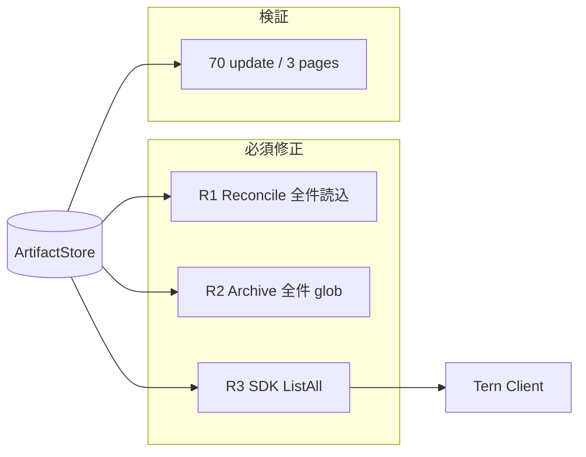

# 001 - System Artifact 大量一覧の完全取得（O1/O2/O3 必須化 + 70件3ページ検証）

## 背景 (Background)

先行確認仕様（`000-SystemArtifact-ListLimits.md`）により、次が判明した。

- Web API の `per_page` は現状デフォルト **30**、ハード上限 **100**（要改訂）
- Coding Agent 側の検知件数上限はない
- 50 件は `per_page` 指定またはページ送りで全件取得可能
- 一方で、次の3点が **未修正の欠陥 / 欠落機能** として残っている

| 旧任意 | 内容 | 影響 |
|--------|------|------|
| O1 | Reconciliation が ExistingEvents をデフォルト件数しか読まない | ページサイズ超で重複排除が不完全になり、同一キーが再 INSERT されうる |
| O2 | Archive の glob 展開が `PerPage: 100` 固定 | 101件超のマッチで ZIP 欠落 |
| O3 | Client SDK に全ページ自動走査ヘルパーがない | 利用者が `total_count` とページ送りを手実装する必要がある |

加えて、50 件検証は `per_page=30` だと **2ページ**（先頭30 + 残り20）にしかならず、先頭と末尾しか検証できない。
**70件の update データ**なら `per_page=30` で **3ページ**（30 + 30 + 10）となり、先頭・中間・末尾を検証できる。

本仕様は O1/O2/O3 をすべて必須化し、70件 update の3ページ検証を受け入れ条件に含める。

### レビュー決定（ページネーション方針）

| 項目 | 決定 |
|------|------|
| `per_page` / `limit` **未指定** | デフォルト **100** を返す（安全弁。意図せず巨大レスポンスにしない） |
| **明示指定** | 利用側の値を尊重する（ハード上限100でクランプしない） |
| 3ページ境界テスト | デフォルトに依存せず、明示的に `per_page=30` で実施する |

先行仕様:

- `prompts/phases/000-foundation/branches/check-atrifact-limitation/ideas/000-SystemArtifact-ListLimits.md`
- `prompts/phases/000-foundation/branches/feat-file-list/ideas/000-AgentFileListAPI.md`

---

## 要件 (Requirements)

### 必須要件

| # | 要件 |
|---|------|
| R1 | `RunSessionReconciliation` が ExistingEvents を読む際、ページネーション上限に依存せず **当該セッションの全イベント** を読み込む（旧 O1） |
| R2 | `POST /api/v1/artifacts/system/archive` の glob（`q`）展開で、マッチするキーを **件数上限なく** 収集し ZIP に含める（旧 O2）。Keys 直接指定と合わせて重複排除する |
| R3 | Client SDK（少なくとも `client/v1`）に、System Artifact 一覧を **全ページ自動走査して全件返すヘルパー** を追加する（旧 O3）。User Artifact も同趣旨で揃えることを推奨 |
| R4 | **明示的に `per_page=30`** で、**70件の update イベント**を page1（先頭30）/ page2（中間30）/ page3（末尾10）で欠落なく取得できることを自動テストで保証する |
| R5 | R4 の3ページ結果を結合した unique key 数が 70 であること、およびページ境界の連続性（sort=key 時）を検証する |
| R6 | R1 修正後、70件以上の既存イベントがあるセッションでも Reconciliation の重複排除が正しく働き、既知キーが supplemental として再 INSERT されないこと |
| R7 | List の `per_page`（または同等の `limit`）は **未指定時デフォルト 100**（安全弁）。利用側が明示した件数は尊重し、ハード上限100でのクランプは行わない。全件取得はヘルパーまたは明示的ページ送りでも可能とする |

### 任意要件（Nice-to-have）

| # | 要件 |
|---|------|
| O1 | User Artifact Archive にも同様の全件 glob 展開を適用する（現状が 100 固定なら） |
| O2 | `ListAll` ヘルパーにコンテキストキャンセル・進捗コールバックを付ける |

---

## 実現方針 (Implementation Approach)

### 全体像



### R1: Reconciliation の ExistingEvents 全件読込

対象: `shared/libs/go/artifact/analyzer/reconcile.go` の `RunSessionReconciliation`

現状:

```go
page, err := st.ListSystemArtifacts(context.Background(),
    store.SystemArtifactFilter{SessionIDs: []string{sessionID}})
```

方針（いずれか）:

1. **推奨**: Store に `ListAllSystemArtifacts(ctx, filter without page)` 相当を追加し、ページを内部走査または SQL で全件返す
2. または `PerPage` に「無制限」を表す値（例: `-1`）を導入し、`normalizePerPage` を拡張
3. 最低限: `RunSessionReconciliation` 側で `page=1,2,...` を `per_page=100` で回して ExistingEvents を結合

受け入れ: 70件超の ExistingEvents がある状態で git/snapshot reconcile しても、既存キーの二重登録が起きない。

### R2: Archive glob の全件収集

対象: `shared/libs/go/artifact/api/system.go` の `handleArchive`

現状:

```go
page, _ := h.store.ListSystemArtifacts(r.Context(), store.SystemArtifactFilter{
    Q: req.Q, SessionIDs: req.SessionID, PerPage: 100,
})
```

方針: R1 と同じ全件取得手段を使い、glob マッチ結果をページ横断で収集する。
User Artifact 側 archive に同様の固定がある場合は任意 O1 で扱う。

### R3: Client SDK `ListAll` ヘルパー

対象: `client/v1/artifacts.go`（必要なら `client/artifacts.go` も）

想定 API 例:

```go
// ListAll walks pages until all items matching f are collected.
// f.Page is ignored; when f.PerPage is unset, each request uses the API default (100).
func (sc *SystemArtifactClient) ListAll(ctx context.Context, f SystemArtifactFilter) ([]SystemArtifactItem, error)
```

実装: `total_count` または空ページまで `Page` をインクリメント。コンテキストキャンセルを尊重。

### R7: `normalizePerPage` の改訂

現状（`store.go`）: `n<=0 → 30`、`n>100 → 100`。

改訂後:

| 入力 | 結果 |
|------|------|
| 未指定 / `<=0` | **100**（安全弁デフォルト） |
| 利用側が明示した正の整数 | **そのまま**（例: 70, 200, 1000） |

パラメータ名は既存の `per_page` を基本とし、ドキュメント上 `limit` と同義として扱ってよい（新規エイリアスが必要なら実装計画で判断）。

### R4/R5: 70件 update・3ページ検証の意味

**明示的に `per_page=30`** のとき（デフォルト100とは独立した境界テスト）:

| ページ | 役割 | 件数 |
|--------|------|------|
| page=1 | 先頭 | 30 |
| page=2 | 中間 | 30 |
| page=3 | 末尾 | 10 |
| 合計 | | 70 |

50件だと page1=30 / page2=20 の2ページのみで、中間ページの境界バグ（オフセット計算誤り等）を検出しにくい。
70件なら先頭・中間・末尾を同一シナリオでカバーできる。

データは **update 操作** を用いる（create のみだと運用上の「大量更新」を代表しにくい）。
検証では各キーに create + update を入れ、`operation=update` フィルタでちょうど70行になるようにする。

あわせて R7 用に「未指定時は items が最大100」「`per_page=200` 指定時はクランプされず最大200まで返る」を単体テストする。

### 非目標

- Coding Agent 本体のツール呼び出し回数制限の変更は対象外
- 未指定時に全件を一気に返すこと（それは安全弁に反する。全件は `ListAll` または大きな明示 `per_page`）

---

## 検証シナリオ (Verification Scenarios)

ユーザー依頼どおり転記:

1. O1, O2, O3 を全て必須にする
2. 追加で70件の更新データも確認する。これは、30件表示であることを根拠に、3ページ分の試験になるためである。50件だと2ページで、最初と最後のテストにしかならない。70件あれば、最初と中間と最後のテストができると想定している

---

## テスト項目 (Testing)

手動確認のみ禁止。

### 単体・パッケージテスト

```bash
go test ./shared/libs/go/artifact/analyzer/ -run 'Reconcile|Existing|ListAll|Pagination' -count=1
go test ./shared/libs/go/artifact/api/ -run 'Archive|List_Pagination|SystemAPI' -count=1
go test ./shared/libs/go/artifact/store/ -run 'ListSystemArtifacts' -count=1
go test ./client/v1/ -run 'Artifact|ListAll' -count=1
```

追加すべき自動テスト（実装計画で詳細化）:

| テスト | 内容 |
|--------|------|
| Store/API | 70 update、明示 `per_page=30` で page1=30 / page2=30 / page3=10、結合 unique=70 |
| Store/API | 未指定時デフォルト100、明示 `per_page=200` はクランプせず尊重 |
| Reconcile | ExistingEvents が 70超でも既知キーを supplemental しない |
| Archive | glob で 120 キー相当を ZIP に含め、100件で打ち切られない |
| Client | `ListAll` が 70 update を1回の呼び出しで全件返す |

### 統合テスト

```bash
./scripts/process/integration_test.sh --specify 'TestReconcile_SessionEndGitSupplement|TestE2E_.*Artifact|TestCodexE2E_SystemArtifact'
```

### 70件 update 再現（現状ベースライン確認済み）

```bash
go run ./tmp/verify_70_updates/
# 結果: tmp/verify_70_updates_result.txt
```

#### 2026-08-13 ベースライン結果（修正前）

| 検証項目 | 結果 |
|---------|------|
| Store page1 first（update×70, per_page=30） | items=30 / total=70 PASS |
| Store page2 middle | items=30 / total=70 PASS |
| Store page3 last | items=10 / total=70 PASS |
| 3ページ結合 unique | 70/70 PASS |
| ページ境界連続性（sort=key） | PASS |
| HTTP API 3ページ | すべて PASS |
| `per_page=70` / `100` 一括 | PASS |
| Reconcile 風 List（PerPage 未指定） | got=30 of 140 → **R1 未修正のまま WARN** |
| DetectGitChanges update 70件 | PASS |

### 受け入れ基準

- [ ] R1: Reconciliation がセッション内 ExistingEvents を全件読み、70件超でも重複 supplemental が起きない
- [ ] R2: Archive glob が 100件超でも全キーを ZIP に含める
- [ ] R3: `ListAll`（または同等）が page 走査を隠蔽して全件を返す
- [x] R4/R5: 70 update・3ページ（先頭/中間/末尾）で欠落なく取得できることをベースライン確認済み。実装後は自動テストとして恒久化
- [ ] R6: R1 修正の回帰テストが緑
- [ ] R7: 未指定時デフォルト100（安全弁）。明示 `per_page` はハード上限100でクランプされない

---

## 参照ファイル

| 役割 | パス |
|------|------|
| Reconciliation | `shared/libs/go/artifact/analyzer/reconcile.go` |
| Archive API | `shared/libs/go/artifact/api/system.go` |
| Store ページネーション | `shared/libs/go/artifact/store/store.go` |
| Client SDK | `client/v1/artifacts.go` |
| 70件検証 | `tmp/verify_70_updates/` |
| 先行確認仕様 | `prompts/phases/000-foundation/branches/check-atrifact-limitation/ideas/000-SystemArtifact-ListLimits.md` |
