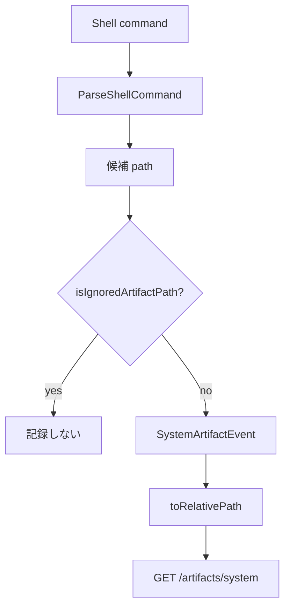

# 002 - シェルコマンド解析が `/dev/null` をファイル更新と誤認する問題

## 背景 (Background)

System Artifact の更新ファイル一覧に、実在しない **`null`** というキーが現れる報告がある。
調査の結果、原因は Coding Agent のシェル Tool call を解析する `ParseShellCommand` が、
`>/dev/null` / `>>/dev/null` などの破棄リダイレクトを通常のファイル書き込みとして扱っていることである。

プロジェクトルート外の絶対パスは `ToolCallAnalyzer.toRelativePath` が basename にフォールバックするため、
`/dev/null` → 論理キー **`null`** として SQLite / Web API に露出する。

関連:

- `prompts/phases/000-foundation/branches/check-atrifact-limitation/ideas/000-SystemArtifact-ListLimits.md`
- `prompts/phases/000-foundation/branches/check-atrifact-limitation/ideas/001-SystemArtifact-FullListFixes.md`

---

## 要件 (Requirements)

### 必須要件

| # | 要件 |
|---|------|
| R1 | シェル解析で **特殊デバイス / 破棄先** へのリダイレクト・tee 先をファイル操作として記録しない |
| R2 | 少なくとも次を除外する: `/dev/null`, `/dev/stdout`, `/dev/stderr`, Windows の `NUL` / `nul`（大文字小文字無視） |
| R3 | `2>/dev/null` や `>/dev/null 2>&1` のような stderr/stdout 破棄も除外する（現状は `>` マッチで `/dev/null` を create 扱い） |
| R4 | 同一コマンドに実ファイル書き込みと `/dev/null` が混在する場合、実ファイル側のみを記録する |
| R5 | 上記を単体テストで固定する（誤検知ゼロ + 正当な `> out.txt` は従来どおり検知） |

### 任意要件

| # | 要件 |
|---|------|
| O1 | `/dev/fd/*`, `/dev/tty`, `CON`, `PRN` 等の追加デバイス除外 |
| O2 | `&>/dev/null` / `>&` 結合リダイレクトの明示対応 |

---

## 実現方針 (Implementation Approach)

### 再現結果（2026-08-13）

検証: `tmp/verify_dev_null/` → `tmp/verify_dev_null_result.txt`

| コマンド | 現状の解析結果 |
|----------|----------------|
| `echo hi > /dev/null` | path=`/dev/null` op=**create** |
| `echo hi >> /dev/null` | path=`/dev/null` op=**update** |
| `cmd 2>/dev/null` | path=`/dev/null` op=**create** |
| `cmd >/dev/null 2>&1` | path=`/dev/null` op=**create** |
| `echo hi > /dev/null && echo x > real.txt` | `/dev/null` と `real.txt` の両方 |
| `echo hi >NUL` / `> nul` | path=`NUL` / `nul` op=create |
| `cat foo \| tee /dev/null` | path=`/dev/null` op=create |

パス正規化:

```
parser path="/dev/null" → basename_key_candidate="null"
```

これが一覧に `null` が出る直接原因。

### 原因箇所

```57:58:shared/libs/go/artifact/analyzer/command_parser.go
	for _, m := range regexp.MustCompile(`>\s*([^\s|;&]+)`).FindAllStringSubmatch(withoutAppend, -1) {
		add(m[1], store.OperationCreate)
```

- `>>` → update、`>` → create としてパスを無条件採用
- `tee` も同様に `/dev/null` を create 扱い
- 除外リストなし

### 修正方針

`ParseShellCommand` の `add` 直前（または `add` 内）で **無視すべきパス** を判定する。

```go
func isIgnoredArtifactPath(path string) bool {
    p := strings.TrimSpace(stripQuotes(path))
    // slash 正規化後に判定
    switch strings.ToLower(filepath.ToSlash(p)) {
    case "/dev/null", "/dev/stdout", "/dev/stderr", "nul", "nul:":
        return true
    }
    // Windows: bare NUL
    if strings.EqualFold(p, "NUL") {
        return true
    }
    return false
}
```

`analyzer.buildEvent` 側でも二重防御として無視してよいが、**一次フィルタは parser** に置く（シェル由来以外の正当なパスを落とさないため）。



### 非目標

- シェル文法の完全パーサ化（現状の regexp 方針は維持）
- git/snapshot reconcile 経路の変更（本バグはリアルタイム shell 解析固有）

---

## 検証シナリオ (Verification Scenarios)

ユーザー報告どおり転記:

- Tern のシェルコマンド解析が `/dev/null` へのリダイレクトを「ファイル更新」と誤認しているのではないかという報告がある
- null というファイルが更新ファイルの一覧に出てくる

追加確認手順:

1. Agent が `something > /dev/null` を実行したセッションで `GET /api/v1/artifacts/system?session_id=...` を叩き、`key=null` または `key=/dev/null` が **出ない** こと
2. 同セッションで `echo x > real.txt` は従来どおり一覧に出ること

---

## テスト項目 (Testing)

### 単体テスト

```bash
go test ./shared/libs/go/artifact/analyzer/ -run 'ParseShellCommand|DevNull|IgnoredPath' -count=1
```

`command_parser_test.go` に少なくとも次を追加:

| ケース | 期待 |
|--------|------|
| `echo hi > /dev/null` | ops 空 |
| `echo hi >> /dev/null` | ops 空 |
| `cmd 2>/dev/null` | ops 空 |
| `cmd >/dev/null 2>&1` | ops 空 |
| `echo hi > /dev/null && echo x > real.txt` | `real.txt` create のみ |
| `cat foo \| tee /dev/null` | ops 空 |
| `echo hi >NUL` / `> nul` | ops 空 |
| `echo hello > output.txt` | 従来どおり create（回帰） |

### 統合テスト

```bash
./scripts/process/integration_test.sh --specify 'TestReconcile_SessionEndGitSupplement|TestE2E_.*Artifact'
```

（シェル誤検知専用の E2E が必要なら実装計画で `TestShellParser_IgnoresDevNull` を追加）

### 受け入れ基準

- [ ] `/dev/null` 系リダイレクトから System Artifact が生成されない
- [ ] 一覧に `null` / `NUL` キーが出ない
- [ ] 正当なリダイレクト先ファイルの検知は維持される
- [ ] 上記単体テストが緑

---

## 参照ファイル

| 役割 | パス |
|------|------|
| シェル解析 | `shared/libs/go/artifact/analyzer/command_parser.go` |
| 解析テスト | `shared/libs/go/artifact/analyzer/command_parser_test.go` |
| パス正規化（basename フォールバック） | `shared/libs/go/artifact/analyzer/analyzer.go` |
| 再現スクリプト | `tmp/verify_dev_null/` |
