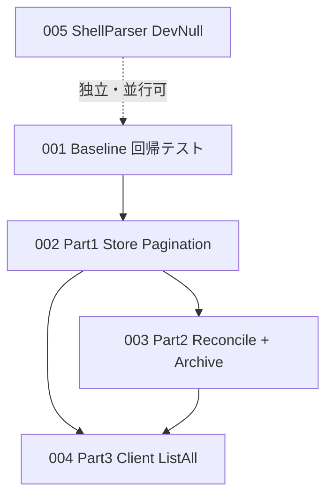

# 000-ArtifactLimitation-ExecutionOrder

> **Source Specification**:
> - `prompts/phases/000-foundation/branches/check-atrifact-limitation/ideas/000-SystemArtifact-ListLimits.md`
> - `prompts/phases/000-foundation/branches/check-atrifact-limitation/ideas/001-SystemArtifact-FullListFixes.md`
> - `prompts/phases/000-foundation/branches/check-atrifact-limitation/ideas/002-ShellParser-DevNull-FalsePositive.md`

## Goal Description

本ブランチの3仕様を実装する際の **前後関係・実行順** を固定する。各 Part の詳細は後続計画ファイルを正とする。

## User Review Required

実行順（下表）でよいか確認。特に「002 シェル誤検知」を最初に独立実施する点。

## Requirement Traceability

| Spec | 計画ファイル | 役割 |
| :--- | :--- | :--- |
| 000 ListLimits（確認結果の恒久化） | `001-SystemArtifact-ListLimits-Baseline.md` | 明示 `per_page` による回帰テスト・ドキュメント整合 |
| 001 FullListFixes R7 / Store基盤 | `002-SystemArtifact-FullListFixes-Part1-StorePagination.md` | デフォルト100・クランプ撤廃・全件読込ヘルパー・70件3ページ |
| 001 FullListFixes R1/R2/R6 | `003-SystemArtifact-FullListFixes-Part2-ReconcileArchive.md` | Reconcile全件・Archive全件glob |
| 001 FullListFixes R3 + 統合 | `004-SystemArtifact-FullListFixes-Part3-ClientListAll.md` | SDK `ListAll`・README・統合テスト |
| 002 DevNull | `005-ShellParser-DevNull-FalsePositive.md` | `/dev/null` 誤検知修正 |

## 依存関係と実行順

### 推奨実行順（直列）

| Step | Plan | 理由 |
| ---: | :--- | :--- |
| 1 | **005** ShellParser | 他 Part と無依存。一覧ノイズ `null` を先に除去 |
| 2 | **001** Baseline | 000の確認結果を明示 `per_page` 付き自動テストへ（001改訂後も壊れない形） |
| 3 | **002** Part1 Store | R7 と `ListAllSystemArtifacts` が後続の前提 |
| 4 | **003** Part2 Reconcile/Archive | Part1 の全件ヘルパーに依存 |
| 5 | **004** Part3 Client | Part1 のページ契約に依存。統合は最後 |

### 並行可能な組合せ

- Step1（005）と Step2（001）は **並行可**
- Step4（003）と Step5（004）の実装着手は Part1 完了後なら並行可（マージは両方緑になってから）

### 000 と 001 の関係（重要）

| 項目 | 000（調査時点） | 001（レビュー後の正） |
| :--- | :--- | :--- |
| 未指定時 `per_page` | 30 | **100（安全弁）** |
| ハード上限100 | あり | **撤廃**（明示値を尊重） |
| O1/O2/O3 | 任意 | **必須 R1/R2/R3** |

→ 000 計画のテストは **明示 `per_page`** のみで境界を固定し、デフォルト30前提のアサーションは書かない（001 が上書きする）。

## Proposed Changes

本ファイルは変更コードなし。オーケストレーションのみ。

## Step-by-Step Implementation Guide

1. **Review order**: 本ファイルの実行順をユーザーが承認する。
2. **Execute 005**: `005-ShellParser-DevNull-FalsePositive.md` に従う。
3. **Execute 001**: `001-SystemArtifact-ListLimits-Baseline.md` に従う。
4. **Execute 002→003→004**: FullListFixes Part1〜3 の順（または 003/004 並行）。
5. **Final verify**: 全 Part 完了後に `./scripts/process/build.sh` と指定の `integration_test.sh` を通す（各 Part の Verification も都度実施）。

## Verification Plan

### Automated Verification

各 Part 完了時に当該 Part の Verification Plan を実行。全完了時:

1. **Build & Unit Tests**: `./scripts/process/build.sh`
2. **Integration Tests**: `./scripts/process/build.sh && ./scripts/process/integration_test.sh --specify 'TestReconcile_SessionEndGitSupplement|TestE2E_.*Artifact|TestCodexE2E_SystemArtifact|TestSystemArtifact_SeventyUpdatePages|TestShellParser_IgnoresDevNull|TestSystemArtifact_ListAll'`

## Documentation

実行順の変更が必要になった場合は本ファイルを先に更新してから Part 計画を直す。
