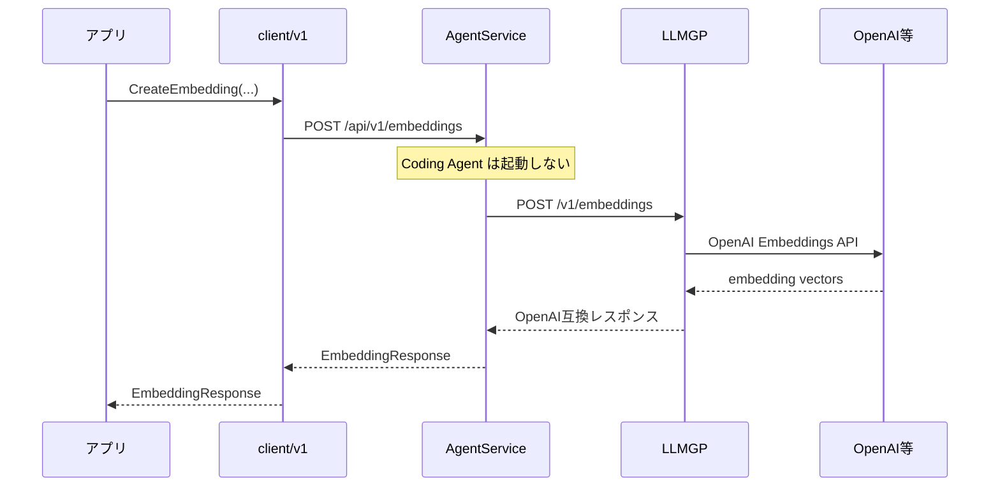

# 仕様書: OpenAI Embeddings API 対応（Client API バイパス）

## 1. 背景 (Background)

Tern は原則として **Coding Agent 経由**で LLM にアクセスする。セッション作成・メッセージ送信・ツール実行といった対話型ワークフローはこの経路が正しい。

一方、OpenAI の **Embeddings API**（テキストをベクトル化する API）は Coding Agent の能力外である。

- エージェントの対話ループやツール呼び出しを必要としない
- 同期的な 1 リクエスト / 1 レスポンスが自然
- 利用側は「埋め込みベクトル」を直接欲しいので、Agent セッションを経由させると冗長で意味もない

現状の Tern には次のギャップがある。

| 層 | 現状 | 課題 |
|---|---|---|
| LLMGP（`llmgateway`） | `/v1/messages`, `/v1/responses`, `/v1/models` のみ | OpenAI 互換の `/v1/embeddings` が未提供 |
| Bifrost SDK（依存済 v1.7.7） | `EmbeddingRequest` API を持つ | Tern 側から未配線 |
| AgentService / `client/v1` | セッション・エージェント API のみ | Embeddings 用の公開 Client API が無い |
| `model_profiles.yaml` | chat / responses モデル中心 | embedding モデル（例: `text-embedding-3-small`）の扱いが未定義 |

本仕様では、**Embeddings 専用の Client API** を追加し、その経路だけ Coding Agent を経由せず **LLMGP へバイパス**する。

用語の整理:

- **Embeddings API**: OpenAI 互換の埋め込みベクトル生成 API（本仕様の対象）
- **Embedded / In-Process モデル**: プロセス内推論エンジンの話ではない（本仕様の対象外）

## 2. 要件 (Requirements)

### 必須要件

#### R1: LLMGP に OpenAI 互換 Embeddings エンドポイントを追加する

* LLM Gateway Proxy に `POST /v1/embeddings` を公開する。
* リクエスト / レスポンスは OpenAI Embeddings API 互換とする。

リクエスト例:

```json
{
  "model": "text-embedding-3-small",
  "input": "The food was delicious and the waiter...",
  "encoding_format": "float"
}
```

* `input` は文字列または文字列配列を受け付ける。
* `encoding_format`（任意）: `"float"`（既定） / `"base64"`。
* `dimensions`（任意）: 対応モデルで次元削減を指定できる場合に転送する。

レスポンス例（概形）:

```json
{
  "object": "list",
  "data": [
    {
      "object": "embedding",
      "embedding": [0.0023064255, -0.009327292, "..."],
      "index": 0
    }
  ],
  "model": "text-embedding-3-small",
  "usage": {
    "prompt_tokens": 8,
    "total_tokens": 8
  }
}
```

* 認証は既存の LLMGP 認証ミドルウェア（Bearer 等）と揃える。
* モデル解決は既存の `ModelRouter` / `model_profiles.yaml` 経路を再利用する。

#### R2: Embeddings 専用の Client API を追加する

* `client/v1` に Coding Agent を介さない Embeddings API を追加する。
* 公開メソッドの想定:

```go
func (c *Client) CreateEmbedding(ctx context.Context, req EmbeddingRequest) (*EmbeddingResponse, error)
```

* HTTP 上は AgentService 側の専用エンドポイント経由とする（例: `POST /api/v1/embeddings`）。
* この API はセッション作成を要求しない。
* 既存の `CreateSession` / `SendMessage` 等の挙動は変更しない。

#### R3: Coding Agent をバイパスし LLMGP へ直接転送する

Embeddings 経路のみ、次のフローとする。



* AgentService は Embeddings リクエストを受けたら Coding Agent を起動せず、内部で保持する Gateway（LLMGP）へ転送する。
* 通常のセッション API（`/api/v1/sessions/*`）は従来どおり Coding Agent 経由のままとする。

#### R4: embedding モデルを model_profiles で宣言できるようにする

* `model_profiles.yaml` で embedding 用モデルを登録できること。
* モデル種別を区別できること（chat / responses と embedding を混同しない）。
  * 例: `mode: embedding` を追加する、または同等の明示的なフラグ / フィールドを導入する。
* `ListModels`（エージェント向けモデル一覧）に embedding 専用モデルを混ぜない。
  * Embeddings 用モデルの列挙は R7 の専用一覧 API で行う。

#### R5: エラーハンドリング

* 未登録モデル / ルーティング失敗: 明確な 4xx。
* 上流プロバイダエラー: ステータスとメッセージを可能な範囲で透過または正規化して返す。
* Gateway 未起動・到達不能: 5xx（または接続エラーを Client に返す）。
* `input` 欠落・不正型: 400。

#### R6: 複数プロバイダの embedding 転送に対応する（旧 O1）

* OpenAI に加え、Bifrost が embedding をサポートする既存プロバイダへ転送できること。
  * 最低限の対象: **OpenAI**, **Ollama**, **Google (Gemini)**（Tern に既に Provider 登録があるもの）。
* `model_profiles.yaml` で各プロバイダに `mode: embedding` のモデルを登録し、同一の Client / LLMGP 契約（OpenAI 互換 JSON）で呼び出せること。
* プロバイダ固有の差分は LLMGP / Bifrost 側で吸収し、Client API の外面は変えない。

#### R7: Embeddings モデル一覧 API（旧 O2）

* AgentService に Embeddings 専用のモデル一覧エンドポイントを追加する。
  * 例: `GET /api/v1/embeddings/models`
* `client/v1` に対応メソッドを追加する（例: `ListEmbeddingModels`）。
* 返却対象は `mode: embedding`（または同等）のモデルのみとする。
* 既存の `GET /api/v1/models` / `ListModels` には embedding モデルを含めない（R4 と整合）。

#### R8: Embeddings 使用例の追加（旧 O4）

* `examples/` 配下に、Embeddings Client API を使う最小サンプルを追加する。
* サンプルは次を示すこと。
  * `ListEmbeddingModels`（または同等）でモデル一覧を取得する
  * `CreateEmbedding` で単一テキストを埋め込む
  * Coding Agent / セッション API を使わないこと
* README またはコメントで起動前提（Tern 起動、embedding モデル登録、必要なら API キー）を簡潔に記載する。

### 任意要件

#### O3: バッチサイズ上限・入力サイズ制限

* 過大な `input` 配列や極端に長い文字列に対するガードは望ましいが、第1弾ではプロバイダ側制限に委譲してもよい。

## 3. 実現方針 (Implementation Approach)

### 設計方針

1. **経路の分離を明確にする**
   * 対話・コーディング: Client → AgentService → Coding Agent → LLMGP
   * Embeddings: Client → AgentService → LLMGP（Agent バイパス）
2. **LLMGP を単一の LLM 出口にする**
   * AgentService から上流プロバイダへ直接飛ばさず、必ず LLMGP の `/v1/embeddings` を通す。
   * 認証・ルーティング・Vault 解決を既存 Gateway に集約する。
3. **Bifrost の `EmbeddingRequest` を利用する**
   * 既に依存している Bifrost SDK に embedding サポートがあるため、新規推論エンジンは導入しない。
4. **OpenAI 互換を外面の契約にする**
   * Client / AgentService / LLMGP の JSON 契約は OpenAI Embeddings API に寄せ、アプリ側の学習コストを下げる。

### 主な変更箇所（想定）

| 領域 | 変更 |
|---|---|
| `shared/libs/go/llmgateway` | `POST /v1/embeddings` ハンドラ追加。Bifrost `EmbeddingRequest` 呼び出し。OpenAI / Ollama / Google へのルーティング |
| `shared/libs/go/config` | `ModelConfig.Mode` に `embedding` を追加、または同等の識別子。一覧フィルタ用ヘルパ |
| `shared/libs/go/agentservice` | `POST /api/v1/embeddings` と `GET /api/v1/embeddings/models` を追加し、Gateway へプロキシ / プロファイル参照 |
| `client/v1` | `CreateEmbedding` / `ListEmbeddingModels` およびリクエスト/レスポンス型を追加 |
| `settings/example/model_profiles.yaml` | OpenAI / Ollama / Google の embedding モデル例を追加 |
| `examples/` | Embeddings Client の最小サンプル（R8） |
| `tests/` | LLMGP / Client / AgentService の統合テスト |

### モデル指定

* Client からは既存と同様、論理名または実モデル名を `model` に指定する。
* ルーティングは既存の `ResolveModel` 相当を使い、provider + model に解決する。
* embedding モードでないモデルを Embeddings API に指定した場合は 400 とする（または上流エラーを返す）。どちらにするかは実装計画で確定する。推奨は **明示的な 400（mode 不一致）**。

### 非目標（Non-Goals）

* Coding Agent 内からの自動 embedding 利用
* ベクトル DB / RAG パイプライン本体
* プロセス内（llama.cpp 等）へのモデル埋め込み
* Chat Completions 一般の Agent バイパス（本仕様は Embeddings のみ）

## 4. 検証シナリオ (Verification Scenarios)

### シナリオ1: Client API から単一テキストを埋め込む

1. OpenAI API キーを Vault / `model_profiles.yaml` に設定した状態で Tern を起動する。
2. `model_profiles.yaml` に `text-embedding-3-small`（`mode: embedding`）を登録する。
3. `client/v1` の `CreateEmbedding` で次を実行する。
   * model: `text-embedding-3-small`
   * input: `"hello embeddings"`
4. エラーなくベクトル配列（非空の `float` 配列）が返ることを確認する。
5. この間、Coding Agent プロセスが起動していないことを確認する。

### シナリオ2: 複数テキストのバッチ埋め込み

1. `input` に文字列配列（2件以上）を指定して `CreateEmbedding` を呼ぶ。
2. `data` の件数が入力件数と一致し、各 `index` が対応することを確認する。

### シナリオ3: 通常セッション経路が非回帰であること

1. 既存どおり `CreateSession` + `SendText` で Coding Agent 経由の対話が動作することを確認する。
2. Embeddings API 追加後もセッション API の契約・挙動が変わっていないことを確認する。

### シナリオ4: 不正リクエスト

1. `input` 無しで呼び、400 系エラーになることを確認する。
2. 未登録モデル名で呼び、4xx になることを確認する。

### シナリオ5: Embeddings モデル一覧

1. `ListEmbeddingModels`（`GET /api/v1/embeddings/models`）を呼ぶ。
2. 返却リストに `mode: embedding` のモデルのみが含まれることを確認する。
3. 既存の `ListModels` に embedding モデルが含まれないことを確認する。

### シナリオ6: 複数プロバイダ

1. OpenAI / Ollama / Google それぞれに embedding モデルを `model_profiles.yaml` へ登録する。
2. 各プロバイダのモデル名で `CreateEmbedding` を呼び、同一の Client API 契約でベクトルが返ることを確認する。
3. （実キーやローカルランタイムが無い環境では、モック / stub Gateway による統合テストで代替してよい）

### シナリオ7: examples サンプル

1. `examples/` の Embeddings サンプルをビルドできることを確認する。
2. Tern 起動済み環境でサンプルを実行し、モデル一覧取得と単一テキスト埋め込みが成功することを確認する。

## 5. テスト項目 (Testing)

### 単体テスト

* LLMGP: `/v1/embeddings` のリクエスト検証、Bifrost 呼び出しマッピング、複数プロバイダへのルーティング、エラー変換。
* AgentService: `/api/v1/embeddings` が Gateway へ転送され、Agent を起動しないこと。`/api/v1/embeddings/models` が embedding モデルのみを返すこと。
* `client/v1`: `CreateEmbedding` / `ListEmbeddingModels` のリクエスト組み立てとレスポンスデコード。
* config: `mode: embedding` のパースと、エージェント向けモデル一覧からの除外（方針どおり）。
* examples: サンプルパッケージがビルド可能であること（`examples_build_test` 相当への追加を含む）。

### 統合テスト

```bash
./scripts/process/build.sh && ./scripts/process/integration_test.sh --specify "Embedding"
```

OpenAI 実キーが必要な E2E がある場合:

```bash
./scripts/process/integration_test.sh --specify "EmbeddingE2E"
```

（カテゴリ機構を使う場合の想定）

```bash
./scripts/process/integration_test.sh --categories llm --specify "Embedding"
```

### 手動確認（自動テストを補完する場合のみ）

* シナリオ1〜7を最小 Client / examples から実行し、レスポンス JSON を確認する。
* ただし手動確認のみの計画は不可。上記の自動テストを必須とする。
