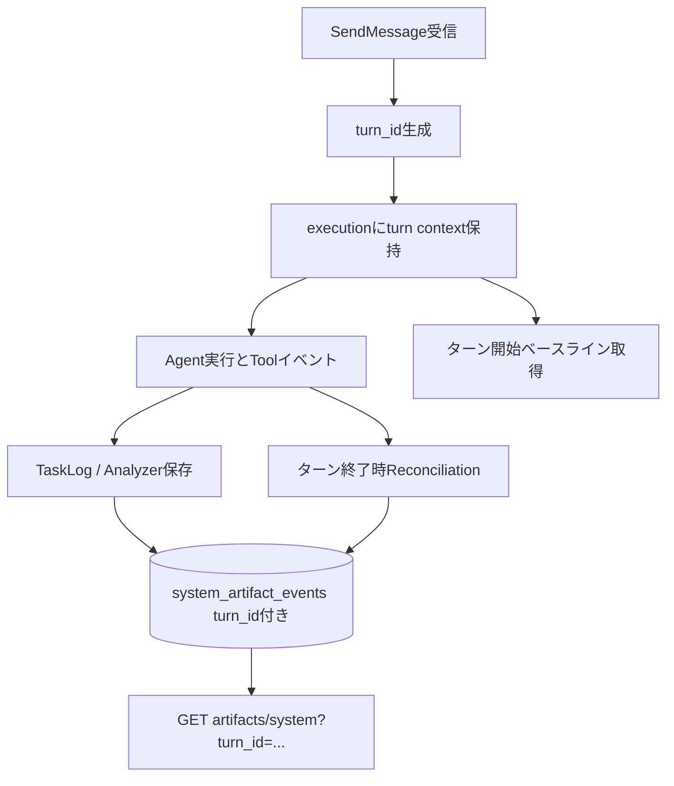

# 001 - System Artifact のターン単位相関と抽出（Issue #38）

## 背景 (Background)

[Issue #38](https://github.com/axsh/arctic-tern/issues/38) で、同一 `session_id` を継続利用する運用において、System Artifact を `SendMessage` ターン単位で取得したい要望が出ている。

現状の `GET /api/v1/artifacts/system` は、主に次の軸での絞り込みを提供している。

- `session_id`
- `agent_id`
- `operation`
- `since` / `until`

一方で、同一セッション内の複数ターンを厳密に分離するための一次キー（`turn_id` または `correlation_id`）が存在しないため、次の課題がある。

- 時刻窓 (`since` / `until`) だけでは隣接ターンの混入を完全に防げない
- 監査用途や UI の「直近ターンの変更ファイル」表示で曖昧さが残る
- 下流ツールが「このターンだけの書き込み」を機械的に扱いにくい

特に Reconciliation（git/snapshot 補完）を行う経路はセッション全体との差分を扱うため、ターン境界を明示しない場合に誤帰属が起きうる。  
そのため、イベントへの ID 付与だけでなく、ターン境界に沿った補完設計が必要である。

---

## 要件 (Requirements)

### 必須要件

| # | 要件 |
|---|------|
| R1 | Tern が `SendMessage` 開始時にサーバー生成の `turn_id` を採番する |
| R2 | `POST /api/v1/sessions/:id/messages` が任意の `correlation_id` を受け付ける |
| R3 | `system_artifact_events` に `turn_id`（必須運用）と `correlation_id`（任意）を保存できる |
| R4 | `GET /api/v1/artifacts/system` に `turn_id`（必要に応じて `correlation_id`）フィルタを追加する |
| R5 | `client/v1` の `SystemArtifactFilter` に `TurnIDs`（必要に応じて `CorrelationIDs`）を追加する |
| R6 | `SendMessage` の SSE/完了経路で `turn_id` をクライアントへ返却する |
| R7 | `respond` は同一ターン継続として扱い、`SendMessage` 開始から最終完了まで同一 `turn_id` を維持する |
| R8 | Reconciliation 補完イベントもターン帰属できるよう、ターン開始時点のベースラインを保持して差分計算する |
| R9 | 既存データ互換を維持する（既存行の `turn_id` は空許容、フィルタ未指定時の挙動は従来どおり） |
| R10 | API リファレンスと `client/v1` ドキュメントに新フィールド・新フィルタの契約を追記する |

### 任意要件（Nice-to-have）

| # | 要件 |
|---|------|
| O1 | 最新完了ターンを簡便取得する API（例: `latest_turn=true`）を提供する |
| O2 | Artifact 一覧レスポンスのメタ情報としてターン統計（件数、開始/終了時刻）を返す |
| O3 | `archive` API でも `turn_id` 指定で ZIP 対象を限定できるようにする |

---

## 実現方針 (Implementation Approach)

### 1. データモデル拡張

- `shared/libs/go/artifact/store/models.go`
  - `SystemArtifactEvent` に `TurnID string`、`CorrelationID string` を追加
  - `SystemArtifactFilter` に `TurnIDs []string`（必要に応じて `CorrelationIDs []string`）を追加
- `shared/libs/go/artifact/store/store.go`
  - 既存 DB への移行を考慮し、`ALTER TABLE` ベースのマイグレーションを追加
  - `system_artifact_events(turn_id)` インデックスを追加
  - 保存クエリと一覧クエリに新列を反映

### 2. ターンコンテキストの導入

- `handleSendMessage` で `turn_id` を生成
- `activeExecution` に `turn_id` / `correlation_id` を保持
- TaskLog 由来のリアルタイム保存経路（ToolCallAnalyzer）にターン情報を伝搬
  - 方式A: セッション ID -> 現在ターン ID の参照マップを Server 側で持つ
  - 方式B: TaskLog エントリにターン情報を追加して analyzer で読む
- `respond` は同一 execution を継続するため、同じ `turn_id` を使い続ける

### 3. Reconciliation のターン境界化

ターン単位の正確性を担保するため、次を実施する。

- 各 `SendMessage` 開始時にベースラインを記録する
  - git 管理下: 開始時点の比較基準を固定して終了時差分を算出
  - 非 git: snapshot をターン開始時に取得し、終了時差分を算出
- 補完イベント保存時に当該 `turn_id` を付与する
- これにより「過去ターンの未コミット変更」が新ターンへ誤帰属するリスクを抑制する

### 4. API / Client 契約拡張

- `shared/libs/go/artifact/api/system.go`
  - `turn_id` クエリを受理し filter へ反映
  - レスポンス item に `turn_id`（必要に応じて `correlation_id`）を含める
- `client/v1/artifacts.go`
  - `SystemArtifactItem` に `TurnID` を追加
  - `SystemArtifactFilter` に `TurnIDs` を追加
  - クエリ生成で `turn_id` を複数指定可能にする
- `client/v1/session.go` / stream
  - `SendMessage` 実行時に返るストリームで `turn_id` を取得可能にする

### 5. イベントフロー



---

## 検証シナリオ (Verification Scenarios)

### シナリオ1: 同一セッションの2ターン分離

1. 同一 `session_id` でターン T1 を実行し `a.txt` を作成
2. 同一 `session_id` でターン T2 を実行し `b.txt` を作成
3. `turn_id=T2` で一覧取得し、`b.txt` のみ含まれることを確認
4. `turn_id=T1` で一覧取得し、`a.txt` のみ含まれることを確認

### シナリオ2: respond を含むターン継続

1. `SendMessage` でツール実行途中に `user_input_required` へ遷移
2. `respond` を複数回送って処理を完了
3. その execution 中の全ファイルイベントが同一 `turn_id` で保存されることを確認

### シナリオ3: Reconciliation の誤帰属防止

1. T1 で複数ファイル変更（一部はリアルタイム未検出を意図）
2. T2 で別ファイル変更
3. 補完イベントを含めて `turn_id` ごとに分離され、T2 に T1 の残件が混入しないことを確認

### シナリオ4: 後方互換

1. 既存 DB（`turn_id` なしイベントを含む）で起動
2. マイグレーション後に API が正常動作することを確認
3. `turn_id` 未指定一覧で従来同等の結果が返ることを確認

---

## テスト項目 (Testing)

### 統合テスト（必須）

- 既存 runner を利用したターゲット実行

```bash
./scripts/process/integration_test.sh --specify "TestE2E_SystemArtifact_TurnScopedList"
./scripts/process/integration_test.sh --specify "TestE2E_SystemArtifact_RespondSameTurnID"
./scripts/process/integration_test.sh --specify "TestReconcile_TurnScopedSupplement"
./scripts/process/integration_test.sh --specify "TestSystemArtifact_ClientFilterByTurnID"
```

### カテゴリ運用時の想定（将来拡張）

- `integration_test.sh` のカテゴリ運用を行う場合、対象カテゴリは `common`, `llm`, `taskengine`, `template`, `gui` を想定する
- 本仕様で主に影響するのは `common`（Artifact API 契約）と `taskengine`（実行ターン境界）

### 単体テスト（必須）

- store 層
  - turn_id 保存・検索・複数 turn_id OR 検索
  - 既存レコード（turn_id 空）との混在
- API 層
  - `turn_id` クエリ解釈
  - レスポンス JSON の `turn_id` 出力
- client/v1 層
  - `SystemArtifactFilter.TurnIDs` -> query encode の確認

---

## 非目標 (Non-Goals)

- User Artifact API の契約変更
- turn_id によるアクセス制御（認可モデルの変更）
- 既存 `session_id` / `since` / `until` フィルタの廃止

---

## リスクと留意点

- Reconciliation のターン境界化が不十分だと、`turn_id` 追加だけでは誤帰属が残る
- SSE で `turn_id` を返す契約を明確化しないと、クライアント側の取得タイミングが不安定になる
- DB マイグレーションは既存運用環境での無停止性を重視し、段階的導入できる形にする

