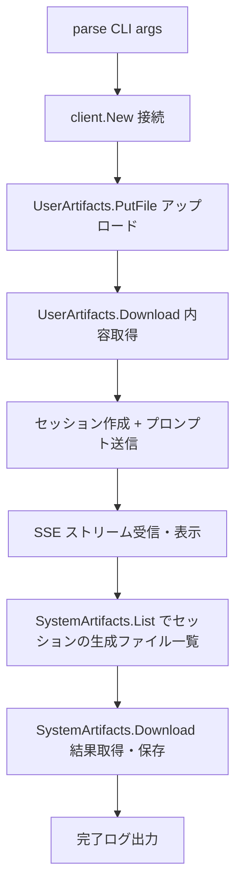

# 001 - アーティファクトパイプライン Example

## 背景 (Background)

Artifact API（System / User）の実装が完了したが、その使い方を示す具体的なサンプルコードが examples/ に存在しない。
API の利用者が「ファイルをアップロード → エージェントに参照させて新ファイルを生成 → 生成ファイルをダウンロード」という一連のパイプラインを、Go コードとして即座に確認できるようにする必要がある。

## 要件 (Requirements)

### 必須要件

1. **`examples/artifact-pipeline/` を新規作成する**
   - 独立した Go モジュール（`go.mod`）を持ち、`go run .` で実行可能
   - 既存 examples と同じディレクトリ構成・命名規則に従う

2. **ステップ1: ユーザーアーティファクトのアップロード**
   - `client.UserArtifacts().Put()` または `PutFile()` を使い、ローカルファイルをサーバへアップロード
   - アップロード先のロジカルキー（例: `inputs/template.txt`）を CLI 引数または定数で指定できること
   - アップロード結果（SHA256、サイズ）をログ出力すること

3. **ステップ2: Coding Agent へプロンプト送信（アーティファクト参照）**
   - セッションを作成し、アップロードしたファイルの内容を埋め込んだプロンプトをエージェントへ送信する
   - プロンプト例: 「`inputs/template.txt` の内容を元に、`output.txt` を生成してください」
   - アーティファクト内容は `client.UserArtifacts().Download()` で取得してプロンプトに埋め込む

4. **ステップ3: 生成ファイルのダウンロード**
   - エージェントがセッション内で生成したファイルを `client.SystemArtifacts().List()` で確認する
   - セッション ID でフィルタリングして生成ファイル一覧を取得する
   - `client.SystemArtifacts().Download()` で特定ファイルをローカルに保存する

5. **エラーハンドリング**
   - 各ステップでエラーが発生した場合は分かりやすいメッセージと共に終了する
   - ファイルが見つからない場合は適切な案内メッセージを出力する

6. **ドキュメント**
   - ファイル先頭に使用方法のコメントを記載する（既存 examples と同様のスタイル）
   - `README.md` の Artifact API Examples セクションにこのサンプルへの言及を追加する

### 任意要件

- `--agent` / `--model` / `--server` など CLI フラグによるカスタマイズ対応
- ZIP アーカイブダウンロード（複数ファイルのバッチ取得）の追加デモ

## 実現方針 (Implementation Approach)

### ファイル構成

```
examples/artifact-pipeline/
├── go.mod         # module github.com/axsh/arctic-tern/examples/artifact-pipeline
├── main.go        # メインロジック（ステップ1〜3を順に実行）
└── README.md      # このサンプル固有の簡単な説明（任意）
```

### main.go の全体フロー



### キーとなる API 呼び出し順

```go
// Step 1: upload
resp, _ := c.UserArtifacts().PutFile(ctx, "inputs/template.txt", localPath)

// Step 2a: artifact 内容を取得してプロンプトに埋め込む
rc, _ := c.UserArtifacts().Download(ctx, "inputs/template.txt")
content, _ := io.ReadAll(rc)

// Step 2b: エージェントにプロンプト送信
session, _ := c.CreateSession(ctx, client.SessionRequest{
    Agent:   agentName,
    WorkDir: ".",
})
prompt := fmt.Sprintf("以下の内容を元に output.txt を生成してください:\n\n%s", content)
stream, _ := session.SendText(ctx, prompt)
stream.Output(os.Stdout)

// Step 3: 生成ファイル確認
page, _ := c.SystemArtifacts().List(ctx, client.SystemArtifactFilter{
    SessionIDs: []string{session.ID},
})
// ダウンロード
rc2, _ := c.SystemArtifacts().Download(ctx, "output.txt")
os.WriteFile("output.txt", readAll(rc2), 0o644)
```

### go.mod の工夫

`go.mod` は `replace` ディレクティブを使用して親モジュールを参照する（既存 examples と同様）:

```
replace github.com/axsh/arctic-tern => ../..
```

### 前提

- 実行前にサーバー（`minimal-server`）が起動していること
- Coding Agent（デフォルト: `wayfinder`）が利用可能であること

## 検証シナリオ (Verification Scenarios)

### 手動確認手順

```bash
# 1. サーバー起動（別ターミナル）
cd examples/minimal-server
go run . -config ../../settings/example/config.yaml

# 2. サンプルの実行
cd examples/artifact-pipeline

# ローカルファイルを用意
echo "名前: テストユーザー\n年齢: 30" > input.txt

# 実行 (--input でアップロードファイル指定、--key でアーティファクトキー指定)
go run . --server http://localhost:3100 --input input.txt --key inputs/template.txt

# 3. 期待される出力
# [Step 1] Uploaded: inputs/template.txt (XX bytes, sha256: ...)
# [Step 2] Session created: sess-XXXXX
# [Step 2] Agent response: ...（エージェントの出力）...
# [Step 3] Generated files in session sess-XXXXX:
#   output.txt  (create)
# [Step 3] Downloaded: output.txt -> ./output.txt
```

### 確認ポイント

1. `./output.txt` が生成されていること
2. 生成ファイルの内容が入力ファイルの内容を反映していること（エージェント依存）
3. `client.SystemArtifacts().List()` が session_id フィルタで正しく絞り込めること

## テスト項目 (Testing)

手動確認に加え、ビルドテスト（`build.sh`）で examples のコンパイルが通ることを確認する。

```bash
# ビルドパイプライン（examples のビルドを含む）
./scripts/process/build.sh
```

E2E テストは `tests/agentservice_e2e_test.go` のヘルパーを活用した統合テストとして追加する。
ただし実際の Coding Agent 呼び出しは LLM 依存のため、統合テストカテゴリ `llm` で実行する。

```bash
./scripts/process/integration_test.sh --categories llm --specify "TestArtifactPipeline"
```
