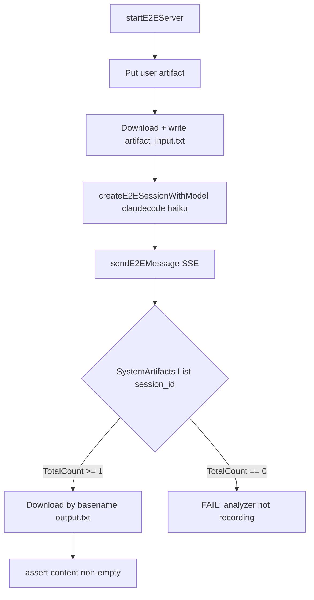

# 002 - アーティファクトパイプライン E2E テスト

## 背景 (Background)

`examples/artifact-pipeline` の実装は完了報告されたが、以下の問題が残っている:

1. **スタブサーバーによるユニットテストのみ**で、実 LLM・実 API キー・実 Tern サーバーを使った自動検証がない
2. `tests/artifact_e2e_test.go` の system artifact テストは**空リスト確認のみ**で、Coding Agent の tool call からイベントが記録されることを検証していない
3. 手動検証で発見された **`TaskLog.SetOnEntry` 上書きバグ**（wsserver が analyzer ハンドラを無効化）の修正が未コミット
4. 「完了」報告時点では、ユーザーが期待する「実際に動く」状態（自動 E2E PASS）になっていなかった

本仕様は、artifact-pipeline の全ライフサイクルを **実 Tern + 実 LLM + 実 API キー** で検証する統合 E2E テストを定義する。

## 要件 (Requirements)

### 必須要件

1. **`tests/artifact_e2e_test.go` に LLM E2E テストを追加する**
   - テスト名: `TestE2E_ArtifactPipeline_FullLifecycle`
   - 実 Tern サーバー起動（既存 `startE2EServer` ヘルパー再利用）
   - vault keyring から API キー解決（`tests/testdata/model_profiles.yaml`）
   - Coding Agent: `claudecode`、モデル: `claude-haiku-4-5`（コスト・速度のバランス）

2. **テストフロー（artifact-pipeline と同等）**

   | Step | 操作 | 検証 |
   | :--- | :--- | :--- |
   | 1 | `UserArtifacts().Put()` でテスト用入力データをアップロード | HTTP 201, status=created |
   | 2 | `UserArtifacts().Download()` で内容取得 | 入力データと一致 |
   | 3 | workDir に `artifact_input.txt` として書き出し | ファイル存在 |
   | 4 | セッション作成 + プロンプト送信（output.txt 生成指示） | SSE で `[DONE]` 受信、error イベントなし |
   | 5 | `SystemArtifacts().List(session_id=...)` | **TotalCount >= 1**、basename `output.txt` の create イベント存在 |
   | 6 | `SystemArtifacts().Download()` で生成ファイル取得 | 内容が空でない |

3. **`TaskLog.SetOnEntry` チェイン修正を含める**
   - wsserver 起動後も ToolCallAnalyzer が system artifact を記録できること
   - 単体テスト `TestTaskLog_SetOnEntryChainsHandlers` で検証

4. **テスト実行**
   - `./scripts/process/build.sh` 成功後
   - `./scripts/process/integration_test.sh --categories llm --specify "TestE2E_ArtifactPipeline_FullLifecycle"` で PASS

### 任意要件

- 重複 Write イベントの dedup（同一 session + key + operation）
- system artifact キーのパス正規化（`/c/` vs `C:/`）

## 実現方針 (Implementation Approach)

### テストファイル

```
tests/artifact_e2e_test.go   ← TestE2E_ArtifactPipeline_FullLifecycle 追加
shared/libs/go/tasklog/task_log.go  ← SetOnEntry チェイン修正（未コミット分を含む）
```

### テスト構成



### ヘルパー

- 既存 `createE2ESessionWithModel`, `sendE2EMessage`, `parseE2ESSEEvents` を `agentservice_e2e_test.go` から再利用（同一 `llm_test` パッケージ）
- system artifact キー解決: `filepath.Base(item.Key) == "output.txt"` でマッチ（Windows パス混在対策）

### 前提条件

- `claude` CLI が PATH に存在
- vault keyring に `providers/anthropic/default` が登録済み
- ネットワーク接続（Anthropic API 呼び出し）

### タイムアウト

- メッセージ送信: 180 秒（`sendE2EMessage` の timeout 引数）

## 検証シナリオ (Verification Scenarios)

```bash
# 1. ビルド
./scripts/process/build.sh

# 2. E2E テスト（LLM カテゴリ、単一テスト指定）
./scripts/process/integration_test.sh --categories llm --specify "TestE2E_ArtifactPipeline_FullLifecycle"
```

### 成功条件

- テストが **SKIP なし** で PASS
- system artifact リストに session 内の `output.txt` create イベントが 1 件以上
- ダウンロードした内容が空でない

## テスト項目 (Testing)

```bash
./scripts/process/build.sh && ./scripts/process/integration_test.sh --categories llm --specify "TestE2E_ArtifactPipeline_FullLifecycle"
```

関連する既存テスト（リグレッション）:

```bash
./scripts/process/integration_test.sh --categories common --specify "TestArtifact"
```
