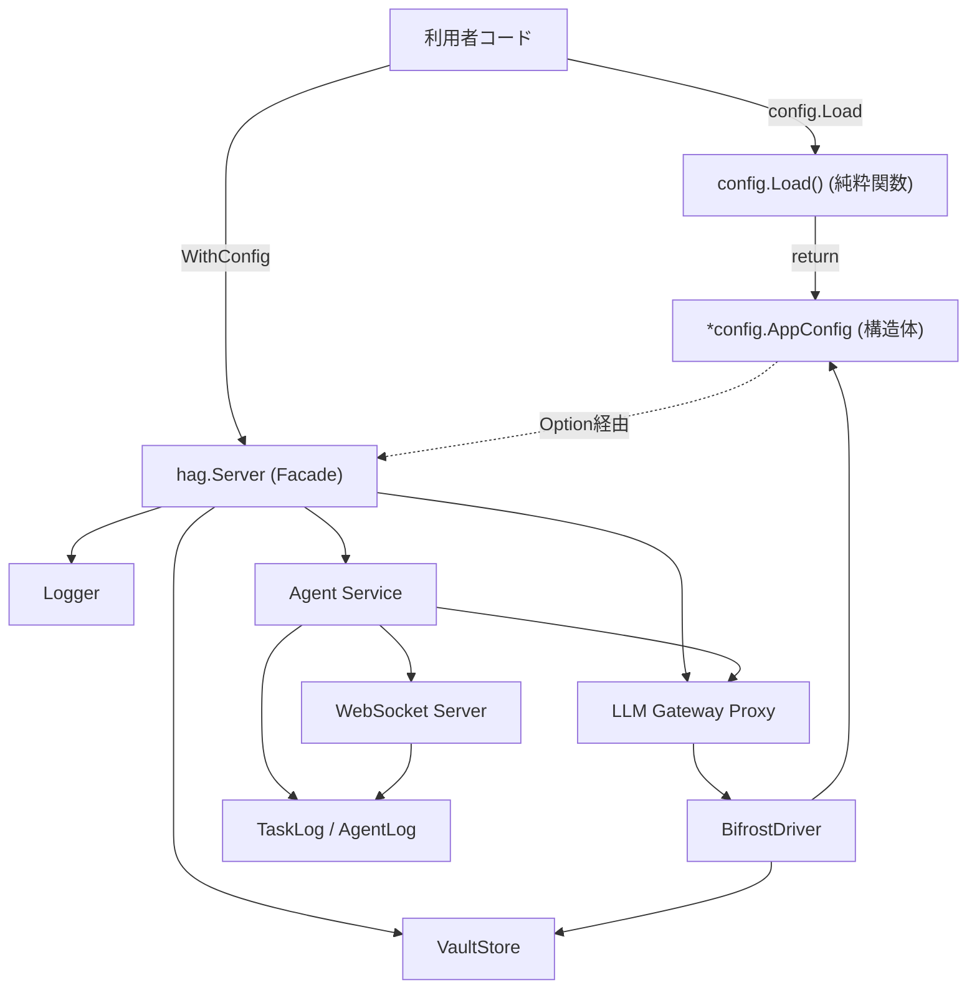
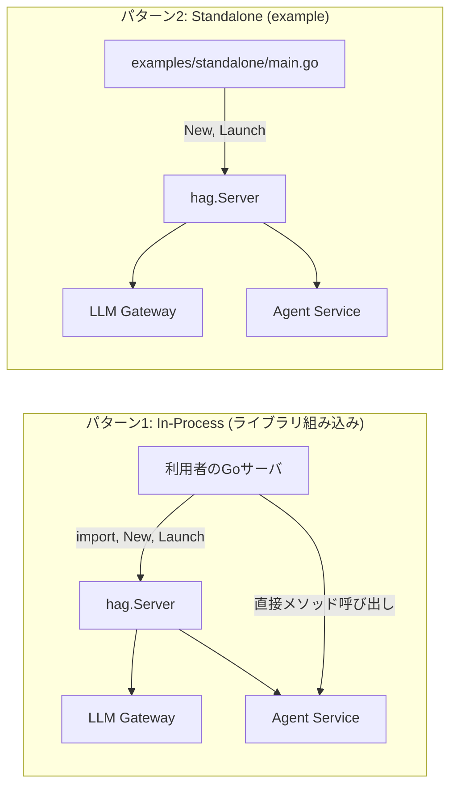
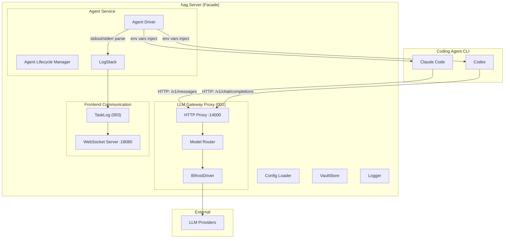
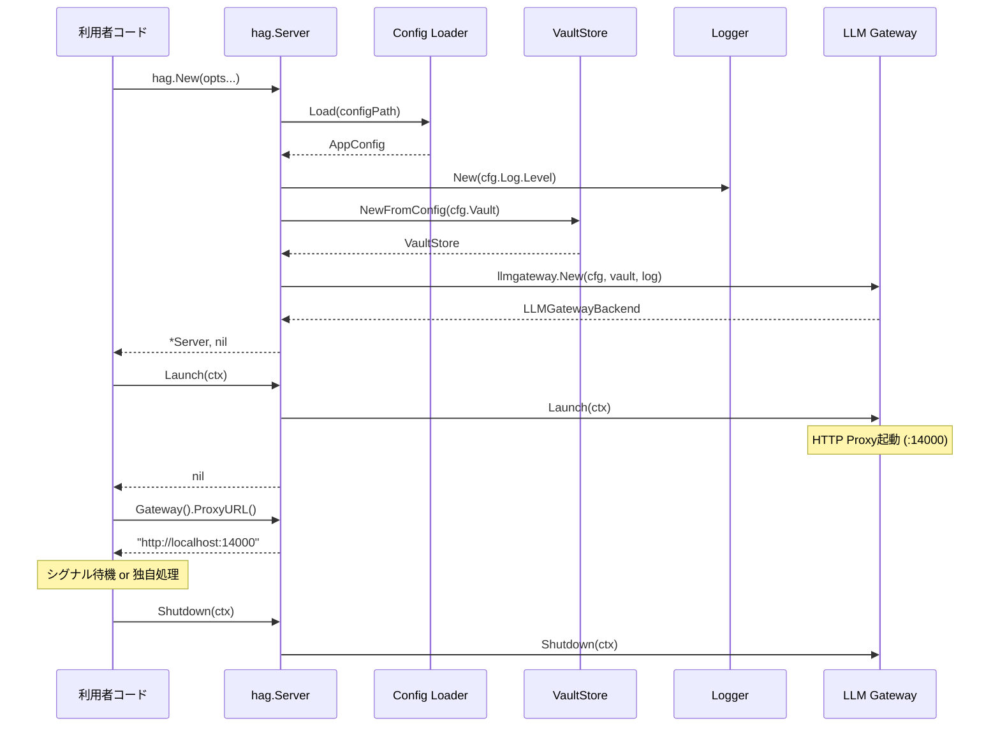

# 000: HAG 全体アーキテクチャ

## 背景 (Background)

HAG (Headless-Agent-Gateway) は、Coding Agent CLI (Claude Code, Codex等) を管理するヘッドレスなゲートウェイシステムである。vv4の参照実装から必要な要素を抽出し、スクラッチで構築する。

**ライブラリファースト設計**: HAGのコア機能は全てGoライブラリとして提供する。利用者は自分のGoサーバに `import` して組み込み (In-Process) で使うことも、スタンドアロンバイナリとして起動することもできる。スタンドアロン版の `main.go` は、ライブラリ利用のexampleとして位置づける。これはBifrost SDKと同様のアプローチである。

本仕様は、HAGシステム全体のアーキテクチャを定義する。個別コンポーネントの仕様は以下で定義する:
- [001-LLMGatewayProxy](file://prompts/phases/000-foundation/branches/feat-llm-backend/ideas/001-LLMGatewayProxy.md): LLM Gateway Proxy
- [002-ConfigAndSecrets](file://prompts/phases/000-foundation/branches/feat-llm-backend/ideas/002-ConfigAndSecrets.md): 設定・シークレット管理
- [003-HierarchicalAgentLog](file://prompts/phases/000-foundation/branches/feat-llm-backend/ideas/003-HierarchicalAgentLog.md): 階層化ログ

### 設計決定事項 (参照)

本仕様は以下の設計決定事項 (DD) に基づく:
DD-001 (3層構造), DD-002 (LLMGatewayBackend), DD-003 (New/Launch/Shutdown), DD-024 (AppConfig最小限), DD-040 (ロガー)

(設計決定事項の詳細は [design_decisions.md](file://prompts/designs/hag/design_decisions.md) を参照)

---

## 要件 (Requirements)

### 必須要件

#### R1: ライブラリファースト設計

- **R1-1**: HAGのコア機能は全て `shared/libs/go/` 以下のGoパッケージとして提供する。外部のGoプロジェクトから `import` して利用できる
- **R1-2**: ライブラリは `hag` パッケージとしてファサード型 `hag.Server` を提供する。利用者はこの型を通じて全機能にアクセスする
- **R1-3**: `hag.Server` は以下のIn-Process APIを提供する:

```go
package hag

// Server はHAGのコア機能を統合したファサードである。
// 利用者は自分のGoサーバに組み込んで使うことができる。
type Server struct { /* ... */ }

// New はHAG Serverを生成する。
// この時点ではgoroutine起動やネットワークリッスンは行わない。
// Optionで設定を注入する。WithConfigもWithConfigPathも指定しない場合は
// デフォルト値で初期化する。
func New(opts ...Option) (*Server, error)

// Launch は全コンポーネントを起動する。
// ブロッキングしない。内部でgoroutineを起動する。
func (s *Server) Launch(ctx context.Context) error

// Shutdown は全コンポーネントをgracefulに停止する。
func (s *Server) Shutdown(ctx context.Context) error

// Gateway はLLM Gateway Proxyへの参照を返す。
// In-Process呼び出し、またはProxyURLの取得に使用する。
func (s *Server) Gateway() LLMGatewayBackend

// AgentService はAgent Serviceへの参照を返す。
func (s *Server) AgentService() AgentService

// --- Option ---

// WithConfig は設定構造体を直接渡す。
// config.Load() で生成した構造体をそのまま渡せる。
// Config Loaderは「YAMLを構造体に変換するだけ」の純粋関数であり、
// hag.Serverとは疎結合である。
func WithConfig(cfg *config.AppConfig) Option

// WithConfigPath は設定ファイルパスを指定する。
// 内部で config.Load(path) を呼び出し、WithConfig相当の処理を行う。
// WithConfigPath は WithConfig のコンビニエンスラッパーである。
func WithConfigPath(path string) Option

// WithLogger はロガーを外部から注入する。
// nilの場合はConfig.Log設定に基づきデフォルトロガーを生成する。
func WithLogger(log logger.Logger) Option

// WithVaultStore はVaultStoreを外部から注入する。
// nilの場合はConfig.Vault設定に基づきデフォルトバックエンドを生成する。
func WithVaultStore(vs vault.VaultStore) Option

// WithGateway はLLMGatewayBackendを外部から注入する。
// テスト時やカスタム実装の差し替えに使用する。
func WithGateway(gw llmgateway.LLMGatewayBackend) Option
```

- **R1-4**: Config構造体のnilフィールドはデフォルト動作とする (Bifrost SDKの設計に倣う)。Optionで個別に上書きする場合は、Configよりも優先する。優先順位: 個別Option > WithConfig > デフォルト値

- **R1-5**: 利用パターンは以下の3つをサポートする:

**パターン1: In-Process (ライブラリ組み込み、Config構造体を外部で生成)**

```go
// 利用者のサーバに組み込む場合
import (
    "github.com/user/hag"
    "github.com/user/hag/config"
)

func main() {
    // Config Loaderは純粋関数: YAMLを構造体に変換するだけ
    cfg, err := config.Load("./config.yaml")
    if err != nil { log.Fatal(err) }

    // 利用者が設定を加工してから渡すことも可能
    cfg.LLMGateway.Port = 15000

    srv, err := hag.New(
        hag.WithConfig(cfg),
        hag.WithLogger(myCustomLogger), // Configより優先
    )
    if err != nil { log.Fatal(err) }

    if err := srv.Launch(ctx); err != nil { log.Fatal(err) }
    defer srv.Shutdown(ctx)

    // In-Process: GatewayのProxyURLを取得してAgent CLIに渡す
    gatewayURL := srv.Gateway().ProxyURL()

    // In-Process: Agent Serviceに直接アクセス
    agentSvc := srv.AgentService()

    // 自分のHTTPサーバにマウント
    mux := http.NewServeMux()
    mux.Handle("/api/agents/", agentSvc.HTTPHandler())
    http.ListenAndServe(":8080", mux)
}
```

**パターン2: スタンドアロン (example、WithConfigPathで簡潔に)**

```go
// examples/standalone/main.go
import "github.com/user/hag"

func main() {
    // WithConfigPathは内部でconfig.Load()を呼ぶコンビニエンスラッパー
    srv, err := hag.New(
        hag.WithConfigPath("./config.yaml"),
    )
    if err != nil { log.Fatal(err) }

    if err := srv.Launch(ctx); err != nil { log.Fatal(err) }

    // シグナル待機
    sigCh := make(chan os.Signal, 1)
    signal.Notify(sigCh, syscall.SIGTERM, syscall.SIGINT)
    <-sigCh

    srv.Shutdown(ctx)
}
```

**パターン3: プログラマティック (Config構造体をコードで直接構築)**

```go
// 設定ファイルなしで全てコードで指定
srv, err := hag.New(
    hag.WithConfig(&config.AppConfig{
        LLMGateway: config.LLMGatewayConfig{
            Port: 14000,
            ModelProfilesPath: "./model_profiles.yaml",
        },
        Vault: config.VaultConfig{
            Backend: "env",
        },
    }),
)
```

- **R1-6**: `features/hag/main.go` は削除し、`examples/standalone/main.go` として提供する。これはライブラリ利用のexampleであり、アプリケーションのコアではない

#### R2: コンポーネント構成

- **R2-1**: 以下の主要コンポーネントで構成する:

| コンポーネント | 責務 | パッケージ | 仕様 |
|---|---|---|---|
| **hag.Server** | ファサード。全コンポーネントのオーケストレーション | `shared/libs/go/hag/` | 本仕様 |
| **LLM Gateway Proxy** | LLMプロバイダへのHTTPプロキシ | `shared/libs/go/llmgateway/` | 001 |
| **Config / Vault** | 設定ファイルロード、シークレット管理 | `shared/libs/go/config/`, `shared/libs/go/vault/` | 002 |
| **Agent Log** | 階層化されたストリーミングログ | `shared/libs/go/tasklog/` | 003 |
| **Agent Service** | Coding Agentのライフサイクル管理 | `shared/libs/go/agentservice/` | 将来仕様 |
| **WebSocket Server** | フロントエンドへのリアルタイム通信 | `shared/libs/go/wsserver/` | 将来仕様 |

#### R3: コンポーネント依存関係と初期化順序

- **R3-1**: コンポーネント間の依存関係を以下の通り定義する:



- **R3-2**: Config Loaderは `hag.Server` に依存しない純粋関数である。YAMLファイルをパースし `*config.AppConfig` 構造体を返すだけの役割を持つ。利用者はこの構造体を加工してから `WithConfig` で渡すこともできる

- **R3-3**: `hag.New()` での初期化順序:

| 順序 | 操作 | 説明 |
|------|------|------|
| 1 | Option適用 | WithConfig / WithLogger / WithVaultStore 等を適用 |
| 2 | Config解決 | WithConfigPathの場合はここでconfig.Load()を実行。WithConfigの場合はそのまま使用。いずれも無い場合はデフォルト値 |
| 3 | Logger生成 | WithLoggerが未指定ならConfig.Logに基づきデフォルト生成 |
| 4 | VaultStore生成 | WithVaultStoreが未指定ならConfig.Vaultに基づきデフォルト生成 |
| 5 | LLM Gateway Proxy | WithGatewayが未指定ならConfig+Vaultから `llmgateway.New()` で生成 |
| 6 | Agent Service | `New` でインスタンス生成 |

- **R3-4**: `hag.Server.Launch()` での起動順序:

| 順序 | コンポーネント | 操作 |
|------|-------------|------|
| 1 | LLM Gateway Proxy | `Launch` でHTTPサーバ起動 |
| 2 | WebSocket Server | 起動 |

- **R3-5**: シャットダウン順序は起動の逆順とする
- **R3-6**: 各コンポーネントはOptionで外部から注入可能とする。注入された場合、`hag.Server` はそのインスタンスをそのまま使用し、自動生成しない

#### R4: ライフサイクルパターン

- **R4-1**: 主要コンポーネントは `New` (メモリ上の準備) + `Launch` (起動) + `Shutdown` (停止) パターンに従う
- **R4-2**: `New` は依存オブジェクトの注入のみ行い、副作用 (goroutine起動、ネットワークリッスン等) を持たない
- **R4-3**: `Launch` はブロッキングしない。内部でgoroutineを起動する
- **R4-4**: `Shutdown` はgraceful shutdownを行う。`context.Context` でタイムアウトを制御する

#### R5: Dependency Injection

- **R5-1**: グローバル変数パターンは使用しない
- **R5-2**: コンストラクタ注入 (constructor injection) を採用する。各コンポーネントの `New` 関数に依存オブジェクトを引数として渡す
- **R5-3**: DIコンテナやフレームワークは使用しない。手動のワイヤリングとする
- **R5-4**: `hag.Server` がワイヤリングを担当する。利用者は `hag.New()` にOptionを渡すだけでよい
- **R5-5**: Bifrost SDKのパターンに倣い、Config構造体のnilフィールドに対してはデフォルト値を適用する。`hag.Server.New()` 内部で「Configがnilか→デフォルト生成」「Loggerがnilか→Config.Logから生成」のように解決する
- **R5-6**: Config Loaderは依存注入の外側に位置する。利用者がConfig構造体をどのように生成するか (YAML, 環境変数, コードリテラル) は `hag.Server` の関知するところではない

#### R6: ディレクトリ構造

- **R6-1**: 以下のディレクトリ構造に従う:

```
shared/libs/go/
    hag/                        -- ファサードパッケージ (hag.Server)
        server.go               -- Server, New, Launch, Shutdown
        options.go              -- Option定義 (WithConfig, WithLogger等)
        server_test.go
    config/                     -- 設定ロード (002)
    vault/                      -- シークレット管理 (002)
    llmgateway/                 -- LLM Gateway Proxy (001)
    tasklog/                    -- ログデータモデル (003)
    agentservice/               -- Agent Service
    logger/                     -- ロガー (vv4移植)

examples/
    standalone/
        main.go                 -- スタンドアロン起動のexample
        config.yaml             -- 設定ファイル例
        model_profiles.yaml     -- モデル設定例
        docker-compose.yaml     -- Docker環境例
        Dockerfile              -- Dockerイメージビルド例
```

- **R6-2**: `shared/libs/go/` は全て外部から `import` 可能な公開パッケージとする
- **R6-3**: `examples/` はライブラリ利用のexampleコード。`main.go` はここに配置する
- **R6-4**: `internal/` パッケージは各ライブラリパッケージの内部実装にのみ使用する

#### R7: Docker環境

- **R7-1**: `examples/standalone/` にDockerfile と docker-compose.yamlを提供する
- **R7-2**: Docker Compose構成:

```yaml
services:
  hag:
    build:
      context: ../../
      dockerfile: examples/standalone/Dockerfile
    ports:
      - "14000:14000"   # LLM Gateway Proxy
      - "18080:18080"   # WebSocket / API
    volumes:
      - ./config.yaml:/app/config.yaml
      - ./model_profiles.yaml:/app/model_profiles.yaml
    environment:
      - HAG_VAULT_ANTHROPIC_PRIMARY=${ANTHROPIC_API_KEY}
      - HAG_VAULT_OPENAI_PRIMARY=${OPENAI_API_KEY}
```

- **R7-3**: Coding Agent CLIからLLM Gateway Proxyへの通信はコンテナ内ネットワークで行う
- **R7-4**: ホストからのAPI/WebSocket接続はポートマッピングで公開する

#### R8: ロガー

- **R8-1**: ロガーは `Logger` インターフェースとして定義する。In-Process利用者が独自のロギング基盤 (slog, zap, zerolog, syslog等) を注入できるようにする

```go
// Logger はHAG内部で使用するロギングインターフェースである。
// 利用者は自分のロギング基盤に合わせた実装を注入できる。
type Logger interface {
    // レベル別ログ出力。fieldsは key, value, key, value, ... の可変長引数。
    Debug(msg string, fields ...any)
    Info(msg string, fields ...any)
    Warn(msg string, fields ...any)
    Error(msg string, fields ...any)

    // WithFields は追加フィールドを持つ子ロガーを返す。
    // 元のロガーは変更しない (immutable)。
    WithFields(fields map[string]any) Logger

    // WithComponent はコンポーネント名フィールドを持つ子ロガーを返す。
    // 各コンポーネントの New() 内で呼ばれ、以降のログに "component"="llmgateway" 等が付与される。
    WithComponent(name string) Logger
}
```

- **R8-2**: デフォルト実装 (`logger.NewDefault()`) を提供する。利用者がWithLoggerを指定しない場合にこれが使用される

```go
// デフォルト実装の構成
// vv4の設計を踏襲し、出力先とフォーマットを差し替え可能にする
type DefaultLogger struct {
    level     Level
    formatter Formatter   // interface: Format(*LogEntry) ([]byte, error)
    writer    LogWriter   // interface: Write(level Level, payload []byte) (int, error)
    fields    map[string]any
}

// LogWriter実装 (デフォルト提供)
// - StdoutWriter: 標準出力に書き込み
// - SyslogWriter: syslogサーバに送信 (TCP/UDP/Unix)

// Formatter実装 (デフォルト提供)
// - TextFormatter: "2026-01-01T00:00:00Z INFO message key=value" 形式
// - JSONFormatter: {"timestamp":"...","level":"INFO","msg":"...","key":"value"} 形式
```

- **R8-3**: ログレベルは `debug`, `info`, `warn`, `error` をサポートする
- **R8-4**: 構造化ログ (Structured Logging) をサポートする。フィールドはkey-value形式で付与する
- **R8-5**: コンポーネント名をログフィールドに含める。`WithComponent()` で子ロガーを生成し、各コンポーネントに渡す
- **R8-6**: `WithLogger` Optionで利用者が独自のLoggerインターフェース実装を注入できる。In-Process利用時に呼び出し元のロギングルールやsyslog集約に対応する

```go
// In-Process利用例: slogアダプタを注入
import "log/slog"

type SlogAdapter struct {
    logger *slog.Logger
}

func (a *SlogAdapter) Info(msg string, fields ...any) {
    a.logger.Info(msg, fields...)
}
// ... 他メソッドも同様

srv, err := hag.New(
    hag.WithConfig(cfg),
    hag.WithLogger(&SlogAdapter{logger: slog.Default()}),
)
```

- **R8-7**: Logger interfaceはBifrost SDKのパターンに倣い最小限のメソッドに留める。Bifrostの `Fatal` / `SetLevel` / `SetOutputType` はHAGでは採用しない (Fatalはライブラリとして不適切、Level/OutputTypeはデフォルト実装の内部仕様)
- **R8-8**: グローバルロガー変数は使用しない (vv4の `globalLogger` パターンは採用しない)。全てコンストラクタ注入で渡す

#### R9: エラーハンドリング方針

- **R9-1**: `hag.New()` のエラー (設定ファイル不正、Vault接続失敗等) は `error` として返す。利用者が処理を決定する
- **R9-2**: ランタイムのエラー (LLMプロバイダ接続エラー、WebSocket切断等) はログに記録し処理を継続する
- **R9-3**: パニックリカバリをHTTPハンドラとgoroutineに設置する

### 任意要件

- **O1**: Prometheus メトリクスエンドポイント (`/metrics`)
- **O2**: pprof デバッグエンドポイント (`/debug/pprof/`)
- **O3**: 設定のランタイムリロードAPI

---

## 実現方針 (Implementation Approach)

### 設計思想: In-Process vs Standalone



### 全体アーキテクチャ図



### 起動シーケンス



### Graceful Shutdown (example)

```go
// examples/standalone/main.go
func main() {
    srv, err := hag.New(
        hag.WithConfigPath("./config.yaml"),
    )
    if err != nil {
        log.Fatalf("Failed to create HAG server: %v", err)
    }

    ctx := context.Background()
    if err := srv.Launch(ctx); err != nil {
        log.Fatalf("Failed to launch HAG server: %v", err)
    }

    // シグナル待機
    sigCh := make(chan os.Signal, 1)
    signal.Notify(sigCh, syscall.SIGTERM, syscall.SIGINT)

    sig := <-sigCh
    log.Printf("Received signal %v, shutting down...", sig)

    shutdownCtx, cancel := context.WithTimeout(ctx, 30*time.Second)
    defer cancel()

    if err := srv.Shutdown(shutdownCtx); err != nil {
        log.Printf("Shutdown error: %v", err)
    }
}
```

---

## 検証シナリオ (Verification Scenarios)

### シナリオ1: In-Process利用

1. テストコードで `hag.New(hag.WithConfigPath("./testdata/config.yaml"))` を呼び出す
2. `srv.Launch(ctx)` で起動する
3. `srv.Gateway().ProxyURL()` でProxy URLが取得できること
4. 取得したURLに対して `GET /` で `200 OK` が返ること
5. `srv.Shutdown(ctx)` でgracefulに停止すること

### シナリオ2: 外部注入

1. `hag.New(hag.WithLogger(customLogger), hag.WithVaultStore(customVault))` でカスタムコンポーネントを注入する
2. 注入したロガーにログが出力されること
3. 注入したVaultStoreからAPIキーが解決されること

### シナリオ3: スタンドアロン (example)

1. `examples/standalone/` の `main.go` をビルドする
2. `config.yaml` と `model_profiles.yaml` を配置する
3. バイナリを起動する
4. `GET http://localhost:14000/` で `200 OK` が返ること
5. `SIGTERM` を送信してgracefulにシャットダウンすること

### シナリオ4: Docker環境での起動

1. `docker-compose up` でHAGコンテナを起動する
2. ホストから `GET http://localhost:14000/` で接続できること
3. `docker-compose down` でgracefulに停止すること

### シナリオ5: コンポーネント初期化エラー

1. 不正な `config.yaml` を指定して `hag.New()` を呼び出す
2. `error` が返ること (プロセスは終了しない、利用者が判断する)
3. エラーメッセージにどのコンポーネントで失敗したか明記されること

---

## テスト項目 (Testing for the Requirements)

### ビルド・全体検証

1. ビルド+単体テスト:
   ```
   scripts/process/build.sh
   ```

2. 起動・停止の統合テスト:
   ```
   scripts/process/integration_test.sh --categories "common" --specify "Server|Boot|Lifecycle|Shutdown"
   ```

### 単体テスト計画

| テスト対象 | テストファイル | 確認内容 |
|---|---|---|
| hag.Server | `server_test.go` | New/Launch/Shutdown、Option注入、コンポーネントアクセス |
| Option | `options_test.go` | WithConfig, WithLogger, WithVaultStore の動作 |
| In-Process利用 | `server_test.go` | Gateway().ProxyURL() の取得、In-Process API呼び出し |
| Graceful Shutdown | `server_test.go` | 逆順シャットダウン、タイムアウト |
| Logger | `logger_test.go` | ログレベル制御、構造化ログ出力 |

---

## 変更履歴

| 日付 | 変更内容 |
|------|---------|
| 2026-06-03 | 初版作成 |
| 2026-06-03 | ライブラリファースト設計に改訂。hag.Serverファサード追加、main.goをexampleに移行 |
| 2026-06-03 | Config Loaderを純粋関数に分離。WithConfigでConfig構造体を渡すパターン追加。Bifrost SDKの初期化パターンを参考にnilデフォルト規約を追加。WithGateway Option追加。利用パターンを3種に拡充 |
| 2026-06-03 | R8ロガーをinterface方式に改訂。Bifrost SDKのLoggerパターンを参考に、In-Process利用者が独自ロガー(slog/syslog等)を注入可能に。デフォルト実装はvv4のLogWriter/Formatterを内部使用。グローバルロガー廃止 |
