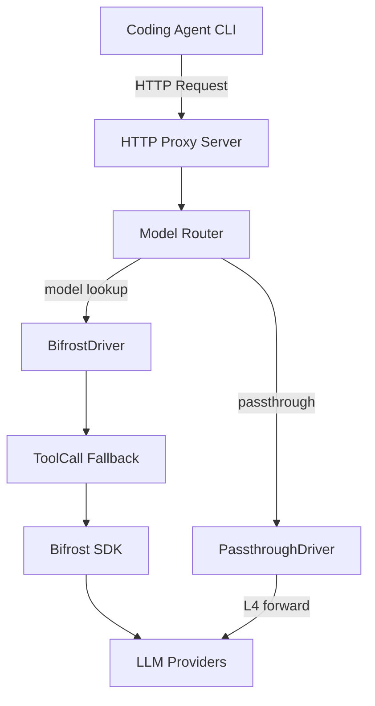

# 001: LLM Gateway Proxy

## 背景 (Background)

HAG (Headless-Agent-Gateway) は Coding Agent CLI (Claude Code, Codex等) を管理するシステムである。Coding Agent CLIはLLMプロバイダ (OpenAI, Anthropic, Ollama等) と通信するが、各CLIは固有のAPIフォーマットを前提としている。

LLM Gateway Proxyは、Coding Agent CLIとLLMプロバイダの間に位置し、以下の課題を解決する:

1. **APIキーの集中管理**: プロバイダのAPIキーをAgent CLIに直接渡さず、VaultStoreで一元管理する
2. **プロバイダ間翻訳**: Claude Code (Anthropic API形式) からOpenAIモデルを使う場合など、APIフォーマットの変換を行う
3. **ルーティング・フォールバック**: モデル名からプロバイダとキーを特定し、適切なバックエンドにルーティングする
4. **レート制限**: プロバイダ毎のレート制限を一元管理する

本仕様は、LLM Gateway Proxyのコア部分を定義する。全体アーキテクチャは [000-Architecture](file://prompts/phases/000-foundation/branches/feat-llm-backend/ideas/000-Architecture.md) を参照。設定管理 (ModelProfilesConfig, VaultStore) は別仕様 [002-ConfigAndSecrets](file://prompts/phases/000-foundation/branches/feat-llm-backend/ideas/002-ConfigAndSecrets.md) で定義する。

### 設計決定事項 (参照)

本仕様は以下の設計決定事項 (DD) に基づく:
DD-001, DD-002, DD-003, DD-005, DD-006, DD-007, DD-008, DD-009, DD-010, DD-011, DD-012, DD-013, DD-014, DD-015, DD-016, DD-017, DD-018, DD-032, DD-033, DD-034, DD-035, DD-037, DD-038, DD-039, DD-040, DD-041, DD-042, DD-043, DD-044

(設計決定事項の詳細は [design_decisions.md](file://prompts/designs/hag/design_decisions.md) を参照)

---

## 要件 (Requirements)

### 必須要件

#### R1: LLMGatewayBackend インターフェース

- **R1-1**: `LLMGatewayBackend` インターフェースをGoで定義する
- **R1-2**: ライフサイクルは `New` (構造体生成) + `Launch` (起動) + `Shutdown` (停止) パターンとする
- **R1-3**: `BifrostDriver` と `PassthroughDriver` の2種のDriverを定義する
- **R1-4**: `BifrostDriver` はBifrost SDKをラップし、マルチプロバイダ統合を提供する
- **R1-5**: `PassthroughDriver` はAgent CLIのLLM接続をそのまま通す (L4転送相当)
- **R1-6**: 以下のメソッドを持つ:

```go
type LLMGatewayBackend interface {
    // Launch はHTTPプロキシサーバを起動する。
    // ブロッキングしない。内部でgoroutineを起動する。
    Launch(ctx context.Context) error

    // Shutdown はHTTPプロキシサーバを停止する。
    Shutdown(ctx context.Context) error

    // ListModels は設定済みモデルの一覧を返す。
    ListModels() []ModelInfo

    // Health はバックエンドの状態を返す。
    Health() HealthStatus

    // ProxyURL はHTTPプロキシのURLを返す。
    // Agent CLI起動時に環境変数として注入する。
    ProxyURL() string
}
```

#### R2: HTTP Proxy

- **R2-1**: Go標準 `net/http` ベースのHTTPサーバを起動し、以下のエンドポイントを公開する:

| エンドポイント | メソッド | 説明 |
|---|---|---|
| `/` | GET | `200 OK` + エンドポイント一覧 (Claude Code到達性チェック対応) |
| `/health` | GET | バックエンド状態JSON |
| `/v1/messages` | POST | Anthropic Messages API互換 |
| `/v1/chat/completions` | POST | OpenAI Chat Completions API互換 (ストリーミングはTODO) |
| `/v1/models` | GET | `model_profiles.yaml` から実際のモデル一覧を返す |

- **R2-2**: HTTPサーバは並行リクエスト処理に対応する (Go標準 `http.Server`)
- **R2-3**: リッスンポートは設定ファイルで指定可能とする

#### R3: Anthropic Messages API互換

- **R3-1**: Anthropic Messages API (`POST /v1/messages`) にSSEストリーミングを含め厳密に公式準拠する
- **R3-2**: SSEイベントの独自拡張は一切行わない
- **R3-3**: リクエストの `model` フィールドからプロバイダとモデルを特定し、Bifrost SDKにルーティングする
- **R3-4**: `provider` と `model` は別フィールドで定義し、文字列パース (`provider/model`) は行わない。ただしHTTP Proxyのリクエストでは既存Agent CLIとの互換性のため `model` フィールドのみ受け付け、プロバイダは `model_profiles.yaml` からのルックアップで特定する

#### R4: OpenAI API互換

- **R4-1**: OpenAI Chat Completions API (`POST /v1/chat/completions`) の非ストリーミングリクエストに対応する
- **R4-2**: `stream: true` のストリーミング対応は将来のCodex対応時に実装する。現時点ではTODOコメントを配置する
- **R4-3**: OpenAI Responses APIはCodexの要件が明確になった時点で判断する

#### R5: モデルルーティング

- **R5-1**: リクエストの `model` フィールドを `model_profiles.yaml` と照合し、対応するプロバイダ・キーを特定する
- **R5-2**: モデル名に対応するプロファイルが見つからない場合、エラーを返す (デフォルトプロバイダの自動補完は行わない)
- **R5-3**: Claude Codeのサブセッション問題 (model_profilesに存在しないモデル名の送信) に対するフォールバックを実装する。セッション最初のモデルにフォールバックさせる
- **R5-4**: `/v1/models` エンドポイントは `model_profiles.yaml` に定義されたモデルの実際の一覧を返す

#### R6: テキスト→Tool Callフォールバック変換

- **R6-1**: ローカルLLM (Ollama等) でtool_callsを返さないモデルに対し、テキストレスポンスからtool callを抽出する変換ロジックを実装する
- **R6-2**: この変換の有効/無効はモデル毎に `model_profiles.yaml` で設定可能とする

#### R7: エラーハンドリング

- **R7-1**: エラーレスポンスはOpenAI/Anthropic互換のJSON形式で返す
- **R7-2**: プロバイダからのエラーはLLM Gateway独自のエラーコードに変換する
- **R7-3**: 原因のHTTPステータスコードはエラーメッセージに含めて開示する
- **R7-4**: `model_profiles.yaml` に未定義のモデル指定、プロバイダ接続エラー、レート制限超過などのエラーケースを定義する

#### R8: Rate Limiting

- **R8-1**: Bifrost SDKのRate Limiting機能を利用する。独自のRate Limiting実装は行わない
- **R8-2**: Rate Limitingの粒度はプロバイダ毎とする

#### R9: 可観測性

- **R9-1**: ロガーはvv4の `logger` パッケージを使用する
- **R9-2**: APIキーやシークレットは下4桁のみ開示でマスクする
- **R9-3**: リクエスト/レスポンスのトレーシングはTraceログレベルで実装する
- **R9-4**: メトリクス収集はBifrost SDKに委譲する。有効/無効はLLM Gatewayの起動設定で制御する

#### R10: Gateway URL注入

- **R10-1**: `ProxyURL()` メソッドでHTTPプロキシのURLを返す
- **R10-2**: Agent DriverはこのURLを環境変数 (`ANTHROPIC_BASE_URL` 等) としてAgent CLIに注入する

### 任意要件

- **O1**: Bifrostの Web UI ダッシュボード連携
- **O2**: Prometheus互換メトリクスエンドポイント

---

## 実現方針 (Implementation Approach)

### パッケージ構成

```
shared/libs/go/llmgateway/
    backend.go        -- LLMGatewayBackend interface
    bifrost_driver.go -- BifrostDriver (Bifrost SDKラッパー)
    passthrough.go    -- PassthroughDriver
    proxy.go          -- HTTP Proxy server
    proxy_anthropic.go -- Anthropic Messages API handler
    proxy_openai.go   -- OpenAI Chat Completions API handler
    proxy_models.go   -- /v1/models handler
    routing.go        -- モデルルーティングロジック
    fallback.go       -- テキスト→Tool Call変換
    errors.go         -- エラーコード定義・変換
    health.go         -- ヘルスチェック
```

### アーキテクチャ



### BifrostDriver の実装方針

- vv4の `BifrostBackend` (745行) をベースにリファクタリング
- `LLMGatewayBackend` インターフェースに合わせて `New` + `Launch` + `Shutdown` パターンに変更
- DI (Dependency Injection) パターンに移行し、グローバル変数 (`globalGateway`) は使用しない

### HTTP Proxy の実装方針

- vv4の `proxy.go` (1013行) をベースにリファクタリング
- Anthropic/OpenAIのハンドラを別ファイルに分離
- `model` フィールドからの `provider` ルックアップをルーティング層に集約

---

## 検証シナリオ (Verification Scenarios)

### シナリオ1: Anthropic Messages APIの基本動作

1. LLM Gateway Proxyを起動する
2. `model_profiles.yaml` に `anthropic/claude-sonnet-4-20250514` を定義する
3. `POST /v1/messages` に `{"model":"claude-sonnet-4-20250514", "messages":[{"role":"user","content":"Hello"}]}` を送信する
4. Anthropic APIフォーマット準拠のレスポンスが返ること

### シナリオ2: SSEストリーミング

1. `POST /v1/messages` に `stream: true` を含むリクエストを送信する
2. SSEフォーマットでレスポンスチャンクが逐次返ること
3. SSEイベントがAnthropic公式フォーマットに厳密に準拠すること

### シナリオ3: モデルルーティング

1. 複数プロバイダ (anthropic, openai) を `model_profiles.yaml` に定義する
2. `model: "gpt-4o"` でリクエストを送信する
3. OpenAIプロバイダにルーティングされること

### シナリオ4: 未定義モデルのエラー

1. `model_profiles.yaml` に定義されていないモデル名を指定してリクエストを送信する
2. JSON形式のエラーレスポンスが返ること (デフォルトプロバイダへの自動補完は行わない)

### シナリオ5: ヘルスチェック

1. `GET /` に対して `200 OK` + エンドポイント一覧が返ること
2. `GET /health` に対して状態JSONが返ること

### シナリオ6: モデル一覧

1. `GET /v1/models` に対して `model_profiles.yaml` に定義されたモデルの実際の一覧が返ること

### シナリオ7: ToolCallフォールバック

1. `model_profiles.yaml` でフォールバック変換を有効にしたモデルを定義する
2. ツール定義を含むリクエストを送信する
3. LLMがテキストでtool callを返した場合、構造化されたtool_callレスポンスに変換されること

---

## テスト項目 (Testing for the Requirements)

### ビルド・全体検証

1. ビルド+単体テスト:
   ```
   scripts/process/build.sh
   ```

2. LLM統合テスト (プロバイダ接続の確認):
   ```
   scripts/process/integration_test.sh --categories "llm"
   ```

### 単体テスト計画

| テスト対象 | テストファイル | 確認内容 |
|---|---|---|
| LLMGatewayBackend interface | `backend_test.go` | インターフェース準拠、ライフサイクル (New/Launch/Shutdown) |
| BifrostDriver | `bifrost_driver_test.go` | Bifrost SDK初期化、モデルルーティング、Rate Limiting委譲 |
| HTTP Proxy | `proxy_test.go` | エンドポイントレスポンス、ヘルスチェック |
| Anthropic handler | `proxy_anthropic_test.go` | Messages APIリクエスト/レスポンス形式、SSEストリーミング |
| OpenAI handler | `proxy_openai_test.go` | Chat Completionsリクエスト/レスポンス形式 |
| Model Router | `routing_test.go` | モデル名→プロバイダ解決、未定義モデルのエラー、フォールバック |
| ToolCall Fallback | `fallback_test.go` | テキスト→Tool Call変換、有効/無効切り替え |
| Error handling | `errors_test.go` | エラーコード変換、JSON形式のエラーレスポンス |
| Secret masking | `masking_test.go` | APIキーの下4桁マスク |

### 統合テスト計画

実際のLLMプロバイダを使用する統合テスト (モックは使用しない):

```
scripts/process/integration_test.sh --categories "llm" --specify "Gateway|Proxy|Anthropic|OpenAI"
```

---

## 変更履歴

| 日付 | 変更内容 |
|------|---------|
| 2026-06-03 | 初版作成 |
