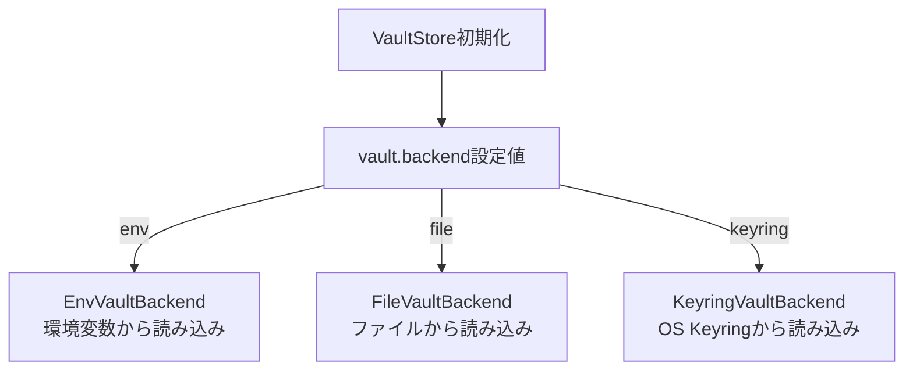

# 002: 設定・シークレット管理

## 背景 (Background)

LLM Gateway Proxy (仕様 [001-LLMGatewayProxy](file://prompts/phases/000-foundation/branches/feat-llm-backend/ideas/001-LLMGatewayProxy.md)) は、動作にあたって以下の設定情報を必要とする:

1. **ModelProfilesConfig**: どのプロバイダのどのモデルをどのAPIキーで使うかの定義
2. **VaultStore**: APIキーの安全な保管と読み込み
3. **AppConfig**: アプリケーション全体の設定 (ポート番号、ログレベル等)

vv4ではこれらがTask Engine、Database、Auth等と共に巨大な `AppConfig` に含まれていたが、HAGでは最小限のフィールドのみ採用し、専用の設定構造体を用意する。

### 設計決定事項 (参照)

DD-014, DD-021, DD-022, DD-023, DD-024, DD-025, DD-026, DD-027, DD-028, DD-029, DD-030, DD-031

全体アーキテクチャは [000-Architecture](file://prompts/phases/000-foundation/branches/feat-llm-backend/ideas/000-Architecture.md) を参照。

---

## 要件 (Requirements)

### 必須要件

#### R1: ModelProfilesConfig

- **R1-1**: vv4の `model_profiles.yaml` スキーマをそのまま採用する
- **R1-2**: 以下の構造を持つ:

```yaml
default_profile:
  provider: "anthropic"
  model: "claude-sonnet-4-20250514"

providers:
  anthropic:
    keys:
      - name: "primary"
        value: "vault://providers/anthropic/primary"
        models:
          - name: "claude-sonnet-4-20250514"
          - name: "claude-haiku-3-5-20241022"
    network_config:
      base_url: ""  # デフォルトのAnthropic APIを使用
  openai:
    keys:
      - name: "primary"
        value: "vault://providers/openai/primary"
        models:
          - name: "gpt-4o"
          - name: "o3-mini"
    network_config:
      base_url: ""
  ollama:
    keys:
      - name: "default"
        value: "vault://providers/ollama/default"
        models:
          - name: "qwen2.5-coder:7b"
            behavior:
              tool_call_fallback: true  # テキスト→ToolCall変換を有効化
    network_config:
      base_url: "http://localhost:11434"

governance:
  routing_rules: []  # TODO: CEL式によるルーティング制御 (将来実装)
```

- **R1-3**: `provider` と `model` は独立したフィールドとして定義する。`provider/model` 形式の文字列パースは行わない
- **R1-4**: `weight` フィールドによる加重ルーティングは実装しない
- **R1-5**: `governance.routing_rules` は構造体の定義のみ残し、実装はしない。TODOコメントで目的を記載する
- **R1-6**: モデル毎の挙動設定 (`behavior`) フィールドを追加する。テキスト→ToolCall変換の有効/無効等を設定可能にする

#### R2: VaultStore

- **R2-1**: APIキーの安全な保管と読み込みを行う `VaultStore` インターフェースを定義する
- **R2-2**: マルチテナント対応を必須とする (チーム利用想定)
- **R2-3**: Vault参照形式は `vault://providers/{provider_name}/{key_name}` に統一する
- **R2-4**: 以下のバックエンドを実装する:

| バックエンド | 説明 | 用途 |
|---|---|---|
| `EnvVaultBackend` | 環境変数からの読み込み | 開発時の簡易セットアップ |
| `FileVaultBackend` | ファイルベースの保管 | シンプルなデプロイメント |
| `KeyringVaultBackend` | OS Keyringを利用 | セキュアなデスクトップ環境 |

- **R2-5**: AES暗号化はオプショナル機能とする。`FileVaultBackend` での平文保存防止に有用
- **R2-6**: 環境変数からのAPIキー読み込みに対応する。環境変数名の規約は `TERN_VAULT_{PROVIDER}_{KEY}` とする (例: `TERN_VAULT_ANTHROPIC_PRIMARY`)
- **R2-7**: `vault://` 参照を実際のキー値に解決する `Resolve(ref string) (string, error)` メソッドを持つ

```go
type VaultStore interface {
    // Resolve はvault://参照を実際のキー値に解決する。
    Resolve(ref string) (string, error)

    // Set はキーを保存する。
    Set(path string, value string) error

    // Delete はキーを削除する。
    Delete(path string) error

    // List は保存されているキーのパス一覧を返す。
    List() ([]string, error)
}
```

#### R3: AppConfig

- **R3-1**: HAG専用の最小限のコンフィグ構造体を定義する

```go
type AppConfig struct {
    // LLMGateway はLLM Gateway Proxyの設定
    LLMGateway LLMGatewayConfig `yaml:"llm_gateway"`

    // Vault はVaultStoreの設定
    Vault VaultConfig `yaml:"vault"`

    // Log はログ設定
    Log LogConfig `yaml:"log"`
}

type LLMGatewayConfig struct {
    // Port はHTTPプロキシのリッスンポート
    Port int `yaml:"port"`

    // ModelProfilesPath はmodel_profiles.yamlのパス
    ModelProfilesPath string `yaml:"model_profiles_path"`

    // MetricsEnabled はBifrostメトリクスの有効/無効
    MetricsEnabled bool `yaml:"metrics_enabled"`
}

type VaultConfig struct {
    // Backend はVaultStoreのバックエンド種別
    Backend string `yaml:"backend"` // "env", "file", "keyring"

    // FilePath はFileVaultBackend使用時のファイルパス
    FilePath string `yaml:"file_path,omitempty"`

    // AESEnabled はAES暗号化の有効/無効
    AESEnabled bool `yaml:"aes_enabled,omitempty"`
}

type LogConfig struct {
    // Level はログレベル
    Level string `yaml:"level"` // "trace", "debug", "info", "warn", "error"
}
```

- **R3-2**: コマンドラインオプションで設定ファイルパスを指定可能にする。デフォルトは `./config.yaml`
- **R3-3**: 設定リロードは再設定APIの呼び出しで即適用する (ファイル監視ではない)

#### R4: 設定ロード

- **R4-1**: `config.yaml` と `model_profiles.yaml` を起動時にロードする
- **R4-2**: 設定のバリデーションを行い、不正な値に対してエラーを返す
- **R4-3**: `vault://` 参照の解決はVaultStoreに委譲する
- **R4-4**: 再設定APIを呼び出した場合、`model_profiles.yaml` を再ロードしBifrost SDKの設定を更新する

#### R5: プロバイダ固有設定

- **R5-1**: プロバイダ固有の差異 (OllamaのベースURL等) はBifrost SDKに委譲する
- **R5-2**: `model_profiles.yaml` の `network_config.base_url` でプロバイダ固有のエンドポイントを設定する
- **R5-3**: HAG側でプロバイダ毎の特殊ケース対応コードは書かない

### 任意要件

- **O1**: Web UIからの設定変更
- **O2**: HashiCorp Vault連携

---

## 実現方針 (Implementation Approach)

### パッケージ構成

```
shared/libs/go/config/
    config.go           -- AppConfig, LLMGatewayConfig, VaultConfig, LogConfig
    model_profiles.go   -- ModelProfilesConfig, ProviderConfig, KeyConfig, ModelConfig
    loader.go           -- 設定ファイルのロード・バリデーション
    loader_test.go      -- ロードのテスト

shared/libs/go/vault/
    vault.go            -- VaultStore interface
    env_backend.go      -- EnvVaultBackend
    file_backend.go     -- FileVaultBackend
    keyring_backend.go  -- KeyringVaultBackend
    resolve.go          -- vault:// 参照解決
```

### 設定ファイルの例

```yaml
# config.yaml
llm_gateway:
  port: 14000
  model_profiles_path: "./model_profiles.yaml"
  metrics_enabled: false

vault:
  backend: "env"  # 開発時は環境変数から

log:
  level: "info"
```

### VaultStore バックエンドの選択



### vault:// 参照解決の流れ

1. `model_profiles.yaml` ロード時に `value: "vault://providers/anthropic/primary"` を検出
2. VaultStoreの `Resolve("vault://providers/anthropic/primary")` を呼び出す
3. バックエンドに応じてキー値を取得:
   - `EnvVaultBackend`: `TERN_VAULT_ANTHROPIC_PRIMARY` 環境変数を読み込む
   - `FileVaultBackend`: ファイルから読み込む (AES復号が必要ならば復号)
   - `KeyringVaultBackend`: OS Keyringから読み込む
4. 解決された値をBifrost SDK初期化時に渡す

---

## 検証シナリオ (Verification Scenarios)

### シナリオ1: 環境変数からのAPIキー読み込み

1. `vault.backend: "env"` を設定する
2. `model_profiles.yaml` に `value: "vault://providers/anthropic/primary"` を定義する
3. `TERN_VAULT_ANTHROPIC_PRIMARY=sk-ant-xxxxx` を環境変数にセットする
4. LLM Gatewayを起動する
5. `POST /v1/messages` でAnthropicモデルにリクエストする
6. 正常にLLMレスポンスが返ること

### シナリオ2: 設定バリデーション

1. 不正な `model_profiles.yaml` (存在しないプロバイダ、空のモデル名等) をロードする
2. バリデーションエラーが返り、起動が拒否されること

### シナリオ3: 再設定API

1. LLM Gatewayを起動する
2. `model_profiles.yaml` にモデルを追加する
3. 再設定APIを呼び出す
4. 追加したモデルが `/v1/models` に反映されること

### シナリオ4: マルチテナント

1. 複数のVaultパス (`vault://providers/anthropic/team-a`, `vault://providers/anthropic/team-b`) を定義する
2. 各パスに異なるAPIキーをセットする
3. テナント毎に異なるキーで認証が行われること

---

## テスト項目 (Testing for the Requirements)

### ビルド・全体検証

1. ビルド+単体テスト:
   ```
   scripts/process/build.sh
   ```

2. 設定ロード統合テスト:
   ```
   scripts/process/integration_test.sh --categories "common" --specify "Config|Vault|ModelProfiles"
   ```

### 単体テスト計画

| テスト対象 | テストファイル | 確認内容 |
|---|---|---|
| AppConfig | `config_test.go` | YAML読み込み、デフォルト値、バリデーション |
| ModelProfilesConfig | `model_profiles_test.go` | スキーマ準拠、プロバイダ/モデル定義、behavior設定 |
| 設定ロード | `loader_test.go` | ファイル読み込み、vault://参照検出、バリデーションエラー |
| VaultStore interface | `vault_test.go` | インターフェース準拠 |
| EnvVaultBackend | `env_backend_test.go` | 環境変数読み込み、未定義変数のエラー |
| FileVaultBackend | `file_backend_test.go` | ファイル読み書き、AES暗号化/復号 |
| vault:// 解決 | `resolve_test.go` | 参照パース、パス正規化、解決エラー |
| シークレットマスク | `masking_test.go` | 下4桁のみ開示 |

---

## 変更履歴

| 日付 | 変更内容 |
|------|---------|
| 2026-06-03 | 初版作成 |
