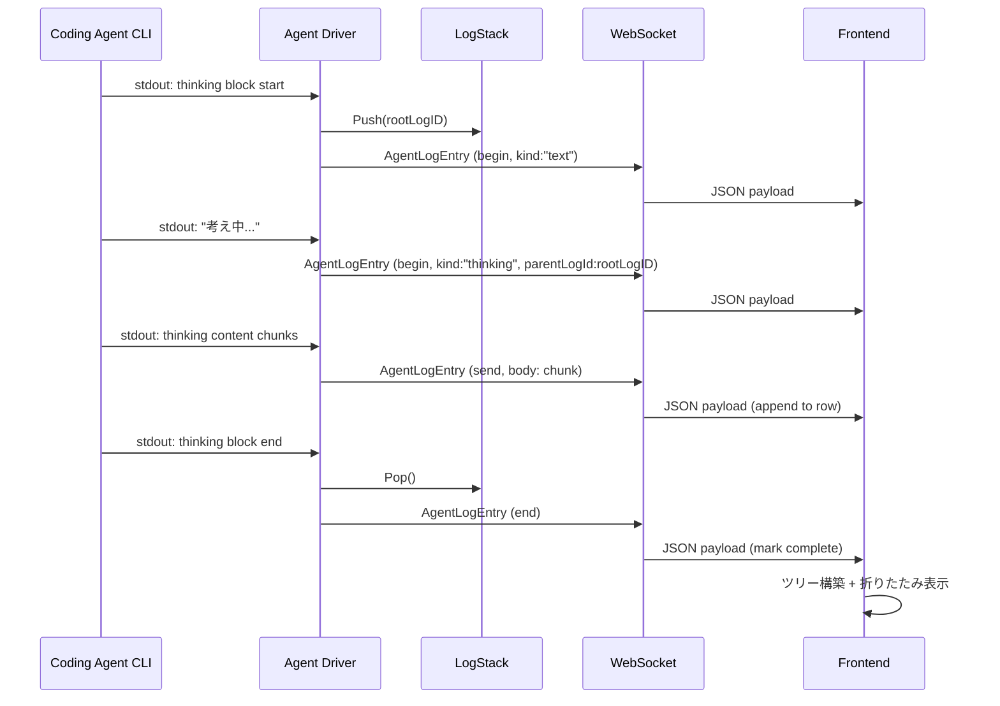

# 003: 階層化ログ (Hierarchical Agent Log)

## 背景 (Background)

Coding Agentの1セッションは数百行のログを生成する。思考過程 (thinking)、ツール呼び出し (tool_use)、ツール結果 (tool_result)、最終出力 (text) が全てフラットに並ぶため、ユーザが重要な情報を素早く見つけるのが困難である。

階層化ログは、ログエントリに親子関係 (`parentLogId`) を持たせ、フロントエンドで子要素を折りたたみ可能にする機構である。これにより:

- 思考過程をデフォルト折りたたみにし、必要な時のみ展開
- ツール結果の長大な出力を折りたたみ
- ルートレベルには「何をしたか」のサマリのみ表示

vv4ではデータモデル (`AgentLogEntry.ParentLogID`) まで実装済みだが、実際にparentLogIdを設定するコードとフロントエンドのツリー構築UIが欠けており動作していない。HAGではこれをスクラッチ実装する。

全体アーキテクチャは [000-Architecture](file://prompts/phases/000-foundation/branches/feat-llm-backend/ideas/000-Architecture.md) を参照。
参考: vv4の調査結果は [hierarchical_log_investigation.md](file://prompts/designs/vv4/hierarchical_log_investigation.md) を参照。
設計概要は [hierarchical_log_design.md](file://prompts/designs/hag/hierarchical_log_design.md) を参照。

---

## 要件 (Requirements)

### 必須要件

#### R1: AgentLogEntry データモデル

- **R1-1**: 以下のフィールドを持つ `AgentLogEntry` 構造体を定義する:

```go
type AgentLogEntry struct {
    BaseEntry                                          // ID, Time, EntryType

    Body        string `json:"body"`                   // 可読テキスト
    Kind        string `json:"kind"`                   // 表示制御ディレクティブ
    Location    string `json:"location,omitempty"`      // ソースコード場所
    ParentLogID string `json:"parentLogId,omitempty"`   // 親ログID (空=ルートレベル)
    TaskNodeID  string `json:"taskNodeId,omitempty"`    // タスクノードID
    AgentID     string `json:"agentId"`                 // エージェントID
    RunID       string `json:"runId,omitempty"`         // 実行ストリームID
    IsComplete  bool   `json:"isComplete"`              // EndLogが呼ばれたか
    Phase       string `json:"phase"`                   // "begin", "send", "end"
}
```

- **R1-2**: `BaseEntry` は `ID` (UUID), `Time` (タイムスタンプ), `EntryType` (固定値 `"AGENT_LOG"`) を持つ
- **R1-3**: `tasklog.Entry` インターフェースを実装する (`Timestamp()`, `Type()`)

#### R2: ストリーミングプロトコル (Phase)

- **R2-1**: 3つのPhaseを持つ: `begin` (開始), `send` (チャンク送信), `end` (完了)
- **R2-2**: `begin` でIDが発行され、`kind`, `location`, `parentLogId` が確定する
- **R2-3**: `send` と `end` はIDのみで対象を特定する。`kind` は変更できない
- **R2-4**: `kind` を途中で切り替えたい場合は、子ログを新たに `begin` する
- **R2-5**: ファクトリ関数を提供する:
  - `NewAgentLogEntry(agentID string, opts ...AgentLogOption) *AgentLogEntry` (begin)
  - `NewAgentLogSendEntry(logID, agentID, body string) *AgentLogEntry` (send)
  - `NewAgentLogEndEntry(logID, agentID string) *AgentLogEntry` (end)
- **R2-6**: Functional Optionパターンで `WithKind`, `WithLocation`, `WithParentLogID`, `WithTaskNodeID` を提供する

#### R3: Kind (表示制御ディレクティブ)

- **R3-1**: `kind` は拡張可能な文字列型とし、ハードコードの列挙型にしない
- **R3-2**: 初期定義値と表示制御:

| kind | デフォルト表示 | 説明 |
|------|-------------|------|
| `text` | 展開 | 通常テキスト出力 |
| `thinking` | 折りたたみ | LLMの思考過程 |
| `tool_use` | 展開 | ツール呼び出し情報 |
| `tool_result` | 折りたたみ | ツール実行結果 |
| `system` | 展開 | システムメッセージ |
| `error` | 常時展開・赤色 | エラーメッセージ |

- **R3-3**: 未知の `kind` を受信した場合は `text` と同等に表示する (フォールバック)

#### R4: Agent Driverでのログ生成

- **R4-1**: Agent DriverがCoding Agent CLIの出力ストリームをパースし、`AgentLogEntry` を生成する
- **R4-2**: ログスタック (`LogStack`) を保持し、`parentLogId` を自動設定する:
  - エージェントのメッセージ開始時にルートログを `begin`
  - thinking block開始時に子ログ (kind: "thinking") を `begin`
  - tool_use検出時に子ログ (kind: "tool_use") を `begin`
  - tool_result受信時に孫ログ (kind: "tool_result") を `begin`
  - 各ブロック終了時に `end`

- **R4-3**: `LogStack` は以下のメソッドを持つ:

```go
type LogStack struct {
    mu    sync.Mutex
    stack []string
}

func (s *LogStack) CurrentParentID() string  // 現在の親ログID
func (s *LogStack) Push(logID string)        // スタックにプッシュ
func (s *LogStack) Pop() string              // スタックからポップ
```

#### R5: WebSocket中継

- **R5-1**: `AgentLogEntry` をWebSocketでフロントエンドに中継する
- **R5-2**: `parentLogId` をWebSocketペイロードに含める
- **R5-3**: ペイロード形式:

```json
{
  "type": "log",
  "payload": {
    "agent_id": "agent-1",
    "process_id": "proc-1",
    "alias": "Agent-1",
    "entry": {
      "id": "log-uuid-1",
      "time": "2026-06-03T12:00:00Z",
      "entryType": "AGENT_LOG",
      "body": "",
      "phase": "begin",
      "kind": "text",
      "isComplete": false,
      "parentLogId": "",
      "agentId": "agent-1"
    }
  }
}
```

#### R6: フロントエンドのツリー構築

- **R6-1**: WebSocketで受信したフラットなログ配列を `parentLogId` に基づいてツリー構造に変換する
- **R6-2**: 各ログのネスト深度 (`depth`) をフロントエンド側で計算する
- **R6-3**: `depth * インデント幅` でインデント表示する

#### R7: フロントエンドの折りたたみ/展開

- **R7-1**: `kind` に基づくデフォルト展開/折りたたみ状態を決定する (R3-2の表に従う)
- **R7-2**: ユーザのクリックにより折りたたみ/展開をトグルできる
- **R7-3**: 親ログが折りたたまれている場合、全ての子孫ログを非表示にする
- **R7-4**: `kind: "error"` は常時展開とし、折りたたむことはできない

#### R8: ストリーミングマージ

- **R8-1**: フロントエンドで同一IDの `begin`/`send`/`end` を結合する
- **R8-2**: `begin` で新しい行を作成し、`send` で本文に追記、`end` で完了状態にする
- **R8-3**: ストリーミング中のログ行にはカーソルアニメーション等の視覚的フィードバックを表示する

#### R9: 異常終了時の処理

- **R9-1**: `TERMINATED` エントリ受信時に、未クローズのログストリーム (`isComplete: false`) を検出する
- **R9-2**: 自動的に `isComplete: true` にセットし、ストリーミング表示を停止する
- **R9-3**: `"[auto-closed: abnormal termination]"` メッセージを付与する

### 任意要件

- **O1**: ログの検索/フィルタ機能 (kindでフィルタ等)
- **O2**: ログのコピー (テキストとしてクリップボードにコピー)
- **O3**: ログの永続化 (DB保存)

---

## 実現方針 (Implementation Approach)

### パッケージ構成

```
shared/libs/go/tasklog/
    entry.go              -- BaseEntry, Entry interface
    agent_log_entry.go    -- AgentLogEntry, Phase, ファクトリ関数
    agent_log_entry_test.go
    entry_types.go        -- MovementEntry, TerminatedEntry, ErrorEntry
    task_log.go           -- TaskLog (ログ履歴管理)
    log_stack.go          -- LogStack (親子関係のスタック管理)
    log_stack_test.go

features/hag/internal/agentdriver/
    log_emitter.go        -- Agent DriverのAgentLogEntry生成ロジック

features/frontend/webview/src/
    types.ts              -- LogEntry (parentLogId, depth追加)
    utils/logTree.ts      -- ツリー構築ロジック
    utils/logTree.test.ts
    components/LogTable/  -- 折りたたみUI
```

### データフロー



### フロントエンドのツリー構築アルゴリズム

```typescript
interface TreeNode {
    entry: LogEntry;
    children: TreeNode[];
    depth: number;
    collapsed: boolean;
}

function buildLogTree(entries: LogEntry[]): TreeNode[] {
    const map = new Map<string, TreeNode>();
    const roots: TreeNode[] = [];

    for (const entry of entries) {
        const node: TreeNode = {
            entry,
            children: [],
            depth: 0,
            collapsed: getDefaultCollapsed(entry.kind),
        };
        map.set(entry.id, node);

        if (entry.parentLogId && map.has(entry.parentLogId)) {
            const parent = map.get(entry.parentLogId)!;
            node.depth = parent.depth + 1;
            parent.children.push(node);
        } else {
            roots.push(node);
        }
    }
    return roots;
}

function getDefaultCollapsed(kind?: string): boolean {
    switch (kind) {
        case 'thinking':
        case 'tool_result':
            return true;
        default:
            return false;
    }
}
```

---

## 検証シナリオ (Verification Scenarios)

### シナリオ1: 基本的な階層化ログ

1. Coding Agentを起動しタスクを実行する
2. Agent Driverがthinking/tool_use/tool_resultをパースし、parentLogId付きのAgentLogEntryを生成する
3. フロントエンドでルートレベルのログが表示される
4. thinking, tool_resultはデフォルト折りたたみで表示される
5. 折りたたみをクリックすると展開される

### シナリオ2: ストリーミング表示

1. `begin` フェーズで新しいログ行が表示される
2. `send` フェーズのチャンクが逐次追記表示される
3. `end` フェーズでストリーミングカーソルが消えて確定表示になる

### シナリオ3: 深いネスト

1. ルート → tool_use → tool_result の3階層ログが生成される
2. フロントエンドで各階層が適切にインデント表示される
3. 親を折りたたむと全ての子孫が非表示になる

### シナリオ4: 異常終了

1. ストリーミング中にCoding Agentが異常終了する
2. `TERMINATED` エントリを受信する
3. 未クローズのログが自動的に確定表示になる
4. `"[auto-closed: abnormal termination]"` メッセージが付与される

### シナリオ5: エラーログ

1. `kind: "error"` のログが生成される
2. 赤色で常時展開表示される
3. 折りたたみボタンが表示されない (常時展開)

---

## テスト項目 (Testing for the Requirements)

### ビルド・全体検証

1. ビルド+単体テスト:
   ```
   scripts/process/build.sh
   ```

2. GUI統合テスト (ログ表示):
   ```
   scripts/process/integration_test.sh --categories "gui" --specify "LogTable|AgentLog|HierarchicalLog"
   ```

3. タスクエンジン統合テスト (ログ中継):
   ```
   scripts/process/integration_test.sh --categories "taskengine" --specify "agent|log|streaming"
   ```

### 単体テスト計画

| テスト対象 | テストファイル | 確認内容 |
|---|---|---|
| AgentLogEntry | `agent_log_entry_test.go` | 構造体生成、フィールド設定、JSON直列化 |
| ファクトリ関数 | `agent_log_entry_test.go` | NewAgentLogEntry/Send/End、Optionパターン |
| WithParentLogID | `agent_log_entry_test.go` | 親子関係の設定、空の場合 |
| LogStack | `log_stack_test.go` | Push/Pop/CurrentParentID、空スタック、並行アクセス |
| ツリー構築 | `logTree.test.ts` | フラット→ツリー変換、depth計算、orphanノード処理 |
| 折りたたみ制御 | `logTree.test.ts` | kind別デフォルト状態、トグル、親折りたたみ時の子孫非表示 |
| ストリーミングマージ | `AgentContext.test.tsx` | begin/send/endの結合、重複IDの処理 |
| 異常終了 | `agent_log_entry_test.go` | 未クローズ検出、自動クローズ |

---

## 変更履歴

| 日付 | 変更内容 |
|------|---------|
| 2026-06-03 | 初版作成 |
