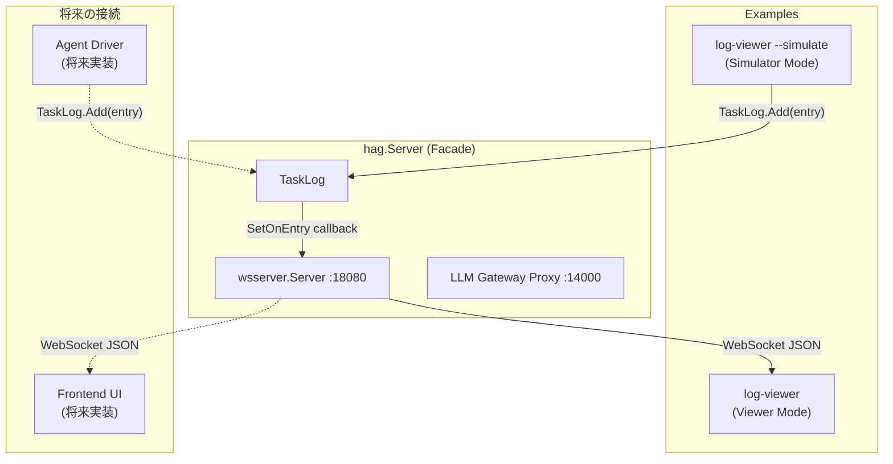
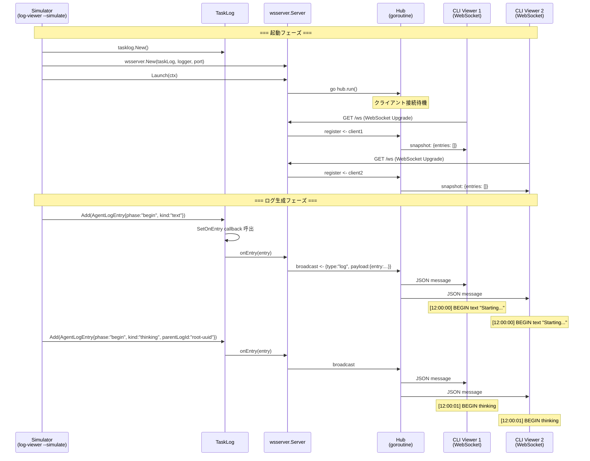
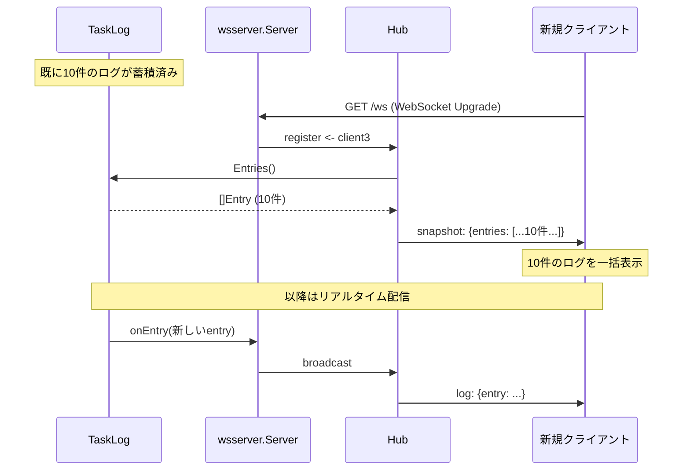

# 006: ログストリーミング WebSocket Server と CLI Viewer

## 背景 (Background)

HAGのFoundationフェーズでは、階層化ログのデータモデル (`tasklog` パッケージ) が実装済みであり、`AgentLogEntry` (begin/send/end フェーズ)、`LogStack` (親子関係のスタック管理)、`TaskLog` (ログ履歴管理と異常終了時の自動クローズ) が動作している。

しかし、現状では以下の課題がある:

1. **WebSocket Server がスケルトンのまま**: `wsserver.Server` は `Launch/Shutdown` が no-op であり、実際にクライアントとの通信を行わない
2. **ログの配信経路が未実装**: `TaskLog` に追加されたエントリをリアルタイムで外部に配信する機構がない
3. **動作確認手段がない**: ログのデータ構造（特に階層構造の `parentLogId`、ストリーミングの `begin/send/end` フェーズ）が正しく機能しているか、エンドツーエンドで検証する方法がない

本仕様では、`wsserver` パッケージを実装し、ログエントリをWebSocket経由でストリーミング配信するサーバーを構築する。加えて、受信したログを階層構造で表示する CLI Viewer (`examples/log-viewer`) を作成し、動作確認の手段とする。

将来的にはフロントエンドUI (React等) がこのWebSocket Serverに接続してリッチなログ表示を行うが、まずはCLI Viewerでデータ構造の正しさを検証する。

### 関連仕様

- [000-Architecture](file://prompts/phases/000-foundation/branches/feat-llm-backend/ideas/000-Architecture.md): R2-1 WebSocket Server コンポーネント定義
- [003-HierarchicalAgentLog](file://prompts/phases/000-foundation/branches/feat-llm-backend/ideas/003-HierarchicalAgentLog.md): R5 WebSocket中継の要件

---

## 要件 (Requirements)

### 必須要件

#### R1: WebSocket Server (`wsserver` パッケージ)

- **R1-1**: `wsserver.Server` を実装し、指定ポートでWebSocket接続を受け付ける
- **R1-2**: 複数クライアントの同時接続をサポートする (Hub パターン)
- **R1-3**: `New/Launch/Shutdown` のライフサイクルパターン (000-Architecture R4) に準拠する
- **R1-4**: `Launch` 時にHTTPサーバーを起動し、`/ws` エンドポイントでWebSocket Upgradeを行う
- **R1-5**: `Shutdown` 時にすべての接続をクローズし、HTTPサーバーをgracefulに停止する
- **R1-6**: `Broadcast(msg []byte)` メソッドで、接続中の全クライアントにメッセージを送信する
- **R1-7**: クライアント切断時に自動的にHubから除去する

#### R2: WebSocket メッセージプロトコル

- **R2-1**: メッセージはJSON形式とし、以下のエンベロープ構造とする:

```json
{
  "type": "log",
  "payload": {
    "entry": {
      "id": "log-uuid-1",
      "time": "2026-06-03T12:00:00Z",
      "entryType": "AGENT_LOG",
      "body": "thinking about the problem...",
      "phase": "begin",
      "kind": "thinking",
      "isComplete": false,
      "parentLogId": "root-uuid",
      "agentId": "agent-1"
    }
  }
}
```

- **R2-2**: `type` フィールドで将来的なメッセージ種別の拡張を可能にする (現時点では `"log"` のみ)
- **R2-3**: `payload.entry` は `tasklog.AgentLogEntry` の JSON 直列化結果と一致させる
- **R2-4**: 接続時に既存のログ履歴を一括送信する `"snapshot"` メッセージをサポートする:

```json
{
  "type": "snapshot",
  "payload": {
    "entries": [
      { "id": "...", "entryType": "AGENT_LOG", ... },
      { "id": "...", "entryType": "AGENT_LOG", ... }
    ]
  }
}
```

#### R3: TaskLog との連携

- **R3-1**: `TaskLog.SetOnEntry()` コールバックを使い、新しいエントリが追加されるたびにWebSocket Serverへ通知する
- **R3-2**: `hag.Server` が `TaskLog` と `wsserver.Server` を接続するワイヤリングを担当する
- **R3-3**: `hag.Server` に `TaskLog()` アクセサメソッドを追加し、In-Process利用者がログを注入できるようにする

#### R4: CLI Viewer (`examples/log-viewer`)

- **R4-1**: WebSocket Serverに接続し、受信したログをターミナルに表示するCLIツールを作成する
- **R4-2**: `parentLogId` に基づくインデント表示を行い、階層構造を可視化する:

```
[12:00:00] BEGIN text         "Starting task..."
[12:00:01]   BEGIN thinking   (parentLogId: root-uuid)
[12:00:01]     SEND           "Let me think about this..."
[12:00:02]     SEND           "I should use the file tool..."
[12:00:02]   END   thinking
[12:00:03]   BEGIN tool_use   (parentLogId: root-uuid)
[12:00:03]     SEND           "read_file: main.go"
[12:00:03]     BEGIN tool_result (parentLogId: tool-uuid)
[12:00:03]       SEND           "package main..."
[12:00:04]     END   tool_result
[12:00:04]   END   tool_use
[12:00:05] END   text
```

- **R4-3**: 各 `kind` に応じた色分け表示を行う:

| kind | 色 |
|------|-----|
| `text` | 白 (デフォルト) |
| `thinking` | 灰色 / 暗め |
| `tool_use` | シアン |
| `tool_result` | 黄色 |
| `system` | 緑 |
| `error` | 赤 / 太字 |

- **R4-4**: `--url` フラグでWebSocket接続先を指定できる (デフォルト: `ws://localhost:18080/ws`)
- **R4-5**: `snapshot` メッセージ受信時に既存ログを一括表示し、以降はリアルタイム表示に切り替える
- **R4-6**: ストリーミング中のログ (`phase: "send"`) は同一行に追記表示する。`phase: "end"` で改行を確定する

#### R5: デモ用シミュレーター (`examples/log-viewer` に内蔵)

- **R5-1**: 実際のCoding Agentがなくても動作確認できるよう、模擬ログを生成するシミュレーターモードを提供する
- **R5-2**: `--simulate` フラグでシミュレーターモードを起動する
- **R5-3**: シミュレーターは以下の階層的なログシーケンスを生成する:
  1. ルートログ (kind: "text") を begin
  2. 子ログ (kind: "thinking") を begin -> send (複数チャンク) -> end
  3. 子ログ (kind: "tool_use") を begin -> send
  4. 孫ログ (kind: "tool_result") を begin -> send -> end
  5. tool_use を end
  6. ルートログを end
  7. 第2ラウンド: 新しいルートログを begin -> error ログ -> end
- **R5-4**: 各ログ間に適切な遅延 (100-500ms) を入れて、ストリーミングの様子を確認できるようにする

#### R6: hag.Server の拡張

- **R6-1**: `hag.Server` に `TaskLog` フィールドを追加し、`New()` で初期化する
- **R6-2**: `hag.Server.TaskLog() *tasklog.TaskLog` アクセサメソッドを追加する
- **R6-3**: `wsserver.Server` のコンストラクタに `TaskLog` と `Logger` を注入する
- **R6-4**: `config.AppConfig` に `WebSocket` 設定セクションを追加する:

```go
type WebSocketConfig struct {
    Port int `yaml:"port"` // デフォルト: 18080
}
```

- **R6-5**: `Launch()` 時に WebSocket Server の起動が失敗した場合はエラーを返す

### 任意要件

- **O1**: WebSocket Server で `ping/pong` によるKeep-Alive
- **O2**: クライアントからの `subscribe` メッセージで特定の `agentId` のみ購読
- **O3**: CLI Viewer で `kind` によるフィルタリング (`--filter kind=thinking` で thinking のみ表示)

---

## 実現方針 (Implementation Approach)

### アーキテクチャ図



### パッケージ構成

```
shared/libs/go/
    wsserver/
        server.go          -- WebSocket Server (Hub + Broadcast)
        server_test.go     -- 単体テスト
        client.go          -- クライアント接続管理
        message.go         -- メッセージ型定義 (LogMessage, SnapshotMessage)

    config/
        config.go          -- WebSocketConfig 追加

    hag/
        server.go          -- TaskLog フィールド追加、ワイヤリング

examples/
    log-viewer/
        main.go            -- CLI Viewer + Simulator
        go.mod
```

### データフロー: シミュレーターモード



### データフロー: 後から接続したクライアントへの Snapshot 配信



### WebSocket Server 内部構造 (Hub パターン)

```go
// Hub manages connected clients and broadcasts messages.
type Hub struct {
    clients    map[*Client]bool
    broadcast  chan []byte
    register   chan *Client
    unregister chan *Client
    taskLog    *tasklog.TaskLog
}

// Client represents a single WebSocket connection.
type Client struct {
    hub  *Hub
    conn *websocket.Conn
    send chan []byte
}
```

この設計は [gorilla/websocket のチャットサンプル](https://github.com/gorilla/websocket/tree/main/examples/chat) に倣った標準的なパターンである。

### CLI Viewer の表示ロジック

```go
// displayEntry はログエントリをインデント付きで表示する。
func displayEntry(entry AgentLogEntry, depthMap map[string]int) {
    depth := 0
    if entry.ParentLogID != "" {
        if parentDepth, ok := depthMap[entry.ParentLogID]; ok {
            depth = parentDepth + 1
        }
    }
    depthMap[entry.ID] = depth

    indent := strings.Repeat("  ", depth)
    timestamp := entry.Time.Format("15:04:05")
    kindColor := colorForKind(entry.Kind)

    switch entry.Phase {
    case "begin":
        fmt.Printf("%s[%s] %sBEGIN %-12s%s %q\n",
            indent, timestamp, kindColor, entry.Kind, resetColor, entry.Body)
    case "send":
        fmt.Printf("%s[%s]   %sSEND%s  %s\n",
            indent, timestamp, kindColor, resetColor, entry.Body)
    case "end":
        fmt.Printf("%s[%s] %sEND   %-12s%s\n",
            indent, timestamp, kindColor, entry.Kind, resetColor)
    }
}
```

---

## 検証シナリオ (Verification Scenarios)

### シナリオ1: WebSocket Server の起動と接続

1. `hag.Server` を `WebSocket.Port: 18080` で起動する
2. WebSocket クライアント (`wscat` または CLI Viewer) で `ws://localhost:18080/ws` に接続する
3. 接続成功し、空の `snapshot` メッセージを受信する
4. サーバーを Shutdown する
5. クライアント接続が正常に切断される

### シナリオ2: シミュレーターによる階層ログの生成と表示

1. `bin/log-viewer --simulate` を実行する (内蔵サーバー起動 + シミュレーター)
2. 別ターミナルで `bin/log-viewer --url ws://localhost:18080/ws` を実行する (ビューアー接続)
3. ビューアーに以下の階層的なログが表示される:
   - ルートレベルのログ (インデントなし)
   - thinking ログ (1段インデント、灰色)
   - tool_use ログ (1段インデント、シアン)
   - tool_result ログ (2段インデント、黄色)
4. 各 `send` フェーズでテキストが逐次追記される
5. 各 `end` フェーズで行が確定する

### シナリオ3: 後から接続したクライアントへのログ配信

1. シミュレーターが数件のログを生成した後に、新しい CLI Viewer を接続する
2. 新しいクライアントが `snapshot` メッセージで既存ログを一括受信する
3. その後のログはリアルタイムで受信する

### シナリオ4: 異常終了ログの確認

1. シミュレーターが未完了のログストリームがある状態で `TerminatedEntry` を発行する
2. CLI Viewer に `[auto-closed: abnormal termination]` メッセージが表示される

### シナリオ5: 複数クライアントへの同時配信

1. 2つの CLI Viewer を同時に接続する
2. シミュレーターがログを生成する
3. 両方のクライアントに同一のログがリアルタイムで表示される

### シナリオ6: Tool Calling の階層構造確認

以下のような Tool Calling のログシーケンスで、階層が正しく構成されていることを確認する:

1. ルートログ begin (kind: "text", parentLogId: "")
2. thinking begin (kind: "thinking", parentLogId: root_id) -> send (複数) -> end
3. tool_use begin (kind: "tool_use", parentLogId: root_id)
4. tool_use send (ツール名と引数の表示)
5. tool_result begin (kind: "tool_result", parentLogId: tool_use_id)
6. tool_result send (ツール実行結果のストリーミング)
7. tool_result end
8. tool_use end
9. 再びtool_use begin (2回目のツール呼び出し) -> 同様のネスト
10. ルートログ end

CLI Viewer の出力で、各エントリの `parentLogId` が正しく設定されていること、インデント深度が階層に一致していることを確認する。

---

## テスト項目 (Testing for the Requirements)

### ビルド・全体検証

1. ビルド+単体テスト:
   ```
   scripts/process/build.sh
   ```

2. 共通統合テスト (サーバーライフサイクル):
   ```
   scripts/process/integration_test.sh --categories "common" --specify "Server|Lifecycle|WebSocket"
   ```

### 単体テスト計画

| テスト対象 | テストファイル | 確認内容 |
|---|---|---|
| Hub | `wsserver/server_test.go` | register/unregister、Broadcastの配信、複数クライアントへの同時送信 |
| WebSocket接続 | `wsserver/server_test.go` | `/ws` エンドポイントへのUpgrade成功、接続/切断のライフサイクル |
| Snapshot配信 | `wsserver/server_test.go` | 接続時に既存TaskLogのEntries()がsnapshot形式で送信されること |
| メッセージ直列化 | `wsserver/message.go` | LogMessage / SnapshotMessage のJSON直列化/逆直列化 |
| hag.Server統合 | `hag/server_test.go` | TaskLog() アクセサ、TaskLog.Add() -> wsserver.Broadcast の連動 |
| CLI Viewer表示 | 手動確認 + Scenario 2 | 階層インデント、色分け、ストリーミング表示 |

### 統合テスト (新規追加)

```go
// tests/wsserver_integration_test.go

func TestWebSocket_LogStreaming(t *testing.T) {
    // 1. hag.Server を起動
    // 2. WebSocket クライアントで /ws に接続
    // 3. snapshot メッセージを受信
    // 4. TaskLog.Add() でエントリを追加
    // 5. WebSocket クライアントが log メッセージを受信
    // 6. 受信したエントリの parentLogId, kind, phase が正しいことを確認
}

func TestWebSocket_HierarchicalLogStructure(t *testing.T) {
    // 1. hag.Server を起動
    // 2. WebSocket クライアントで接続
    // 3. ルート -> thinking -> tool_use -> tool_result の階層ログを生成
    // 4. 受信した各エントリの parentLogId が正しい親子関係を示していることを確認
    // 5. 第3階層 (tool_result) の parentLogId が第2階層 (tool_use) のIDであることを確認
}
```

---

## 変更履歴

| 日付 | 変更内容 |
|---------|---------|
| 2026-06-05 | 初版作成 |
