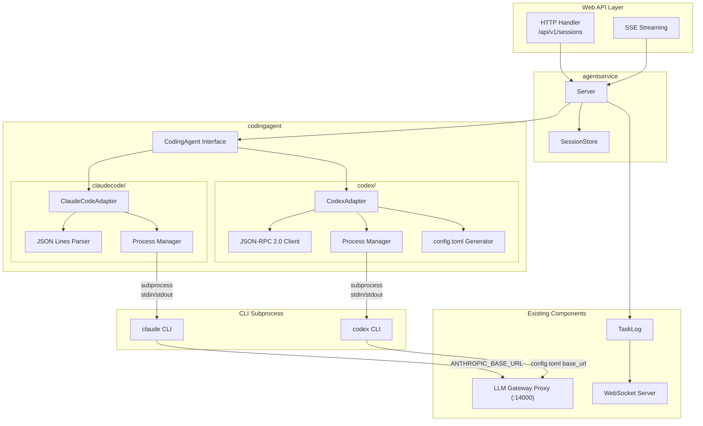
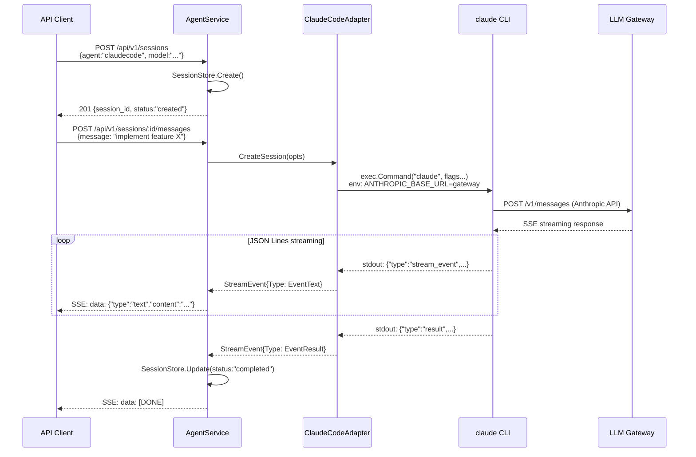

# 007: Coding Agent API

## 背景 (Background)

HAG (Headless-Agent-Gateway) の000-Architectureで定義されたコンポーネントのうち、LLM Gateway Proxy、Config/Vault、Logger、TaskLog、WebSocket Serverの実装が完了した。次のステップとして、コーディングエージェント (Claude Code, Codex) との接続層を構築する。

vv4の参照実装ではTypeScript + Claude Agent SDK (`@anthropic-ai/claude-agent-sdk`) + Dockerコンテナで実装されていたが、過去の設計議論 ([agent-abstraction-research.md](file://prompts/designs/vv4/agent-abstraction-research.md)) において、**Go言語による直接実装**が合意されている。Claude Code CLIはJSON Lines (NDJSON) プロトコル、CodexはJSON-RPC 2.0プロトコルで通信しており、Go言語から直接サブプロセスとして制御可能である。

本仕様は、共通化されたCoding Agent APIを定義し、Claude Code AdapterとCodex Adapterを通じて各コーディングエージェントをシングルショットで起動・管理する仕組みを規定する。

### 設計決定事項 (参照)

本仕様は以下の設計決定事項 (DD) に基づく:
DD-001 (3層構造), DD-003 (New/Launch/Shutdown), DD-005 (llmadapter層不移植), DD-039 (Gateway接続先は環境変数注入), DD-044 (モックは使用しない)

(設計決定事項の詳細は [design_decisions.md](file://prompts/designs/hag/design_decisions.md) を参照)

### 参照ドキュメント

| ドキュメント | 内容 |
|---|---|
| [agent-abstraction-research.md](file://prompts/designs/vv4/agent-abstraction-research.md) | CLIプロトコル調査、Go直接実装の合意 |
| [llm-backend-architecture.md](file://prompts/designs/vv4/llm-backend-architecture.md) | Agent DriverとLLM Gatewayの関係整理 |
| [coding-agent-architecture-investigation.md](file://prompts/designs/vv4/coding-agent-architecture-investigation.md) | vv4からの抽出戦略 |
| [000-Architecture.md](file://prompts/phases/000-foundation/branches/feat-llm-backend/ideas/000-Architecture.md) | HAG全体アーキテクチャ |

---

## 要件 (Requirements)

### 必須要件

#### R1: CodingAgent Interface

- **R1-1**: コーディングエージェントの共通インターフェース `CodingAgent` をGoで定義する。Claude Code、Codexの両方が同一インターフェースで扱える

```go
package codingagent

// CodingAgent はコーディングエージェントバックエンドの共通インターフェース。
// CLIラッパー型 (Claude Code, Codex) と将来のAPI直接型の両方が実装可能。
type CodingAgent interface {
    // CreateSession は新しいエージェントセッションを開始する。
    // 内部でCLIサブプロセスを起動する。
    CreateSession(ctx context.Context, opts ...SessionOption) (Session, error)

    // Name はエージェントバックエンド名を返す ("claudecode", "codex")。
    Name() string

    // Close はエージェントリソースを解放する。
    Close() error
}
```

- **R1-2**: セッションインターフェース `Session` を定義する。メッセージ送信とストリーミング受信をサポートする

```go
// Session はアクティブなエージェントセッション。
// CLIサブプロセスのライフサイクルに対応する。
type Session interface {
    // Send はメッセージを送信し、ストリーミングイベントチャネルを返す。
    // チャネルはエージェントの応答完了時にクローズされる。
    Send(ctx context.Context, message string) (<-chan StreamEvent, error)

    // ID はセッションIDを返す。
    ID() string

    // Close はセッションを終了し、サブプロセスをクリーンアップする。
    Close() error
}
```

- **R1-3**: ストリーミングイベント型 `StreamEvent` を定義する。vv4の `AgentStreamEvent` に相当する

```go
// StreamEvent はエージェントからのストリーミングイベント。
type StreamEvent struct {
    Type      EventType              `json:"type"`
    Content   string                 `json:"content,omitempty"`
    ToolName  string                 `json:"tool_name,omitempty"`
    ToolInput map[string]interface{} `json:"tool_input,omitempty"`
    SessionID string                 `json:"session_id,omitempty"`
    Error     error                  `json:"-"`
}

type EventType string

const (
    EventText       EventType = "text"
    EventToolUse    EventType = "tool_use"
    EventToolResult EventType = "tool_result"
    EventResult     EventType = "result"
    EventError      EventType = "error"
    EventSystem     EventType = "system"
)
```

- **R1-4**: セッションオプション `SessionOption` でエージェントの実行パラメータを指定する

```go
// SessionOption はセッション作成時のオプション。
type SessionOption func(*SessionConfig)

type SessionConfig struct {
    // Web APIリクエスト由来のオプション (リクエスト毎に変化)
    Model        string   // 使用するモデル名 (例: "anthropic/claude-sonnet-4")
    Prompt       string   // 初期プロンプト (シングルショット用)
    AllowedTools []string // 許可するツール一覧

    // 起動オプション (環境/コンテナ起動時に固定)
    WorkDir      string            // 作業ディレクトリ (CWD)
    EnvVars      map[string]string // 追加環境変数

    // セッション継続 (resume)
    SDKSessionID string     // CLI/SDK側の既存セッションを再開する場合に指定

    // VFSマウント (コンテナ実行時)
    VFSMounts    []VFSMount // ホスト->コンテナのファイルマッピング
}

func WithModel(model string) SessionOption
func WithPrompt(prompt string) SessionOption
func WithAllowedTools(tools []string) SessionOption
func WithWorkDir(dir string) SessionOption
func WithEnvVars(vars map[string]string) SessionOption
func WithSDKSessionID(id string) SessionOption
func WithVFSMounts(mounts []VFSMount) SessionOption
```

#### R2: Adapter共通仕様

- **R2-1**: 各Adapterは `CodingAgent` インターフェースを実装する
- **R2-2**: Adapterはコンストラクタ注入パターンに従う。依存オブジェクト (Logger, Gateway URL等) は `New` 関数で注入する

```go
// AdapterConfig は全Adapter共通の設定
type AdapterConfig struct {
    GatewayURL string        // LLM Gateway Proxy URL
    Logger     logger.Logger // ロガー
    
    // 起動オプション (デフォルト値、SessionOptionで上書き可能)
    DefaultWorkDir      string            // デフォルトCWD
    DefaultModel        string            // デフォルトモデル
    DefaultEnvVars      map[string]string // デフォルト追加環境変数
    
    // サンドボックス制御
    DisableSandbox bool // true: CLIの内部サンドボックスを無効化 (コンテナ実行時)
}
```

- **R2-3**: Adapterはサブプロセスのライフサイクル管理を行う

| フェーズ | 責務 |
|---|---|
| プリフライト | CLI実行ファイルの存在確認、設定ファイル生成 (Codex用config.toml等) |
| 起動 | `exec.Command` でサブプロセス起動、stdin/stdout パイプ接続 |
| 通信 | プロトコル別のメッセージ送受信、ストリーミングイベントのチャネル転送 |
| 監視 | プロセス死活監視、タイムアウト管理 |
| 終了 | Graceful shutdown (SIGTERM -> SIGKILL)、リソースクリーンアップ |

- **R2-5**: セッション作成時にリトライロジックを実装する。コンテナ起動直後のレースコンディション等、一時的な接続障害に対応する

| 項目 | 値 |
|---|---|
| 最大試行回数 | 10回 |
| リトライ間隔 | 3秒 |
| リトライ対象エラー | EOF, connection reset, broken pipe, connection refused, connectex |
| 非リトライ対象 | HTTP 4xx/5xx (読み取り可能なレスポンスボディがある場合) |
| コンテナ実行時の追加チェック | リトライ前にコンテナの死活確認 (`docker inspect`)。停止済みなら即座に中断 |

- **R2-4**: LLM Gateway ProxyへのURL注入はAdapter内で行う。Agent CLI側でこのURLにアクセスするように環境変数や設定ファイルを自動設定する

#### R3: Claude Code Adapter

- **R3-1**: Claude Code CLI (`claude`) をサブプロセスとして起動し、JSON Lines (NDJSON) プロトコルで通信する

```bash
# シングルショット起動コマンド例
claude --output-format stream-json --input-format stream-json --verbose \
  -p "プロンプトテキスト" \
  --model "anthropic/claude-sonnet-4" \
  --allowedTools "Read,Edit,Write,Bash,Glob,Grep" \
  --permission-mode bypassPermissions
```

- **R3-2**: 以下の環境変数をサブプロセスに注入する

| 環境変数 | 値 | 説明 |
|---|---|---|
| `ANTHROPIC_BASE_URL` | AdapterConfig.GatewayURL | LLM Gateway Proxy URL |
| `ANTHROPIC_API_KEY` | Vault管理値 or "not-needed" | APIキー |
| `CLAUDE_CODE_SKIP_SANDBOX` | "1" (コンテナ時) | bwrapサンドボックス無効化 |

- **R3-3**: JSON Lines出力を逐次パースし、`StreamEvent` に変換する。イベントマッピングはvv4の [ClaudeAgent.ts](file://reference_repo/vv4/features/coding-agent/src/agents/ClaudeAgent.ts) のmapEvent()に準拠する

| CLI出力イベント | StreamEvent.Type |
|---|---|
| `system` (subtype: init) | `EventSystem` (SessionID抽出) |
| `system` (他) | 無視 |
| `stream_event` (content_block_delta/text_delta) | `EventText` |
| `assistant` (tool_use blocks) | `EventToolUse` |
| `user` (tool_result blocks) | `EventToolResult` |
| `result` | `EventResult` |

- **R3-4**: `--session-id` フラグでセッションIDを指定し、コンテキストの引き継ぎをサポートする
- **R3-5**: サブプロセスのCWDを `SessionConfig.WorkDir` で制御する
- **R3-6**: サンドボックス制御: `AdapterConfig.DisableSandbox` が `true` の場合、`CLAUDE_CODE_SKIP_SANDBOX=1` を環境変数に設定する

#### R4: Codex Adapter

- **R4-1**: Codex CLI (`codex`) をサブプロセスとして起動し、JSON-RPC 2.0プロトコルで通信する
- **R4-2**: Codexの起動前に一時的な `config.toml` を生成し、LLM Gateway Proxy URLを設定する

```toml
model = "{model_name}"
model_provider = "gateway"

[model_providers.gateway]
name = "HAG LLM Gateway"
base_url = "{gateway_url}"
env_key = "OPENAI_API_KEY"
wire_api = "chat"
```

- **R4-3**: JSON-RPC 2.0のライフサイクルに従う: `initialize` -> `startThread` -> ターン実行 -> ストリーミング通知
- **R4-4**: 承認フロー (approval request) を自動承認するハンドラを実装する
- **R4-5**: JSON-RPC 2.0の通知イベントを `StreamEvent` に変換する

#### R5: AgentService (Web APIフロント)

- **R5-1**: `agentservice.Server` はCoding Agent APIのHTTPハンドラを提供する

```go
package agentservice

// Server はCoding Agent APIのサービス層。
// CodingAgentインスタンスの管理とHTTP APIの提供を行う。
type Server struct {
    agents   map[string]codingagent.CodingAgent // 登録済みAdapter
    sessions SessionStore                        // セッション永続化
    logger   logger.Logger
    taskLog  *tasklog.TaskLog
}

func New(opts ...Option) *Server
func (s *Server) HTTPHandler() http.Handler
func (s *Server) RegisterAgent(agent codingagent.CodingAgent)
```

- **R5-2**: 以下のHTTPエンドポイントを提供する

| エンドポイント | メソッド | 説明 |
|---|---|---|
| `/health` | GET | ヘルスチェック (認証不要) |
| `/api/v1/agents` | GET | 利用可能なエージェント一覧 |
| `/api/v1/sessions/:id/terminate` | POST | セッション強制終了 |
| `/api/v1/sessions` | POST | セッション作成 (agent, model, workDir指定) |
| `/api/v1/sessions/:id/messages` | POST | メッセージ送信 (SSE or JSON応答) |
| `/api/v1/sessions/:id` | GET | セッション状態取得 |
| `/api/v1/sessions/:id` | DELETE | セッション終了 |
| `/api/v1/sessions/:id/logs` | GET | セッションログSSEストリーミング |

- **R5-3**: `/health` エンドポイントはCAWA自身の状態に加え、LLM Gateway Proxy (LLMGP) への連鎖ヘルスチェックを行う。LLMGPはHAGアーキテクチャの必須コンポーネントとして扱う

  **HTTPステータスコード**:

  | 状態 | ステータス | 説明 |
  |---|---|---|
  | CAWA正常 + LLMGP正常 | `200 OK` | 全コンポーネント正常 |
  | CAWA正常 + LLMGP異常 | `502 Bad Gateway` | 上流コンポーネント (LLMGP) に到達不可 |
  | CAWA異常 | 無応答 | CAWA自身が停止中 |

  **200 OK レスポンス例**:

```json
{
  "status": "ok",
  "agents": ["claudecode", "codex"],
  "cli_versions": {
    "claude": "2.1.x",
    "codex": "1.x.x"
  },
  "gateway": {
    "status": "ok",
    "url": "http://localhost:14000"
  }
}
```

  **502 Bad Gateway レスポンス例**:

```json
{
  "status": "degraded",
  "agents": ["claudecode", "codex"],
  "cli_versions": {
    "claude": "2.1.x",
    "codex": "1.x.x"
  },
  "gateway": {
    "status": "unreachable",
    "url": "http://localhost:14000",
    "error": "connection refused"
  }
}
```

  - CAWA起動時に `AdapterConfig.GatewayURL` で設定されたLLMGP URLの `/health` を呼び出す
  - LLMGP側のヘルスチェック応答タイムアウトは2秒とする
  - 認証は不要 (ヘルスチェック間の通信もBearerトークンは使用しない)

- **R5-4**: メッセージ送信APIはContent Negotiationでレスポンス形式を切り替える
  - `Accept: text/event-stream` -> SSEストリーミング応答
  - それ以外 -> JSON応答 (ストリーミング完了後に一括返却)

- **R5-5**: ストリーミングイベントはTaskLogに記録し、WebSocket Server経由でフロントエンドにリアルタイム通知する

- **R5-6**: セッションログSSEストリーミング (`GET /api/v1/sessions/:id/logs`) はHTTP SSEでエージェントのログをリアルタイム配信する。WebSocket非対応のクライアント (curl等での開発時デバッグ) 向け

| SSEイベント型 | 内容 |
|---|---|
| `log` | ログエントリ (JSON) |
| `session` | セッションID通知 |
| `status` | エージェント状態変更 (terminated, failed) |
| `[DONE]` | ストリーム終了 |

  - 初期接続時に既存ログのスナップショットを送信する
  - 500ms間隔のポーリングで新規ログを配信する
  - エージェント終了時にエラーログの有無を判定し、`terminated` または `failed` を通知する

#### R6: 起動オプションの二層構造

- **R6-1**: 起動オプションは以下の2層で管理する

| 層 | 指定タイミング | スコープ | 例 |
|---|---|---|---|
| **環境レベル** | プロセス/コンテナ起動時 | 全セッション共通 | CWD, サンドボックス設定, Gateway URL |
| **リクエストレベル** | Web API リクエスト毎 | セッション個別 | プロンプト, モデル, ツール制限 |

- **R6-2**: 環境レベルオプションは `AdapterConfig` で指定する (コンストラクタ注入)
- **R6-3**: リクエストレベルオプションは `SessionOption` で指定する (メソッド引数)
- **R6-4**: リクエストレベルオプションは環境レベルオプションを上書きできる。優先順位: リクエストレベル > 環境レベル > デフォルト値

- **R6-5**: コンテナ実行時 (UC-B/UC-C) はDockerコンテナに以下の環境変数を注入する

| 環境変数 | 値 | 説明 |
|---|---|---|
| `DEFAULT_MODEL` | 例: `ollama/qwen2.5-coder:7b` | デフォルトLLMモデル |
| `LLM_GATEWAY_URL` | 例: `http://host.docker.internal:14000` | LLM Gateway Proxy URL |
| `AGENT_AUTH_TOKEN` | UUID or JWT | Coding Agent APIの認証トークン |
| `CLAUDE_CODE_SKIP_SANDBOX` | `1` | bwrapサンドボックス無効化 |
| `CLAUDE_CONFIG_DIR` | `/workspace/.claude` | Claude SDKの設定ディレクトリ |

- **R6-6**: コンテナ間通信では `--add-host=host.docker.internal:host-gateway` でホスト解決を保証する (Docker Desktop以外の環境でも動作するように)

- **R6-7**: VFSマウント: コンテナ実行時にホストのワークスペースディレクトリをコンテナ内にマッピングする仕組みを提供する

```go
// VFSMount はホストパス <-> コンテナパスのマッピングを定義する
type VFSMount struct {
    VFSPath      string // 論理パス (例: "vfs://workspace/")
    PhysicalPath string // ホスト物理パス (例: "file:///home/user/project")
}

// vfsToContainerPath はVFS URIをコンテナ内パスに変換する
// "vfs://workspace/"      -> "/workspace"
// "vfs://workspace/data/" -> "/workspace/data"
func vfsToContainerPath(vfsPath string) string
```

  - マウントは親ディレクトリ優先でソートする (パス長の昇順)
  - `SessionConfig` にVFSマウント一覧を含め、Web APIリクエストで指定可能にする
  - CWD (`WorkDir`) は引き続きサポートするが、VFSマウントはより柔軟な複数ディレクトリのマッピングを提供する

#### R7: セッション管理

- **R7-1**: `SessionStore` インターフェースでセッション永続化を抽象化する

```go
// SessionStore はセッション永続化の抽象インターフェース
type SessionStore interface {
    Create(session *SessionRecord) error
    Get(id string) (*SessionRecord, error)
    Update(session *SessionRecord) error
    List() ([]*SessionRecord, error)
    Delete(id string) error
}

type SessionRecord struct {
    ID           string
    AgentName    string    // "claudecode", "codex"
    Model        string
    Status       string    // "active", "completed", "error", "closed"
    WorkDir      string
    SDKSessionID string    // CLI/SDKが内部管理するセッションID (コンテキスト引き継ぎ用)
    CreatedAt    time.Time
    UpdatedAt    time.Time
}
```

- **R7-2**: 初期実装はインメモリ `MemorySessionStore` を提供する
- **R7-3**: シングルショットセッション: プロンプト送信 -> ストリーミング応答 -> セッション完了のサイクル

- **R7-4**: セッションIDは2階層で管理する

| ID種別 | 管理主体 | 用途 |
|---|---|---|
| `session_id` (HAG管理) | AgentService/SessionStore | セッション永続化、API識別子、ライフサイクル管理 |
| `sdk_session_id` (CLI内部) | Claude CLI / Codex CLI | SDK側のコンテキスト引き継ぎ、`--session-id` / `--resume` フラグ |

  - `session_id` はHAGが生成するUUID。Web APIの応答とSessionStoreに保存する
  - `sdk_session_id` はCLIプロセスの初回起動時にSDKが返すID。`SessionRecord.SDKSessionID` に保存する
  - マルチターンセッションで同一セッションの継続 (resume) を行う際は、`sdk_session_id` をCLIに渡して前回のコンテキストを引き継ぐ
  - シングルショットの場合、`sdk_session_id` は保存されるが即座にセッションが完了するため、通常は使用されない

#### R8: hag.Serverとの統合

- **R8-1**: `hag.Server` の初期化順序にAgentServiceの生成を追加する (R3-3 順序6)
- **R8-2**: `WithAgentService` Optionで外部注入をサポートする
- **R8-3**: `hag.Server.AgentService()` で取得したインスタンスをHTTPサーバにマウントする

#### R9: フォールバックツール実行 (Agent Adapter層)

- **R9-1**: ローカルLLM (Ollama等) が `tool_calls` 形式ではなくテキストでツールコールを返すケースに対し、Agent Adapter層で最終手段のフォールバック実行を行う

  > **注**: HAGではLLM Gateway Proxy側 (DD-015) でのテキスト -> Tool Call変換が第一防衛線。R9はGateway側の変換が不十分だった場合のバックストップとして機能する

- **R9-2**: テキスト出力からJSON形式のツールコールを解析する

```go
// FallbackToolCall はテキストから解析されたツールコール
type FallbackToolCall struct {
    Name      string         `json:"name"`
    Arguments map[string]any `json:"arguments"`
}

// ParseFallbackToolCalls はテキストからツールコールを抽出する。
// 対応形式:
//   - 単一オブジェクト: {"name": "Write", "arguments": {...}}
//   - 配列: [{"name": "Write", ...}, ...]
//   - マークダウンコードフェンス内のJSON: ```json\n{...}\n```
func ParseFallbackToolCalls(text string) ([]FallbackToolCall, bool)
```

- **R9-3**: Claude Code / Codex が使用する全ツール (Write, Read, Edit, Bash, Glob, Grep 等) をサポートする。解析されたツール名と引数をそのまま `StreamEvent` (EventToolUse) として転送し、Adapter層で実行する。ワークスペースパスとの相対パス解決を行い、ファイル操作系ツールでは必要に応じてディレクトリを作成する
- **R9-4**: フォールバック実行時はTaskLogに通知ログ ("Text output converted to Tool Call (Go backend fallback)") を記録する

---

### デプロイメントユースケース

#### UC-A: フルローカル実行

```
[ホストマシン]
  ├── Coding Agent Web API (Go プロセス)
  │     └── AgentService + CodingAgent Adapter
  ├── claude / codex CLI (サブプロセス)
  └── LLM Gateway Proxy (Go、hag.Server内 In-Process)

サンドボックス: bwrap有効 (デフォルト)
Gateway URL: http://localhost:14000
```

開発者がローカルマシンで直接動作させるケース。全コンポーネントが同一ホスト上で動作する。

#### UC-B: フルコンテナ実行

```
[Docker Host]
  └── [Container: hag-all-in-one]
        ├── Coding Agent Web API (Go)
        ├── claude / codex CLI
        └── LLM Gateway Proxy (Go)

サンドボックス: bwrap無効 (CLAUDE_CODE_SKIP_SANDBOX=1)
Gateway URL: http://localhost:14000 (コンテナ内)
```

全コンポーネントを単一コンテナイメージに含め、必要に応じて起動/停止するケース。

#### UC-C: ハイブリッド (Gateway外出し)

```
[Docker Host / Kubernetes]
  ├── [Container/Pod: LLM Gateway Proxy]
  │     └── hag.Server (Gateway機能のみ)
  └── [Container/Pod: Coding Agent]
        ├── Coding Agent Web API (Go)
        └── claude / codex CLI

サンドボックス: bwrap無効
Gateway URL: http://gateway-host:14000 (外部URL)
```

LLM Gateway Proxyを共有リソースとして別コンテナ/Podで運用するケース。複数のCoding Agentコンテナが同一Gatewayを共有する。APIキー管理、レート制限、プロバイダルーティングを一元化する企業向け構成。

---

### 任意要件

- **O1**: Bearer認証ミドルウェア (Web APIの認証)
- **O2**: マルチターンセッション (初期はシングルショットのみ)
- **O3**: 並行セッション数制限 (同時実行エージェント数の上限管理)
- **O4**: メトリクスエンドポイント (セッション数、実行時間等)
- **O5**: Agent管理API拡張 (Pause/Resume: 初期はシングルショット中心のため不要)
- **O6**: グローバルエラーハンドラ (unhandled panic/rejection のキャッチ、コンテナクラッシュ防止)

> **Note**: O7 (CLIバージョン検出) は [008-CodingAgentAPI-Completion.md](file://prompts/phases/000-foundation/branches/feat-llm-backend/ideas/008-CodingAgentAPI-Completion.md) の C3 により必須要件に昇格済み。HealthResponse に `cli_versions` フィールドとして含まれる。

---

## 実現方針 (Implementation Approach)

### パッケージ構成

```
shared/libs/go/
    codingagent/               -- CodingAgent抽象レイヤー
        interface.go           -- CodingAgent / Session / StreamEvent interfaces
        options.go             -- SessionOption, SessionConfig
        event.go               -- EventType, StreamEvent
        claudecode/            -- Claude Code Adapter
            adapter.go         -- ClaudeCodeAdapter (CodingAgent実装)
            protocol.go        -- JSON Lines パーサー、イベントマッピング
            process.go         -- サブプロセス管理 (起動/監視/停止)
        codex/                 -- Codex Adapter
            adapter.go         -- CodexAdapter (CodingAgent実装)
            protocol.go        -- JSON-RPC 2.0 クライアント
            process.go         -- サブプロセス管理
            config.go          -- config.toml テンプレート生成
    agentservice/              -- Coding Agent API (Web APIフロント)
        service.go             -- Server, RegisterAgent, HTTPHandler
        handler.go             -- HTTPハンドラ (REST + SSE)
        session_store.go       -- SessionStore interface + MemorySessionStore
```

### 全体アーキテクチャ図



### セッション実行シーケンス (シングルショット)



### コンテナ構成

各ユースケースに対応するコンテナイメージを `container/` フォルダ以下に構築する:

```
container/
    local/                     -- UC-A: ローカル開発用
        docker-compose.yml     -- hag + Ollama + 補助サービス
    all-in-one/                -- UC-B: フルコンテナ
        Dockerfile             -- Go API + claude CLI + LLM Gateway
        entrypoint.sh
        docker-compose.yml
    hybrid/                    -- UC-C: ハイブリッド
        gateway/
            Dockerfile         -- LLM Gateway Proxy のみ
            docker-compose.yml
        agent/
            Dockerfile         -- Go API + claude CLI (Gateway外部)
            entrypoint.sh
            docker-compose.yml
        docker-compose.yml     -- 統合構成 (gateway + agent)
```

#### コンテナ共通仕様 (vv4からの知見)

1. **非rootユーザー実行**: Claude Code CLI 2.1.x は root/sudo での `--dangerously-skip-permissions` を禁止する。`claude` ユーザーを作成し `gosu` で権限降格する
2. **サンドボックス無効化**: コンテナ内では `CLAUDE_CODE_SKIP_SANDBOX=1` を設定。bwrapがDockerのネームスペースと競合する
3. **ボリュームオーナーシップ**: entrypoint.sh でマウントボリュームの所有者を修正する
4. **CWD制御**: `WORKDIR /workspace` をデフォルトとし、ボリュームマウントで外部ディレクトリを接続する

---

## 検証シナリオ (Verification Scenarios)

### シナリオ1: Claude Code Adapter シングルショット実行

1. `ClaudeCodeAdapter` を生成する (`AdapterConfig` でGateway URL指定)
2. `CreateSession` でセッションを作成する (model, workDir, prompt指定)
3. `session.Send()` でプロンプトを送信する
4. `<-chan StreamEvent` からイベントを逐次受信する
5. `EventText`, `EventToolUse`, `EventToolResult`, `EventResult` が順に到来すること
6. 最終的に `EventResult` でセッションが完了すること
7. `session.Close()` でサブプロセスがクリーンアップされること

### シナリオ2: Codex Adapter シングルショット実行

1. `CodexAdapter` を生成する
2. 一時的な `config.toml` が生成され、Gateway URLが設定されていること
3. `CreateSession` でcodex CLIが起動すること
4. JSON-RPC 2.0 `initialize` + `startThread` が実行されること
5. ストリーミングイベントが `StreamEvent` に変換されること
6. 完了後にサブプロセスがクリーンアップされること

### シナリオ3: Web API経由のSSEストリーミング

1. `POST /api/v1/sessions` でセッション作成
2. `POST /api/v1/sessions/:id/messages` (Accept: text/event-stream) でメッセージ送信
3. SSEストリームで `data: {"type":"text",...}` が逐次送信されること
4. 最終行に `data: [DONE]` が送信されること
5. `GET /api/v1/sessions/:id` でセッション状態が "completed" であること

### シナリオ4: CWDとサンドボックス制御

1. `WithWorkDir("/custom/path")` を指定してセッション作成
2. サブプロセスのCWDが `/custom/path` に設定されていること
3. `DisableSandbox: true` の場合、`CLAUDE_CODE_SKIP_SANDBOX=1` が環境変数に設定されていること
4. `DisableSandbox: false` の場合、上記環境変数が設定されないこと

### シナリオ4a: セッション作成リトライ

1. Coding Agentコンテナの起動直後、APIが利用可能になる前にセッション作成を試行する
2. 最初のリクエストが「connection refused」で失敗すること
3. 3秒間隔のリトライが実行され、API起動後に成功すること
4. コンテナが停止した場合、リトライが即座に中断されること
5. 最大10回のリトライ後に全て失敗した場合、適切なエラーメッセージが返ること

### シナリオ4b: ヘルスチェック

1. `GET /health` でステータス「ok」とエージェント一覧が返ること
2. 認証トークンが設定されている場合でも、`/health` は認証不要でアクセスできること
3. CLIバージョン情報がレスポンスに含まれること (CLIが存在しない場合は null)

### シナリオ4c: SDK Session ID (Resume)

1. シングルショットセッション完了後、`SessionRecord.SDKSessionID` にCLI側のセッションIDが保存されていること
2. `WithSDKSessionID(savedID)` で新しいセッションを作成した場合、前回のコンテキストが引き継がれること
3. Claude Code Adapterの場合、`--session-id` フラグにSDK Session IDが渡されること

### シナリオ4d: VFSマウント

1. `WithVFSMounts(...)` で複数のマウントポイントを指定してセッション作成
2. Docker引数に `-v host_path:container_path` が正しく生成されること
3. マウントが親ディレクトリ優先でソートされていること
4. `file://` URI形式のパスがネイティブファイルパスに正しく変換されること

### シナリオ4e: ログストリーミングSSE

1. `GET /api/v1/sessions/:id/logs` でSSE接続を開始する
2. 既存ログのスナップショットが即座に送信されること
3. 新しいログエントリがリアルタイムで配信されること
4. セッション完了時に `status: terminated` と `[DONE]` が送信されること
5. エラー終了の場合は `status: failed` が送信されること

### シナリオ4f: フォールバックツール実行

1. ローカルLLMがtool_useイベントを返さず、テキストでJSONツールコールを返した場合
2. `ParseFallbackToolCalls()` がテキストからWriteツールコールを解析できること
3. 解析結果に基づきファイルが正しく書き込まれること
4. TaskLogにフォールバック実行の通知が記録されること

### シナリオ5: Gateway外部URL (UC-C)

1. `AdapterConfig.GatewayURL` を外部URL (`http://gateway-host:14000`) に設定
2. サブプロセスの `ANTHROPIC_BASE_URL` に外部URLが注入されること
3. CLIがこの外部URLに対してLLMリクエストを送信すること

### シナリオ6: コンテナ統合テスト (UC-B: フルコンテナ)

1. `container/all-in-one/` のDockerイメージをビルドする
2. `docker-compose up` でコンテナを起動する
3. ホストから `POST /api/v1/sessions` でセッション作成
4. メッセージ送信でSSEストリーミング応答を受信する
5. `docker-compose down` でgracefulに停止する

### シナリオ7: コンテナ統合テスト (UC-C: ハイブリッド)

1. `container/hybrid/` の `docker-compose up` でGatewayコンテナとAgentコンテナを起動
2. AgentコンテナがGatewayコンテナのURLに接続できること
3. ホストからAgentコンテナのAPIを呼び出してSSEストリーミング応答を受信する
4. Gatewayコンテナのログにリクエストが記録されていること
5. `docker-compose down` で全コンテナがgracefulに停止する

---

## テスト項目 (Testing for the Requirements)

### ビルド・全体検証

1. ビルド+単体テスト:
   ```
   scripts/process/build.sh
   ```

2. Coding Agent統合テスト (共通APIテスト):
   ```
   scripts/process/integration_test.sh --categories "common" --specify "CodingAgent|AgentService|Session"
   ```

### 単体テスト計画

| テスト対象 | テストファイル | 確認内容 |
|---|---|---|
| CodingAgent Interface | `codingagent/interface_test.go` | インターフェース準拠性 |
| SessionConfig | `codingagent/options_test.go` | オプション合成、優先順位 |
| StreamEvent | `codingagent/event_test.go` | イベント型のJSON変換 |
| Claude Code JSON Lines Parser | `codingagent/claudecode/protocol_test.go` | 各イベント型のパース、不正入力のハンドリング |
| Claude Code Process Manager | `codingagent/claudecode/process_test.go` | CLI起動コマンド構築、環境変数注入、CWD設定 |
| Codex JSON-RPC Client | `codingagent/codex/protocol_test.go` | JSON-RPC 2.0メッセージの構築/パース |
| Codex config.toml Generator | `codingagent/codex/config_test.go` | テンプレート生成、Gateway URL埋め込み |
| AgentService Handler | `agentservice/handler_test.go` | HTTPエンドポイント、SSEストリーミング |
| MemorySessionStore | `agentservice/session_store_test.go` | CRUD操作、ステータス遷移、SDKSessionID保存 |
| Health Endpoint | `agentservice/health_test.go` | ヘルスチェック応答、CLIバージョン情報 |
| Session Retry | `codingagent/retry_test.go` | リトライロジック、retryableエラー判定、コンテナ死活確認 |
| VFS Mount | `codingagent/vfs_test.go` | VFS URI変換、Docker引数構築、マウントソート |
| Log Stream SSE | `agentservice/log_stream_test.go` | SSEイベント配信、スナップショット、完了通知 |
| Fallback Tool Parser | `codingagent/fallback_test.go` | テキスト->ツールコール解析、マークダウンフェンス除去 |
| Terminate API | `agentservice/terminate_test.go` | 強制終了、状態遷移 |

### コンテナ統合テスト計画

`container/` フォルダ以下にユースケース別のコンテナ構成を用意し、各構成でのエンドツーエンドテストを実行する:

| ユースケース | テスト構成 | テスト内容 |
|---|---|---|
| UC-B: フルコンテナ | `container/all-in-one/` | イメージビルド、起動、API呼び出し、SSE応答、停止 |
| UC-C: ハイブリッド | `container/hybrid/` | Gateway/Agent分離、コンテナ間通信、API呼び出し |

コンテナ統合テストは以下のスクリプトで実行する:
```
scripts/process/integration_test.sh --categories "common" --specify "Container|Docker|UseCase"
```

---

## 変更履歴

| 日付 | 変更内容 |
|------|---------|
| 2026-06-05 | 初版作成 |
| 2026-06-05 | vv4差異分析 (GAP-1〜8) を反映: リトライロジック(R2-5)、ヘルスチェック(R5-3)、Terminate API(R5-2)、ログSSE(R5-6)、コンテナ環境設定注入(R6-5〜R6-7)、SDK Session ID 2階層(R7-4)、フォールバックツール実行(R9)、VFSマウント、検証シナリオ追加 |
