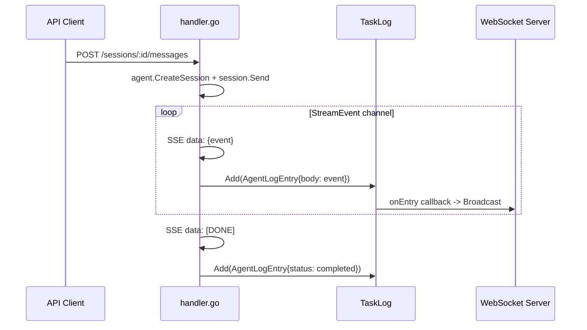

# 008: CodingAgentAPI 完成 -- 残課題修正・コンテナ構成・統合テスト

## 背景 (Background)

[007-CodingAgentAPI.md](file://prompts/phases/000-foundation/branches/feat-llm-backend/ideas/007-CodingAgentAPI.md) に基づくPart1-3の実装が完了したが、仕様書の全要件と照合した結果、以下の課題が特定された ([調査レポート](file://C:/Users/yamya/.gemini/antigravity-ide/brain/c6b559e4-4b8e-4649-b3f8-26719323844f/implementation_gap_analysis.md))。

**レビュー済み設計判断**:
- Terminate APIパスは `/api/v1/sessions/:id/terminate` で確定 (vv4ではエージェント単位だったが、HAGではセッション単位の操作として妥当)
- terminate_test.goの独立ファイル化は不要 (handler_test.go内のTestHandleTerminateAgentで網羅済み)

本仕様は以下の3つの領域を対象とする:

1. **コード品質修正** -- Part1-3で特定された実装不足の修正
2. **Dockerコンテナ構成** -- UC-B/UC-C のコンテナイメージ構築
3. **統合テスト** -- コンテナを使ったエンドツーエンド検証

### 参照ドキュメント

| ドキュメント | 内容 |
|---|---|
| [007-CodingAgentAPI.md](file://prompts/phases/000-foundation/branches/feat-llm-backend/ideas/007-CodingAgentAPI.md) | 元仕様書 |
| [009-Part1](file://prompts/phases/000-foundation/branches/feat-llm-backend/plans/009-CodingAgentAPI-Part1-CoreAbstraction.md) | Part1実装計画 |
| [010-Part2](file://prompts/phases/000-foundation/branches/feat-llm-backend/plans/010-CodingAgentAPI-Part2-Adapters.md) | Part2実装計画 |
| [011-Part3](file://prompts/phases/000-foundation/branches/feat-llm-backend/plans/011-CodingAgentAPI-Part3-AgentService-Integration.md) | Part3実装計画 |
| [vv4 Dockerfile](file://reference_repo/vv4/docker/coding-agent/Dockerfile) | vv4コンテナ参照実装 |

---

## 要件 (Requirements)

### 必須要件

#### C1: TaskLog記録の追加 (R5-5 修正)

- **C1-1**: `agentservice/handler.go` の `streamSSE()` メソッド内で、各 `StreamEvent` を `TaskLog.Add()` で記録する
- **C1-2**: StreamEvent を TaskLog の Entry に変換するアダプタ関数を作成する。`AgentLogEntry` 形式に変換し、セッションIDを関連付ける
- **C1-3**: TaskLog への記録により、WebSocket Server 経由のリアルタイム通知が自動的に機能するようになること
- **C1-4**: `respondJSON()` メソッドでも同様にTaskLog記録を行う

#### C2: SDKSessionID 保存ロジック (R7-4 修正)

- **C2-1**: `streamSSE()` のイベントループ内で `EventSystem` イベントを検出し、`SessionRecord.SDKSessionID` に CLI が返したセッションIDを保存する
- **C2-2**: Claude Code Adapter の場合、`system` イベント (subtype: init) の `session_id` フィールドがSDKSessionIDに該当する
- **C2-3**: SDKSessionID が保存された後、`SessionStore.Update()` で永続化する
- **C2-4**: `GET /api/v1/sessions/:id` のレスポンスに `sdk_session_id` が含まれること

#### C3: HealthResponse への cli_versions 追加 (O7 実装)

- **C3-1**: `HealthResponse` 構造体に `CLIVersions map[string]string` フィールドを追加する
- **C3-2**: 登録済みの各エージェントについて、CLI のバージョンを取得する。`claude --version` / `codex --version` を実行し、出力を解析する
- **C3-3**: CLI が存在しない場合やバージョン取得に失敗した場合は、該当エージェントの値を `"unavailable"` とする
- **C3-4**: バージョン取得は `/health` 呼び出し時ではなく、**Server初期化時に1回だけ**実行しキャッシュする (毎回サブプロセス起動はコスト高)

#### C4: Graceful Shutdown の実装 (R2-3 修正)

- **C4-1**: `claudecode/process.go` と `codex/process.go` の `ProcessManager.Stop()` を改善する
- **C4-2**: 停止シーケンス: SIGTERM 送信 -> 5秒待機 -> 応答なしの場合 SIGKILL (context cancel)
- **C4-3**: Windows環境では SIGTERM が使えないため、`cmd.Process.Kill()` にフォールバックする

#### C5: 仕様書 007 の更新

- **C5-1**: Terminate APIパスを `/api/v1/sessions/:id/terminate` に修正する (レビュー済み設計判断を反映)
- **C5-2**: cli_versions を任意要件(O7)から必須要件に昇格する (C3の実装に伴い)

---

#### C6: Dockerコンテナ構成 (UC-B: All-in-One)

- **C6-1**: `container/all-in-one/Dockerfile` を作成する

```dockerfile
# Multi-stage build
# Stage 1: Go backend build
FROM golang:1.21-bookworm AS go-builder
WORKDIR /build
COPY shared/libs/go/ ./shared/libs/go/
COPY go.work go.work.sum ./
RUN cd shared/libs/go && go build -o /build/bin/hag-server ./examples/standalone

# Stage 2: Runtime
FROM debian:bookworm-slim
RUN apt-get update && apt-get install -y \
    git curl python3 make g++ gosu \
    procps jq file wget ca-certificates \
    && rm -rf /var/lib/apt/lists/*

# Install Node.js (Claude Code CLI requires it)
RUN curl -fsSL https://deb.nodesource.com/setup_22.x | bash - \
    && apt-get install -y nodejs

# Install Claude Code CLI
RUN npm install -g @anthropic-ai/claude-code

# Create non-root user (Claude CLI 2.1.x forbids root)
RUN groupadd -r claude && useradd -r -g claude -m -d /home/claude claude

COPY --from=go-builder /build/bin/hag-server /usr/local/bin/
COPY container/all-in-one/entrypoint.sh /usr/local/bin/
RUN chmod +x /usr/local/bin/entrypoint.sh

RUN mkdir -p /workspace && chown -R claude:claude /workspace /home/claude

ENV CLAUDE_CODE_SKIP_SANDBOX=1
ENV ANTHROPIC_API_KEY="not-needed"
ENV LLM_GATEWAY_URL="http://localhost:14000"
ENV DEFAULT_MODEL=""
ENV AGENT_AUTH_TOKEN=""

EXPOSE 14000 3100
WORKDIR /workspace
ENTRYPOINT ["entrypoint.sh"]
CMD ["hag-server"]
```

- **C6-2**: `container/all-in-one/entrypoint.sh` を作成する

```bash
#!/bin/bash
# Fix volume ownership
chown -R claude:claude /workspace 2>/dev/null || true
# Drop to claude user
exec gosu claude "$@"
```

- **C6-3**: `container/all-in-one/docker-compose.yml` を作成する

```yaml
version: "3.8"
services:
  hag:
    build:
      context: ../..
      dockerfile: container/all-in-one/Dockerfile
    ports:
      - "14000:14000"
      - "3100:3100"
    volumes:
      - workspace:/workspace
    environment:
      - DEFAULT_MODEL=${DEFAULT_MODEL:-}
      - AGENT_AUTH_TOKEN=${AGENT_AUTH_TOKEN:-}
    extra_hosts:
      - "host.docker.internal:host-gateway"
volumes:
  workspace:
```

---

#### C7: Dockerコンテナ構成 (UC-C: Hybrid)

- **C7-1**: `container/hybrid/gateway/Dockerfile` -- LLM Gateway Proxy のみ

```dockerfile
FROM golang:1.21-bookworm AS builder
WORKDIR /build
COPY shared/libs/go/ ./shared/libs/go/
COPY go.work go.work.sum ./
RUN cd shared/libs/go && go build -o /build/bin/hag-gateway ./examples/standalone

FROM debian:bookworm-slim
RUN apt-get update && apt-get install -y ca-certificates && rm -rf /var/lib/apt/lists/*
COPY --from=builder /build/bin/hag-gateway /usr/local/bin/
EXPOSE 14000
CMD ["hag-gateway", "--gateway-only"]
```

- **C7-2**: `container/hybrid/agent/Dockerfile` -- Coding Agent のみ (Gateway外部)

```dockerfile
FROM golang:1.21-bookworm AS go-builder
WORKDIR /build
COPY shared/libs/go/ ./shared/libs/go/
COPY go.work go.work.sum ./
RUN cd shared/libs/go && go build -o /build/bin/hag-agent ./examples/standalone

FROM debian:bookworm-slim
RUN apt-get update && apt-get install -y \
    git curl python3 gosu procps ca-certificates \
    && rm -rf /var/lib/apt/lists/*
RUN curl -fsSL https://deb.nodesource.com/setup_22.x | bash - \
    && apt-get install -y nodejs
RUN npm install -g @anthropic-ai/claude-code

RUN groupadd -r claude && useradd -r -g claude -m -d /home/claude claude
COPY --from=go-builder /build/bin/hag-agent /usr/local/bin/
COPY container/hybrid/agent/entrypoint.sh /usr/local/bin/
RUN chmod +x /usr/local/bin/entrypoint.sh

RUN mkdir -p /workspace && chown -R claude:claude /workspace /home/claude

ENV CLAUDE_CODE_SKIP_SANDBOX=1
ENV LLM_GATEWAY_URL=""
ENV AGENT_AUTH_TOKEN=""

EXPOSE 3100
WORKDIR /workspace
ENTRYPOINT ["entrypoint.sh"]
CMD ["hag-agent", "--agent-only"]
```

- **C7-3**: `container/hybrid/docker-compose.yml` -- Gateway + Agent 統合構成

```yaml
version: "3.8"
services:
  gateway:
    build:
      context: ../..
      dockerfile: container/hybrid/gateway/Dockerfile
    ports:
      - "14000:14000"
  agent:
    build:
      context: ../..
      dockerfile: container/hybrid/agent/Dockerfile
    ports:
      - "3100:3100"
    environment:
      - LLM_GATEWAY_URL=http://gateway:14000
      - AGENT_AUTH_TOKEN=${AGENT_AUTH_TOKEN:-}
    volumes:
      - workspace:/workspace
    depends_on:
      - gateway
    extra_hosts:
      - "host.docker.internal:host-gateway"
volumes:
  workspace:
```

---

#### C8: 統合テスト

- **C8-1**: `tests/common/agentservice_test.go` に AgentService の統合テストを作成する

テストシナリオ:
1. `TestAgentServiceHealthCheck` -- ヘルスチェックエンドポイントの正常応答確認 (cli_versions含む)
2. `TestAgentServiceSessionLifecycle` -- セッション作成 -> 取得 -> 終了 -> 削除の一連フロー
3. `TestAgentServiceSSEStreaming` -- SSEストリーミングの形式と[DONE]マーカー確認 (mockエージェント使用)
4. `TestAgentServiceTaskLogIntegration` -- ストリーミング中にTaskLogにイベントが記録されること
5. `TestAgentServiceLogStreamSSE` -- /logs エンドポイントでスナップショットとリアルタイム配信
6. `TestAgentServiceSDKSessionID` -- SDKSessionIDがセッション完了後に保存されていること

- **C8-2**: コンテナ統合テストスクリプト `scripts/test/container_test.sh` を作成する

```bash
#!/bin/bash
# container_test.sh -- Docker統合テスト
# Usage: ./scripts/test/container_test.sh [all-in-one|hybrid]

# 1. docker-compose build
# 2. docker-compose up -d
# 3. ヘルスチェック待機 (最大30秒)
# 4. curl -s http://localhost:3100/health でステータス確認
# 5. curl -s -X POST http://localhost:3100/api/v1/sessions でセッション作成
# 6. docker-compose down
```

- **C8-3**: コンテナ統合テストはCI/CDではなく手動実行を前提とする (Docker環境依存のため)。ただし、将来的にCI統合可能な構造にする

---

### 任意要件

- **OC1**: Bearer認証ミドルウェア (`/health`以外のエンドポイント) -- 将来フェーズ
- **OC2**: フォールバックツール実行層 (R9-3) -- Adapter統合テストで検証後に実装

---

## 実現方針 (Implementation Approach)

### パッケージ変更一覧

```
shared/libs/go/
    agentservice/
        handler.go         -- [MODIFY] TaskLog記録 + SDKSessionID保存追加
        health.go          -- [MODIFY] CLIVersions追加
        service.go         -- [MODIFY] CLI版バージョンキャッシュ
    codingagent/
        claudecode/
            process.go     -- [MODIFY] Graceful Shutdown (SIGTERM -> SIGKILL)
        codex/
            process.go     -- [MODIFY] Graceful Shutdown

container/
    all-in-one/            -- [NEW] UC-Bコンテナ構成
        Dockerfile
        entrypoint.sh
        docker-compose.yml
    hybrid/                -- [NEW] UC-Cコンテナ構成
        gateway/
            Dockerfile
        agent/
            Dockerfile
            entrypoint.sh
        docker-compose.yml

tests/common/
    agentservice_test.go   -- [NEW] 統合テスト

scripts/test/
    container_test.sh      -- [NEW] コンテナ統合テストスクリプト

prompts/.../ideas/
    007-CodingAgentAPI.md  -- [MODIFY] Terminate APIパス修正、O7昇格
```

### TaskLog記録のアーキテクチャ



### Graceful Shutdown シーケンス

```
Stop() called
  |
  v
Send SIGTERM to process
  |
  v
Wait 5 seconds (with select/timer)
  |
  +-- Process exited -> return
  |
  +-- Timeout -> cancel context (SIGKILL)
       |
       v
       cmd.Wait() -> return
```

---

## 検証シナリオ (Verification Scenarios)

### シナリオ1: TaskLog記録の検証

1. `AgentService.New()` でサーバを作成し、mockエージェントを登録する
2. `POST /api/v1/sessions` でセッション作成
3. `POST /api/v1/sessions/:id/messages` (Accept: text/event-stream) でメッセージ送信
4. SSEレスポンスの各イベントが、TaskLog.Entries() に記録されていること
5. TaskLogの `onEntry` コールバックが呼ばれ、WebSocket通知が可能な状態であること

### シナリオ2: SDKSessionID保存の検証

1. mockエージェントが `EventSystem` イベント (SessionID: "sdk-abc-123") を返すように設定
2. `POST /api/v1/sessions/:id/messages` でストリーミング完了
3. `GET /api/v1/sessions/:id` で取得し、`sdk_session_id` が "sdk-abc-123" であること

### シナリオ3: HealthCheckのCLIバージョン

1. Server初期化時にCLIバージョンが取得されること (または "unavailable")
2. `GET /health` のレスポンスに `cli_versions` フィールドが含まれること
3. CLIが存在しない環境でも `"unavailable"` が返りエラーにならないこと

### シナリオ4: Graceful Shutdown

1. ProcessManager.Stop() を呼び出す
2. プロセスが5秒以内に自発的に終了した場合、SIGKILLは送信されないこと
3. プロセスが5秒以内に終了しない場合、強制終了されること

### シナリオ5: All-in-Oneコンテナ (UC-B)

1. `container/all-in-one/` でDockerイメージをビルドする
2. `docker-compose up -d` でコンテナを起動する
3. `curl http://localhost:3100/health` でステータス200 + agents/cli_versions/gateway情報を確認
4. `docker-compose down` でgracefulに停止する

### シナリオ6: ハイブリッドコンテナ (UC-C)

1. `container/hybrid/` で `docker-compose up -d` を実行
2. Gatewayコンテナが `:14000` で起動していること
3. Agentコンテナが `:3100` で起動し、GatewayのURLに接続できていること
4. `curl http://localhost:3100/health` でgateway.status が "ok" であること
5. `docker-compose down` で全コンテナが停止すること

---

## テスト項目 (Testing for the Requirements)

### ビルド・全体検証

1. ビルド+単体テスト:
   ```
   scripts/process/build.sh
   ```

2. AgentService統合テスト (C1-C4の検証):
   ```
   scripts/process/integration_test.sh --categories "common" --specify "AgentService|Health|Session|TaskLog|SDKSession"
   ```

### 単体テスト計画

| テスト対象 | テストファイル | 確認内容 |
|---|---|---|
| TaskLog記録 | `agentservice/handler_test.go` | streamSSE/respondJSON でTaskLog.Add()が呼ばれること |
| SDKSessionID保存 | `agentservice/handler_test.go` | EventSystemからsdk_session_idが抽出・保存されること |
| CLIバージョン取得 | `agentservice/health_test.go` | cli_versionsフィールドがレスポンスに含まれること |
| Graceful Shutdown | `claudecode/process_test.go` | SIGTERM -> タイムアウト -> SIGKILLのシーケンス |
| Graceful Shutdown | `codex/process_test.go` | 同上 |

### コンテナ統合テスト

| ユースケース | テスト方法 | 確認内容 |
|---|---|---|
| UC-B: All-in-One | `scripts/test/container_test.sh all-in-one` | ビルド、起動、ヘルスチェック、停止 |
| UC-C: Hybrid | `scripts/test/container_test.sh hybrid` | Gateway/Agent分離、コンテナ間通信 |

---

## 変更履歴

| 日付 | 変更内容 |
|------|---------| 
| 2026-06-05 | 初版作成 |
