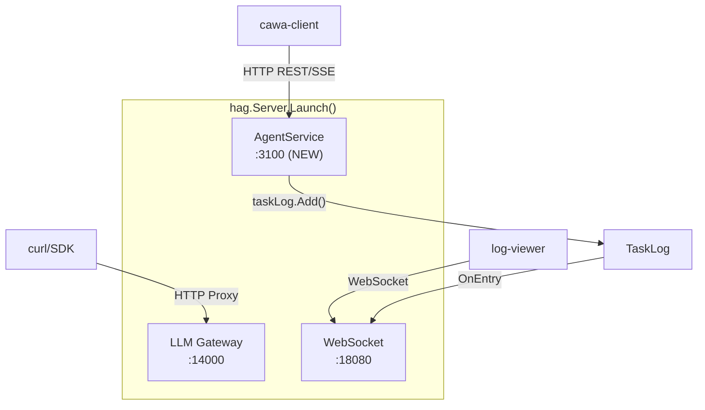

# 010-AgentService-HTTPListener

## 背景 (Background)

AgentService (Coding Agent Web API) の HTTP ハンドラは `agentservice.Server.HTTPHandler()` として実装済みだが、`hag.Server.Launch()` からは起動されておらず、実際にはどのポートでもリッスンしていない。

README にはポート 3100 が記載されているが、standalone バイナリを起動しても AgentService の API エンドポイントには接続できない。cawa-client も含め、外部クライアントが AgentService と通信する手段がない。

### 現状の Launch() の起動コンポーネント

| コンポーネント | ポート | 起動 |
|--------------|--------|------|
| LLM Gateway Proxy | 14000 (config) | 起動済み |
| WebSocket (ログ) | 18080 (config) | 起動済み |
| AgentService | 未定 | **未起動** |

### 依存関係

- AgentService は `tasklog.TaskLog` を通じて WebSocket サーバとログデータを共有している (同一インスタンス)
- AgentService は Coding Agent アダプタ (claudecode/codex) を `RegisterAgent()` で登録し、CLI プロセスを管理する
- `cawa-client` はデフォルトで `http://localhost:3100` に接続する
- Docker コンテナ構成 (`container/all-in-one`, `container/hybrid`) は 3100 を EXPOSE している

## 要件 (Requirements)

### R1: AgentService HTTP リスナーの起動 (必須)

- `hag.Server.Launch()` 内で AgentService の HTTP サーバを起動し、設定されたポートでリッスンする
- `hag.Server.Shutdown()` 内で AgentService の HTTP サーバをグレースフルにシャットダウンする
- 起動・シャットダウンの順序は以下:
  - 起動: Gateway -> WebSocket -> AgentService
  - シャットダウン: AgentService -> WebSocket -> Gateway (逆順)

### R2: config.yaml での AgentService ポート設定 (必須)

- `config.AppConfig` に `AgentService` セクションを追加する
- `agent_service.port` で AgentService の HTTP リッスンポートを設定可能にする
- デフォルトポートは `3100`
- ポートが `0` の場合は OS が割り当てるエフェメラルポートを使用する

```yaml
# config.yaml に追加される設定
agent_service:
  port: 3100    # AgentService HTTP リッスンポート (デフォルト: 3100)
```

### R3: Coding Agent の登録 (必須)

- standalone バイナリ (examples/standalone) で Claude Code エージェントを自動登録する
- Claude Code CLI (`claude`) がシステムに存在する場合のみ登録する (存在しない場合はスキップし、ログで警告する)
- AgentService の `/health` エンドポイントで登録済みエージェント一覧と CLI バージョンが確認できる

### R4: standalone での動作確認 (必須)

- standalone バイナリを起動し、cawa-client で以下の操作が正常に動作すること:
  - `cawa-client health` -- ヘルスチェックが 200 OK で返る
  - `cawa-client agents` -- 登録エージェント一覧が返る
  - `cawa-client run` -- セッション作成 + メッセージ送信 (SSE) が動作する (Claude Code CLI がある場合)

## 実現方針 (Implementation Approach)

### コンポーネント構成



### 変更対象ファイル

1. **config/config.go**: `AgentServiceConfig` 構造体の追加
2. **hag/server.go**: `Launch()` と `Shutdown()` に AgentService HTTP サーバの起動/停止を追加
3. **examples/standalone/main.go**: Claude Code エージェントの自動登録
4. **examples/standalone/config.yaml**: `agent_service.port: 3100` の追加

### 設計上の決定事項

- AgentService は独立した HTTP サーバとして起動する (LLM Gateway と同じポートにはマウントしない)
- AgentService の HTTP サーバは `agentservice.Server` 内に新しい `Launch(ctx, port)` / `Shutdown(ctx)` メソッドとして追加する (外部から `http.ListenAndServe` を呼ばなくてよい設計)
- ポート番号は config.yaml で設定可能にし、デフォルト値 3100 は `config.AppConfig` のゼロ値ではなく、`hag.Server` 内のフォールバックとして定義する

## 検証シナリオ (Verification Scenarios)

### シナリオ 1: standalone 起動でポート 3100 がリッスンする

1. `./bin/standalone -config examples/standalone/config.yaml` で起動
2. 起動ログに `AgentService started on :3100` が表示される
3. `curl http://localhost:3100/health` が 200 OK を返す
4. レスポンスに `"status": "ok"` と `"agents"` フィールドが含まれる

### シナリオ 2: cawa-client で health/agents が動作する

1. standalone を起動
2. `./bin/cawa-client health` が正常なレスポンスを表示
3. `./bin/cawa-client agents` がエージェント一覧を表示 (Claude Code CLI がない場合は空リスト)

### シナリオ 3: Ctrl+C で全サーバがグレースフルにシャットダウンする

1. standalone を起動
2. Ctrl+C (SIGINT) を送信
3. AgentService, WebSocket, Gateway がすべて正常に停止
4. エラーなしでプロセスが終了

### シナリオ 4: config でポート番号を変更できる

1. config.yaml の `agent_service.port` を `4000` に変更
2. standalone を起動
3. `:4000` でリッスンし、`:3100` ではリッスンしない

## テスト項目 (Testing for the Requirements)

### ビルド・全体検証

1. ビルド + 単体テスト:

```bash
scripts/process/build.sh
```

2. AgentService 統合テスト (既存テストのリグレッション確認):

```bash
scripts/process/integration_test.sh --specify "AgentService"
```

### テスト対応表

| 要件 | テスト方法 |
|------|-----------|
| R1: HTTP リスナー起動 | `build.sh` (コンパイル確認) + 統合テスト |
| R2: config ポート設定 | 統合テスト (config からポート読み取り確認) |
| R3: エージェント登録 | 統合テスト (HealthCheck でエージェント一覧確認) |
| R4: standalone 動作 | 手動確認 (standalone + cawa-client) -- ただし CI では Claude Code CLI がないため自動化困難 |

### 新規テスト

- `TestAgentServiceLaunchShutdown`: AgentService の `Launch` / `Shutdown` メソッドの正常動作を確認 (エフェメラルポート使用)
- `TestAgentServiceConfigPort`: config から AgentService ポートが正しく読み取られることを確認
