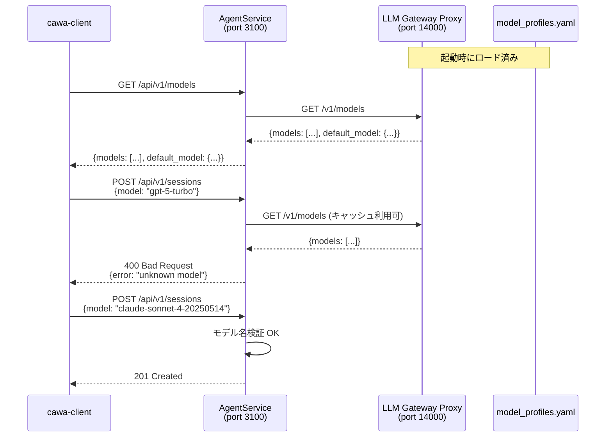

# 014: Model Profiles API とモデル指定バリデーション

## 背景 (Background)

### 現状の問題

前回の調査 (afe40f00 会話) で、`--model` フラグの値が `model_profiles.yaml` に定義されたモデル名であるかのバリデーションが一切行われていないことが判明した。

現在の問題点:
1. **バリデーション欠如**: セッション作成時に任意の文字列を model に指定でき、エラーは Claude CLI が LLM API にリクエストを送る段階で初めて発覚する (遅延検出)
2. **DefaultModel のハードコード**: `standalone/main.go` で `"claude-sonnet-4-20250514"` がハードコードされており、`model_profiles.yaml` の `default_profile` 設定と連携していない
3. **モデル名の不透明性**: クライアントが利用可能なモデル一覧を事前に知る手段がない (AgentService 経由では)

### 既存の基盤

調査の結果、以下の基盤が既に整っていることが分かった:

- **LLM Gateway Proxy に `GET /v1/models` エンドポイントが既存** ([proxy.go L140](file:///shared/libs/go/llmgateway/proxy.go#L140))
- **`LLMGatewayBackend` インターフェースに `ListModels()` メソッドが既存** ([backend.go L16](file:///shared/libs/go/llmgateway/backend.go#L16))
- **`ModelRouter.ResolveModel()` がモデル名解決ロジックを実装済み** ([routing.go L41](file:///shared/libs/go/llmgateway/routing.go#L41))
- **`DefaultProfileConfig` 構造体は定義済みだが、実際の YAML で `default_profile` は未設定** ([model_profiles.go L17-L21](file:///shared/libs/go/config/model_profiles.go#L17-L21))
- **AgentService は `gatewayURL` を保持し、Gateway への HTTP 問い合わせを health check で実施済み** ([health.go L60-L90](file:///shared/libs/go/agentservice/health.go#L60-L90))

## 要件 (Requirements)

### 必須要件

#### R1: LLM Gateway Proxy にモデル情報 API を拡張する

既存の `GET /v1/models` を拡張し、以下の情報を返すようにする:

- **モデル一覧**: プロバイダー別のモデル名リスト (既存機能の拡張)
- **デフォルトモデル**: `model_profiles.yaml` の `default_profile` から取得したデフォルトモデル情報

レスポンス例:
```json
{
  "models": [
    {"provider": "anthropic", "model": "claude-sonnet-4-20250514"},
    {"provider": "openai", "model": "gpt-4o"},
    {"provider": "openai", "model": "gpt-4o-mini"},
    {"provider": "openai", "model": "gpt-4.1-mini"},
    {"provider": "google", "model": "gemini-2.5-flash"}
  ],
  "default_model": {
    "provider": "anthropic",
    "model": "claude-sonnet-4-20250514"
  }
}
```

#### R2: AgentService にモデル一覧 API を追加する

AgentService (CAWA) に `GET /api/v1/models` エンドポイントを追加する。
このエンドポイントは内部的に LLM Gateway Proxy の `GET /v1/models` を呼び出し、
結果をクライアントに返す。

これにより、cawa-client やフロントエンドは AgentService の単一ポート経由で
モデル情報を取得できる。

#### R3: セッション作成時のモデルバリデーション

`handleCreateSession` (POST `/api/v1/sessions`) で、指定された `model` が
利用可能なモデル一覧に含まれるかを検証する。

- model が空の場合: デフォルトモデルにフォールバック (現行動作を維持しつつ、デフォルトの取得元を変更)
- model が指定されたが一覧に存在しない場合: `400 Bad Request` を返す
- model が指定されて一覧に存在する場合: そのまま使用 (現行動作)

エラーレスポンス例:
```json
{
  "error": "unknown model: gpt-5-turbo",
  "available_models": ["claude-sonnet-4-20250514", "gpt-4o", "gpt-4o-mini", "gpt-4.1-mini", "gemini-2.5-flash"]
}
```

#### R4: DefaultModel のハードコード排除

`standalone/main.go` の `DefaultModel: "claude-sonnet-4-20250514"` を排除し、
以下のいずれかから動的に取得する:

1. **model_profiles.yaml の `default_profile`** (推奨): `default_profile.model` を使用
2. **LLM Gateway API 経由**: `GET /v1/models` のレスポンスから `default_model` を取得

#### R5: model_profiles.yaml に default_profile を追加する

既存の `model_profiles.yaml` に `default_profile` セクションを追加する。
`DefaultProfileConfig` 構造体は既に定義済みだが、実際の YAML では未設定。

```yaml
default_profile:
  provider: anthropic
  model: claude-sonnet-4-20250514

providers:
  openai:
    keys:
      - name: default
        value: vault://providers/openai/default
        models:
          - name: gpt-4o
          - name: gpt-4o-mini
          - name: gpt-4.1-mini
  anthropic:
    keys:
      - name: default
        value: vault://providers/anthropic/default
        models:
          - name: claude-sonnet-4-20250514
  google:
    keys:
      - name: default
        value: vault://providers/google/default
        models:
          - name: gemini-2.5-flash
```

#### R6: cawa-client に models サブコマンドを追加する

```bash
./bin/cawa-client models
```

出力例:
```
Available models:
  anthropic:
    * claude-sonnet-4-20250514 (default)
  openai:
    - gpt-4o
    - gpt-4o-mini
    - gpt-4.1-mini
  google:
    - gemini-2.5-flash
```

### 任意要件 (将来検討)

#### O1: 論理名 (エイリアス) から具体的モデル名への Resolve

`model_profiles.yaml` で論理名 (エイリアス) を定義し、具体的なモデル名に解決する機能。
本仕様のスコープ外とし、将来の拡張として記録する。

例:
```yaml
aliases:
  fast: gpt-4o-mini
  smart: claude-sonnet-4-20250514
  cheap: gemini-2.5-flash
```

```bash
./bin/cawa-client run --agent claudecode --model smart --prompt "Hello"
# "smart" -> "claude-sonnet-4-20250514" に解決される
```

## 実現方針 (Implementation Approach)

### アーキテクチャ概要



### 変更対象

#### レイヤー 1: LLM Gateway Proxy (model_profiles の情報源)

1. **`GET /v1/models` レスポンスの拡張**: `default_model` フィールドを追加
2. **`LLMGatewayBackend` インターフェース**: `DefaultModel() *ModelInfo` メソッドを追加
3. **`ProxyServer.ListModels()`**: 既存のまま (変更不要)
4. **`BifrostDriver`**: `DefaultModel()` を実装
5. **`StubGateway`**: `DefaultModel()` を実装

#### レイヤー 2: AgentService (バリデーション + API 転送)

1. **`GET /api/v1/models` エンドポイント追加**: Gateway の `/v1/models` を呼び出して結果を返す
2. **`handleCreateSession` のバリデーション追加**: model 指定時に Gateway からモデル一覧を取得して検証
3. **モデル一覧のキャッシュ** (任意): 毎回 Gateway に問い合わせるのではなく、起動時に取得してキャッシュ (ReloadModelProfiles 時に更新)

#### レイヤー 3: standalone / エントリポイント

1. **`DefaultModel` のハードコード排除**: Gateway 起動後に `DefaultModel()` を呼び出して取得
2. **`model_profiles.yaml` に `default_profile` セクション追加**

#### レイヤー 4: cawa-client

1. **`models` サブコマンド追加**: `GET /api/v1/models` を呼び出して表示

### 設計上の考慮点

#### LLMGP を唯一の情報源 (Single Source of Truth) とする設計の妥当性

この設計は適切である。理由:

1. **責務の明確化**: model_profiles.yaml は LLMGP が管理するリソースであり、モデル情報の問い合わせ先として LLMGP が適切
2. **DRY 原則**: モデル情報を複数箇所で保持しない。AgentService は LLMGP に問い合わせるだけ
3. **既存基盤の活用**: `ListModels()`, `GET /v1/models`, `ModelRouter.ResolveModel()` が既に実装されている
4. **動的更新対応**: `ReloadModelProfiles()` によるランタイム更新に自動対応

#### 懸念点と対策

| 懸念 | 対策 |
|------|------|
| LLMGP が未起動の場合の動作 | health check と同様にタイムアウト付きでリクエストし、失敗時はバリデーションをスキップ (フェイルオープン) |
| 毎回の HTTP 問い合わせのオーバーヘッド | AgentService 起動時にモデル一覧をキャッシュし、ReloadModelProfiles 時に更新。TTL キャッシュも検討 |
| in-process 構成 (Gateway と AgentService が同一プロセス) | `gatewayURL` が空の場合は `hag.Server` 経由で直接 `ListModels()` を呼び出す経路も用意 |

## 検証シナリオ (Verification Scenarios)

### シナリオ 1: モデル一覧 API の動作確認

1. HAG サーバを起動する (`./bin/standalone -config examples/standalone/config.yaml`)
2. `GET /api/v1/models` を呼び出す
3. レスポンスに `model_profiles.yaml` に定義された全モデルが含まれることを確認
4. `default_model` フィールドが `default_profile` の値と一致することを確認

### シナリオ 2: 有効なモデル指定でのセッション作成

1. HAG サーバを起動する
2. `POST /api/v1/sessions` で `model_profiles.yaml` に存在するモデル名を指定
3. 201 Created が返ることを確認

### シナリオ 3: 無効なモデル指定でのセッション作成 (バリデーション)

1. HAG サーバを起動する
2. `POST /api/v1/sessions` で `model_profiles.yaml` に存在しないモデル名 (例: `gpt-5-turbo`) を指定
3. 400 Bad Request が返ることを確認
4. レスポンスに利用可能なモデル一覧が含まれることを確認

### シナリオ 4: モデル未指定でのデフォルトフォールバック

1. HAG サーバを起動する
2. `POST /api/v1/sessions` で model を省略
3. セッションが作成され、デフォルトモデル (`default_profile.model`) が使用されることを確認

### シナリオ 5: cawa-client models コマンド

1. HAG サーバを起動する
2. `./bin/cawa-client models` を実行
3. プロバイダー別のモデル一覧が表示されることを確認
4. デフォルトモデルに `(default)` マークが付くことを確認

### シナリオ 6: DefaultModel ハードコード排除の確認

1. `model_profiles.yaml` の `default_profile.model` を `gpt-4o` に変更
2. HAG サーバを起動する
3. model 未指定でセッションを作成
4. `gpt-4o` がデフォルトモデルとして使用されることを確認

## テスト項目 (Testing for the Requirements)

### ビルド・全体検証

1. ビルド + 単体テスト:
   ```bash
   scripts/process/build.sh
   ```

2. LLM 関連の統合テスト:
   ```bash
   scripts/process/integration_test.sh --categories "llm"
   ```

3. 共通機能のリグレッション確認:
   ```bash
   scripts/process/integration_test.sh --categories "common"
   ```

### 単体テスト (新規追加分)

| 要件 | テスト内容 | テスト配置 |
|------|-----------|-----------|
| R1 | `GET /v1/models` に `default_model` が含まれる | `llmgateway/proxy_test.go` |
| R1 | `DefaultModel()` メソッドが `default_profile` から正しい値を返す | `llmgateway/bifrost_driver_test.go` |
| R2 | `GET /api/v1/models` が Gateway の結果を返す | `agentservice/handler_test.go` |
| R3 | 有効なモデルでセッション作成 200 | `agentservice/handler_test.go` |
| R3 | 無効なモデルでセッション作成 400 | `agentservice/handler_test.go` |
| R3 | モデル未指定でデフォルトにフォールバック | `agentservice/handler_test.go` |
| R5 | `default_profile` 付き YAML の読み込み/バリデーション | `config/loader_test.go` |

### E2E テスト (既存テストの更新)

| テスト | 更新内容 |
|--------|---------|
| `TestE2E_StandaloneHealth` | models API の疎通確認を追加 |
| `TestE2E_CodingAgentStreaming` | 有効なモデル指定の確認 (既存動作の維持) |
| `TestE2E_CodingAgentDefaultModel` | DefaultModel がハードコードでなく YAML から取得されることの確認 |
