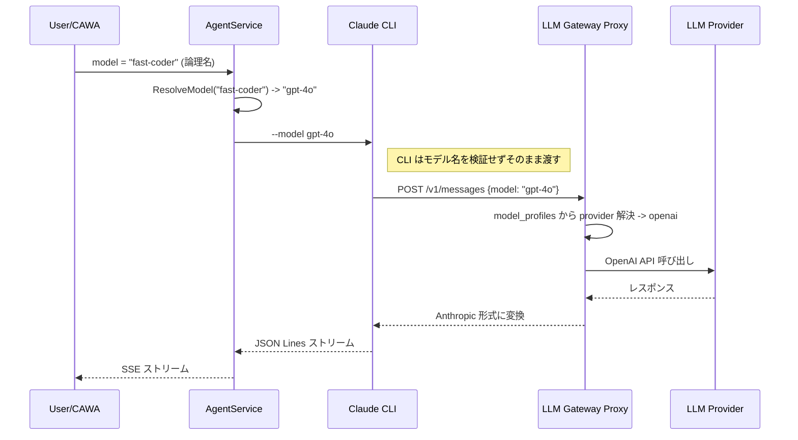

# 015: クロスプロバイダ対応 -- SupportedProviders 撤回と論理名ベースのモデル管理

## 背景 (Background)

### 現在の問題

1. **SupportedProviders 制限**: 現在の `CodingAgent` インターフェースには `SupportedProviders()` メソッドがあり、`ClaudeCodeAdapter` は `["anthropic"]` のみを返す。これにより `AgentService` の `IsValidModelForAgent()` が非 Anthropic モデルを拒否する。しかし実際には Gateway 経由で任意のプロバイダに転送可能。

2. **model_profiles.yaml の論理名不在**: 現在の `model_profiles.yaml` はプロバイダ別にモデルを列挙しているが、ユーザが指定する「論理名」(例: `fast-coder`) から実際の `provider/model_id` を逆引きする仕組みがない。

### 調査で判明した事実

Claude CLI v2.1.169 の実証テストにより、以下が確認された:

- **CLI はモデル名のクライアントサイド検証を行わない**: `--model gpt-4o` や `--model totally-fake-model-xyz` のような任意のモデル名を受け入れ、そのまま `POST /v1/messages` の `model` フィールドに含めて API リクエストを送信する
- **検証は API サーバー側で行われる**: `ANTHROPIC_BASE_URL` がカスタム Gateway を指している場合、モデル名はそのまま Gateway に到達する。Gateway 側でルーティング・検証を行えばよい
- **`CLAUDE_CODE_ENABLE_GATEWAY_MODEL_DISCOVERY` は不要**: CLI がモデル名を検証しないため、Gateway からモデルリストを取得する機能は必要ない

> [!NOTE]
> この事実は vv4 で非 Anthropic モデル (gpt-4o 等) が動作していた理由を説明する: CLI がモデル名 (`openai/gpt-4o`) をそのまま Gateway に渡し、Gateway の `splitProviderModel` が provider と model_id を分離してルーティングしていた。

### 解決方針

1. `AgentService` 内部の `SupportedProviders` による制限を撤回する
2. `model_profiles.yaml` に論理名を追加し、逆引き解決を実装する
3. CLI にはモデル名をそのまま渡す (追加の環境変数は不要)

## 要件 (Requirements)

### 必須要件

#### R1: `SupportedProviders()` 制限の撤回

`CodingAgent` インターフェースから `SupportedProviders()` メソッドを削除し、`IsValidModelForAgent()` と `AvailableModelNamesForAgent()` のプロバイダフィルタリングを撤回する。全エージェントは `model_profiles.yaml` に定義されたすべてのモデルを使用可能とする。

対象ファイル:
- [interface.go](file:///c:/Users/yamya/myprog/Headless-Agent-Gateway/work/feat-llm-backend/shared/libs/go/codingagent/interface.go) -- `SupportedProviders()` 削除
- [adapter.go (claudecode)](file:///c:/Users/yamya/myprog/Headless-Agent-Gateway/work/feat-llm-backend/shared/libs/go/codingagent/claudecode/adapter.go) -- 実装削除
- [adapter.go (codex)](file:///c:/Users/yamya/myprog/Headless-Agent-Gateway/work/feat-llm-backend/shared/libs/go/codingagent/codex/adapter.go) -- 実装削除
- [service.go](file:///c:/Users/yamya/myprog/Headless-Agent-Gateway/work/feat-llm-backend/shared/libs/go/agentservice/service.go) -- `IsValidModelForAgent()` / `AvailableModelNamesForAgent()` を簡素化

#### R2: model_profiles.yaml に論理名 (logical_name) を追加

`model_profiles.yaml` の各モデル定義に `logical_name` フィールドを追加する。ユーザはこの論理名で `model_profiles.yaml` 上のモデルを検索できる。`logical_name` が省略された場合は `name` (model_id) がそのまま使われる。

```yaml
providers:
  openai:
    keys:
      - name: default
        value: vault://providers/openai/default
        models:
          - name: gpt-4o
            logical_name: fast-coder      # 論理名 (任意)
          - name: gpt-4o-mini
          - name: gpt-4.1-mini
  anthropic:
    keys:
      - name: default
        value: vault://providers/anthropic/default
        models:
          - name: claude-sonnet-4-20250514
            logical_name: balanced-coder   # 論理名 (任意)
```

#### R3: 論理名からの逆引き解決

`AgentService` または `LLM Gateway` に論理名からプロバイダ + モデル ID を逆引きする関数を追加する。セッション作成時にユーザが `model=fast-coder` と指定した場合、`{provider: "openai", model_id: "gpt-4o"}` に解決される。

- 論理名でも model_id (実名) でもマッチ可能にする
- 重複する論理名がある場合はエラー (起動時バリデーション)

#### R4: モデル名パススルーの統合テスト

Claude Code が `--model` で受け取ったモデル名を LLM Gateway Proxy (LLMGP) にそのまま渡すことを検証する統合テストを作成する。

テスト概要:
1. テスト用のモック LLMGP サーバーを起動し、受信した `POST /v1/messages` リクエストの `model` フィールドを記録する
2. AgentService + Claude CLI 経由で非 Anthropic モデル名 (例: `gpt-4o`) を指定してセッションを実行
3. モック LLMGP が受信したリクエストの `model` フィールドが指定したモデル名と一致することを検証

対象ファイル: `tests/agentservice_integration_test.go` に追加

> [!NOTE]
> このテストは Claude CLI の実バイナリ (`claude`) がインストールされている環境でのみ実行可能。CI 環境では `claude` が利用できない場合はスキップする (`t.Skip`)。

### 任意要件

#### R5: `cawa-client` の models コマンドで論理名を表示

`cawa-client models` コマンドの出力に論理名も表示する。

```
Available models:
  fast-coder        -> openai/gpt-4o
  balanced-coder    -> anthropic/claude-sonnet-4-20250514
  gpt-4o-mini       -> openai/gpt-4o-mini  (logical_name なし)
  gemini-2.5-flash  -> google/gemini-2.5-flash  (logical_name なし)
```

## 実現方針 (Implementation Approach)

### 変更の全体像



> [!NOTE]
> CLI はモデル名を検証しないため、`CLAUDE_CODE_ENABLE_GATEWAY_MODEL_DISCOVERY` 環境変数や `/v1/models` の OpenAI 互換化は不要。

### コンポーネント別変更

#### 1. CodingAgent インターフェース (`codingagent/interface.go`)

- `SupportedProviders()` メソッドを削除
- 各アダプター (`claudecode/adapter.go`, `codex/adapter.go`) の実装も削除

#### 2. AgentService (`agentservice/service.go`)

- `IsValidModelForAgent()` -> `IsValidModel()` に簡素化 (プロバイダフィルタ不要)
- `AvailableModelNamesForAgent()` -> `AvailableModelNames()` に統合
- `ResolveModel()` 関数を追加: 論理名 -> model_id の解決

#### 3. Config (`config/model_profiles.go`)

- `ModelEntry` 構造体に `LogicalName` フィールドを追加
- YAML パーサが `logical_name` を読み取るように対応

## 検証シナリオ (Verification Scenarios)

### シナリオ 1: 非 Anthropic モデルの利用

1. `model_profiles.yaml` に `openai/gpt-4o` を定義
2. `cawa-client run -a claudecode -m gpt-4o` を実行
3. `AgentService` が `gpt-4o` を model_profiles から検索し valid と判定 (SupportedProviders フィルタなし)
4. Claude CLI に `--model gpt-4o` が渡される
5. CLI はモデル名を検証せず `POST /v1/messages {model: "gpt-4o"}` を Gateway に送信
6. Gateway が openai プロバイダにルーティングし、レスポンスが正常にストリーミングされる

### シナリオ 2: 論理名によるモデル指定

1. `model_profiles.yaml` で `gpt-4o` に `logical_name: fast-coder` を設定
2. `cawa-client run -a claudecode -m fast-coder` を実行
3. `AgentService` が `fast-coder` を `gpt-4o` に解決
4. Claude CLI に `--model gpt-4o` が渡される
5. 以降はシナリオ 1 と同じ

### シナリオ 3: model_id (実名) によるモデル指定

1. `cawa-client run -a claudecode -m gpt-4o` を実行 (論理名ではなく実名)
2. `AgentService` が `gpt-4o` を model_profiles から直接検索
3. Claude CLI に `--model gpt-4o` が渡される
4. 正常動作

### シナリオ 4: models コマンドの表示

1. `cawa-client models` を実行
2. 全モデルが論理名付きで表示される (`SupportedProviders` によるフィルタリングなし)

### シナリオ 5: モデル名パススルーの統合テスト

1. テスト用のモック LLMGP サーバーを `httptest.NewServer` で起動
   - `POST /v1/messages` を受け付け、リクエストボディの `model` フィールドを記録
   - Anthropic Messages API 互換のレスポンスを返す (最小限の `assistant` メッセージ)
2. `ClaudeCodeAdapter` を `GatewayURL = モック LLMGP のURL` で構成
3. `CreateSession` で `model = "gpt-4o"` を指定してセッションを作成
4. プロンプトを送信し、Claude CLI がモック LLMGP に `POST /v1/messages` を送信するのを待つ
5. モック LLMGP が受信したリクエストの `model` フィールドが `"gpt-4o"` であることを検証
6. 同様に `model = "totally-custom-model"` でも試し、任意のモデル名がパススルーされることを確認

## テスト項目 (Testing for the Requirements)

### 単体テスト

| 要件 | テスト対象 | 検証内容 |
|------|-----------|---------|
| R1 | `agentservice/handler_test.go` | `IsValidModel()` がプロバイダに関係なく profiles 内モデルを valid と判定 |
| R2 | `config/model_profiles_test.go` | `logical_name` が正しくパースされること |
| R3 | `agentservice/service_test.go` | `ResolveModel("fast-coder")` が `"gpt-4o"` を返すこと |

### 統合テスト

| 要件 | テスト対象 | 検証内容 |
|------|-----------|---------|
| R4 | `tests/agentservice_integration_test.go` | Claude CLI 経由で非 Anthropic モデル名を指定した際、LLMGP に到達するリクエストの `model` フィールドが一致すること |

### ビルド・全体検証

1. ビルド + 単体テスト:
   ```
   scripts/process/build.sh
   ```

2. バックエンド統合テスト (LLM Gateway 関連):
   ```
   scripts/process/integration_test.sh --categories "llm"
   ```

3. 共通機能のリグレッション確認:
   ```
   scripts/process/integration_test.sh --categories "common"
   ```
