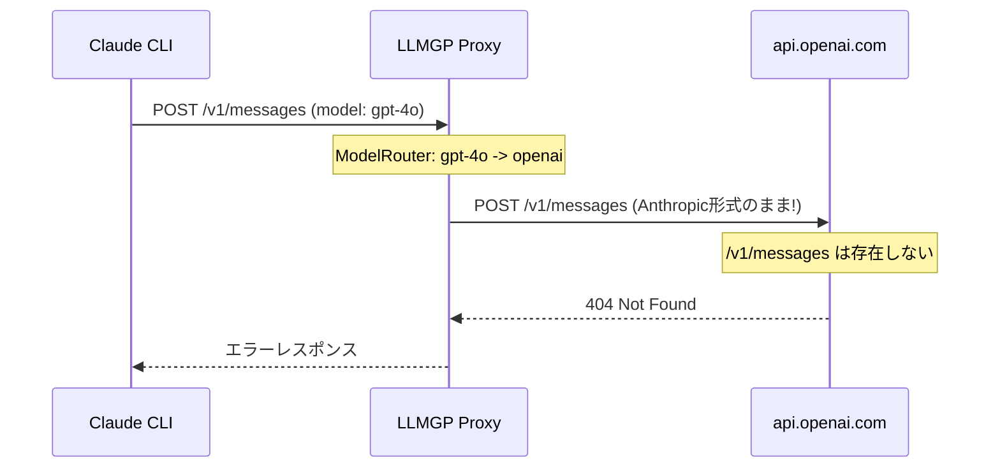
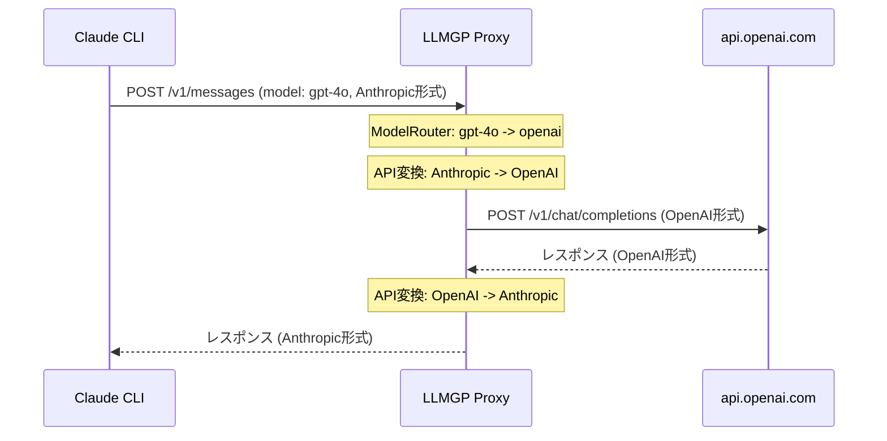

# 016: LLMGP クロスプロバイダ API 変換

## 背景 (Background)

015 および 022 で agentservice レベルでのプロバイダフィルタリングを撤回し、
クロスプロバイダのモデル指定が agentservice で受理されるようになった。

しかし、実際にクロスプロバイダのリクエストを実行すると、以下の問題で失敗する:

1. **Claude CLI は常に Anthropic Messages API (`POST /v1/messages`) を使用する**
2. LLMGP の `handleAnthropicMessages` がモデルを OpenAI プロバイダに解決した場合、
   **そのまま `https://api.openai.com/v1/messages` に転送してしまう**
3. OpenAI には `/v1/messages` エンドポイントが存在しない -> 404 エラー

ターミナルでの再現:

```
$ ./bin/cawa-client run --agent claudecode --model gpt-4o --prompt "Create hello.py" --work-dir ./tmp/
Session created: 61a50286fdd92829c500afb7923bba47
[System]
There's an issue with the selected model (gpt-4o). It may not exist or you may not have access to it.
[Error] exit status 1
```

### 現在のリクエストフロー (失敗)



### 期待するリクエストフロー



## 要件 (Requirements)

### R1: Anthropic -> OpenAI リクエスト変換 (必須)

LLMGP の `handleAnthropicMessages` で、ルーティング先プロバイダが `openai` の場合、
Anthropic Messages API リクエストを OpenAI Chat Completions API リクエストに変換して転送すること。

変換対象フィールド:

| Anthropic Messages | OpenAI Chat Completions |
|---|---|
| `model` | `model` |
| `messages[].role` | `messages[].role` (user/assistant は同一) |
| `messages[].content` (テキスト) | `messages[].content` |
| `messages[].content` (配列/ブロック) | `messages[].content` (配列形式) |
| `system` (トップレベル) | `messages[0]` に `role: "system"` として挿入 |
| `max_tokens` | `max_tokens` |
| `temperature` | `temperature` |
| `stream` | `stream` |
| `tools` (Anthropic形式) | `tools` (OpenAI形式) |

### R2: OpenAI -> Anthropic レスポンス変換 (必須)

OpenAI Chat Completions API のレスポンスを Anthropic Messages API のレスポンス形式に変換して
Claude CLI に返すこと。Claude CLI が正常にパースし表示できる形式にすること。

変換対象フィールド:

| OpenAI Response | Anthropic Response |
|---|---|
| `choices[0].message.content` | `content[].text` (text ブロック) |
| `choices[0].message.tool_calls` | `content[].type: "tool_use"` |
| `choices[0].finish_reason` | `stop_reason` |
| `usage.prompt_tokens` | `usage.input_tokens` |
| `usage.completion_tokens` | `usage.output_tokens` |
| `id` | `id` |

### R3: ストリーミングレスポンス変換 (必須)

`stream: true` の場合、OpenAI の SSE ストリーム (`data: {...}`) を
Anthropic の SSE ストリーム形式 (`event: ...\ndata: {...}`) に変換してリアルタイムで返すこと。

主なイベントマッピング:

| OpenAI SSE | Anthropic SSE |
|---|---|
| 最初のチャンク | `message_start` |
| `choices[0].delta.content` | `content_block_delta` |
| `choices[0].delta.tool_calls` | `content_block_delta` (tool_use) |
| `[DONE]` | `message_stop` |

### R4: ツール呼び出し変換 (必須)

Claude CLI がツール定義を渡す場合 (`tools` フィールド)、
Anthropic 形式のツール定義を OpenAI 形式に変換して送信し、
レスポンスの `tool_calls` も Anthropic 形式に逆変換すること。

### R5: エラーハンドリング (必須)

- OpenAI API から返されたエラーレスポンスを Anthropic 形式のエラーに変換すること
- 変換処理自体のエラー (パース失敗等) は適切なエラーレスポンスとして返すこと
- ログに変換方向と変換元/先モデルを記録すること

### R6: R4 パススルー統合テスト (必須)

015 仕様の R4 (未実装) として、Claude CLI がモデル名を LLMGP にパススルーすることを
検証する統合テストを作成すること。モック LLMGP で受信内容を検証する。

### R7: 変換対象外のフィールドの透過 (任意)

Anthropic 固有のフィールド (例: `metadata`, `top_k`) で OpenAI に対応するものがない場合は、
警告ログを出力してフィールドを無視する。リクエスト全体を拒否しないこと。

## 実現方針 (Implementation Approach)

### アーキテクチャ: 変換レイヤーの追加

`handleAnthropicMessages` 内で、ルーティング先プロバイダに応じた分岐を追加する。

```
handleAnthropicMessages
  |
  +-- ModelRouter.ResolveModel(model)
  |
  +-- routed.Provider == "anthropic"?
  |     -> 従来通り forwardToProvider("anthropic", "/v1/messages", body)
  |
  +-- routed.Provider == "openai"?
        -> convertAnthropicToOpenAI(body)       ... R1
        -> forwardToProvider("openai", "/v1/chat/completions", convertedBody)
        -> convertOpenAIToAnthropic(response)   ... R2/R3
```

### 主要コンポーネント

1. **`convert_anthropic_to_openai.go`** (新規)
   - `ConvertAnthropicRequestToOpenAI(body []byte) ([]byte, error)` - リクエスト変換
   - `ConvertOpenAIResponseToAnthropic(body []byte) ([]byte, error)` - レスポンス変換
   - `ConvertOpenAIStreamToAnthropic(reader io.Reader, writer http.ResponseWriter)` - ストリーム変換

2. **`proxy_anthropic.go`** (修正)
   - `handleAnthropicMessages` にプロバイダ分岐ロジックを追加

3. **`provider_forwarder.go`** (修正なし)
   - 既存の `forwardToProvider` をそのまま利用

### ストリーミング変換戦略

ストリーミング変換は以下の戦略で実装する:

1. OpenAI のレスポンスを SSE チャンク単位で読み取る
2. 各チャンクを Anthropic SSE イベント形式に変換する
3. 変換したイベントを即座にクライアントにフラッシュする
4. `[DONE]` シグナルを `message_stop` イベントに変換する

### スコープ制限

- 本仕様では **Anthropic -> OpenAI** 方向の変換のみを対象とする
  (Claude CLI が入口であるため、OpenAI -> Anthropic 方向は現時点で不要)
- Google Gemini API への変換は本仕様のスコープ外とする (将来の仕様で対応)

## 検証シナリオ (Verification Scenarios)

### シナリオ 1: 基本的なテキスト応答

1. `model_profiles.yaml` に `openai` プロバイダで `gpt-4o` を定義
2. `./bin/cawa-client run --agent claudecode --model gpt-4o --prompt "Say hello" --work-dir ./tmp/` を実行
3. LLMGP が Anthropic -> OpenAI 変換を行い、OpenAI API にリクエストを送信
4. OpenAI のレスポンスが Anthropic 形式に変換され、Claude CLI に返される
5. Claude CLI がテキスト応答を正常に表示する

### シナリオ 2: ストリーミング応答

1. 上記と同じ設定で、ストリーミングモードで実行
2. Claude CLI がリアルタイムでテキストを逐次表示する
3. 最後まで正常に完了する

### シナリオ 3: ツール呼び出し

1. `gpt-4o` モデルで「ファイルを作成して」等のツール呼び出しを要求するプロンプトを実行
2. OpenAI がツール呼び出しを返す
3. Claude CLI がツール呼び出しを正常に処理し、ファイル操作等を実行する

## テスト項目 (Testing for the Requirements)

### R1/R2: リクエスト・レスポンス変換の単体テスト

- `convert_anthropic_to_openai_test.go` でテキスト、system、tools の変換を検証
- 入力: Anthropic Messages API JSON -> 出力: OpenAI Chat Completions API JSON
- 入力: OpenAI レスポンス JSON -> 出力: Anthropic レスポンス JSON

### R3: ストリーミング変換の単体テスト

- OpenAI SSE ストリームのモックを入力として、Anthropic SSE イベントへの変換を検証

### R4: ツール呼び出し変換の単体テスト

- Anthropic ツール定義 -> OpenAI ツール定義の変換を検証
- OpenAI tool_calls レスポンス -> Anthropic tool_use コンテンツブロックの変換を検証

### R6: パススルー統合テスト

- モック LLMGP サーバーを起動
- claudecode エージェントでセッション作成し、モデル名が LLMGP に到達することを確認

### ビルド・全体検証

1. ビルド + 単体テスト:
   ```
   scripts/process/build.sh
   ```

2. 統合テスト (共通 + LLM):
   ```
   scripts/process/integration_test.sh --specify "TestAgentService"
   ```
