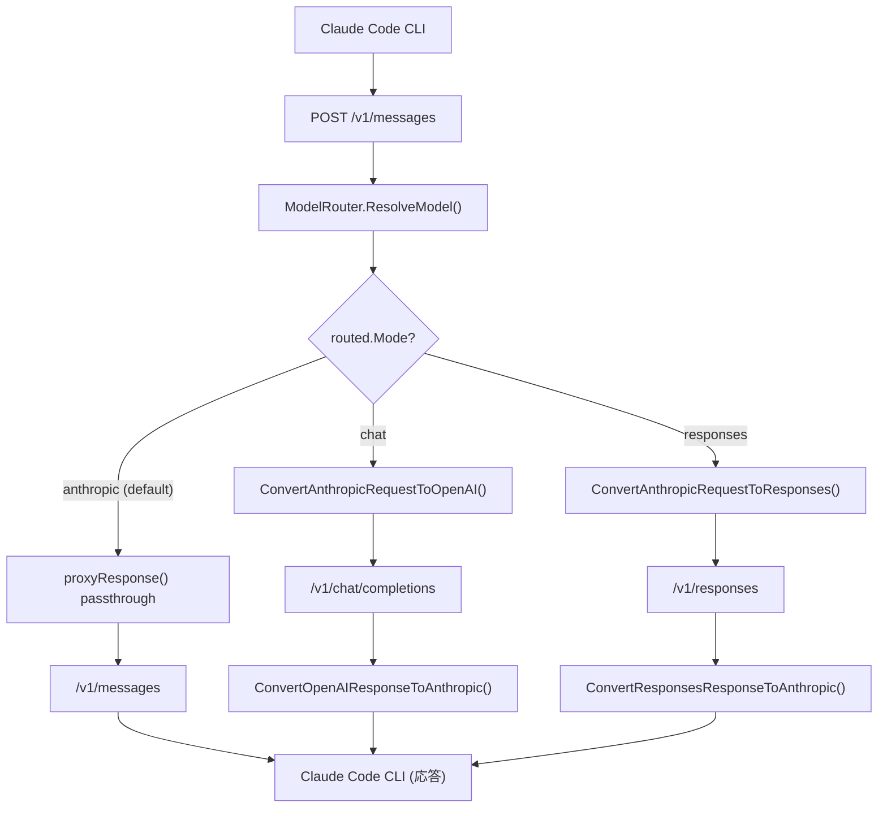

# 017: LLMGP Responses API 対応 (Codex モデルサポート)

## 背景 (Background)

### 現状の課題

LLMGP (LLM Gateway Proxy) のクロスプロバイダ変換は、現在 OpenAI Chat Completions API (`/v1/chat/completions`) のみを対象としている。しかし、OpenAI の Codex モデル (`codex-mini-latest`, `gpt-5.2-codex` 等) は Chat Completions API をサポートしておらず、**Responses API** (`/v1/responses`) 専用である。

このため、Anthropic Messages API エンドポイント (`/v1/messages`) 経由で Codex モデルを指定しても、変換先が `/v1/chat/completions` に固定されているため動作しない。

### vv4 のアプローチ

参照リポジトリ vv4 では、`model_profiles.yaml` の `mode` フィールド (`"chat"` / `"responses"`) により API モードを指定し、Bifrost SDK 内部でルーティングを切り替えている。HAG は HTTP リバースプロキシとして動作するため、同じアプローチは取れないが、同様のルーティング分岐を proxy 層に導入する。

### 調査レポート

- [investigation_codex_responses_api.md](file:///C:/Users/yamya/.gemini/antigravity-ide/brain/afe40f00-d7b8-4d81-9e86-afc64da4f78a/investigation_codex_responses_api.md)

## 要件 (Requirements)

### 必須要件

- **R1: model_profiles.yaml に `mode` フィールドを追加**
  - `ModelConfig` 構造体に `Mode string` フィールドを追加する
  - 値: `"chat"` (デフォルト) / `"responses"`
  - `mode` が未指定の場合は `"chat"` として扱う

- **R2: RoutedModel に Mode 情報を伝播**
  - `RoutedModel` 構造体に `Mode string` フィールドを追加する
  - `ResolveModel()` が mode 情報を含む `RoutedModel` を返す

- **R3: Anthropic -> Responses API リクエスト変換**
  - Anthropic Messages API リクエストを OpenAI Responses API リクエストに変換する
  - 変換対象:
    - `messages` -> `input` (ResponsesMessage 形式)
    - `system` -> system ロールのメッセージ
    - `tools[].input_schema` -> `tools[].parameters` (function 型)
    - `max_tokens` -> `max_output_tokens`
    - `temperature` -> `temperature`

- **R4: Responses API レスポンス -> Anthropic 変換 (非ストリーミング)**
  - OpenAI Responses API のレスポンスを Anthropic Messages API 形式に変換する
  - 変換対象:
    - `output[].content` -> `content[]` (text ブロック)
    - `output[type=function_call]` -> `content[type=tool_use]` ブロック
    - `status: "completed"` -> `stop_reason: "end_turn"`
    - `usage` -> `usage` (フィールド名変換)

- **R5: Responses API ストリーミング変換**
  - OpenAI Responses API のストリーミングイベントを Anthropic SSE 形式に変換する
  - イベントマッピング:
    - `response.created` -> `message_start`
    - `response.output_text.delta` -> `content_block_delta` (text_delta)
    - `response.function_call_arguments.delta` -> `content_block_delta` (input_json_delta)
    - `response.output_item.added[type=function_call]` -> `content_block_start` (tool_use)
    - `response.completed` -> `message_delta` + `message_stop`

- **R6: proxy_anthropic.go での mode ルーティング**
  - `handleAnthropicMessages` で `routed.Mode == "responses"` を検出した場合:
    - リクエストを Responses API 形式に変換
    - OpenAI `/v1/responses` エンドポイントに転送
    - レスポンスを Anthropic 形式に逆変換

### 任意要件

- **R7: tool_result の変換対応**
  - Anthropic の `tool_result` コンテンツブロック -> Responses API の `function_call_output` メッセージへの変換
  - tool_use のフルループ (リクエスト -> ツール呼び出し -> 結果返却) に必要

## 実現方針 (Implementation Approach)

### アーキテクチャ



### 主要コンポーネント

1. **config パッケージ**: `ModelConfig` に `Mode` フィールド追加
2. **routing.go**: `RoutedModel` に `Mode` フィールド追加、`ResolveModel()` で伝播
3. **convert_a2r.go** (新規): Anthropic -> Responses API 変換関数群
4. **proxy_anthropic.go**: mode によるルーティング分岐追加

### ファイル構成

| ファイル | 変更種別 | 内容 |
|---|---|---|
| `shared/libs/go/config/model_profiles.go` | 修正 | `ModelConfig.Mode` フィールド追加 |
| `shared/libs/go/llmgateway/routing.go` | 修正 | `RoutedModel.Mode` フィールド追加、伝播 |
| `shared/libs/go/llmgateway/convert_a2r.go` | 新規 | Anthropic <-> Responses API 変換 |
| `shared/libs/go/llmgateway/convert_a2r_test.go` | 新規 | 変換ロジックのユニットテスト |
| `shared/libs/go/llmgateway/proxy_anthropic.go` | 修正 | mode ルーティング分岐追加 |
| `shared/libs/go/llmgateway/proxy_anthropic_test.go` | 修正 | Responses API プロキシテスト |
| `examples/standalone/model_profiles.yaml` | 修正 | Codex モデルに `mode: responses` 追加 |
| `tests/testdata/model_profiles.yaml` | 修正 | テスト用 Codex モデル設定 |

### Responses API リクエスト形式

```json
{
  "model": "codex-mini-latest",
  "input": [
    {"role": "user", "content": "Create a hello.py file"}
  ],
  "max_output_tokens": 16384,
  "tools": [
    {
      "type": "function",
      "name": "get_weather",
      "parameters": {"type": "object", "properties": {...}}
    }
  ]
}
```

### Responses API レスポンス形式 (非ストリーミング)

```json
{
  "id": "resp_abc123",
  "status": "completed",
  "output": [
    {
      "type": "message",
      "content": [{"type": "output_text", "text": "Hello!"}]
    }
  ],
  "usage": {
    "input_tokens": 10,
    "output_tokens": 5,
    "total_tokens": 15
  }
}
```

## 検証シナリオ (Verification Scenarios)

### シナリオ 1: 非ストリーミング Codex 呼び出し

1. model_profiles.yaml に `codex-mini-latest` を `mode: "responses"` で定義
2. Claude Code CLI から `--model codex-mini-latest` でタスクを実行
3. LLMGP が `/v1/messages` リクエストを受信
4. ModelRouter が `mode: "responses"` を含む RoutedModel を返す
5. リクエストが Responses API 形式に変換され、`api.openai.com/v1/responses` に転送
6. レスポンスが Anthropic Messages API 形式に変換され、クライアントに返却
7. Claude Code CLI がレスポンスを正常に処理

### シナリオ 2: ストリーミング Codex 呼び出し

1. `stream: true` で `codex-mini-latest` を呼び出し
2. OpenAI Responses API のストリーミングイベントが Anthropic SSE 形式に変換
3. `message_start`, `content_block_delta`, `message_stop` の順序で送信

### シナリオ 3: chat モードの既存動作への影響なし

1. `mode: "chat"` または `mode` 未指定のモデル (gpt-4o 等) は従来通り `/v1/chat/completions` に転送
2. Anthropic ネイティブモデル (claude-sonnet-4-20250514 等) は従来通りパススルー

## テスト項目 (Testing for the Requirements)

### 単体テスト (R1, R2, R3, R4, R5)

対象パッケージ: `shared/libs/go/llmgateway`, `shared/libs/go/config`

| 要件 | テスト関数 | 検証内容 |
|---|---|---|
| R1 | `TestModelConfig_ModeField` | YAML パース時に mode フィールドが読み取れること |
| R2 | `TestModelRouter_ResolveModel_WithMode` | ResolveModel が mode を含む RoutedModel を返すこと |
| R3 | `TestConvertAnthropicRequestToResponses_*` | リクエスト変換の正確性 (テキスト、ツール、system) |
| R4 | `TestConvertResponsesResponseToAnthropic_*` | レスポンス逆変換の正確性 |
| R5 | `TestConvertResponsesStreamToAnthropic_*` | ストリーミング変換のイベント順序と内容 |
| R6 | `TestHandleAnthropicMessages_ResponsesMode` | proxy ハンドラのルーティング分岐 |

### ビルド・全体検証

1. ビルド + 単体テスト:
   ```
   scripts/process/build.sh
   ```

2. LLM 統合テスト (E2E):
   ```
   scripts/process/integration_test.sh --categories "llm"
   ```

3. クロスプロバイダ + Responses API テスト:
   ```
   scripts/process/integration_test.sh --specify "TestCrossProvider|TestResponses"
   ```
