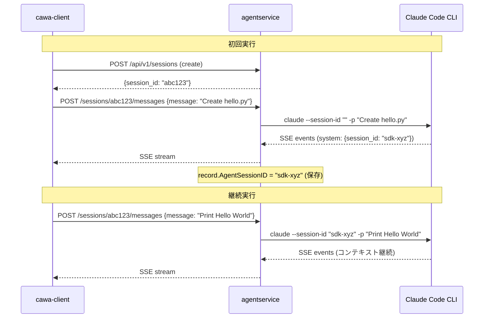

# 018-SessionContinuation-And-Rename

## 背景 (Background)

### 現状の問題

1. **セッション継続ができない**: 現在の `cawa-client` の `run` コマンドは、実行のたびに新しいセッションを作成する。ユーザーがエージェントの応答に対して追加の指示 (フォローアップ) を送りたい場合でも、既存セッションを継続する手段がない。ターミナルの出力例:

```
$ ./bin/cawa-client run --agent claudecode --model gpt-5.3-codex --prompt "Create a hello.py file" --work-dir ./tmp/
Session created: 40d36e818bcc6e91b3badfab278dc331

[System]
Got it -- I'll create hello.py.
What should it print? (If you want a default, I can make it print Hello, world!)

--- Stream completed ---
```

ここでエージェントが質問を返しているが、ユーザーがそれに回答する方法がない。

2. **`sdk_session_id` の命名問題**: セッション情報の JSON レスポンスに `sdk_session_id` というフィールドがある。これはClaude Code CLI が内部管理するセッション ID だが、エンドユーザーに「SDK」という実装詳細を露出する意味がない。`session_id` で十分であり、既に `id` がセッション (HAG 側) の一意識別子として存在するため、混乱の原因にもなる。

```json
{
  "id": "40d36e818bcc6e91b3badfab278dc331",
  "sdk_session_id": "e1b0bcc6-a01b-4a0a-8858-beb3abd82a71",
  ...
}
```

### 技術的背景

- `handleSendMessage` (agentservice/handler.go) は毎回 `agent.CreateSession()` を呼び出しており、既存の SDK セッションを再利用する仕組みがない。
- Claude Code CLI は `--session-id` オプションでセッションを再開する機能を持っている。`SDKSessionID` フィールドはそのために存在するが、現在は `handleSendMessage` で活用されていない。
- `SessionRecord.SDKSessionID` は SSE ストリーム中の `system` イベントから取得され、レコードに保存されている。

## 要件 (Requirements)

### 必須要件

#### R1: セッション継続 (cawa-client)

- `run` コマンドに `--session-id` オプションを追加する。
- `--session-id` が指定された場合、新規セッション作成をスキップし、既存セッションに対してメッセージを送信する。
- 使用例:
  ```bash
  # 初回実行
  $ ./bin/cawa-client run --agent claudecode --prompt "Create a hello.py" --work-dir ./tmp/
  Session created: 40d36e8...

  # 継続 (フォローアップ)
  $ ./bin/cawa-client run --session-id 40d36e8... --prompt "Print Hello, World!"
  ```

#### R2: セッション継続 (agentservice)

- `POST /api/v1/sessions/:id/messages` で、既存セッションの `SDKSessionID` が存在する場合、`agent.CreateSession()` に `WithSDKSessionID()` を渡してセッションを継続する。
- 現在は `SDKSessionID` を保存するだけで、再利用していない。これを修正する。

#### R3: `sdk_session_id` -> `session_id` へのリネーム

- `SessionRecord` の JSON タグ `sdk_session_id` を `session_id` にリネームする。
- Go コード内のフィールド名 `SDKSessionID` は `SessionID` にリネームする (ただし `SessionRecord.ID` との混同を避けるため、`AgentSessionID` にリネームすることも検討)。
- 関連するテストコード、オプション関数 (`WithSDKSessionID` -> `WithSessionID`)、ヘルパー関数をすべて更新する。

### 任意要件

#### R4: インタラクティブモード (将来検討)

- `run` コマンドで、ストリーム完了後にプロンプトを表示してユーザー入力を受け付ける対話モード。
- 本仕様では対象外。セッション ID を手動で指定するシンプルな方式を先に実装する。

## 実現方針 (Implementation Approach)

### 変更対象コンポーネント

#### 1. cawa-client (examples/cawa-client/main.go)

- `cmdRun` に `--session-id` フラグを追加。
- `--session-id` が空の場合: 現在と同じく新規セッション作成 + メッセージ送信。
- `--session-id` が指定された場合: セッション作成をスキップし、既存セッションにメッセージ送信。`--agent`, `--model`, `--work-dir` は不要 (既にセッションに紐付いている)。
- usage 表示を更新。

#### 2. agentservice (shared/libs/go/agentservice/handler.go)

- `handleSendMessage`: セッションレコードから `AgentSessionID` (旧 SDKSessionID) を取得し、空でなければ `WithSDKSessionID()` (後述のリネーム後は `WithSessionID()`) を渡す。
- これにより、2 回目以降のメッセージ送信で Claude Code CLI が `--session-id` 付きで起動され、前回のコンテキストが引き継がれる。

#### 3. codingagent パッケージ (リネーム)

- `SessionRecord.SDKSessionID` -> `SessionRecord.AgentSessionID`
  - JSON タグ: `sdk_session_id` -> `agent_session_id`
  - 理由: `id` フィールドは HAG のセッション ID、`agent_session_id` はエージェント (Claude Code CLI 等) が管理するセッション ID。「SDK」はエンドユーザーに不要な実装詳細。
- `SessionConfig.SDKSessionID` -> `SessionConfig.AgentSessionID`
- `WithSDKSessionID()` -> `WithAgentSessionID()`
- 関連テストコードの更新。



### 影響範囲

| ファイル | 変更種別 |
|---|---|
| examples/cawa-client/main.go | 機能追加 (--session-id) |
| shared/libs/go/agentservice/handler.go | 機能追加 (セッション継続ロジック) |
| shared/libs/go/codingagent/session_store.go | リネーム |
| shared/libs/go/codingagent/options.go | リネーム |
| shared/libs/go/codingagent/claudecode/process.go | リネーム |
| shared/libs/go/codingagent/claudecode/process_test.go | リネーム |
| shared/libs/go/codingagent/options_test.go | リネーム |
| shared/libs/go/agentservice/session_store_test.go | リネーム |
| shared/libs/go/agentservice/handler.go | リネーム |

## 検証シナリオ (Verification Scenarios)

### シナリオ 1: セッション継続 (Non-Interactive)

1. `cawa-client run --agent claudecode --prompt "Create a hello.py file" --work-dir ./tmp/` で初回実行
2. レスポンスに表示された Session ID をメモ
3. `cawa-client run --session-id <ID> --prompt "Print Hello, World! instead"` で継続実行
4. エージェントが前回のコンテキスト (hello.py の件) を覚えた状態で応答する
5. セッション情報に `agent_session_id` が含まれる (`sdk_session_id` ではない)

### シナリオ 2: `--session-id` 不正時のエラー

1. `cawa-client run --session-id nonexistent-id --prompt "test"` を実行
2. HTTP 404 エラーが返り、`session not found` と表示される

### シナリオ 3: リネーム確認

1. `cawa-client session --id <ID>` でセッション情報を取得
2. JSON レスポンスに `agent_session_id` フィールドがある
3. `sdk_session_id` フィールドは存在しない

## テスト項目 (Testing for the Requirements)

### ビルド + 単体テスト

```bash
scripts/process/build.sh
```

- R3 (リネーム) により既存の単体テストがコンパイルエラーになるため、テストコードも更新必須。

### 統合テスト

```bash
# agentservice の統合テストのみ (セッション作成+メッセージ送信)
scripts/process/integration_test.sh --specify "TestIntegration|TestWebSocket"
```

- セッション継続のテスト: 同一セッションに 2 回メッセージを送信し、2 回目で `--session-id` が CLI に渡されることを確認。
- リネーム確認: セッション取得 API のレスポンスに `agent_session_id` が含まれ `sdk_session_id` が含まれないことを確認。

### 手動検証 (E2E)

```bash
# 初回
./bin/cawa-client run --agent claudecode --prompt "Create a hello.py file" --work-dir ./tmp/
# Session ID を確認

# 継続
./bin/cawa-client run --session-id <ID> --prompt "Add a goodbye message to it"
```

- エージェントが前回のコンテキストを維持していることを確認。
