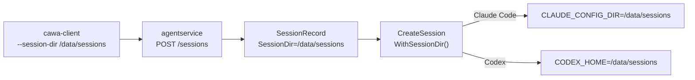

# 019-SessionPersistence-DirectoryConfig

## 背景 (Background)

### 現状の問題

HAG (Headless Agent Gateway) は、エージェント (Claude Code, Codex 等) を起動してセッションを管理する。セッション継続のために `agent_session_id` を保存する仕組みは 018 で導入されたが、エージェント側のセッションデータ (会話履歴、コンテキスト) がどこに保存されるかは、各エージェント CLI のデフォルト動作に依存している。

マルチユーザー環境やコンテナ実行時には、セッションデータの保存先を明示的に制御する必要がある。例えば:

- 複数のプロジェクトで同一エージェントを使い分ける場合、セッションが混在する
- コンテナ内でエージェントを実行する場合、デフォルトの `~/.claude/` がコンテナ再起動で消失する
- セキュリティやコンプライアンスの要件で、セッションデータの保存先を管理したい

### 各エージェント CLI のセッション保存仕様

以下は、2026年6月時点の各プロダクトのセッション保存機能の調査結果である。

## 調査結果: プロダクト別セッション保存機能比較

### 1. Claude Code CLI

| 項目 | 詳細 |
|---|---|
| **保存場所** | `~/.claude/projects/<project-hash>/<session-id>.jsonl` |
| **形式** | JSONL (append-only) |
| **ディレクトリ変更** | 環境変数 `CLAUDE_CONFIG_DIR` で全体のルートを変更可能 |
| **セッション再開** | `claude --continue` (直近), `claude --resume` (ピッカー), `claude --resume <session-id>` (ID指定) |
| **プロジェクト紐付け** | 絶対パスのハッシュでプロジェクトディレクトリに紐付く |
| **SDK/API** | Agent SDK では `SessionStore` アダプタで S3/Redis/Postgres 等に変更可能 |

**ポイント**:
- `CLAUDE_CONFIG_DIR` を指定すれば、セッション保存先を含む全設定のルートを変更できる
- HAG から Claude Code CLI を起動する際、この環境変数を渡すことで保存先を制御可能
- `direnv` との組み合わせでプロジェクト別に自動切り替えも可能

```bash
# 例: プロジェクト別にセッション保存先を分離
CLAUDE_CONFIG_DIR=/data/sessions/project-a claude -p "hello" --session-id xyz
```

### 2. OpenAI Codex CLI

| 項目 | 詳細 |
|---|---|
| **保存場所** | `~/.codex/sessions/YYYY/MM/DD/<session-id>.jsonl` |
| **形式** | JSONL |
| **ディレクトリ変更** | 環境変数 `CODEX_HOME` で全体のルートを変更可能 |
| **セッション再開** | `codex resume --last`, `codex resume` (ピッカー), `codex resume <session-id>` |
| **プロジェクト紐付け** | カレントディレクトリでスコープされる |
| **設定優先順序** | CLI flags > プロジェクト `.codex/config.toml` > プロファイル > グローバル config.toml |

**ポイント**:
- `CODEX_HOME` を指定すれば、セッションを含む全状態の保存先を変更できる
- Claude Code の `CLAUDE_CONFIG_DIR` と同様のアプローチ
- 日付ベースのディレクトリ構造 (`YYYY/MM/DD/`) で自動整理される

```bash
# 例: カスタムホームでセッション分離
CODEX_HOME=/data/codex-sessions codex resume
```

### 3. Antigravity CLI (agy)

| 項目 | 詳細 |
|---|---|
| **保存場所** | `<appDataDir>/brain/<conversation-id>/` |
| **形式** | JSONL (transcript.jsonl) + Artifact ファイル群 |
| **ディレクトリ変更** | 不明確 (appDataDir は OS 標準に従う) |
| **セッション再開** | `/resume` スラッシュコマンド, `agy --conversation <id>` |
| **プロジェクト紐付け** | ワークスペースディレクトリでスコープ |
| **追加機能** | Artifact システム (implementation_plan.md, task.md 等) がセッション内に保存される |

**ポイント**:
- Gemini CLI から Antigravity CLI (agy) に移行済み (Go ベース)
- セッション保存のカスタマイズ性は Claude Code / Codex に比べて限定的
- ただし、Artifact システムとの統合がネイティブに組み込まれている

### 比較表

| 機能 | Claude Code | Codex CLI | Antigravity CLI |
|---|---|---|---|
| **セッション保存** | 自動 | 自動 | 自動 |
| **保存形式** | JSONL | JSONL | JSONL + Artifacts |
| **ディレクトリ変更** | `CLAUDE_CONFIG_DIR` | `CODEX_HOME` | 限定的 |
| **環境変数でのオーバーライド** | 可 | 可 | 不明確 |
| **セッション再開コマンド** | `--continue` / `--resume` | `resume` | `--conversation` / `/resume` |
| **プロジェクト紐付け** | パスハッシュ | カレントディレクトリ | ワークスペース |
| **SDK レベルのカスタマイズ** | SessionStore アダプタ | なし | なし |

## 要件 (Requirements)

### 必須要件

#### R1: セッション保存ディレクトリの設定

- `SessionConfig` (codingagent パッケージ) に `SessionDir` フィールドを追加する。
- このフィールドが指定された場合、エージェントアダプタは対応する環境変数を設定してセッション保存先を制御する。
- **デフォルト値**: `--session-dir` が未指定の場合、`WorkDir` (作業ディレクトリ) の値を `SessionDir` に適用する。これにより、プロジェクトの作業ディレクトリにセッションデータが自然に紐付く。

| エージェント | 環境変数 | 設定値 |
|---|---|---|
| Claude Code | `CLAUDE_CONFIG_DIR` | `<SessionDir>` (デフォルト: `WorkDir`) |
| Codex CLI | `CODEX_HOME` | `<SessionDir>` (デフォルト: `WorkDir`) |

#### R2: cawa-client への --session-dir オプション追加

- `run` コマンドに `--session-dir` オプションを追加する。
- 指定された場合、セッション作成 API にこの情報を渡し、エージェント起動時に環境変数として適用する。

#### R3: 既存セッション情報への保存先記録

- `SessionRecord` に `SessionDir` フィールドを追加し、セッション作成時の保存先を記録する。
- セッション継続時に同じ保存先が使用されるようにする。

### 任意要件

#### R4: ApplyDefaults での SessionDir フォールバック

- `ApplyDefaults` 関数で、`SessionConfig.SessionDir` が空の場合に `SessionConfig.WorkDir` を適用する。
- これにより、ユーザーが明示的に `--session-dir` を指定しなくても、作業ディレクトリにセッションが保存される。
- `AdapterConfig.DefaultSessionDir` が設定されている場合はそちらを優先する。
- 優先順序: `--session-dir` (明示指定) > `AdapterConfig.DefaultSessionDir` > `WorkDir` (フォールバック)

```go
func ApplyDefaults(cfg *SessionConfig, ac *AdapterConfig) {
    // ...existing defaults...
    if cfg.SessionDir == "" {
        if ac.DefaultSessionDir != "" {
            cfg.SessionDir = ac.DefaultSessionDir
        } else if cfg.WorkDir != "" {
            cfg.SessionDir = cfg.WorkDir
        }
    }
}
```

#### R5: Antigravity CLI 対応

- Antigravity CLI の保存先制御方法が判明した場合に対応する。
- 現時点では対象外とし、Claude Code と Codex CLI のみを対象とする。

## 実現方針 (Implementation Approach)

### 変更対象コンポーネント

#### 1. codingagent パッケージ

```go
// SessionConfig に追加
type SessionConfig struct {
    // ...existing fields...
    SessionDir string // Directory for agent session data storage
}

// SessionRecord に追加
type SessionRecord struct {
    // ...existing fields...
    SessionDir string `json:"session_dir"`
}

// オプション関数
func WithSessionDir(dir string) SessionOption {
    return func(c *SessionConfig) { c.SessionDir = dir }
}
```

#### 2. claudecode アダプタ (process.go)

```go
// BuildEnv で SessionDir -> CLAUDE_CONFIG_DIR に変換
func BuildEnv(ac *AdapterConfig, cfg *SessionConfig) []string {
    // ...existing logic...
    if cfg.SessionDir != "" {
        env["CLAUDE_CONFIG_DIR"] = cfg.SessionDir
    }
}
```

#### 3. codex アダプタ (process.go)

```go
// BuildEnv で SessionDir -> CODEX_HOME に変換
func BuildEnv(ac *AdapterConfig, cfg *SessionConfig) []string {
    // ...existing logic...
    if cfg.SessionDir != "" {
        env["CODEX_HOME"] = cfg.SessionDir
    }
}
```

#### 4. agentservice (handler.go)

- セッション作成リクエストに `session_dir` フィールドを追加。
- `SessionRecord` に保存し、`CreateSession` 時に `WithSessionDir()` を渡す。

#### 5. cawa-client (main.go)

- `run` コマンドに `--session-dir` オプション追加。
- セッション作成 API のボディに `session_dir` を含める。



### 影響範囲

| ファイル | 変更種別 |
|---|---|
| shared/libs/go/codingagent/options.go | フィールド追加 |
| shared/libs/go/codingagent/session_store.go | フィールド追加 |
| shared/libs/go/codingagent/claudecode/process.go | 環境変数変換追加 |
| shared/libs/go/codingagent/codex/process.go | 環境変数変換追加 |
| shared/libs/go/agentservice/handler.go | リクエストパラメータ追加 |
| examples/cawa-client/main.go | --session-dir オプション追加 |

## 検証シナリオ (Verification Scenarios)

### シナリオ 1: Claude Code でカスタム保存先を指定

1. `cawa-client run --agent claudecode --prompt "hello" --work-dir ./tmp/ --session-dir /tmp/claude-sessions` を実行
2. Claude Code CLI が `CLAUDE_CONFIG_DIR=/tmp/claude-sessions` で起動される
3. セッションデータが `/tmp/claude-sessions/projects/` 配下に保存される
4. セッション継続時にも同じ `CLAUDE_CONFIG_DIR` が使用される

### シナリオ 2: Codex でカスタム保存先を指定

1. `cawa-client run --agent codex --prompt "hello" --work-dir ./tmp/ --session-dir /tmp/codex-sessions` を実行
2. Codex CLI が `CODEX_HOME=/tmp/codex-sessions` で起動される
3. セッションデータが `/tmp/codex-sessions/sessions/` 配下に保存される

### シナリオ 3: --session-dir 未指定時のデフォルト動作 (work_dir フォールバック)

1. `cawa-client run --agent claudecode --prompt "hello" --work-dir ./tmp/` を実行 (--session-dir なし)
2. `ApplyDefaults` により `SessionDir = WorkDir = ./tmp/` が適用される
3. Claude Code CLI が `CLAUDE_CONFIG_DIR=./tmp/` で起動される
4. セッションデータが作業ディレクトリに紐付いて保存される
5. セッション継続時にも同じ保存先が使用される

## テスト項目 (Testing for the Requirements)

### ビルド + 単体テスト

```bash
scripts/process/build.sh
```

- R1: `WithSessionDir` オプション関数のテスト (options_test.go)
- R1: `BuildEnv` で `SessionDir` -> 環境変数の変換テスト (claudecode/process_test.go, codex/process_test.go)
- R3: `SessionRecord.SessionDir` の永続化テスト (session_store_test.go)

### 統合テスト

```bash
scripts/process/integration_test.sh --specify "TestIntegration|TestWebSocket"
```

- 既存テストのリグレッション確認

### E2E 検証

```bash
# Claude Code でカスタム保存先
./bin/cawa-client run --agent claudecode --prompt "hello" --work-dir ./tmp/ --session-dir /tmp/test-sessions

# セッション情報で session_dir が記録されていること
./bin/cawa-client session --id <ID>

# セッション継続で同じ保存先が使用されること
./bin/cawa-client run --session-id <ID> --prompt "continue"
```
