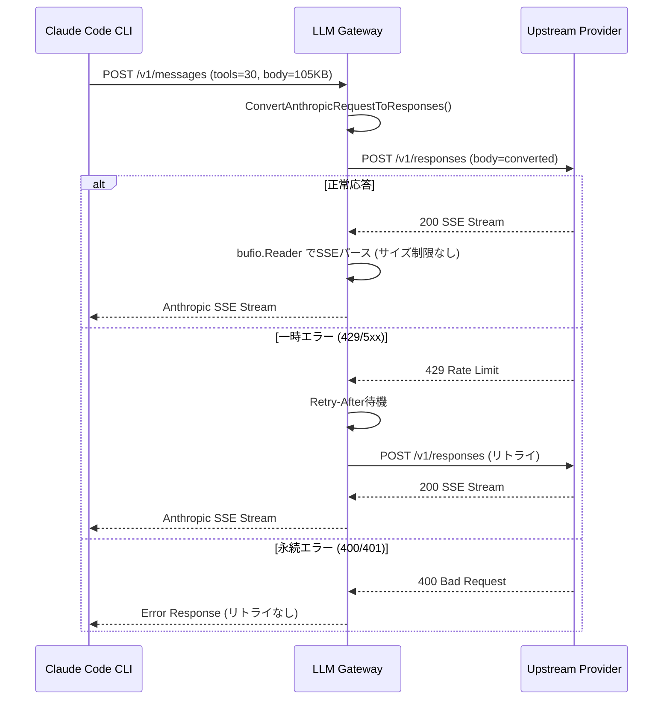

# 023-SSE-Parser-And-Gateway-Retry

## 背景 (Background)

### 問題1: SSEストリームパーサーのバッファサイズ制限

LLM Gatewayのクロスプロバイダー変換（`ConvertResponsesStreamToAnthropic`, `ConvertOpenAIStreamToAnthropic`）で `bufio.Scanner` を使用してSSEストリームを行単位でパースしている。`bufio.Scanner` はトークン（行）単位でデータを返すAPIであり、**1行がバッファサイズを超えると `ErrTooLong` を返して処理を停止**する。「残りを次に送る」というバッファの一般的な動作ではなく、トークン分割器としての制約である。

Claude Code CLIは30個のツール定義を含むリクエストを送信し（105KB超）、gpt-5.3-codexのResponses APIストリームレスポンスのSSEイベント行がデフォルトの64KBバッファを超えることが判明した。これにより `bufio.Scanner: token too long` エラーが発生し、function_callイベントが失われ、ファイル作成等のツール実行が行われないという深刻な障害が発生していた。

現在の応急処置として `scanner.Buffer(make([]byte, 0, 64*1024), 1024*1024)` で最大1MBに拡大しているが、CLIのリクエストサイズが1MBを超えた場合に同じ問題が再発する。これはソフトウェア設計上の問題であり、根本的な修正が必要である。

### 問題2: Gateway層のリトライ機構の欠如

LLM Gatewayの `providerForwarder.forwardToProvider()` は1回のHTTPリクエストのみを発行し、リトライロジックを持たない。OpenAI Responses APIが一時的なエラー（`model output must contain either output text or tool calls, these cannot both be empty`、5xx、Rate Limit 429等）を返した場合、エラーがそのままClaude Code CLIに伝播し、セッションが失敗する。

`codingagent` パッケージに `Retry()` 関数と `IsRetryableError()` が実装済みだが、プロダクションコードでは一切使用されていない。また、対象エラーがネットワークエラー（EOF、connection reset等）のみで、HTTPステータスベースのリトライ（429、5xx、空レスポンス）は対象外である。

VV4の `llmadapter.Client` では `Generate()` メソッドにリトライループが実装されており、`config.RetryConfig` で `MaxRetries` と `RetryDelaySeconds` を制御していた。

## 要件 (Requirements)

### 必須要件

#### R1: SSEパーサーの `bufio.Scanner` 廃止

- `bufio.Scanner` を `bufio.Reader` に置き換え、行サイズの上限を撤廃する
- 対象ファイル:
  - `shared/libs/go/llmgateway/convert_a2r.go` (`ConvertResponsesStreamToAnthropic`)
  - `shared/libs/go/llmgateway/stream_converter.go` (`ConvertOpenAIStreamToAnthropic`)
- `bufio.Reader.ReadString('\n')` または `ReadBytes('\n')` を使用し、任意サイズの行を処理可能にする
- 応急処置の `scanner.Buffer(...)` 呼び出しを削除する
- 既存の動作（SSEイベントのパース、空行検出、`[DONE]` 検出）を維持する

#### R2: Gateway層のHTTPリトライ機構

- `providerForwarder` にリトライロジックを追加する
- リトライ対象:
  - HTTPステータス 429 (Rate Limit) -- `Retry-After` ヘッダーを尊重
  - HTTPステータス 500, 502, 503, 504 (サーバーエラー)
  - ネットワークエラー (EOF, connection reset, connection refused)
- リトライ対象外 (即時エラー返却):
  - HTTPステータス 400, 401, 403, 404 (クライアントエラー)
  - コンテキストキャンセル
- デフォルト設定:
  - 最大リトライ回数: 3回
  - リトライ間隔: 指数バックオフ (1秒, 2秒, 4秒) + ジッター
  - 429の場合は `Retry-After` ヘッダーの値を使用（ヘッダーがない場合は指数バックオフ）
- ストリーミングレスポンスではリトライしない（レスポンスの途中からリトライは不可能なため）
  - リトライはリクエスト送信前、またはレスポンスヘッダー受信直後（ストリーミング開始前）に判定

#### R3: リトライ設定の外部化

- `config.AppConfig` にリトライ設定を追加する
  ```yaml
  gateway:
    retry:
      max_retries: 3
      initial_delay_seconds: 1
      max_delay_seconds: 30
  ```
- 設定がない場合はデフォルト値を使用する

### 任意要件

#### R4: リトライログの可視化

- リトライ発生時にログ出力する（リトライ回数、待機時間、エラー理由）
- WebSocketのログストリームにもリトライイベントを送信する（将来的なUI表示のため）

#### R5: 既存 `codingagent.Retry` の統合検討

- `codingagent` パッケージの既存 `Retry()` / `IsRetryableError()` と Gateway層のリトライの関係を整理する
- 重複を避けつつ、各レイヤーの責務を明確にする
  - Gateway層: HTTP通信レベルのリトライ (429, 5xx)
  - codingagent層: プロセスレベルのリトライ (CLI起動失敗、セッション作成失敗)

## 実現方針 (Implementation Approach)

### R1: SSEパーサーの再設計

```go
// Before (bufio.Scanner - 行サイズ上限あり)
scanner := bufio.NewScanner(reader)
for scanner.Scan() {
    line := scanner.Text()
    // ...
}

// After (bufio.Reader - 行サイズ上限なし)
br := bufio.NewReader(reader)
for {
    line, err := br.ReadString('\n')
    if err == io.EOF {
        if line != "" {
            // 最終行（改行なし）の処理
        }
        break
    }
    if err != nil {
        return err
    }
    line = strings.TrimRight(line, "\r\n")
    // 既存のSSEパースロジック
}
```

### R2: リトライ機構

```go
type retryConfig struct {
    MaxRetries       int
    InitialDelay     time.Duration
    MaxDelay         time.Duration
}

func (f *providerForwarder) forwardWithRetry(
    ctx context.Context,
    provider, path string,
    body []byte,
    apiKey string,
    headers http.Header,
    cfg *retryConfig,
) (*http.Response, error) {
    var lastErr error
    for attempt := 0; attempt <= cfg.MaxRetries; attempt++ {
        resp, err := f.forwardToProvider(provider, path, body, apiKey, headers)
        if err != nil {
            if !isRetryableNetworkError(err) {
                return nil, err
            }
            lastErr = err
        } else if !isRetryableStatusCode(resp.StatusCode) {
            return resp, nil
        } else {
            // 5xxや429の場合、ボディを読み捨ててリトライ
            io.Copy(io.Discard, resp.Body)
            resp.Body.Close()
            lastErr = fmt.Errorf("upstream returned %d", resp.StatusCode)
        }

        if attempt < cfg.MaxRetries {
            delay := calculateBackoff(attempt, cfg, resp)
            select {
            case <-time.After(delay):
            case <-ctx.Done():
                return nil, ctx.Err()
            }
        }
    }
    return nil, lastErr
}
```

### アーキテクチャ



## 検証シナリオ (Verification Scenarios)

### シナリオ1: 大規模SSEイベントの処理

1. Claude Code CLIから30個のツール定義を含むリクエストをgpt-5.3-codex経由で送信する
2. Responses APIのSSEストリームが64KBを超える行を含むことを確認する
3. `bufio.Scanner: token too long` エラーが発生しないことを確認する
4. function_callイベントが正しくAnthropic形式に変換されることを確認する
5. `stop_reason=tool_use` が正しく設定されることを確認する
6. Claude Code CLIがツール（Writeなど）を実行し、ファイルが実際に作成されることを確認する

### シナリオ2: Gateway層リトライ

1. 上流プロバイダーが429を返した場合、Retry-Afterヘッダーに従ってリトライされることを確認する
2. 上流プロバイダーが500を返した場合、指数バックオフでリトライされることを確認する
3. 最大リトライ回数に達した場合、最後のエラーが返されることを確認する
4. 400/401の場合、リトライせずに即時エラーが返されることを確認する
5. ストリーミングレスポンスの途中でエラーが発生した場合、リトライしないことを確認する

### シナリオ3: E2E (手動)

1. `./bin/cawa-client run --agent claudecode --model gpt-5.3-codex --prompt "Create a hello.py file" --work-dir ./tmp/` を実行
2. `[Tool: Write]` イベントがSSEストリームに表示されることを確認
3. `./tmp/hello.py` が実際に作成されることを確認

## テスト項目 (Testing for the Requirements)

### 単体テスト

```bash
cd shared/libs/go && go test ./llmgateway/... -v -run "TestConvertResponsesStream|TestConvertOpenAIStream|TestForwardWithRetry"
```

- R1: `TestConvertResponsesStreamToAnthropic_LargeEvent` -- 64KB超のSSEイベント行を含むストリームの処理を検証
- R1: `TestConvertOpenAIStreamToAnthropic_LargeEvent` -- 同上（Chat Completions API用）
- R2: `TestForwardWithRetry_429` -- 429レスポンスでのリトライ動作を検証
- R2: `TestForwardWithRetry_500` -- 500レスポンスでのリトライ動作を検証
- R2: `TestForwardWithRetry_400_NoRetry` -- 400レスポンスでリトライしないことを検証
- R2: `TestForwardWithRetry_MaxAttempts` -- 最大リトライ回数超過を検証
- R2: `TestForwardWithRetry_ContextCancel` -- コンテキストキャンセル時の動作を検証

### ビルドと全体テスト

```bash
./scripts/process/build.sh
```

### 統合テスト

```bash
./scripts/process/integration_test.sh --specify "TestE2E_CodingAgentStreaming"
./scripts/process/integration_test.sh --specify "TestCrossProvider"
./scripts/process/integration_test.sh --specify "TestResponsesAPI"
```

### リグレッション

```bash
./scripts/process/integration_test.sh
```
