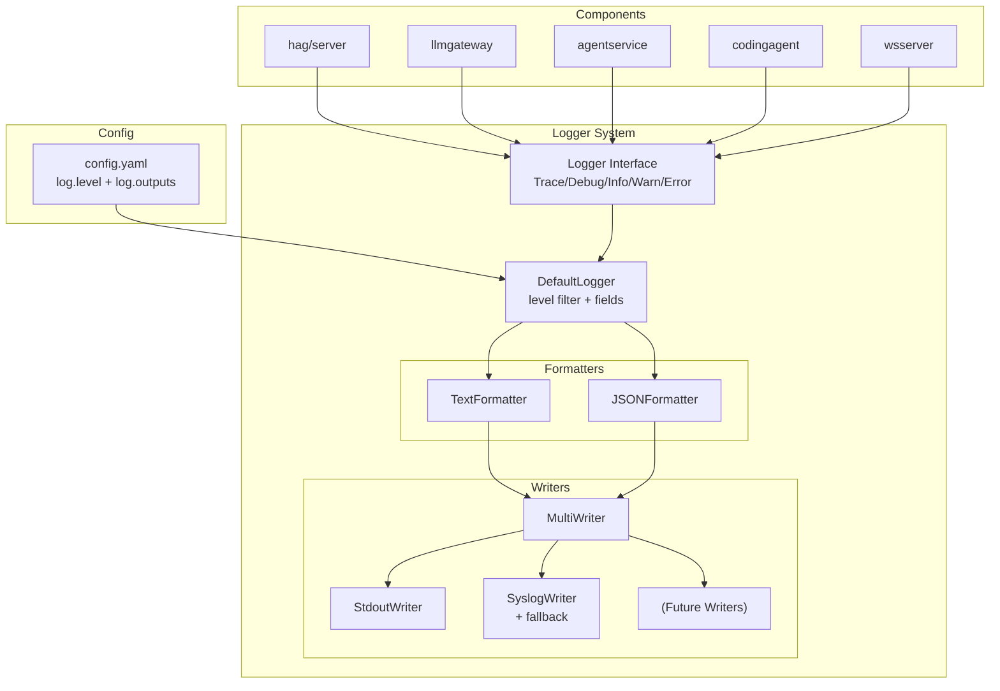

# 024-Logging-System-Redesign

## 背景 (Background)

現在のHAGプロジェクトのログシステムには以下の課題がある:

1. **ログレベルが4段階 (DEBUG/INFO/WARN/ERROR)** で、データダンプ用の TRACE レベルが存在しない。DEBUG とデータダンプが混在し、ログの可読性が低い。
2. **ログ出力先が単一指定**で、stdout/stderr と syslog の同時出力ができない。
3. **ログの挿入がほとんどされていない**。全モジュール合計で約130箇所のみ。特に DEBUG レベルのログがほぼゼロで、内部処理の追跡が不可能。
4. **ログ基準のルールが未定義**。各レベルで何を出力すべきかの明文化がなく、開発者間で基準がばらついている。
5. **直近のデバッグ事例** (Claude CLI + Gateway経由でファイル生成されない問題) では、Gatewayのリクエスト/レスポンスのダンプログがないため原因特定に時間を要した。

### 現状のアーキテクチャ

```
logger パッケージ (shared/libs/go/logger/)
├── Logger interface       -- Debug/Info/Warn/Error + WithFields/WithComponent
├── DefaultLogger          -- Strategy Pattern (Formatter + LogWriter)
├── TextFormatter          -- "TIMESTAMP LEVEL message key=val" 形式
├── JSONFormatter          -- JSON Lines 形式
├── StdoutWriter           -- INFO/DEBUG -> stdout, WARN/ERROR -> stderr
└── SyslogWriter           -- RFC3164 syslog (UDP)

tasklog パッケージ (shared/libs/go/tasklog/)
└── TaskLog                -- フロントエンド向けのエージェント実行履歴（変更対象外）
```

logger を利用しているモジュール (13ファイル):
- `hag/server.go`, `hag/options.go` (コアサーバー)
- `llmgateway/proxy.go`, `proxy_anthropic.go`, `proxy_openai.go`, `routing.go` 等 (LLM Gateway)
- `agentservice/service.go` (Agent Service)
- `wsserver/server.go`, `hub.go` (WebSocket)
- `codingagent/adapter_config.go` (Coding Agent)

## 要件 (Requirements)

### R1: ログレベルの5段階化 (必須)

| レベル | 数値 | 対象者 | 用途 |
|--------|------|--------|------|
| **TRACE** | 0 | 開発者 | 変数ダンプ、JSON/リクエスト/レスポンスの全文、スタックトレース、ファイル内容。DEBUG を補足する詳細データ。 |
| **DEBUG** | 1 | 開発者 | 処理フローの追跡。スレッド/条件分岐/オブジェクトライフサイクルのイベント。簡単なパラメータを含む。 |
| **INFO** | 2 | 運用者 | 平時の正常動作確認。起動/終了、データロード、外部アクセスの有無。 |
| **WARN** | 3 | 運用者 | 問題ではないが望ましくない状態。リトライ発生、スローダウン、閾値超過、フォーマット/バージョン不一致（互換あり）。 |
| **ERROR** | 4 | 運用者 | 処理続行不能。**その時点で収集可能な有益情報を全て含める**（リクエスト内容、レスポンス内容、コンテキスト情報）。Fatal/exit は不要。 |

**各レベルの詳細基準**:

- **INFO**: システム管理者がトラブルでない平時にも確認したいログ。正常動作が分かるもの。
  - 例: サーバー起動/終了、設定ファイルロード完了、外部接続成功、リクエスト受付

- **WARN**: エラーではないが、エラーにつながる可能性がある警告。
  - 例: マージン付き閾値超過、スローダウン検出、リトライ発生、継続可能な例外、ファイル読み取り失敗（フォールバックあり）、レスポンスのフォーマット/バージョン不一致（互換性で読める）

- **ERROR**: 処理を続行できず諦めなければならない問題。**TRACE レベルにして後で確認するのでは機会を逃すため、ERROR ログ自体に詳細情報を含める**。
  - 例: API接続失敗、変換エラー、設定エラー
  - 含めるべき情報: リクエストの概要、エラー詳細、コンテキスト（セッションID、モデル名等）

- **DEBUG**: 何を処理しているかが分かるもの。外形からの観測だけで内部処理フローが理解できるようにする。
  - 例: 関数エントリ/イグジット、条件分岐の判定結果、オブジェクト生成/破棄、ルーティング決定

- **TRACE**: DEBUG を補足する詳細データのダンプ。
  - 例: JSON ボディ全文、HTTP ヘッダー一覧、SSE イベントの生データ、設定値の詳細、変換前後のデータ

### R2: ログ出力先の複数指定 (必須)

設定ファイル (`config.yaml`) で以下を指定可能にする:

```yaml
log:
  level: "info"          # 最小ログレベル
  outputs:
    - type: "stdout"     # stdout/stderr 振り分け出力
    - type: "syslog"     # syslog 出力
      network: "udp"
      address: "localhost:514"
      tag: "hag"
```

- 出力なし / 1種類のみ / 複数同時出力 を設定で制御可能
- `outputs` が空または未指定の場合はデフォルトで stdout を使用
- 将来の3種類目以降の出力先（ファイル、外部ログサービス等）を追加できる拡張可能な設計

### R3: syslog フォールバック (必須)

- syslog 接続失敗時は stderr へ WARN を表示し、stdout/stderr へフォールバック
- stdout/stderr 出力が別途指定されている場合はフォールバック不要（重複回避）
- syslog 接続復旧時は自動的に syslog への出力を再開

### R4: ログ基準ルールの策定 (必須)

`prompts/rules/logging-rules.md` を新規作成し、以下を定義する:
- 各ログレベルの使用基準と具体例
- コンポーネントタグ付けのルール
- キー/バリューフィールドの命名規則
- 実装ワークフロー (`execute-implementation-plan.md`) からの参照

### R5: 既存コードへのログ挿入 (必須)

全モジュールに対して以下のログを追加する:

| コンポーネント | DEBUG ログの例 | TRACE ログの例 |
|---------------|---------------|---------------|
| **llmgateway** | リクエストルーティング判定、プロバイダー選択、変換パス選択 | リクエストボディ全文、レスポンスヘッダー、SSE イベント生データ |
| **agentservice** | セッション作成/取得/削除、メッセージ送信開始/完了 | リクエスト/レスポンス JSON、ストリームイベント詳細 |
| **codingagent** | CLI 起動引数、環境変数設定、プロセス開始/終了 | CLI の stdout 生出力、stderr 内容 |
| **wsserver** | クライアント接続/切断、ブロードキャスト送信 | メッセージ内容のダンプ |
| **hag (core)** | サーバー初期化ステップ、シグナルハンドリング | 設定値の全ダンプ |

### R6: Logger インターフェースへの Trace メソッド追加 (必須)

```go
type Logger interface {
    Trace(msg string, fields ...any)  // 新規追加
    Debug(msg string, fields ...any)
    Info(msg string, fields ...any)
    Warn(msg string, fields ...any)
    Error(msg string, fields ...any)
    WithFields(fields map[string]any) Logger
    WithComponent(name string) Logger
}
```

### R7: MultiWriter の実装 (必須)

複数の LogWriter を束ねる `MultiWriter` を実装する。

```go
type MultiWriter struct {
    writers []LogWriter
}

func (mw *MultiWriter) Write(level Level, payload []byte) (int, error) {
    // 全 writer に書き込み、最初のエラーを返す
}
```

## 実現方針 (Implementation Approach)

### Phase 1: logger パッケージの拡張

1. `level.go`: `LevelTrace` を追加（最低レベル = 0）、既存レベルの値をシフト
2. `logger.go`: `Trace(msg string, fields ...any)` メソッドを追加
3. `default.go`: `Trace` メソッドの実装を追加
4. `writer.go`: `MultiWriter` 構造体を新規実装
5. `writer_syslog.go`: フォールバック機構を追加

### Phase 2: config / 初期化の拡張

1. `config.go`: `LogConfig` を拡張し `Outputs []LogOutputConfig` を追加
2. `hag/server.go` or `hag/options.go`: 設定に基づいた logger 初期化ロジック

### Phase 3: ログ基準ルールの策定

1. `prompts/rules/logging-rules.md` を新規作成
2. `execute-implementation-plan.md` ワークフローに logging-rules.md の参照を追加

### Phase 4: 既存コードへのログ挿入マイグレーション

1. 全モジュールの logger を新しいインターフェースに対応
2. 既存の `Info`/`Warn`/`Error` 呼び出しをレベル基準に照らして見直し
3. `Debug` ログを処理フロー追跡用に追加
4. `Trace` ログをデータダンプ用に追加

### アーキテクチャ図



## 検証シナリオ (Verification Scenarios)

### シナリオ 1: ログレベルフィルタリング

1. `config.yaml` で `log.level: "debug"` を設定してサーバーを起動
2. TRACE ログは出力されず、DEBUG 以上のログが出力されることを確認
3. `log.level: "trace"` に変更して再起動し、TRACE ログも出力されることを確認

### シナリオ 2: 複数出力先

1. stdout と syslog の両方を `outputs` に指定してサーバーを起動
2. ログが両方の出力先に同時に出力されることを確認
3. syslog のみを指定した場合、syslog 接続失敗時に stderr へフォールバックすることを確認

### シナリオ 3: デバッグログによるフロー追跡

1. `log.level: "debug"` でサーバーを起動
2. `cawa-client run --agent claudecode --model gpt-5.3-codex --prompt "Hello"` を実行
3. リクエストがどのプロバイダーにルーティングされ、どの変換パスを通り、どのエンドポイントに転送されたかがログから追跡できることを確認

### シナリオ 4: TRACE ログによるデータダンプ

1. `log.level: "trace"` でサーバーを起動
2. LLM Gateway へのリクエストを送信
3. リクエストボディ、変換後ボディ、レスポンスヘッダー、レスポンスボディがログに含まれることを確認

## テスト項目 (Testing for the Requirements)

### 自動テスト

```bash
# 全体ビルドおよびユニットテスト
./scripts/process/build.sh

# 統合テスト（LLM関連）
./scripts/process/integration_test.sh --specify "TestE2E"
```

### ユニットテスト対象

| テスト | 対象 |
|--------|------|
| `TestLevelTrace` | TRACE レベルの追加とフィルタリング |
| `TestMultiWriter` | 複数 writer への同時書き込み |
| `TestSyslogFallback` | syslog 接続失敗時のフォールバック |
| `TestLogConfigParsing` | 新しい `LogConfig` の YAML パース |
| `TestDefaultLogger_Trace` | Trace メソッドの動作確認 |

### 手動確認

- `log.level: "debug"` でサーバーを起動し、各操作で DEBUG ログが出力されることを目視確認
- `log.level: "trace"` でサーバーを起動し、リクエスト/レスポンスのダンプが出力されることを目視確認

## 実施状況とステータス (Status)

### Phase 1〜3 (Part 1)
- **ステータス**: [x] 完了
- **コミット**:
  - `0f3efdc feat: add log output config and BuildFromConfig factory`
  - `dd571c7 feat: add syslog fallback to stderr on connection failure`
  - `2ed4c1d feat: implement MultiWriter for multiple log output destinations`
  - `d125335 docs: add logging rules and update workflow references`

### Phase 4 (Part 2)
- **ステータス**: [x] 完了
- **変更内容**:
  - `codingagent/claudecode` へのロガー注入および DEBUG/TRACE ログ挿入
  - `llmgateway` パッケージへのログ追加（`proxy.go`, `proxy_anthropic.go`, `proxy_openai.go`, `routing.go`, `provider_forwarder.go`, `convert_a2r.go`, `stream_converter.go`）
  - `agentservice` パッケージへのログ追加（`service.go`, `handler.go`）
  - `wsserver` パッケージへのログ追加（`server.go`, `hub.go`）
  - `hag` パッケージへのログ追加（`server.go`）
  - 既存の `Info`/`Warn`/`Error` ログの基準見直しとコンテキスト詳細化の適用
- **コミット**:
  - `8c15707 feat: add debug/trace logging to codingagent claudecode`
  - `a22c3c9 feat: add debug/trace logging to llmgateway`
  - `7840cb5 feat: add debug/trace logging to agentservice`
  - `b22ec64 feat: add debug/trace logging to wsserver`
  - `16ce57e feat: add debug/trace logging to hag core server`
  - `c3fe0b1 refactor: align existing log levels with logging rules`
