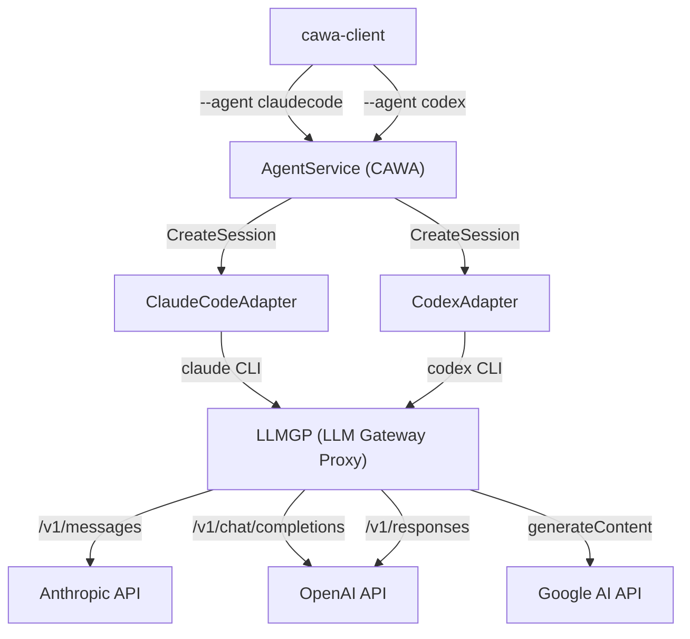

# 027: Codex エンジン統合 - CAWA バックエンドとしての選択対応

## 背景 (Background)

### 現状

HAG (Headless-Agent-Gateway) の CAWA (Coding Agent Web API) は、現在 Claude Code CLI のみをバックエンドエンジンとして登録している。`codingagent/codex/` パッケージには Codex CLI アダプタの骨格実装（`CodingAgent` インターフェース準拠、JSON-RPC 2.0 プロトコル、`config.toml` 生成、プロセス管理）が既に存在するが、実際の統合テストや `standalone` サーバーへの登録は行われていない。

### 課題

調査レポート（investigation_report.md）により、以下の 5 つのギャップ (GAP-01 ~ GAP-05) が特定されている:

1. **GAP-01**: `config.toml` の `wire_api` が `"chat"` 固定。Responses API モデル（`codex-mini-latest` 等）に対応できない
2. **GAP-02/03**: `codex/process.go` に `stderr` キャプチャおよびプロセス終了監視ゴルーチンが欠如。エラーが `EventError` としてストリームに伝達されない
3. **GAP-04**: `OPENAI_API_KEY` 環境変数にセッション ID メタデータが埋め込まれていない。LLMGP 側でセッション特定ができない
4. **GAP-05**: LLMGP に `POST /v1/responses` エンドポイントが未登録。Codex CLI が `wire_api = "responses"` でリクエストした場合にプロキシできない

### 目標

- Claude Code と Codex を CAWA のバックエンドとして切り替え可能にする
- `cawa-client --agent codex` で Codex CLI 経由のタスク実行を実現する
- GPT-Codex モデルだけでなく、Claude Sonnet や Gemini など他プロバイダのモデルでも基本的な処理（ファイル作成等）が動作することを確認する

## 要件 (Requirements)

### 必須要件

#### R1: LLMGP に `/v1/responses` パススルーエンドポイントを追加 (GAP-05)

- `llmgateway/proxy.go` の `setupRoutes()` に `POST /v1/responses` を登録する
- ハンドラ `handleOpenAIResponses` を新規作成する
- リクエストの `Authorization` ヘッダーからセッション ID を抽出する（`ExtractSessionID` を利用）
- `ModelRouter.ResolveModel()` でモデル解決を行い、API キー（Vault）を特定する
- 上流 OpenAI `/v1/responses` にリクエストをそのまま転送する（パススルー）
- レスポンス（ストリーミング含む）をクライアントにそのまま返却する
- BifrostDriver 非利用時（スタンドアロン ProxyServer）でも動作するよう設計する

#### R2: `config.toml` の `wire_api` を動的に設定 (GAP-01)

- `codex/config.go` の `GenerateConfigTOML` にパラメータ `wireAPI string` を追加する
- `wire_api` の値を `"chat"` (デフォルト) または `"responses"` から選択可能にする
- `codex/adapter.go` の `CreateSession` でモデルの動作モード（`mode`）を判定し、適切な `wireAPI` を `GenerateConfigTOML` に渡す
- モデルの `mode` 判定には `AdapterConfig` に新規追加する `ModelMode` フィールドを使用する（`agentservice` がセッション作成時にモデルプロファイルから取得して設定する）

#### R3: Codex アダプタにエラーハンドリングを追加 (GAP-02, GAP-03)

- `codex/process.go` の `StartProcess` で `cmd.Stderr` を `bytes.Buffer` にキャプチャする
- stdout 読み取りゴルーチン終了後に `cmd.Wait()` を呼び出し、non-zero 終了時に `EventError` をチャネルに送信する
- エラーメッセージは `stderr` のキャプチャ内容を優先的に使用し、空の場合は `err.Error()` を使用する
- `claudecode/process.go` の既存パターンと同じ設計にする

#### R4: `OPENAI_API_KEY` にセッション ID メタデータを埋め込み (GAP-04)

- `codex/process.go` の `BuildEnv` で `OPENAI_API_KEY` の値を以下の形式に変更する:
  ```
  not-needed;fallback=<true|false>;sid=<SESSION_ID>
  ```
- `fallback` は `AdapterConfig.ToolCallFallback` の値を使用する
- `sid` は `SessionConfig.AgentSessionID` を使用し、空の場合は `"default"` とする
- LLMGP 側の既存 `ExtractSessionID` / `ExtractFallbackFlag` でパース可能な形式を維持する

#### R5: `cawa-server` に Codex アダプタを登録

- `examples/cawa-server/main.go` の `registerCodingAgents()` に Codex CLI の登録ロジックを追加する
- `exec.LookPath("codex")` で Codex CLI の存在を確認し、存在する場合のみ登録する
- `claudecode` と同じパターンで `codex.New(&codingagent.AdapterConfig{...})` を呼び出し、`srv.AgentService().RegisterAgent(adapter)` で登録する
- Gateway URL、デフォルトモデル、ToolCallFallback を `claudecode` と同様に設定する

#### R6: Codex アダプタにログ出力を追加

- `codex/adapter.go` と `codex/process.go` に `logger.Logger` を導入する
- `claudecode` アダプタと同等の粒度でログを出力する:
  - `adapter.go`: セッション作成・終了のログ
  - `process.go`: CLI 引数、環境変数（API キーはマスク）、プロセス開始・終了のログ

#### R7: `codex/process.go` に `stdin` の EOF 送信を追加

- `startThread` 送信後に `stdin.Close()` を呼び出し、Codex CLI に入力の完了を通知する
- 一部のバージョンの Codex CLI が stdin の EOF を待つ動作をする場合に対応する

## 実現方針 (Implementation Approach)

### アーキテクチャ



### Codex CLI の通信フロー

```mermaid
sequenceDiagram
    participant AS as AgentService
    participant CX as Codex CLI
    participant GW as LLMGP
    participant UP as Upstream API

    AS->>CX: exec(codex --config config.toml)
    AS->>CX: stdin: {"jsonrpc":"2.0","method":"initialize","id":1}
    AS->>CX: stdin: {"jsonrpc":"2.0","method":"startThread","id":2,"params":{"prompt":"..."}}
    
    CX->>GW: POST /v1/chat/completions (or /v1/responses)
    Note over GW: Authorization: Bearer not-needed;sid=xxx
    GW->>UP: Forward with real API key
    UP-->>GW: Response (stream)
    GW-->>CX: Response (stream)
    
    CX->>AS: stdout: {"jsonrpc":"2.0","method":"text","params":{"content":"..."}}
    CX->>AS: stdout: {"jsonrpc":"2.0","method":"approval_request","id":5,"params":{"tool":"Write"}}
    AS->>CX: stdin: {"jsonrpc":"2.0","id":5,"result":{"approved":true}}
    CX->>AS: stdout: {"jsonrpc":"2.0","method":"tool_use","params":{"name":"Write","input":{...}}}
    CX->>AS: stdout: {"jsonrpc":"2.0","method":"result"}
```

### 主要コンポーネントと変更ファイル

| ファイル | 変更種別 | 内容 |
|---|---|---|
| `shared/libs/go/llmgateway/proxy.go` | 修正 | `/v1/responses` ルート追加 |
| `shared/libs/go/llmgateway/proxy_openai.go` | 修正 | `handleOpenAIResponses` ハンドラ追加 |
| `shared/libs/go/codingagent/codex/config.go` | 修正 | `wireAPI` パラメータ追加 |
| `shared/libs/go/codingagent/codex/config_test.go` | 修正 | `wireAPI` テスト追加 |
| `shared/libs/go/codingagent/codex/process.go` | 修正 | stderr キャプチャ、エラーハンドリング、セッションメタデータ、ログ追加 |
| `shared/libs/go/codingagent/codex/process_test.go` | 修正 | メタデータ埋め込みテスト追加 |
| `shared/libs/go/codingagent/codex/adapter.go` | 修正 | ログ追加、`ModelMode` 対応 |
| `shared/libs/go/codingagent/adapter_config.go` | 修正 | `ModelMode` フィールド追加 |
| `examples/cawa-server/main.go` | 修正 | Codex アダプタ登録ロジック追加 |
| `tests/codex_e2e_test.go` | 新規 | Codex E2E テスト |

## 検証シナリオ (Verification Scenarios)

### シナリオ 1: Codex + デフォルトモデル (OpenAI) でのファイル作成

1. `cawa-server` を起動し、`codex` エージェントが登録されていることを `cawa-client agents` で確認する
2. `cawa-client --agent codex --prompt "Create a file named hello.txt with 'Hello Codex'" --work-dir ./tmp/` を実行する
3. SSE ストリームが流れ、text / tool_use / result イベントが受信されることを確認する
4. `./tmp/hello.txt` が作成され、内容に `Hello Codex` が含まれることを確認する
5. セッションステータスが `completed` になることを確認する

### シナリオ 2: Codex + Gemini モデルでの簡単な処理

1. `cawa-client --agent codex --model gemini-2.5-flash --prompt "Create test.txt containing 'Hello from Gemini via Codex'" --work-dir ./tmp/` を実行する
2. Codex CLI が LLMGP 経由で Gemini API にリクエストを転送し、応答を受けることを確認する
3. `./tmp/test.txt` が作成されることを確認する

### シナリオ 3: Codex + Claude Sonnet モデルでの簡単な処理

1. `cawa-client --agent codex --model claude-sonnet-4-20250514 --prompt "Create test.txt containing 'Hello from Sonnet via Codex'" --work-dir ./tmp/` を実行する
2. Codex CLI が LLMGP 経由で Anthropic API にリクエストを転送し、応答を受けることを確認する
3. `./tmp/test.txt` が作成されることを確認する

### シナリオ 4: エラーハンドリング

1. 存在しないモデルを指定して `cawa-client --agent codex --model nonexistent-model --prompt "hello" --work-dir ./tmp/` を実行する
2. SSE ストリームに `error` イベントが送信されることを確認する
3. セッションステータスが `error` になることを確認する

### シナリオ 5: LLMGP `/v1/responses` パススルー

1. LLMGP が起動した状態で、直接 `POST /v1/responses` にリクエストを送信する
2. 上流 OpenAI API にリクエストが転送され、レスポンスが返ることを確認する
3. ストリーミングモード (`stream: true`) でもイベントが正常に中継されることを確認する

## テスト項目 (Testing for the Requirements)

### テスト戦略: ブレークダウン

テストは以下のレイヤーで段階的に検証する。全層が通ることで最終的な E2E 動作を保証する。

### レイヤー 1: 単体テスト (既存パッケージ内)

対象: `codex/`, `llmgateway/`

| 要件 | テスト関数 | ファイル | 検証内容 |
|---|---|---|---|
| R1 | `TestProxyServer_ResponsesRoute` | `proxy_test.go` | `/v1/responses` にルートが登録されていること |
| R1 | `TestHandleOpenAIResponses_Passthrough` | `proxy_openai_test.go` | パススルーが正常動作すること |
| R2 | `TestGenerateConfigTOML_WireAPIChat` | `config_test.go` | `wire_api = "chat"` が出力されること |
| R2 | `TestGenerateConfigTOML_WireAPIResponses` | `config_test.go` | `wire_api = "responses"` が出力されること |
| R3 | `TestCodexProcess_StderrCapture` | `process_test.go` | stderr がキャプチャされること (構造テスト) |
| R4 | `TestCodexBuildEnv_SessionMetadata` | `process_test.go` | `OPENAI_API_KEY` にメタデータが含まれること |
| R4 | `TestCodexBuildEnv_FallbackFlag` | `process_test.go` | `fallback=true` が正しく設定されること |

### レイヤー 2: 統合テスト (AgentService レベル)

対象: `tests/agentservice_integration_test.go`

| テスト関数 | 検証内容 |
|---|---|
| `TestAgentService_CodexAgent_Registration` | Codex アダプタが AgentService に登録されること |
| `TestAgentService_CodexAgent_SessionLifecycle` | Codex エージェントのセッション作成・取得・削除が正常に動作すること |

### レイヤー 3: E2E テスト (実コマンド実行)

対象: `tests/codex_e2e_test.go` (新規作成)

| テスト関数 | 検証内容 | 前提条件 |
|---|---|---|
| `TestCodexE2E_FileCreation` | Codex CLI + デフォルトモデルでファイル作成が完了すること | `codex` CLI が PATH に存在、OpenAI API キーが keyring に設定済み |
| `TestCodexE2E_GeminiModel_FileCreation` | Codex CLI + Gemini モデルで簡単なファイル作成が動作すること | `codex` CLI が PATH に存在、Google API キーが keyring に設定済み |
| `TestCodexE2E_ClaudeModel_FileCreation` | Codex CLI + Claude Sonnet モデルで簡単なファイル作成が動作すること | `codex` CLI が PATH に存在、Anthropic API キーが keyring に設定済み |
| `TestCodexE2E_ErrorPropagation` | 不正モデル指定時にエラーが SSE 経由で伝達されること | `codex` CLI が PATH に存在 |

### レイヤー 4: LLMGP パススルーテスト

対象: `tests/llm_gateway_test.go` (既存ファイルに追加)

| テスト関数 | 検証内容 | 前提条件 |
|---|---|---|
| `TestResponsesAPI_Passthrough_NonStream` | `/v1/responses` で非ストリーミングリクエストが正常にプロキシされること | OpenAI API キーが keyring に設定済み |
| `TestResponsesAPI_Passthrough_Stream` | `/v1/responses` でストリーミングリクエストが正常にプロキシされること | OpenAI API キーが keyring に設定済み |

### 自動検証コマンド

1. ビルド + 単体テスト:
   ```bash
   scripts/process/build.sh
   ```

2. Codex E2E テスト:
   ```bash
   scripts/process/integration_test.sh --specify "TestCodexE2E"
   ```

3. LLMGP Responses API テスト:
   ```bash
   scripts/process/integration_test.sh --specify "TestResponsesAPI_Passthrough"
   ```

4. 全 LLM テスト (回帰確認含む):
   ```bash
   scripts/process/integration_test.sh --categories "llm"
   ```
