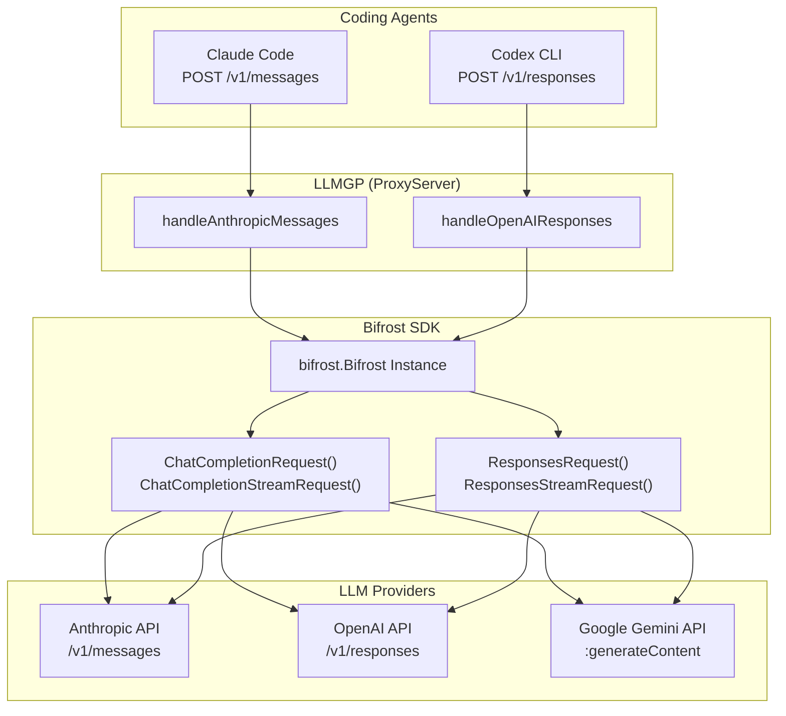

# 028: LLMGP 変換処理の Bifrost SDK 委譲

## 背景 (Background)

現在の LLMGP (LLM Gateway Proxy) は、各 LLM プロバイダ (Anthropic, OpenAI, Google Gemini) への
リクエスト変換・レスポンス逆変換を自前で実装している。一方で、依存している Bifrost SDK (v1.5.15) は
これらの変換機能を内蔵しており、機能が重複している。

### 現在の問題

1. **Codex + Gemini/Anthropic が動作しない**: Codex CLI は Responses API (`POST /v1/responses`) を使用するが、
   `handleOpenAIResponses` はパススルー方式のため、Google API の存在しない `/v1/responses` エンドポイントに
   リクエストが転送され 404 エラーとなる。Anthropic も同様。

2. **変換コードの重複**: LLMGP に約 1,300行 の自前変換コード (`convert_a2g.go`, `convert_a2o.go`, `convert_a2r.go`)
   があるが、Bifrost SDK が同等の変換を各プロバイダ (24プロバイダ対応) で内蔵している。

3. **Bifrost SDK の活用不足**: 現在 Bifrost SDK は `BifrostAccount` (設定管理) と `ModelRouter` (ルーティング)
   のみに使用されており、本来の変換・転送機能が活用されていない。

### 現在の LLMGP ルーティング対応表

| Inbound API | Agent | Anthropic | OpenAI | Google |
|---|---|---|---|---|
| `POST /v1/messages` | Claude Code | OK (パススルー) | OK (自前変換) | OK (自前変換) |
| `POST /v1/responses` | Codex CLI | **NG** | OK (パススルー) | **NG** |

## 要件 (Requirements)

### 必須要件

1. **R1: `handleOpenAIResponses` の Bifrost 委譲**
   - `handleOpenAIResponses` のリクエスト転送を `providerForwarder` から Bifrost SDK の
     `ResponsesRequest()` / `ResponsesStreamRequest()` に置き換える
   - これにより Codex CLI から Gemini, Anthropic モデルが利用可能になる

2. **R2: `handleAnthropicMessages` の Bifrost 委譲**
   - `handleAnthropicMessages` のリクエスト転送を Bifrost SDK の
     `ChatCompletionRequest()` / `ChatCompletionStreamRequest()` に置き換える
   - Claude Code からの全プロバイダ接続が Bifrost 経由になる

3. **R3: Bifrost インスタンスの生成と管理**
   - `BifrostDriver` に `bifrost.Bifrost` インスタンスを生成・保持する
   - 既存の `BifrostAccount` をそのまま使用してプロバイダ設定を提供する
   - ProviderQueue の初期化とライフサイクル管理を行う

4. **R4: SSE ストリーミングの Bifrost チャネル変換**
   - Bifrost SDK は `chan *BifrostStreamChunk` でストリーミングを提供する
   - このチャネルから受信したチャンクを SSE (`text/event-stream`) 形式に
     エンコードして HTTP レスポンスとして返す変換レイヤーを実装する

5. **R5: 既存の自前変換コードの段階的削除**
   - R1, R2 が完了し動作確認後、不要になった変換関数を削除する
   - 対象: `convert_a2g.go`, `convert_a2o.go`, `convert_a2r.go` および関連テスト

6. **R6: 既存機能のリグレッション防止**
   - Claude Code + 各モデル (Anthropic, OpenAI, Gemini) の既存動作を維持する
   - Codex + OpenAI モデルの既存動作を維持する

### 実装順序

Phase 1 (R1 + R3 + R4) と Phase 2 (R2) を分けて段階的に進める。
Phase 1 完了後に Phase 2 に進む。R5 は Phase 2 完了後に実施する。

## 実現方針 (Implementation Approach)

### アーキテクチャ概要



### Phase 1: handleOpenAIResponses の Bifrost 委譲

#### 1.1 Bifrost インスタンスの生成 (R3)

`BifrostDriver` に `*bifrost.Bifrost` フィールドを追加し、`NewBifrostDriver` で初期化する。

```go
type BifrostDriver struct {
    // 既存フィールド
    cfg      *config.AppConfig
    profiles *config.ModelProfilesConfig
    vault    vault.VaultStore
    logger   logger.Logger
    proxy    *ProxyServer
    router   *ModelRouter
    account  *BifrostAccount
    // 新規追加
    bifrost  *bifrost.Bifrost  // Bifrost SDK インスタンス
}
```

初期化:

```go
func NewBifrostDriver(...) (*BifrostDriver, error) {
    // ... 既存の初期化コード ...
    
    // Bifrost SDK インスタンスの生成
    bi, err := bifrost.Init(ctx, d.account, &bifrost.BifrostConfig{
        // 設定
    })
    if err != nil {
        return nil, fmt.Errorf("bifrost init: %w", err)
    }
    d.bifrost = bi
    
    return d, nil
}
```

#### 1.2 handleOpenAIResponses の書き換え (R1)

現在の `providerForwarder.forwardWithRetry()` を Bifrost の `ResponsesRequest()` / `ResponsesStreamRequest()` に置き換える。

```go
func (p *ProxyServer) handleOpenAIResponses(w http.ResponseWriter, r *http.Request) {
    // 1. JSON パース (既存のまま)
    // 2. ModelRouter で解決 (既存のまま)
    // 3. Vault でキー解決 (既存のまま)
    
    // 4. Bifrost リクエスト構築 (新規)
    bifrostReq := &schemas.BifrostResponsesRequest{
        Provider: schemas.ModelProvider(routed.Provider),
        Model:    routed.Model,
        // Input, Params はリクエストボディからパース
    }
    
    // 5. ストリーミング判定
    if isStreaming(req) {
        // ResponsesStreamRequest -> chan *BifrostStreamChunk -> SSE
        ch, err := p.driver.bifrost.ResponsesStreamRequest(ctx, bifrostReq)
        // ch をSSE形式に変換して w に書き出す
    } else {
        // ResponsesRequest -> BifrostResponsesResponse -> JSON
        resp, err := p.driver.bifrost.ResponsesRequest(ctx, bifrostReq)
        // resp をJSON形式で w に書き出す
    }
}
```

#### 1.3 Bifrost チャネル → SSE 変換 (R4)

```go
func writeBifrostStreamAsSSE(w http.ResponseWriter, ch chan *schemas.BifrostStreamChunk, model string) error {
    flusher, ok := w.(http.Flusher)
    // ...
    for chunk := range ch {
        // BifrostStreamChunk -> SSE "data: {...}\n\n" 形式に変換
        // chunk.ResponsesStreamResponse をそのまま JSON marshal して SSE で返す
    }
}
```

### Phase 2: handleAnthropicMessages の Bifrost 委譲

Phase 1 と同様のパターンで、`handleAnthropicMessages` を Bifrost の
`ChatCompletionRequest()` / `ChatCompletionStreamRequest()` に委譲する。

Anthropic Messages API からの入力を `BifrostChatRequest` に変換し、
Bifrost のレスポンスを Anthropic Messages API 形式に逆変換して返す。

### Phase 3: 自前変換コードの削除 (R5)

Phase 2 完了後、以下のファイルを削除:

- `convert_a2g.go` / `convert_a2g_test.go` (Anthropic -> Gemini)
- `convert_a2o.go` / `convert_a2o_test.go` (Anthropic -> OpenAI)
- `convert_a2r.go` / `convert_a2r_test.go` (Anthropic -> Responses)
- `provider_forwarder.go` / `provider_forwarder_test.go` (HTTP 転送)

### 制約・注意事項

1. **fasthttp 依存**: Bifrost SDK は内部で `fasthttp` を使用。LLMGP は `net/http` を使用。
   Bifrost をライブラリとして使用する場合、HTTP サーバー部分は LLMGP 側の `net/http` のまま、
   Bifrost は「バックエンド呼び出しエンジン」として使用する形になる。

2. **OpenAI Responses API のリクエスト形式**: Codex CLI が送信するリクエストボディを
   `schemas.BifrostResponsesRequest` に正しくパースする必要がある。
   OpenAI Responses API の `input` フィールド (メッセージ配列) を
   `[]schemas.ResponsesMessage` にマッピングする。

3. **ストリーミングレスポンスの形式**: Codex CLI は OpenAI Responses API の SSE 形式を期待する。
   Bifrost の `BifrostStreamChunk` に含まれる `ResponsesStreamResponse` を
   そのまま SSE イベントとして返せるかを確認する必要がある。

## 検証シナリオ (Verification Scenarios)

### シナリオ 1: Codex + Gemini でファイル作成 (Phase 1 の核心)

1. HAG サーバーを起動する (`./bin/standalone -config ./examples/standalone/config.yaml`)
2. `./bin/cawa-client run --agent codex --model gemini-2.5-flash --prompt "Create a file named hello.txt containing 'Hello from Gemini via Codex'" --work-dir ./tmp/` を実行
3. SSE ストリームが正常に返ること (エラーイベントなし)
4. `./tmp/hello.txt` が作成され、期待する内容を含むこと
5. セッションのステータスが `completed` であること

### シナリオ 2: Codex + Anthropic でファイル作成 (Phase 1)

1. HAG サーバーを起動する
2. `./bin/cawa-client run --agent codex --model claude-sonnet-4-20250514 --prompt "Create a file named hello.txt containing 'Hello from Anthropic via Codex'" --work-dir ./tmp/` を実行
3. SSE ストリームが正常に返ること
4. ファイルが作成されること

### シナリオ 3: Codex + GPT-5.x-codex (OpenAI) の既存動作維持 (Phase 1)

1. HAG サーバーを起動する
2. `./bin/cawa-client run --agent codex --model gpt-5.x-codex --prompt "Create a file named hello.txt containing 'Hello from OpenAI via Codex'" --work-dir ./tmp/` を実行
3. SSE ストリームが正常に返ること
4. ファイルが作成されること
5. Bifrost 委譲後も OpenAI モデルへのルーティングが正常に動作すること

### シナリオ 4: Claude Code + Gemini の既存動作維持 (Phase 2)

1. HAG サーバーを起動する
2. `./bin/cawa-client run --agent claudecode --model gemini-2.5-flash --prompt "Create a file named hello.txt containing 'Hello from Gemini via Claude Code'" --work-dir ./tmp/` を実行
3. SSE ストリームが正常に返ること
4. ファイルが作成されること

### シナリオ 5: Claude Code + Anthropic の既存動作維持 (Phase 2)

1. HAG サーバーを起動する
2. `./bin/cawa-client run --agent claudecode --model claude-sonnet-4-20250514 --prompt "Create a file named hello.txt containing 'Hello from Anthropic via Claude Code'" --work-dir ./tmp/` を実行
3. SSE ストリームが正常に返ること
4. ファイルが作成されること

## テスト項目 (Testing for the Requirements)

### 単体テスト

- Bifrost インスタンスの初期化と破棄が正常に動作すること
- `BifrostResponsesRequest` の構築が正しいこと
- BifrostStreamChunk → SSE 変換が正しいこと

### 統合テスト (自動化)

#### Phase 1 (Codex + cross-provider)

```bash
# Codex E2E テスト (Gemini テストの SKIP 解除含む)
./scripts/process/integration_test.sh --specify TestCodexE2E
```

対象テスト:
- `TestCodexE2E_FileCreation` -- Codex + OpenAI (既存、動作維持)
- `TestCodexE2E_GeminiModel_FileCreation` -- Codex + Gemini (SKIP 解除、新規動作)
- `TestCodexE2E_ErrorPropagation` -- エラー伝播 (既存、動作維持)
- `TestCodexE2E_HealthWithCodexAgent` -- ヘルスチェック (既存、動作維持)
- 追加: `TestCodexE2E_AnthropicModel_FileCreation` -- Codex + Anthropic (新規)

#### Phase 2 (Claude Code + cross-provider via Bifrost)

```bash
# Claude Code E2E テスト
./scripts/process/integration_test.sh --specify TestE2E
```

対象テスト:
- `TestE2E_CodingAgentStreaming` -- Claude Code + ストリーミング (既存、リグレッション確認)
- `TestE2E_CodingAgentError` -- エラー伝播 (既存、リグレッション確認)
- `TestE2E_CodingAgentDefaultModel` -- デフォルトモデル (既存、リグレッション確認)

#### 全体リグレッション

```bash
# ビルド + 全単体テスト
./scripts/process/build.sh

# 全統合テスト
./scripts/process/integration_test.sh
```
