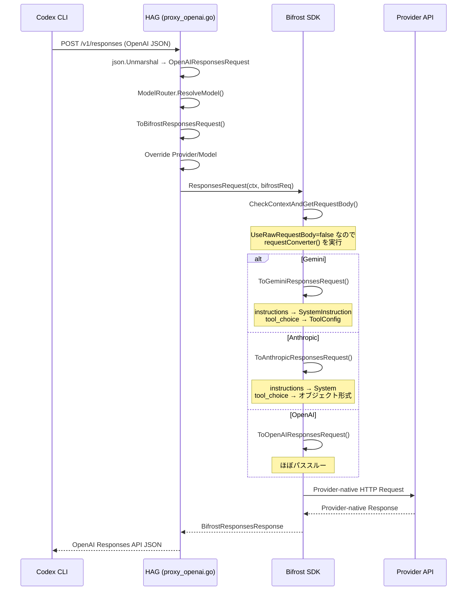

# 029: Responses API の Bifrost 型変換パス移行

## 背景 (Background)

### 前提: 028-Bifrost-Delegation-Migration の成果

[028-Bifrost-Delegation-Migration](file:///c:/Users/yamya/myprog/Headless-Agent-Gateway/work/feat-llm-backend/prompts/phases/000-foundation/branches/feat-llm-backend/ideas/028-Bifrost-Delegation-Migration.md) により、`handleOpenAIResponses` は Bifrost SDK の `ResponsesRequest()` / `ResponsesStreamRequest()` に委譲された。しかし、その実装では `UseRawRequestBody` モードを使用しており、OpenAI Responses API のリクエストボディを raw bytes のまま Bifrost SDK に渡している。

### 現在の問題

E2E テストの結果、6件中 2件が失敗している:

| テスト | プロバイダ | 結果 | エラー |
|---|---|---|---|
| TestCodexE2E_FileCreation | OpenAI gpt-4o | PASS | - |
| TestCodexE2E_GPT5Codex_FileCreation | OpenAI gpt-5.3-codex | PASS | - |
| TestCodexE2E_ErrorPropagation | - | PASS | - |
| TestCodexE2E_HealthWithCodexAgent | - | PASS | - |
| **TestCodexE2E_GeminiModel_FileCreation** | **Gemini** | **FAIL** | **"Unknown name instructions"** |
| **TestCodexE2E_AnthropicModel_FileCreation** | **Anthropic** | **FAIL** | **"Input should be an object"** |

### 根本原因

`UseRawRequestBody=true` を設定すると、Bifrost SDK 内部の `CheckContextAndGetRequestBody()` ([providers/utils/utils.go:1138-1174](file:///C:/Users/yamya/go/pkg/mod/github.com/maximhq/bifrost/core@v1.5.15/providers/utils/utils.go#L1138-L1174)) が `requestConverter()` をバイパスし、raw bytes をそのままプロバイダ API に送信する。

これにより、OpenAI 固有のフィールドが変換されずにプロバイダ API に到達する:

| フィールド | OpenAI 形式 | Gemini で必要な形式 | Anthropic で必要な形式 |
|---|---|---|---|
| `instructions` | `"instructions": "..."` | `"systemInstruction": {...}` | `"system": [...]` |
| `tool_choice` | `"tool_choice": "auto"` (文字列) | `"toolConfig": {...}` | `"tool_choice": {"type": "auto"}` (オブジェクト) |

### コミュニティ調査結果

- GitHub Issues #3408, #3511, #3322 で類似の問題が報告されている
- Bifrost SDK v1.5.18 (最新) でもこの設計は変わっていない
- `UseRawRequestBody` は同一プロバイダ向けの最適化パスであり、クロスプロバイダ変換のバイパスは設計意図通りの動作

## 要件 (Requirements)

### 必須要件

1. **R1: UseRawRequestBody の廃止**
   - `handleOpenAIResponses` から `BifrostContextKeyUseRawRequestBody = true` の設定を除去する
   - `BifrostResponsesRequest.RawRequestBody` フィールドへの raw bytes の設定を除去する

2. **R2: OpenAI Responses API リクエストのフルパース**
   - リクエストボディを Bifrost SDK の `openai.OpenAIResponsesRequest` 型にフルデシリアライズする
   - 現在の最小パース (`openaiRequest{Model}`) を置き換える

3. **R3: Bifrost 正規変換パスの利用**
   - `OpenAIResponsesRequest.ToBifrostResponsesRequest()` を使用して `BifrostResponsesRequest` を構築する
   - Bifrost SDK 内部の `requestConverter()` が各プロバイダ向けの変換を実行する:
     - `ToGeminiResponsesRequest()`: `instructions` → `SystemInstruction`, `tool_choice` → `ToolConfig`
     - `ToAnthropicResponsesRequest()`: `instructions` → `System`, `tool_choice` → オブジェクト形式
     - `ToOpenAIResponsesRequest()`: OpenAI 同士のためほぼパススルー

4. **R4: ルーティング結果の適用**
   - `ToBifrostResponsesRequest()` 後、`ModelRouter` のルーティング結果 (`routed.Provider`, `routed.Model`) を `BifrostResponsesRequest` に上書きする

5. **R5: 既存テストのリグレッションなし**
   - 既存 PASS の 4 テスト (OpenAI gpt-4o, gpt-5.3-codex, ErrorPropagation, HealthCheck) が引き続き PASS すること

6. **R6: Bifrost SDK のバージョンアップ (v1.5.15 → v1.5.18)**
   - Go module `github.com/maximhq/bifrost/core` を v1.5.15 から v1.5.18 にアップグレードする
   - 他のバグ修正・CVE 対応を取り込む

## 実現方針 (Implementation Approach)

### 変更対象ファイル

変更は 1 ファイルのみ:

- [proxy_openai.go](file:///c:/Users/yamya/myprog/Headless-Agent-Gateway/work/feat-llm-backend/shared/libs/go/llmgateway/proxy_openai.go)

### 変更内容

#### 1. import 追加

```go
import (
    // 既存
    bifrostSchemas "github.com/maximhq/bifrost/core/schemas"
    // 追加
    bifrostOpenAI "github.com/maximhq/bifrost/core/providers/openai"
)
```

#### 2. handleOpenAIResponses 関数の変更

**変更前** (L160-277):

```go
// 最小パース (Model のみ)
var req openaiRequest
if err := json.Unmarshal(body, &req); err != nil { ... }

// ... (ルーティング等) ...

// Raw body でBifrostResponsesRequest を構築
providerKey := toBifrostProvider(routed.Provider)
bifrostReq := &bifrostSchemas.BifrostResponsesRequest{
    Provider:       providerKey,
    Model:          routed.Model,
    Input:          []bifrostSchemas.ResponsesMessage{},
    RawRequestBody: forwardBody,
}

// raw body mode を有効化
bifrostCtx := bifrostSchemas.NewBifrostContext(r.Context(), bifrostSchemas.NoDeadline)
bifrostCtx.SetValue(bifrostSchemas.BifrostContextKeyUseRawRequestBody, true)
```

**変更後**:

```go
// OpenAI Responses API リクエストをフルパース
var oaiReq bifrostOpenAI.OpenAIResponsesRequest
if err := json.Unmarshal(body, &oaiReq); err != nil { ... }

// Model をルーティング用に取得
req := openaiRequest{Model: oaiReq.Model}

// ... (ルーティング等 -- 変更なし) ...

// モデル名書き換え (ルーティングで変わった場合)
if routed.Model != req.Model {
    oaiReq.Model = routed.Model
}

// Bifrost 正規変換パスで BifrostResponsesRequest を構築
bifrostCtx := bifrostSchemas.NewBifrostContext(r.Context(), bifrostSchemas.NoDeadline)
bifrostReq := oaiReq.ToBifrostResponsesRequest(bifrostCtx)

// ルーティング結果でプロバイダとモデルを上書き
providerKey := toBifrostProvider(routed.Provider)
bifrostReq.Provider = providerKey
bifrostReq.Model = routed.Model

// UseRawRequestBody は設定しない
// → Bifrost SDK が requestConverter() でプロバイダ固有の変換を実行する
```

### データフロー



### 影響範囲

| 項目 | 影響 |
|---|---|
| `handleOpenAIChatCompletions` | **なし** -- 別の処理パス |
| `handleAnthropicMessages` | **なし** -- 別の処理パス |
| `handleOpenAIResponsesLegacy` | **なし** -- Bifrost SDK 未初期化時のフォールバックパス |
| `handleOpenAIResponsesStream` | **なし** -- Bifrost SDK への呼び出し以降は同じ |
| `handleOpenAIResponsesNonStream` | **なし** -- Bifrost SDK への呼び出し以降は同じ |
| `rewriteModelField` | **不要になる** -- `oaiReq.Model` を直接書き換えるため |
| `isStreamRequest` | **変更なし** -- `oaiReq.Stream` を直接参照可能だが、下流関数との互換性のため body ベースの判定を維持してもよい |

## 検証シナリオ (Verification Scenarios)

### シナリオ 1: Codex + Gemini (現在 FAIL → PASS にすべき)

1. HAG サーバーを起動する (Gemini API キー設定済み)
2. `TestCodexE2E_GeminiModel_FileCreation` を実行
3. Codex CLI が Gemini モデルに Responses API リクエストを送信
4. `instructions` が `SystemInstruction` に変換され、Gemini API に正しく送信されること
5. ファイルが作成され、テストが PASS すること

### シナリオ 2: Codex + Anthropic (現在 FAIL → PASS にすべき)

1. HAG サーバーを起動する (Anthropic API キー設定済み)
2. `TestCodexE2E_AnthropicModel_FileCreation` を実行
3. Codex CLI が Anthropic モデルに Responses API リクエストを送信
4. `tool_choice` がオブジェクト形式に変換され、Anthropic API に正しく送信されること
5. ファイルが作成され、テストが PASS すること

### シナリオ 3: Codex + OpenAI (既存 PASS の維持)

1. HAG サーバーを起動する
2. `TestCodexE2E_FileCreation` および `TestCodexE2E_GPT5Codex_FileCreation` を実行
3. OpenAI → OpenAI のパスで、正規変換パスでも正しく動作すること
4. テストが PASS すること

### シナリオ 4: エラー伝播とヘルスチェック (既存 PASS の維持)

1. `TestCodexE2E_ErrorPropagation` を実行し、PASS すること
2. `TestCodexE2E_HealthWithCodexAgent` を実行し、PASS すること

## テスト項目 (Testing for the Requirements)

### 単体テスト

新規の単体テストは不要。変更は既存の `handleOpenAIResponses` 関数内のリクエスト構築方法のみであり、Bifrost SDK 内部の変換ロジック（`ToBifrostResponsesRequest`, `ToGeminiResponsesRequest` 等）は既に Bifrost SDK 側でテスト済み。

### 統合テスト (自動化)

#### Codex E2E テスト (全 6 件が PASS すること)

```bash
./scripts/process/integration_test.sh --specify TestCodexE2E
```

対象テスト:

| テスト名 | プロバイダ | 現在 | 期待 |
|---|---|---|---|
| `TestCodexE2E_FileCreation` | OpenAI gpt-4o | PASS | PASS |
| `TestCodexE2E_GPT5Codex_FileCreation` | OpenAI gpt-5.3-codex | PASS | PASS |
| `TestCodexE2E_GeminiModel_FileCreation` | Gemini | FAIL | **PASS** |
| `TestCodexE2E_AnthropicModel_FileCreation` | Anthropic | FAIL | **PASS** |
| `TestCodexE2E_ErrorPropagation` | - | PASS | PASS |
| `TestCodexE2E_HealthWithCodexAgent` | - | PASS | PASS |

#### 全体リグレッション

```bash
# ビルド + 全単体テスト
./scripts/process/build.sh

# 全統合テスト
./scripts/process/integration_test.sh
```
