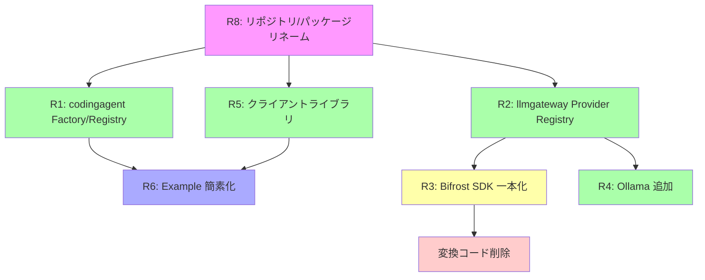

# 030: Factory/Registry パターン導入と Bifrost 一本化

## 背景

現在の llmgateway パッケージはプロバイダー固有のコードがフラットに分散しており、新プロバイダー追加時に最低5箇所の修正が必要。
また、codingagent パッケージにも factory がなく、アダプター登録ロジックが examples/standalone/main.go に流出している。
cawa-client もロジックが 442 行の main.go に詰め込まれており、ライブラリとして再利用できない。

本仕様では以下の4つの目的を達成する:

1. **Factory/Registry パターンの導入** (codingagent, llmgateway)
2. **Bifrost SDK 一本化** (/v1/messages ハンドラの移行)
3. **クライアントライブラリ化** (cawa-client -> hawkclient ライブラリ)
4. **Example の簡素化** (standalone -> cawa-server リネーム、最小コード example 追加)

## 要件

### R1: codingagent の Factory/Registry

**目的**: CodingAgent アダプターの登録を init() による自己申告制にする。

- codingagent パッケージにグローバル Registry を追加する
- 各アダプター(claudecode, codex)は init() 関数でファクトリ関数を自己登録する
- hag.Server の初期化時に、Registry に登録されたアダプターを自動的にインスタンス化・登録する
- CLI の存在チェック (exec.LookPath) はファクトリ内部で行い、利用者から隠蔽する
- examples/standalone/main.go (-> cawa-server) の registerCodingAgents() 関数を廃止する

**現在の問題箇所**:
- [standalone/main.go L65-L115](file:///c:/Users/yamya/myprog/Headless-Agent-Gateway/work/feat-llm-backend/examples/standalone/main.go#L65-L115): アダプターごとに exec.LookPath -> New -> RegisterAgent を手動で行っている
- 新しいアダプター追加時に main.go の修正が必要

**実現イメージ**:
```go
// codingagent/registry.go
var registry = map[string]FactoryFunc{}

type FactoryFunc func(cfg *AdapterConfig) (CodingAgent, error)

func Register(name string, factory FactoryFunc) {
    registry[name] = factory
}

func CreateAll(cfg *AdapterConfig) []CodingAgent { ... }
```

```go
// codingagent/claudecode/init.go
func init() {
    codingagent.Register("claudecode", func(cfg *codingagent.AdapterConfig) (codingagent.CodingAgent, error) {
        if _, err := exec.LookPath("claude"); err != nil {
            return nil, nil // CLI not available, skip
        }
        return New(cfg), nil
    })
}
```

### R2: llmgateway の Provider Registry

**目的**: プロバイダー固有のコード(BaseURL, 認証ヘッダー, 変換ロジック)を Provider インターフェースに集約し、switch-case を排除する。

- Provider インターフェースを定義する
- 各プロバイダーは init() で自己登録する
- providerBaseURLs マップ、認証ヘッダーの switch-case、proxy_anthropic.go のプロバイダー分岐を Provider インスタンスへの委譲に置き換える
- Ollama は新しい Provider として追加する

**現在の問題箇所** (プロバイダー固有コードの分散):
- [provider_forwarder.go L18-L22](file:///c:/Users/yamya/myprog/Headless-Agent-Gateway/work/feat-llm-backend/shared/libs/go/llmgateway/provider_forwarder.go#L18-L22): `providerBaseURLs` マップ
- [provider_forwarder.go L69-L88](file:///c:/Users/yamya/myprog/Headless-Agent-Gateway/work/feat-llm-backend/shared/libs/go/llmgateway/provider_forwarder.go#L69-L88): 認証ヘッダー switch-case
- [proxy_anthropic.go L108-L170](file:///c:/Users/yamya/myprog/Headless-Agent-Gateway/work/feat-llm-backend/shared/libs/go/llmgateway/proxy_anthropic.go#L108-L170): リクエスト変換 switch-case
- [proxy_anthropic.go L212-L320](file:///c:/Users/yamya/myprog/Headless-Agent-Gateway/work/feat-llm-backend/shared/libs/go/llmgateway/proxy_anthropic.go#L212-L320): レスポンス変換 switch-case
- [bifrost_account.go L14-L23](file:///c:/Users/yamya/myprog/Headless-Agent-Gateway/work/feat-llm-backend/shared/libs/go/llmgateway/bifrost_account.go#L14-L23): `providerNameMap` マップ

**Provider インターフェース案**:
```go
// llmgateway/provider.go
type Provider interface {
    Name() string
    BaseURL() string
    SetAuthHeaders(req *http.Request, apiKey string)
    BifrostProvider() bifrostSchemas.ModelProvider
}
```

### R3: Bifrost SDK 一本化 (/v1/messages ハンドラの移行)

**目的**: /v1/messages (Claude Code CLI 用) ハンドラを Bifrost SDK 経由に移行し、手動変換コード(convert_*.go)を段階的に廃止する。

**現状**:
- /v1/responses (Codex CLI): Bifrost SDK 経由 (移行済み)
- /v1/messages (Claude Code CLI): legacy forwarder + 手動変換コード (未移行)
- /v1/chat/completions: legacy forwarder パススルー

**移行方針**:
- handleAnthropicMessages 内で、受信した Anthropic Messages API 形式のリクエストを Bifrost SDK の ResponsesRequest 形式に変換する
- Bifrost SDK に処理を委譲し、レスポンスを Anthropic Messages API 形式に逆変換してクライアントに返す
- 以下のファイルの変換コードが不要になる:
  - convert_a2o.go (358行): Anthropic -> OpenAI Chat Completions
  - convert_a2g.go (493行): Anthropic -> Google Gemini
  - convert_a2r.go (517行): Anthropic -> OpenAI Responses
  - stream_converter.go (292行): OpenAI SSE -> Anthropic SSE
- provider_forwarder.go (336行) の legacy forwarder もフォールバック専用から完全廃止へ

**段階的アプローチ**:
1. Bifrost SDK パスを primary にし、legacy を fallback として残す
2. 全プロバイダーで Bifrost SDK パスが安定動作することを検証
3. legacy コード(convert_*.go, provider_forwarder.go)を削除

### R4: Ollama プロバイダーの追加

**目的**: Ollama を LLM Gateway のバックエンドプロバイダーとして追加する。

- Ollama は OpenAI 互換 API を提供しているため、Bifrost SDK の Ollama プロバイダーを通じて対応可能
- R2 の Provider Registry に Ollama Provider を init() で登録する
- bifrost_account.go の providerNameMap には既に `"ollama": bifrostSchemas.Ollama` が存在
- config (model_profiles.yaml) には既に ollama プロバイダーの定義構造がある
- network_config.base_url でカスタム URL (デフォルト: http://localhost:11434) を指定可能

### R5: クライアントライブラリ化 (client)

**目的**: cawa-client の HTTP クライアントロジックをライブラリに抽出し、再利用可能にする。

- shared/libs/go/client/ にパッケージを作成する
- 以下の機能をライブラリとして提供する:
  - Health チェック
  - エージェント一覧取得
  - モデル一覧取得
  - セッション作成・取得・削除
  - メッセージ送信 (SSE ストリーミング対応)
  - セッションログストリーミング
  - セッション終了
- examples/cawa-client は上記ライブラリを使用する薄い CLI ラッパーにリファクタリングする

**現在の問題箇所**:
- [cawa-client/main.go](file:///c:/Users/yamya/myprog/Headless-Agent-Gateway/work/feat-llm-backend/examples/cawa-client/main.go) (442行): HTTP リクエスト構築、レスポンスパース、SSE パースが全て main.go に実装されている

**Stream API の二層設計**:

- **初心者向け (デフォルト出力)**: `stream.Output(os.Stdout)` で指定した `io.Writer` に全イベントを出力し完了を待つ。1行で済む。ファイルにも書ける。
- **中級者向け (ハンドラ差し替え)**: `stream.OnText(fn)`, `stream.OnResult(fn)` 等でイベント別にハンドラを差し替えてから `stream.Run()` で実行。不要なイベントはデフォルト処理が行われる。
- **上級者向け (チャネル直接)**: `stream.Events()` で `chan Event` を取得し、自前で全イベントを処理する。

### R6: Example の簡素化とリネーム

**目的**: examples をシンプルにし、ライブラリの使いやすさを示す。

#### R6-1: standalone -> cawa-server リネーム + Viper/Cobra リファクタリング
- examples/standalone を examples/cawa-server にリネームする
- registerCodingAgents() を廃止し、R1 の Factory/Registry で自動登録にする
- Viper (設定管理) + Cobra (CLI フレームワーク) を導入して main.go を分割する
- main.go は Cobra の rootCmd 起動のみとし、サブコマンドやフラグ定義は別ファイルに分離
- 設定ファイルの読み込み、シグナルハンドリング、グレースフルシャットダウン等のボイラープレートを整理する
- 最小コード example は R6-2 で実現するため、cawa-server 自体は実用的な CLI アプリケーションとして構成する

#### R6-2: 最小コード example の追加

##### examples/minimal-server/
- HAG サーバーの最小起動コード:

```go
package main

import (
    "context"
    "fmt"
    "log"

    "github.com/axsh/arctic-tern/config"
    "github.com/axsh/arctic-tern/tern"
    _ "github.com/axsh/arctic-tern/codingagent/claudecode" // init() で自動登録
)

func main() {
    cfg := config.Load("config.yaml")
    srv, err := tern.New(
        tern.WithAgentServiceConfig(cfg.AgentServiceConfig()),
        tern.WithLLMServiceConfig(cfg.LLMServiceConfig()),
    )
    if err != nil {
        log.Fatal(err)
    }
    ctx := context.Background()
    if err := srv.Launch(ctx); err != nil {
        log.Fatal(err)
    }
    defer srv.Shutdown(ctx)

    fmt.Printf("HAG server running on %s\n", srv.AgentService().URL())
}
```

> **設計方針**: サーバー (`hag.Server`) は設定ファイルのローダーを内蔵しない。設定の読み込みは呼び出し側の責務とし、`config.Load()` で読み込んだ結果から `AgentServiceConfig()` と `LLMServiceConfig()` をそれぞれ取得して `hag.New()` に渡す。`LLMServiceConfig` は LLM Gateway のポート設定、ModelProfiles (プロバイダー/モデル定義)、Vault 設定等を含む。

##### examples/minimal-client/
- エージェントにタスクを与え、ストリーミングで結果を受信する最小コード:

```go
package main

import (
    "context"
    "log"
    "os"

    "github.com/axsh/arctic-tern/client"
)

func main() {
    ctx := context.Background()
    c := client.New("http://localhost:3100")

    // セッションを作成
    session, err := c.CreateSession(ctx, client.SessionRequest{
        Agent:   "claudecode",
        Model:   "sonnet", // model_profiles.yaml のモデル名
        WorkDir: ".",
    })
    if err != nil {
        log.Fatal(err)
    }
    defer session.Terminate(ctx)
    log.Printf("Session: %s", session.ID)

    // メッセージを送信し、SSE ストリームを受信
    stream, err := session.SendMessage(ctx, "Create a file called hello.txt with the content 'Hello, World!'")
    if err != nil {
        log.Fatal(err)
    }

    // 全イベントを stdout に出力し、完了を待つ
    if err := stream.Output(os.Stdout); err != nil {
        log.Fatal(err)
    }
}
```

#### R6-3: 最小コード example のテスト
- examples/minimal-server と examples/minimal-client がコンパイルできることを検証するテストを追加する

### R7: 既存テストの維持

- convert_*.go の削除は R3 の段階的アプローチに従い、Bifrost SDK パスが安定してから行う
- 削除前は既存のテストを全て維持する
- Bifrost SDK パスの新しいテストを先に追加してからレガシーテストを削除する

### R8: リポジトリ・パッケージリネーム (arctic-tern)

**目的**: リポジトリ名を `Headless-Agent-Gateway` から `arctic-tern` に、内部名称を `HAG` から `tern` に変更する。

**変更範囲**:

| 対象 | 変更前 | 変更後 |
|---|---|---|
| Go モジュールパス | `github.com/axsh/hag` | `github.com/axsh/arctic-tern` |
| ファサードパッケージ | `shared/libs/go/hag/` (package `hag`) | `shared/libs/go/tern/` (package `tern`) |
| インポート例 | `github.com/axsh/hag/hag` | `github.com/axsh/arctic-tern/tern` |
| サーバー型 | `hag.Server`, `hag.New()` | `tern.Server`, `tern.New()` |
| オプション | `hag.WithXxx()` | `tern.WithXxx()` |
| コメント/ドキュメント | "HAG", "Headless-Agent-Gateway" | "tern", "arctic-tern" |

**変更対象の詳細**:

1. **go.mod**: モジュールパスを `github.com/axsh/arctic-tern` に変更
2. **全 .go ファイルの import パス**: `github.com/axsh/hag/xxx` -> `github.com/axsh/arctic-tern/xxx` (約112箇所)
3. **shared/libs/go/hag/**: ディレクトリを `tern/` にリネーム、`package hag` -> `package tern`
4. **コメント・ドキュメント**: "HAG", "Headless-Agent-Gateway" の言及を更新 (約222箇所、ideas/plans 配下を除く)
5. **README.md**: プロジェクト名・説明を更新
6. **スクリプト**: scripts/ 配下の HAG 参照を更新
7. **設定ファイル**: config.yaml のコメント等を更新

**変更対象外**:
- `prompts/phases/` 配下の過去の ideas/plans マークダウンは変更しない (履歴として保持)
- Git リモートのリネームはスコープ外 (GitHub 上でのリポジトリリネームは別途対応)

## 影響調査

### 影響を受けるファイル・パッケージ

#### shared/libs/go/codingagent/ (R1)
| ファイル | 変更内容 |
|---|---|
| registry.go | [NEW] FactoryFunc 型 + Register() + CreateAll() |
| claudecode/init.go | [NEW] init() で自己登録 |
| codex/init.go | [NEW] init() で自己登録 |
| adapter_config.go | 変更なし (既存の AdapterConfig をそのまま使用) |

#### shared/libs/go/llmgateway/ (R2, R3, R4)
| ファイル | 変更内容 |
|---|---|
| provider.go | [NEW] Provider インターフェース + Registry |
| anthropic/provider.go | [NEW] AnthropicProvider (init() で自己登録) |
| openai/provider.go | [NEW] OpenAIProvider (init() で自己登録) |
| google/provider.go | [NEW] GoogleProvider (init() で自己登録) |
| ollama/provider.go | [NEW] OllamaProvider (init() で自己登録) |
| proxy_anthropic.go | [MODIFY] switch-case を Provider Registry 呼び出しに置換。Bifrost SDK パスを追加 |
| provider_forwarder.go | [MODIFY] providerBaseURLs / 認証 switch を Provider 委譲に置換。段階的に廃止 |
| bifrost_account.go | [MODIFY] providerNameMap を Provider.BifrostProvider() に委譲 |
| convert_a2o.go | [DELETE予定] R3完了後に削除 |
| convert_a2g.go | [DELETE予定] R3完了後に削除 |
| convert_a2r.go | [DELETE予定] R3完了後に削除 |
| stream_converter.go | [DELETE予定] R3完了後に削除 |

> **注意**: サブディレクトリ(anthropic/, openai/ 等)を作ると Go の別パッケージになる。llmgateway パッケージの内部型へのアクセスが必要な場合は internal パッケージか、Provider インターフェースの設計で解決する必要がある。

#### shared/libs/go/hag/ (R1, R6)
| ファイル | 変更内容 |
|---|---|
| server.go | [MODIFY] codingagent.CreateAll() を使って自動登録。registerCodingAgents の責務を吸収 |
| options.go | [MODIFY] 必要に応じて新しい Option を追加 |

#### shared/libs/go/client/ (R5)
| ファイル | 変更内容 |
|---|---|
| client.go | [NEW] Client 構造体 + コンストラクタ |
| health.go | [NEW] Health() メソッド |
| agents.go | [NEW] ListAgents() メソッド |
| models.go | [NEW] ListModels() メソッド |
| sessions.go | [NEW] CreateSession(), GetSession(), DeleteSession() メソッド |
| messages.go | [NEW] SendMessage() メソッド (SSE ストリーミング対応) |
| stream.go | [NEW] SSE パーサー / StreamEvent 型 |

#### examples/ (R5, R6)
| ファイル | 変更内容 |
|---|---|
| standalone/ | [RENAME] -> cawa-server/ |
| cawa-server/main.go | [MODIFY] registerCodingAgents() 廃止。import による自動登録 |
| cawa-client/main.go | [MODIFY] client ライブラリを使用する薄い CLI ラッパーに簡素化 |
| minimal-server/ | [NEW] 最小サーバー example |
| minimal-client/ | [NEW] 最小クライアント example |

#### tests/ (R1, R2, R3)
| ファイル | 変更内容 |
|---|---|
| agentservice_e2e_test.go | [MODIFY] claudecode import パス変更なし (init() 追加のみ) |
| gemini_e2e_test.go | [MODIFY] 同上 |
| codex_e2e_test.go | [MODIFY] 同上 |

### 影響を受けないファイル・パッケージ

以下は変更の影響を受けない:
- shared/libs/go/config/ - 既存の ModelProfilesConfig はそのまま利用
- shared/libs/go/vault/ - 変更なし
- shared/libs/go/logger/ - 変更なし
- shared/libs/go/tasklog/ - 変更なし
- shared/libs/go/wsserver/ - 変更なし
- examples/log-viewer/ - 変更なし
- examples/vault-cli/ - 変更なし

## 依存関係と実装順序



- **R8 が最初に実行**: リネームを先に行い、以降の全作業を新命名で行う
- R1 と R2 は独立して並行実装可能
- R5 は独立して実装可能
- R3 は R2 の完了が前提 (Provider Registry がないと Bifrost 移行時に新たな switch-case が発生する)
- R4 は R2 の完了が前提 (Provider Registry に登録する形式で実装)
- R6 は R1 と R5 の完了が前提
- 変換コード削除は R3 の安定動作確認後

## 決定事項 (元・未決事項)

### 1. パッケージ名: `client`

クライアントライブラリのパッケージ名は `client` とする。パス: `shared/libs/go/client/`

### 2. Provider インターフェース設計

Provider インターフェースを以下のように定義する。サブディレクトリは作らず、init() による自己登録で switch-case を排除する:

```go
// llmgateway/provider.go
type Provider interface {
    // Name returns the provider identifier (e.g. "anthropic", "openai", "google", "ollama").
    Name() string

    // BaseURL returns the API base URL for this provider.
    BaseURL() string

    // SetAuthHeaders sets provider-specific authentication headers on the request.
    SetAuthHeaders(req *http.Request, apiKey string, originalHeaders http.Header)

    // BifrostProvider returns the corresponding Bifrost SDK ModelProvider constant.
    BifrostProvider() bifrostSchemas.ModelProvider
}

// Registry
var providerRegistry = map[string]Provider{}

func RegisterProvider(p Provider) {
    providerRegistry[p.Name()] = p
}

func GetProvider(name string) (Provider, bool) {
    p, ok := providerRegistry[name]
    return p, ok
}
```

各プロバイダーは同一パッケージ(llmgateway)内のファイルに init() で登録する:

```go
// llmgateway/provider_anthropic.go
func init() {
    RegisterProvider(&anthropicProvider{})
}

type anthropicProvider struct{}

func (p *anthropicProvider) Name() string { return "anthropic" }
func (p *anthropicProvider) BaseURL() string { return "https://api.anthropic.com" }
func (p *anthropicProvider) SetAuthHeaders(req *http.Request, apiKey string, originalHeaders http.Header) {
    req.Header.Set("x-api-key", apiKey)
    req.Header.Set("anthropic-version", "2023-06-01")
    if beta := originalHeaders.Get("anthropic-beta"); beta != "" {
        req.Header.Set("anthropic-beta", beta)
    }
}
func (p *anthropicProvider) BifrostProvider() bifrostSchemas.ModelProvider {
    return bifrostSchemas.Anthropic
}
```

> サブディレクトリ（llmgateway/anthropic 等）を作ると Go の別パッケージになり、llmgateway パッケージの内部型へのアクセスに internal パッケージが必要になるため、同一パッケージ内のファイル分割で対応する。

### 3. Bifrost SDK の Anthropic Messages API サポート: 調査完了

**結論**: Bifrost SDK は Anthropic Messages API の入力を直接サポートしていない。

- Bifrost SDK は OpenAI 形式 (Responses API / Chat Completions API) のみを中間表現として受け付ける
- `BifrostResponsesRequest` に変換すれば、Bifrost SDK が全プロバイダーへの変換を自動処理する
- HAG では「Anthropic Messages Request -> BifrostResponsesRequest」の変換レイヤー (推定 300-500行) を新規構築する必要がある
- これにより既存の convert_*.go + stream_converter.go の合計 1,660行 が不要になる

詳細は [investigation_bifrost_anthropic_support.md](file:///C:/Users/yamya/.gemini/antigravity-ide/brain/5b2cc65a-b860-489a-ac16-5ab6789e5a11/investigation_bifrost_anthropic_support.md) を参照。

### 4. /v1/chat/completions エンドポイント: 削除

/v1/chat/completions エンドポイントは使用されていないため削除する。関連するファイル:
- proxy_openai.go の handleOpenAIChatCompletions() を削除
- proxy.go のルーティング登録を削除
