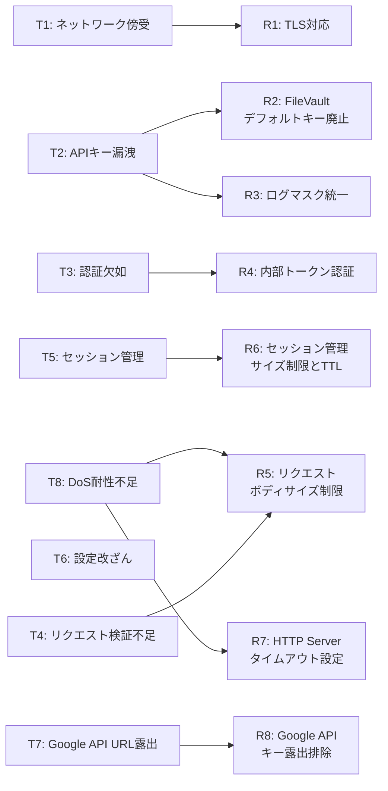
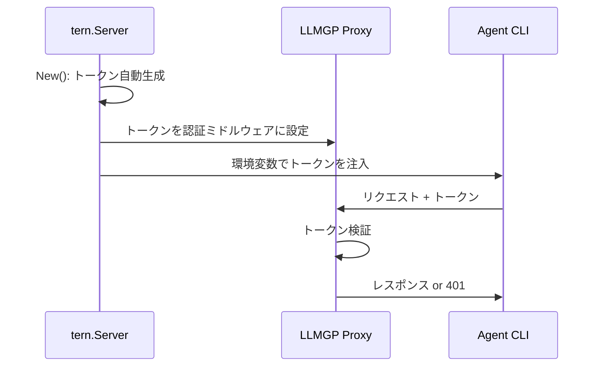
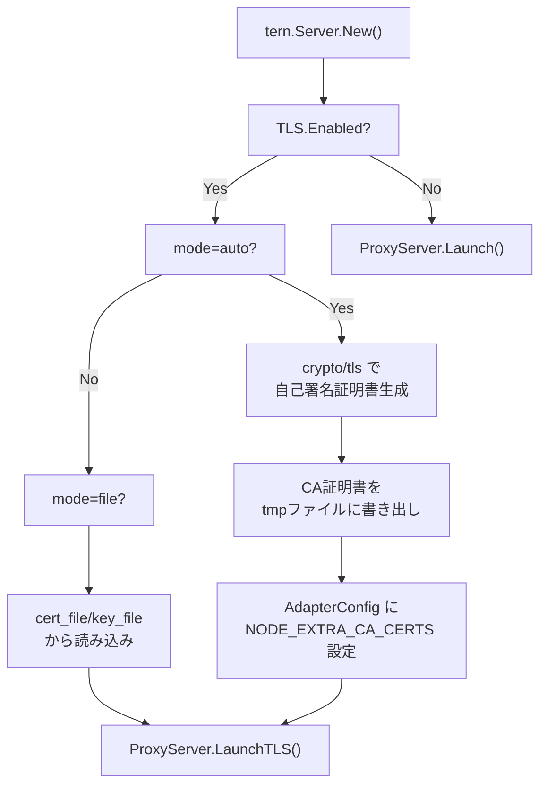

# 033: LLMGP セキュリティ強化

## 背景 (Background)

LLM Gateway Proxy (LLMGP) のセキュリティ調査 (調査レポート参照) により、以下の脅威とリスクが識別された:

| ID | 脅威 | リスクレベル |
|----|------|-------------|
| T1 | ネットワーク傍受 (Docker環境での平文HTTP通信) | 中 |
| T2 | APIキーの漏洩 (デフォルト暗号化キー、ログ出力) | 高 |
| T3 | 認証欠如 (任意のローカルプロセスからの不正利用) | 高 |
| T4 | リクエスト検証不足 (ボディサイズ制限なし) | 高 |
| T5 | セッション管理の脆弱性 (セッションマップ無制限増加) | 中 |
| T6 | 設定ファイル改ざん (base_url書き換えによるAPIキー窃取) | 低 |
| T7 | Google APIキーのURL露出 | 中 |
| T8 | DoS耐性不足 (タイムアウト未設定、接続数制限なし) | 高 |

本仕様は、これらの脅威に対する具体的な対策を定義する。全ての設定値は `config.yaml` で設定可能にし、デフォルト値で安全な動作を保証する。

### 脅威-対策マッピング



> T6 (設定ファイル改ざん) は、`model_profiles.yaml` のファイルシステムレベルの保護 (パーミッション設定) に委ねる。アプリケーションレベルの署名検証は本仕様のスコープ外とする。

---

## 要件 (Requirements)

### 必須要件

#### R1: TLS対応 (オプショナル有効化)

LLMGPのHTTP Proxyに、TLSを有効化するオプションを追加する。

- **R1-1**: TLSはデフォルト無効とする。設定ファイルで明示的に有効化する
- **R1-2**: 証明書の指定方法は以下の3パターンをサポートする:

| パターン | 説明 | 用途 |
|---------|------|------|
| 自動生成 (auto) | 起動時にGoの `crypto/tls` で自己署名証明書をインメモリ生成 | 開発・テスト環境 |
| ファイル指定 | `cert_file` / `key_file` で外部証明書を指定 | Docker環境・本番 |
| 無効 (デフォルト) | TLSなし、従来通りの平文HTTP | ローカル開発 |

- **R1-3**: TLS有効時、`ProxyURL()` は `https://` を返す
- **R1-4**: 自動生成モードでは、CA証明書を一時ファイルに書き出し、Agent CLIの環境変数 (`NODE_EXTRA_CA_CERTS` 等) で信頼させる
- **R1-5**: `tern.Server` は起動時にTLS設定を解決し、Agent CLI側への環境変数注入を自動で行う

```yaml
# config.yaml - TLS設定例
llm_gateway:
  port: 14000
  tls:
    enabled: true
    mode: "auto"  # "auto" | "file" | "" (disabled)
    cert_file: ""  # mode=file時のみ
    key_file: ""   # mode=file時のみ
```

- **R1-6**: `auto` モードの自己署名証明書は以下の仕様とする:
  - Subject: `CN=tern-llmgp-local`
  - SAN (Subject Alternative Name): `127.0.0.1`, `localhost`
  - 有効期限: 起動時から24時間
  - 鍵タイプ: ECDSA P-256
  - 起動ごとに新規生成 (永続化しない)

- **R1-7**: Docker環境 (hybrid構成) ではSANにサービス名 (`gateway`) を追加可能とする:

```yaml
tls:
  enabled: true
  mode: "auto"
  extra_sans:
    - "gateway"  # Docker Compose サービス名
```

- **R1-8**: `auto` モードでは、証明書の有効期限に関するログを段階的に出力する:

  | タイミング | レベル | メッセージ例 |
  |-----------|--------|-------------|
  | 残り2時間 | INFO | `TLS certificate will expire in 2 hours, auto-renewal scheduled` |
  | 残り1時間 | WARN | `TLS certificate expires in less than 1 hour -- if auto-renewal fails, restart the server to regenerate the certificate` |
  | 自動更新実行 | INFO | `TLS certificate auto-renewed successfully, new expiry: <timestamp>` |
  | 自動更新失敗 | ERROR | `TLS certificate auto-renewal failed: <error> -- restart the server to restore HTTPS connectivity. Workaround: restart the tern server process` |
  | 期限切れ発生 | ERROR | `TLS certificate has expired -- HTTPS connections will fail. Restart the server to generate a new certificate` |

  ログメッセージには以下の原則を適用する:
  - **原因**: 何が起きたか (証明書の期限切れ)
  - **影響**: 何が起こるか (HTTPS接続が失敗する)
  - **対処法**: どうすればよいか (サーバーを再起動する)

- **R1-9**: `auto` モードでは、証明書の自動更新を行う:
  - バックグラウンドgoroutineで証明書の有効期限を監視する
  - 有効期限の1時間前に、新しい自己署名証明書を自動生成する
  - `tls.Config` の `GetCertificate` コールバックを使用し、プロセス再起動なしで証明書を差し替える
  - 更新時にCA証明書ファイルも再書き出しする (Agent CLIは次回接続時に新証明書を使用)

- **R1-10**: 証明書監視goroutineのライフサイクル:
  - `Launch()` で監視goroutineを起動する
  - `Shutdown()` で監視goroutineを停止する
  - 監視間隔: 10分ごとに有効期限をチェック

- **R1-11**: 証明書期限切れ時のHTTPレスポンス:
  - TLSハンドシェイク失敗はクライアント側のエラーとなるため、HTTP応答レベルでの制御はできない。ただし以下の対策を行う:
  - `GetCertificate` コールバック内で期限切れを検知した場合、ERRORログにワークアラウンドを含むメッセージを出力する
  - `GET /health` エンドポイント (TLS有効時でも平文HTTPのフォールバックポートを提供しない場合) のレスポンスに証明書の有効期限を含める:

  ```json
  {
    "status": "degraded",
    "message": "TLS certificate expired -- restart the server to restore HTTPS",
    "models": 3,
    "tls": {
      "enabled": true,
      "mode": "auto",
      "cert_expires_at": "2026-06-12T16:48:00Z",
      "cert_expired": true
    }
  }
  ```

  - 証明書が期限切れ間近 (残り1時間以内) の場合、`status` を `"degraded"` にし、`message` に警告を含める

#### R2: FileVaultBackend デフォルト暗号化キー廃止

- **R2-1**: `TERN_VAULT_KEY` 環境変数が未設定の場合、`NewFileVaultBackend` はエラーを返す
- **R2-2**: デフォルトキー `"default-hag-vault-key-change-me"` をコードから削除する
- **R2-3**: エラーメッセージには、環境変数の設定方法を案内する

```go
// 変更後
rawKey := os.Getenv("TERN_VAULT_KEY")
if rawKey == "" {
    return nil, fmt.Errorf(
        "TERN_VAULT_KEY environment variable is required for file vault backend; " +
        "set a strong random key (e.g. openssl rand -base64 32)")
}
```

#### R3: ログマスク統一

- **R3-1**: `routing.go` のTraceログで先頭8文字を出力している箇所を `MaskSecret()` に統一する
- **R3-2**: APIキーに関するログ出力は、すべて `MaskSecret()` を経由する

```go
// 変更前 (routing.go:91-94)
if len(resolved.KeyValue) > 8 {
    keyPrefix = resolved.KeyValue[:8] + "..."
}

// 変更後
keyPrefix = MaskSecret(resolved.KeyValue)
```

#### R4: 内部トークン認証

LLMGPへのアクセスを、正当なAgent CLIからのリクエストに限定するための内部トークン認証を実装する。

- **R4-1**: `tern.Server.New()` の初期化時に、暗号学的に安全なランダムトークンを自動生成する
- **R4-2**: 生成したトークンをLLMGPの認証ミドルウェアに設定する
- **R4-3**: Agent CLI起動時に、環境変数としてトークンを注入する:
  - Claude Code: `ANTHROPIC_API_KEY` のメタデータに `token=<value>` を追加
  - Codex: 環境変数 `TERN_GATEWAY_TOKEN` として注入
- **R4-4**: 認証ミドルウェアは `X-Gateway-Token` ヘッダまたは既存の認証ヘッダ (`x-api-key`, `Authorization`) からトークンを検証する
- **R4-5**: トークンが一致しない場合、`401 Unauthorized` を返す
- **R4-6**: `/health` と `GET /` エンドポイントは認証不要とする (ヘルスチェック用)
- **R4-7**: `config.yaml` で静的トークンも設定可能とする (Docker環境用):

```yaml
llm_gateway:
  auth_token: ""  # 空=自動生成, 値指定=静的トークン
```

- **R4-8**: `tern.Server` は自動生成/設定されたトークンを `AdapterConfig` に注入する



#### R5: リクエストボディサイズ制限

- **R5-1**: `POST /v1/messages` と `POST /v1/responses` のハンドラで、`http.MaxBytesReader` を適用する
- **R5-2**: デフォルト値は 10MB とする
- **R5-3**: `config.yaml` で設定可能とする:

```yaml
llm_gateway:
  max_request_body_bytes: 10485760  # 10MB (デフォルト)
```

- **R5-4**: 制限超過時は `413 Request Entity Too Large` を返す

#### R6: セッション管理のサイズ制限とTTL

`ModelRouter` のセッションモデルマップにサイズ制限とTTLを追加する。

- **R6-1**: セッションの最大数を設定可能にする。デフォルト: 1000
- **R6-2**: セッションのTTLを設定可能にする。デフォルト: 24時間 (86400秒)
- **R6-3**: 最大数超過時は最も古いセッションを破棄する (LRU方式)
- **R6-4**: `config.yaml` で設定可能とする:

```yaml
llm_gateway:
  session:
    max_sessions: 1000       # 最大セッション数
    ttl_seconds: 86400       # セッションTTL (秒)
```

#### R7: HTTP Server タイムアウト設定

- **R7-1**: `http.Server` に `ReadTimeout`, `WriteTimeout`, `IdleTimeout`, `MaxHeaderBytes` を設定する
- **R7-2**: `WriteTimeout` はSSEストリーミングを考慮し、十分に大きい値をデフォルトとする
- **R7-3**: `config.yaml` で設定可能とする:

```yaml
llm_gateway:
  server:
    read_timeout_seconds: 30    # デフォルト: 30秒
    write_timeout_seconds: 300  # デフォルト: 300秒 (SSEストリーミング考慮)
    idle_timeout_seconds: 60    # デフォルト: 60秒
    max_header_bytes: 1048576   # デフォルト: 1MB
```

#### R8: Google APIキーのURL露出排除

- **R8-1**: `provider_google.go` の `SetAuthHeaders` から、URLクエリパラメータへのAPIキー付与を削除する
- **R8-2**: ヘッダベース認証 (`x-goog-api-key`) のみを使用する

```go
// 変更後
func (p *googleProvider) SetAuthHeaders(req *http.Request, apiKey string, originalHeaders http.Header) {
    req.Header.Set("x-goog-api-key", apiKey)
    req.Header.Del("Authorization")
    // URL query parameter is intentionally NOT set (security: key exposure in logs).
}
```

### 任意要件

- **O1**: `max_concurrent_requests` による同時リクエスト数制限 (semaphore方式)
- **O2**: リクエストレート制限 (プロバイダ毎のトークンバケット)

---

## 実現方針 (Implementation Approach)

### Config構造体の拡張

```go
// config.go に追加
type LLMGatewayConfig struct {
    Port              int            `yaml:"port"`
    ModelProfilesPath string         `yaml:"model_profiles_path"`
    MetricsEnabled    bool           `yaml:"metrics_enabled"`
    Retry             RetrySettings  `yaml:"retry"`

    // --- 以下、新規追加 ---

    // TLS holds TLS configuration for the proxy server.
    TLS TLSConfig `yaml:"tls"`

    // AuthToken is the internal gateway authentication token.
    // Empty = auto-generate at startup. Non-empty = use as static token.
    AuthToken string `yaml:"auth_token"`

    // MaxRequestBodyBytes is the maximum request body size in bytes.
    // Default: 10MB (10485760).
    MaxRequestBodyBytes int64 `yaml:"max_request_body_bytes"`

    // Session holds session management settings.
    Session SessionConfig `yaml:"session"`

    // Server holds HTTP server timeout settings.
    Server ServerConfig `yaml:"server"`
}

type TLSConfig struct {
    // Enabled controls whether TLS is used. Default: false.
    Enabled bool `yaml:"enabled"`

    // Mode is the TLS mode: "auto" (self-signed), "file" (external cert).
    // Ignored when Enabled is false.
    Mode string `yaml:"mode"`

    // CertFile is the path to the TLS certificate (mode=file).
    CertFile string `yaml:"cert_file"`

    // KeyFile is the path to the TLS private key (mode=file).
    KeyFile string `yaml:"key_file"`

    // ExtraSANs is additional Subject Alternative Names (mode=auto).
    ExtraSANs []string `yaml:"extra_sans"`
}

type SessionConfig struct {
    // MaxSessions is the maximum number of tracked sessions. Default: 1000.
    MaxSessions int `yaml:"max_sessions"`

    // TTLSeconds is the session TTL in seconds. Default: 86400 (24h).
    TTLSeconds int `yaml:"ttl_seconds"`
}

type ServerConfig struct {
    // ReadTimeoutSeconds is the HTTP server read timeout. Default: 30.
    ReadTimeoutSeconds int `yaml:"read_timeout_seconds"`

    // WriteTimeoutSeconds is the HTTP server write timeout. Default: 300.
    WriteTimeoutSeconds int `yaml:"write_timeout_seconds"`

    // IdleTimeoutSeconds is the HTTP server idle timeout. Default: 60.
    IdleTimeoutSeconds int `yaml:"idle_timeout_seconds"`

    // MaxHeaderBytes is the maximum header size. Default: 1MB.
    MaxHeaderBytes int `yaml:"max_header_bytes"`
}
```

### TLS自動生成の実装方針



- `crypto/ecdsa` + `crypto/x509` で ECDSA P-256 の自己署名証明書を生成
- SANには `127.0.0.1`, `localhost`, および `extra_sans` の値を含める
- CA証明書はPEM形式で一時ファイルに書き出し、Agent CLI側で `NODE_EXTRA_CA_CERTS` 経由で信頼させる
- 証明書はメモリ上に保持し、ディスクには書き出さない (CA証明書のみ書き出し)
- `http.Server` の `TLSConfig` フィールドに設定し、`server.ServeTLS()` で起動

### 内部トークン認証の実装方針

```go
// proxy.go に認証ミドルウェアを追加
func (p *ProxyServer) authMiddleware(next http.HandlerFunc) http.HandlerFunc {
    return func(w http.ResponseWriter, r *http.Request) {
        if p.authToken == "" {
            next(w, r)
            return
        }
        // 1. X-Gateway-Token ヘッダから検証
        if token := r.Header.Get("X-Gateway-Token"); token == p.authToken {
            next(w, r)
            return
        }
        // 2. x-api-key ヘッダのメタデータから検証 (Claude Code互換)
        if extractToken(r.Header.Get("x-api-key")) == p.authToken {
            next(w, r)
            return
        }
        // 3. Authorization ヘッダのメタデータから検証 (Codex互換)
        if extractToken(r.Header.Get("Authorization")) == p.authToken {
            next(w, r)
            return
        }
        WriteErrorResponse(w, &GatewayError{
            Type:    "authentication_error",
            Message: "invalid or missing gateway token",
            Code:    "unauthorized",
            Status:  http.StatusUnauthorized,
        })
    }
}
```

- `tern.Server.New()` で `crypto/rand` を使用してトークンを生成 (32バイト、hex エンコード)
- `ProxyServer` に `authToken` フィールドを追加
- `AdapterConfig` に `GatewayToken` フィールドを追加
- Claude Code の `BuildEnv` でトークンをAPIキーメタデータに追加: `not-needed;token=<value>;fallback=false;sid=default`

### パッケージ構成 (変更・追加ファイル)

```
shared/libs/go/config/
    config.go           -- [MODIFY] TLSConfig, SessionConfig, ServerConfig 追加

shared/libs/go/vault/
    file_backend.go     -- [MODIFY] デフォルトキー廃止

shared/libs/go/llmgateway/
    proxy.go            -- [MODIFY] authMiddleware, TLS対応, タイムアウト設定
    proxy_tls.go        -- [NEW] TLS証明書自動生成ロジック
    proxy_anthropic.go  -- [MODIFY] MaxBytesReader 適用
    proxy_openai.go     -- [MODIFY] MaxBytesReader 適用
    routing.go          -- [MODIFY] セッションマップにサイズ制限・TTL追加
    provider_google.go  -- [MODIFY] URLクエリパラメータ削除

shared/libs/go/codingagent/
    adapter_config.go   -- [MODIFY] GatewayToken フィールド追加
    claudecode/
        process.go      -- [MODIFY] トークンの環境変数注入
    codex/
        process.go      -- [MODIFY] トークンの環境変数注入

shared/libs/go/tern/
    server.go           -- [MODIFY] トークン自動生成、TLS解決、AdapterConfig注入
    options.go          -- [MODIFY] (必要に応じて)
```

### config.yaml の完全な例

```yaml
llm_gateway:
  port: 14000
  model_profiles_path: "./model_profiles.yaml"
  metrics_enabled: false
  retry:
    max_retries: 3
    initial_delay_seconds: 1
    max_delay_seconds: 30

  # --- セキュリティ設定 ---
  tls:
    enabled: false       # true で TLS 有効化
    mode: "auto"         # "auto" (自己署名) | "file" (外部証明書)
    cert_file: ""        # mode=file 時のみ
    key_file: ""         # mode=file 時のみ
    extra_sans: []       # 追加SAN (Docker サービス名等)

  auth_token: ""         # 空=自動生成, 値指定=静的トークン

  max_request_body_bytes: 10485760  # 10MB

  session:
    max_sessions: 1000
    ttl_seconds: 86400   # 24時間

  server:
    read_timeout_seconds: 30
    write_timeout_seconds: 300
    idle_timeout_seconds: 60
    max_header_bytes: 1048576  # 1MB

vault:
  backend: "env"

log:
  level: "info"
```

---

## 検証シナリオ (Verification Scenarios)

### シナリオ1: リクエストボディサイズ制限

1. LLMGPを起動する (`max_request_body_bytes: 1024` に設定)
2. 1024バイト以下のリクエストを `POST /v1/messages` に送信する
3. 正常にレスポンスが返ること
4. 1025バイト以上のリクエストを送信する
5. `413 Request Entity Too Large` が返ること

### シナリオ2: HTTP Serverタイムアウト

1. `read_timeout_seconds: 1` に設定してLLMGPを起動する
2. 意図的に遅いリクエストを送信する
3. タイムアウトにより接続が切断されること

### シナリオ3: セッション管理

1. `max_sessions: 3` に設定してLLMGPを起動する
2. 4つの異なるセッションIDでリクエストを送信する
3. 4番目のセッション登録時に、最も古いセッションが破棄されること
4. TTL超過後にセッションが無効化されること

### シナリオ4: 内部トークン認証

1. LLMGPをトークン認証有効で起動する
2. 正しいトークンを含むリクエストを送信する --> 正常レスポンス
3. トークンなしでリクエストを送信する --> `401 Unauthorized`
4. 不正なトークンでリクエストを送信する --> `401 Unauthorized`
5. `GET /health` にトークンなしでリクエストする --> `200 OK` (認証不要)

### シナリオ5: TLS (自動生成モード)

1. `tls.enabled: true`, `tls.mode: auto` でLLMGPを起動する
2. `ProxyURL()` が `https://` を返すこと
3. `https://localhost:{port}/health` に対して、生成されたCA証明書を信頼して接続できること
4. Agent CLI起動時に `NODE_EXTRA_CA_CERTS` が設定されること

### シナリオ5b: TLS証明書の期限切れ警告と自動更新

1. テスト用に短い有効期限 (例: 5秒) の証明書を生成する
2. 有効期限の1時間前 (テスト用に短縮) にWARNINGログが出力されること
3. 自動更新が実行され、新しい証明書に差し替わること
4. INFOログ `"TLS certificate auto-renewed, valid until <timestamp>"` が出力されること
5. 更新後もHTTPS接続が正常に確立できること

### シナリオ6: TLS (ファイル指定モード)

1. `openssl` で自己署名証明書を生成する
2. `tls.enabled: true`, `tls.mode: file`, `cert_file`, `key_file` を設定してLLMGPを起動する
3. HTTPS接続が確立できること

### シナリオ7: FileVaultBackend デフォルトキー廃止

1. `TERN_VAULT_KEY` 環境変数を未設定にする
2. `vault.backend: file` でLLMGPを起動する
3. エラーメッセージに設定方法の案内が含まれること
4. `TERN_VAULT_KEY` を設定して起動する
5. 正常に起動すること

### シナリオ8: Google APIキーURL排除

1. Google (Gemini) プロバイダでリクエストを送信する
2. upstream requestのURLにAPIキーが含まれないこと
3. `x-goog-api-key` ヘッダにAPIキーが含まれること

### シナリオ9: ログマスク統一

1. Traceログレベルでリクエストを処理する
2. ログ出力にAPIキーの先頭8文字が含まれないこと
3. `****` + 下4桁の形式でマスクされていること

---

## テスト項目 (Testing for the Requirements)

### ビルド・全体検証

```bash
# 全体ビルドと単体テスト
./scripts/process/build.sh
```

### 単体テスト計画

| テスト対象 | テストファイル | 確認内容 |
|---|---|---|
| TLS証明書生成 | `proxy_tls_test.go` | 自己署名証明書の生成、SAN設定、有効期限、自動更新、期限切れ警告ログ |
| 認証ミドルウェア | `proxy_test.go` | トークン検証、認証不要エンドポイント、401応答 |
| リクエストサイズ制限 | `proxy_anthropic_test.go`, `proxy_openai_test.go` | MaxBytesReader適用、413応答 |
| セッション管理 | `routing_test.go` | サイズ制限、TTL、LRU破棄 |
| HTTP Serverタイムアウト | `proxy_test.go` | タイムアウト設定の適用 |
| FileVaultデフォルトキー | `file_backend_test.go` | 未設定時のエラー、設定時の正常動作 |
| Google APIキー | `provider_test.go` | URLにキーが含まれないこと |
| ログマスク | `routing_test.go` | MaskSecret統一 |
| Config拡張 | `config_test.go` | 新規フィールドのYAMLパース、デフォルト値 |
| トークン注入 | `claudecode/process_test.go`, `codex/process_test.go` | 環境変数にトークンが含まれること |

### 統合テスト

```bash
# LLM関連テスト (認証、TLS含む)
./scripts/process/integration_test.sh --categories "llm"

# サーバ起動・停止テスト
./scripts/process/integration_test.sh --categories "common" --specify "Server|Boot|Lifecycle"
```

---

## 変更履歴

| 日付 | 変更内容 |
|------|---------) |
| 2026-06-11 | 初版作成。セキュリティ調査レポートに基づく |
