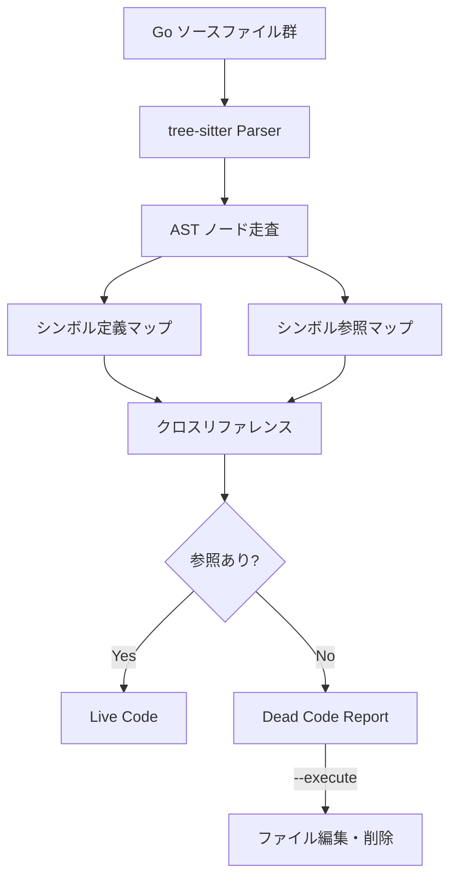

# 039: overkill -- tree-sitter ベースのデッドコード検出/削除ツール

## 背景 (Background)

手動でデッドコードを探す作業は、ファイル数が増えるほど困難になる。`shared/libs/go/` 以下だけでも10パッケージ、100以上のエクスポートシンボルが存在し、grep ベースの調査では漏れや誤検出が避けられない。

Go の標準ツール (`go vet`, `staticcheck` 等) はエクスポートシンボルのデッド検出に弱い。エクスポートシンボルは「外部パッケージから使われる可能性がある」ため、通常は未使用と判定されない。しかし、プロジェクト内で閉じたスコープでは、エクスポートシンボルも含めた網羅的なデッドコード検出が可能である。

## 要件 (Requirements)

### 必須要件

1. **tree-sitter による Go ソースコードのパース**:
   - tree-sitter の Go バインディング (`github.com/tree-sitter/go-tree-sitter` 公式、または `github.com/smacker/go-tree-sitter`) を使用
   - プロジェクト内の全 `.go` ファイルをパースし、AST (抽象構文木) を構築

2. **シンボル定義の抽出**: 以下のシンボル定義を検出する
   - エクスポート関数 (`func FuncName(...)`)
   - エクスポートメソッド (`func (r *Receiver) MethodName(...)`)
   - エクスポート型 (`type TypeName struct/interface/...`)
   - エクスポート定数 (`const ConstName = ...`)
   - エクスポート変数 (`var VarName = ...`)
   - 非エクスポートシンボルも対象とする（パッケージ内部のデッドコードも検出）

3. **シンボル参照の収集**: 全ファイルのAST内でシンボルが識別子として参照されている箇所を収集

4. **デッドコード判定アルゴリズム**:
   - **定義のみで参照がないシンボルをデッドコードと判定**
   - パッケージスコープを考慮:
     - 非エクスポートシンボル: 同一パッケージ内で参照がなければデッド
     - エクスポートシンボル: プロジェクト全体で参照がなければデッド
   - インターフェース実装のメソッドは除外（インターフェースを満たすために存在する可能性がある）
   - `init()` 関数は除外（Go ランタイムが暗黙的に呼び出す）
   - `main()` 関数は除外
   - `_test.go` ファイル内のシンボルは定義側として収集しない（テスト専用コードのため）
   - `_test.go` ファイルからの参照は参照としてカウントする

5. **レポート出力** (デフォルトモード):
   - デッドコードと判定されたシンボルを一覧表示
   - ファイルパス、行番号、シンボル名、種別 (func/type/const/var) を含む
   - パッケージ単位でグループ化して表示
   - JSON 出力オプション (`--json`) も用意

6. **自動削除モード** (`--execute`):
   - `--execute` フラグが指定された場合のみ、デッドコードをファイルから物理的に削除
   - 削除前にバックアップは作らない（Git があるため）
   - 削除した内容をログに出力

7. **スキャン対象の指定**:
   - デフォルト: カレントディレクトリ以下の全 `.go` ファイル
   - `--path` オプションで対象ディレクトリを指定可能
   - `--exclude` オプションで除外パターンを指定可能 (例: `reference_repo`, `vendor`)

### 任意要件

- ファイル全体がデッドの場合（全シンボルがデッド）、ファイルごと削除を提案
- `--verbose` で参照元の詳細を表示
- 検出精度の可視化（確信度: high/medium/low）

## 実現方針 (Implementation Approach)

### ツール配置

```
features/overkill/
  go.mod
  main.go              # エントリポイント (CLI)
  analyzer/
    parser.go           # tree-sitter パーサー
    symbols.go          # シンボル定義・参照の収集
    deadcode.go         # デッドコード判定ロジック
    reporter.go         # レポート出力
    executor.go         # デッドコード削除実行
```

### tree-sitter パースフロー



### 検出対象の tree-sitter ノードタイプ

| Go の構文 | tree-sitter ノードタイプ |
| :--- | :--- |
| `func FuncName(...)` | `function_declaration` |
| `func (r *T) Method(...)` | `method_declaration` |
| `type T struct{...}` | `type_declaration` -> `type_spec` |
| `const C = ...` | `const_declaration` -> `const_spec` |
| `var V = ...` | `var_declaration` -> `var_spec` |
| 識別子の参照 | `identifier`, `type_identifier`, `field_identifier` |

### CLI インターフェース

```bash
# デフォルト: レポートのみ
overkill --path ./shared/libs/go --exclude reference_repo

# JSON出力
overkill --path ./shared/libs/go --json

# 実際に削除
overkill --path ./shared/libs/go --execute

# 詳細表示
overkill --path ./shared/libs/go --verbose
```

### 出力例（レポートモード）

```
=== Dead Code Report ===

Package: llmgateway (shared/libs/go/llmgateway)
  DEAD func  NewPassthroughDriver     passthrough.go:19
  DEAD func  TryFallbackOpenAIResponse fallback.go:41
  DEAD func  AllProviders             provider.go:52
  DEAD type  PassthroughDriver        passthrough.go:13

Package: codingagent (shared/libs/go/codingagent)
  DEAD func  SomeUnusedFunc           somefile.go:42

Summary: 5 dead symbols found across 2 packages
```

### 誤検出の抑制

以下のケースはデッドコードから除外する:

1. `init()` 関数 -- Go ランタイムが暗黙的に呼び出す
2. `main()` 関数 -- エントリポイント
3. `_test.go` 内の定義 -- テスト専用
4. インターフェース実装メソッド -- インターフェースを満たすために存在（将来的に型チェックで判定可能にする）
5. `// overkill:ignore` コメントがあるシンボル -- 明示的な除外

## 検証シナリオ (Verification Scenarios)

1. `features/overkill` をビルドし、`bin/overkill` が生成されることを確認
2. `overkill --path ./shared/libs/go` を実行し、先に手動で確認したデッドコード（`PassthroughDriver`, `TryFallbackOpenAIResponse`, `AllProviders`）が検出されることを確認
3. `overkill --json --path ./shared/libs/go` で JSON 形式の出力が得られることを確認
4. `overkill --execute --path ./shared/libs/go` でデッドコードが削除され、その後 `./scripts/process/build.sh` が通ることを確認

## テスト項目 (Testing for the Requirements)

```bash
# ツール自体のビルドとテスト
cd features/overkill && go test ./...

# プロジェクト全体のビルド（デッドコード削除後の確認）
./scripts/process/build.sh
```
