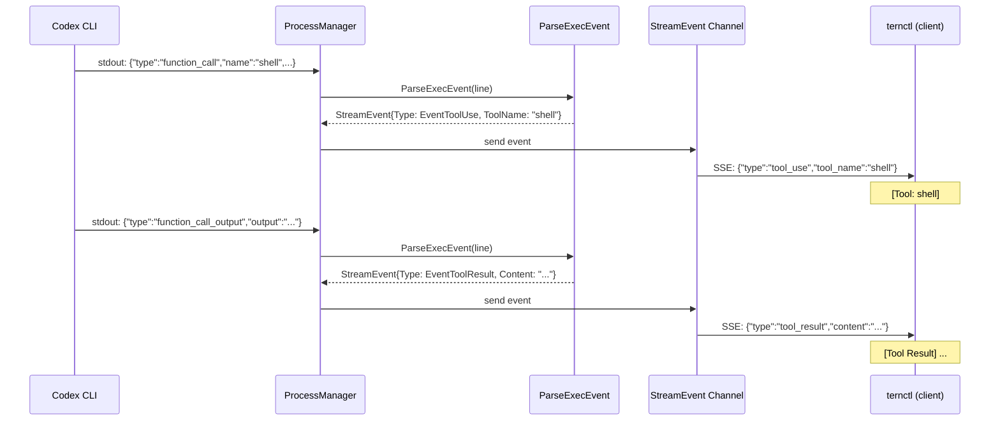

# 043: Codex イベントパーサーのツールログ修正

## 背景 (Background)

### 現状の問題

`ternctl` でCodexエージェントを使用した場合、Claude Codeでは表示される `[Tool: ...]` / `[Tool Result] ...` のツール実行ログが一切表示されない。また、TaskLogにもツール実行情報が記録されておらず、エージェントが「何を実行し、何の結果を得たか」を外部から確認できない状態にある。

### 原因

調査の結果、[protocol.go](file://shared/libs/go/codingagent/codex/protocol.go) の `ParseExecEvent()` 関数に2つの問題が特定された:

1. **イベント型の誤マッピング**: `function_call_output` イベントが `EventToolResult` ではなく `EventResult` にマッピングされている。`EventResult` はセッション完了を意味する型であり、クライアント側 (`stream.go`) では何も出力しない。
2. **コンテンツの破棄**: `function_call_output` のツール実行結果(`output` フィールド)が完全に破棄されており、Content フィールドが設定されていない。

### Claude Code との比較

| エージェント | ツール呼び出しイベント | ツール結果イベント | 表示 |
|---|---|---|---|
| Claude Code | `assistant` > `tool_use` -> `EventToolUse` | `user` > `tool_result` -> `EventToolResult` | `[Tool: Bash]` / `[Tool Result] ...` |
| Codex | `function_call` -> `EventToolUse` | `function_call_output` -> `EventResult` (誤り) | `[Tool: shell]` のみ (結果は非表示) |

### 追加の懸念事項

Codex CLI (`codex exec --json --dangerously-bypass-approvals-and-sandbox`) の `exec --json` モードが実際にどのようなJSONLイベントを出力するかは、現在の実装が想定しているイベント構造と異なる可能性がある。仕様書の根拠となったイベントタイプ名 (`function_call`, `function_call_output`) は、Codex CLI の `0.139.0` バージョンでの実際の出力を確認する必要がある。

### 調査レポート

- [investigation_codex_tool_logs.md](file:///C:/Users/yamya/.gemini/antigravity-ide/brain/f11ddd6b-dab2-46d8-9899-e1f17e3fc16b/investigation_codex_tool_logs.md)

## 要件 (Requirements)

### 必須要件

#### R1: Codex CLI の `exec --json` JSONL出力フォーマットの実地確認

実装の前提として、Codex CLI `0.139.0` の `exec --json` モードが出力する実際のJSONLイベントを確認する。以下のコマンドで直接出力を観察する:

```bash
codex exec --json --dangerously-bypass-approvals-and-sandbox \
  --ignore-user-config \
  "please run 'pwd' command and report the result." 2>/dev/null
```

確認事項:
- `function_call` イベントが出力されるか、または別のイベント名が使われるか
- `function_call_output` イベントが出力されるか、そのフィールド構造(`output` フィールドの有無、型)
- `--dangerously-bypass-approvals-and-sandbox` モードでツールイベントが省略されていないか
- `message` タイプの `content` 配列内にツール情報がラップされている可能性

#### R2: `function_call_output` のイベントマッピング修正

`ParseExecEvent()` の `function_call_output` ケースを修正する:

- `EventResult` ではなく `EventToolResult` にマッピングする
- `function_call_output` のコンテンツ(ツール実行結果)を `Content` フィールドに設定する
- R1 の結果に基づき、実際のフィールド名を正確にパースする

修正前:
```go
case "function_call_output":
    return &codingagent.StreamEvent{Type: codingagent.EventResult}
```

修正後 (暫定、R1の結果に基づき調整):
```go
case "function_call_output":
    var out struct {
        Output string `json:"output"`
    }
    json.Unmarshal([]byte(line), &out)
    return &codingagent.StreamEvent{
        Type:    codingagent.EventToolResult,
        Content: out.Output,
    }
```

#### R3: 未知のイベントタイプへの対応強化

`ParseExecEvent()` の `default` ケースで、未知のイベントタイプを無視するのではなく、TRACEログに記録する。これにより、Codex CLI のバージョンアップで新しいイベントタイプが追加された場合に検出可能にする。

現状:
```go
default:
    return nil
```

修正後:
```go
default:
    // Log unknown event types for debugging
    return nil  // ログ出力は呼び出し元で行う
```

ただし、`ParseExecEvent` は現在ログ引数を取らない純粋関数であるため、ログ出力は呼び出し元の `process.go` の goroutine 内で、`ev == nil` かつ line が空でない場合に TRACE ログを出力する方針とする。

#### R4: 単体テストの追加・修正

- `function_call_output` のテストを `EventToolResult` に修正し、Content の検証を追加する
- R1 の結果に基づき、実際のJSONL構造を反映したテストデータを使用する

### 任意要件

#### O1: `message` タイプ内のツール情報パース拡充

R1 の結果、`function_call` / `function_call_output` が `message` タイプの `content` 配列内にラップされて出力されている場合は、`message` ケースのパース処理にツール関連の content type (`function_call`, `function_call_output`) の処理を追加する。

## 実現方針 (Implementation Approach)

### 修正対象ファイル

| ファイル | 変更種別 | 内容 |
|---|---|---|
| `shared/libs/go/codingagent/codex/protocol.go` | 修正 | `function_call_output` のマッピング修正、フィールドパース追加 |
| `shared/libs/go/codingagent/codex/protocol_test.go` | 修正 | `function_call_output` テスト修正、新テストケース追加 |
| `shared/libs/go/codingagent/codex/process.go` | 修正 | 未知イベントのTRACEログ出力追加 |

### イベントフロー (修正後)



### 実装ステップ

1. **R1 実地確認**: `codex exec --json` の出力を観察して実際のイベント構造を把握する
2. **R2 マッピング修正**: 確認結果に基づき `protocol.go` を修正
3. **R3 未知イベントログ**: `process.go` の goroutine にTRACEログ追加
4. **R4 テスト修正**: テストを更新・追加
5. **ビルド検証**: `go build` と `go test` で動作確認
6. **手動E2E確認**: `ternctl` で codex セッションを実行し、`[Tool: ...]` / `[Tool Result] ...` の出力を目視確認

## 検証シナリオ (Verification Scenarios)

### シナリオ 1: ternctl で Codex のツールログが表示される

1. `./bin/tern --config ./features/tern/config.yaml` でサーバを起動する
2. `./bin/ternctl run --agent codex --prompt "please run 'pwd' command and report the result." --work-dir tmp` を実行する
3. 出力に `[Tool: shell]` (または実際のツール名) が表示されることを確認する
4. 出力に `[Tool Result] ...` (ツール実行結果の内容) が表示されることを確認する
5. 最終的にセッションステータスが `completed` であることを確認する

### シナリオ 2: Claude Code との表示一貫性

1. 同じプロンプトで `--agent claudecode` と `--agent codex` の両方を実行する
2. 両方のケースで `[Tool: ...]` と `[Tool Result] ...` が表示されることを確認する

### シナリオ 3: tern サーバの TRACE ログで未知イベントが記録される

1. `--log-level trace` でサーバを起動する
2. codex セッションを実行する
3. 未知のイベントタイプ(あれば) が TRACE ログに記録されることを確認する

## テスト項目 (Testing for the Requirements)

### 単体テスト

対象パッケージ: `shared/libs/go/codingagent/codex`

| 要件 | テスト関数 | 検証内容 |
|---|---|---|
| R2 | `TestParseExecEvent_FunctionCallOutput` (既存修正) | `function_call_output` が `EventToolResult` に変換されること |
| R2 | `TestParseExecEvent_FunctionCallOutput_Content` (新規) | ツール実行結果の `Content` が正しく設定されること |
| R4 | `TestParseExecEvent_UnknownType` (新規) | 未知のイベントタイプで `nil` が返ること (既存の default の検証) |

### ビルド・検証コマンド

```bash
# 単体テスト
cd shared/libs/go/codingagent/codex && go test ./... -v -count=1

# 全体ビルド + テスト
scripts/process/build.sh
```
