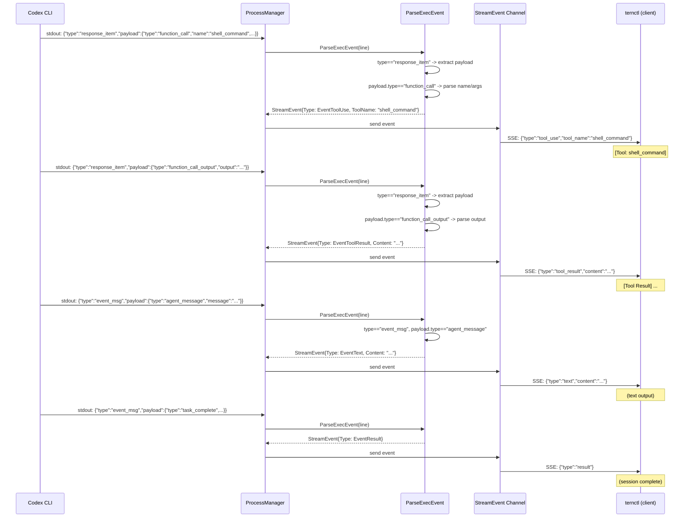

# 044: Codex JSONL パーサーの修正と ternctl E2E テストカバレッジの追加

## 背景 (Background)

### 問題 1: Codex JSONL パーサーがイベントを取りこぼしている

`ternctl` で Codex エージェントを使用した場合、Claude Code では表示される `[Tool: ...]` / `[Tool Result] ...` や `[System] ...` のストリーミング出力が一切表示されない。セッションは `completed` になるが、途中のテキスト出力やツール使用情報が全く見えない。

実際の Codex CLI (`codex exec --json`) の JSONL 出力を調査した結果、根本原因が特定された。

### 根本原因: JSONL イベントフォーマットの不一致

`ParseExecEvent()` ([protocol.go](file://shared/libs/go/codingagent/codex/protocol.go)) はトップレベルの `type` フィールドで以下のフラットなイベントを想定している:

```json
{"type":"function_call","name":"shell","arguments":"{...}"}
{"type":"function_call_output","output":"..."}
{"type":"response.output_text.delta","delta":"hello"}
```

しかし、Codex CLI `0.139.0` の `exec --json` が実際に出力する JSONL は**ネストされた構造**である:

```json
{"timestamp":"...","type":"response_item","payload":{"type":"function_call","name":"shell_command","arguments":"{...}"}}
{"timestamp":"...","type":"response_item","payload":{"type":"function_call_output","output":"Exit code: 0\n..."}}
{"timestamp":"...","type":"response_item","payload":{"type":"message","role":"assistant","content":[{"type":"output_text","text":"..."}]}}
{"timestamp":"...","type":"event_msg","payload":{"type":"agent_message","message":"..."}}
{"timestamp":"...","type":"event_msg","payload":{"type":"task_complete",...}}
```

トップレベルの `type` は `response_item`, `event_msg`, `session_meta`, `turn_context` の4種類であり、実際のイベント種別は `payload.type` に格納されている。

現在の `ParseExecEvent` は以下のようにマッチしない:
- `type: "response_item"` -> `default: return nil` (無視される)
- `type: "event_msg"` -> `default: return nil` (無視される)
- `type: "turn_context"` -> `default: return nil` (無視される)
- `type: "session_meta"` -> `default: return nil` (無視される)

唯一 `turn.completed` と `turn.started` のマッチは、これらがトップレベルの `type` として直接出力される場合にのみ動作するが、実際の Codex CLI 出力ではこれらも `event_msg` の payload 内にある可能性がある。

### 実証データ

Codex CLI の実際のセッションログ ([rollout JSONL](file://tmp/.codex/sessions/2026/06/12/rollout-2026-06-12T16-21-08-019ebab4-c20b-71a3-a7ff-b2420f67bccc.jsonl)) から確認したイベント構造:

| 行 | トップレベル `type` | `payload.type` | 期待される StreamEvent |
|---|---|---|---|
| 1 | `session_meta` | - | 無視 (ライフサイクル) |
| 2 | `event_msg` | `task_started` | 無視 (ライフサイクル) |
| 7 | `event_msg` | `user_message` | 無視 (ライフサイクル) |
| 8 | `response_item` | `function_call` | `EventToolUse` |
| 9 | `response_item` | `function_call_output` | `EventToolResult` |
| 11 | `event_msg` | `agent_message` | `EventText` |
| 12 | `response_item` | `message` (role:assistant) | `EventText` |
| 14 | `event_msg` | `task_complete` | `EventResult` |

### 問題 2: E2E テストが ternctl の実行を検証していない

現在の E2E テスト ([agentservice_e2e_test.go](file://tests/agentservice_e2e_test.go), [codex_e2e_test.go](file://tests/codex_e2e_test.go)) は全て Go の HTTP クライアントでサーバ API を直接呼び出しており、`ternctl` コマンドの実行は行われていない。

具体的には:
- `http.Post(baseURL+"/api/v1/sessions", ...)` でセッションを作成
- `http.NewRequest("POST", baseURL+"/api/v1/sessions/"+sessionID+"/messages", ...)` でメッセージを送信
- SSE レスポンスを `bufio.Scanner` で直接パース

このため、以下のコンポーネントが E2E テストのカバレッジ外にある:
1. `ternctl` の CLI 引数パース ([main.go L132-198](file://features/ternctl/main.go#L132-L198))
2. `client` パッケージの `CreateSession` / `SendMessage` / `Output` の連携
3. `stream.go` の `Output()` メソッド ([stream.go L47-67](file://shared/libs/go/client/stream.go#L47-L67)) による `[Tool: ...]` / `[Tool Result] ...` のフォーマット出力
4. 全体の E2E フロー: `ternctl` -> `client` -> `server` -> `codex CLI` -> SSE -> `stream.go` -> stdout

### 043 仕様書で行った修正の評価

先行する仕様 [043-Fix-Codex-ToolLog-EventMapping](file://prompts/phases/000-foundation/branches/feat-llm-backend/ideas/043-Fix-Codex-ToolLog-EventMapping.md) で `function_call_output` のマッピングを `EventResult` -> `EventToolResult` に修正し、`output` フィールドのパースを追加した。この修正自体はロジックとして正しいが、そもそも `function_call_output` が `ParseExecEvent` の switch ケースに到達しないため、実際の環境では効果がない。

## 要件 (Requirements)

### 必須要件

#### R1: `ParseExecEvent` のネストされた JSONL フォーマット対応

`ParseExecEvent()` を修正し、Codex CLI `0.139.0` の実際の JSONL 出力フォーマットに対応する。

具体的な対応:

1. **`response_item` タイプの処理**: `payload.type` を読み取り、既存の `function_call`, `function_call_output`, `message` のパースロジックにディスパッチする。`payload` の JSON 内容をそのままパースに使用する。

2. **`event_msg` タイプの処理**: `payload.type` を読み取り、以下のマッピングを行う:
   - `agent_message`: `payload.message` を `EventText` にマッピング
   - `task_complete`: `EventResult` にマッピング
   - その他 (`task_started`, `user_message`, `token_count`): 無視 (nil)

3. **後方互換性**: フラットなフォーマット (`{"type":"function_call",...}`) も引き続きサポートする。これにより、既存の単体テストが壊れないようにする。

4. **`function_call_output` の `output` フィールド対応**: 043 で修正済みの `EventToolResult` マッピングを維持する。

#### R2: ternctl の実コマンド実行による E2E テスト

`ternctl` バイナリを実際にサブプロセスとして実行し、stdout 出力を検証する E2E テストを追加する。

テストシナリオ:
1. `tern` サーバをテスト用に起動する
2. `ternctl run --agent codex --prompt "..." --work-dir <tmpdir>` を `exec.Command` で実行する
3. stdout 出力をキャプチャし、以下を検証する:
   - `Session created:` の行が出力される
   - ツール使用時: `[Tool: ...]` が出力される
   - ツール結果: `[Tool Result] ...` が出力される (空でない)
   - テキスト出力: エージェントの応答テキストが出力される
   - 最終的な JSON ブロック (セッション詳細) が出力される
   - exit code が 0 である

#### R3: 単体テストのネスト形式対応

`protocol_test.go` にネストされた JSONL フォーマットのテストケースを追加する。

### 任意要件

#### O1: `response.output_text.delta` のネスト対応

`response_item` 内に `response.output_text.delta` が含まれるケースが存在する場合は対応する。ただし、実際のセッションログからは確認されていないため、R1 の実地確認結果に依存する。

## 実現方針 (Implementation Approach)

### 修正対象ファイル

| ファイル | 変更種別 | 内容 |
|---|---|---|
| `shared/libs/go/codingagent/codex/protocol.go` | 修正 | `ParseExecEvent` にネストフォーマット対応を追加 |
| `shared/libs/go/codingagent/codex/protocol_test.go` | 修正 | ネスト形式のテストケースを追加 |
| `tests/codex_e2e_test.go` | 修正 | ternctl 実行による E2E テストを追加 |

### ParseExecEvent の修正方針

```go
func ParseExecEvent(line string) *codingagent.StreamEvent {
    var ev struct {
        Type    string          `json:"type"`
        Payload json.RawMessage `json:"payload,omitempty"`
        // ... existing fields for flat format
    }
    json.Unmarshal([]byte(line), &ev)

    switch ev.Type {
    case "response_item":
        // Nested format: extract payload.type and re-dispatch
        var payload struct {
            Type string `json:"type"`
        }
        json.Unmarshal(ev.Payload, &payload)
        return parsePayloadEvent(payload.Type, ev.Payload)

    case "event_msg":
        var payload struct {
            Type    string `json:"type"`
            Message string `json:"message,omitempty"`
        }
        json.Unmarshal(ev.Payload, &payload)
        switch payload.Type {
        case "agent_message":
            return &codingagent.StreamEvent{Type: codingagent.EventText, Content: payload.Message}
        case "task_complete":
            return &codingagent.StreamEvent{Type: codingagent.EventResult}
        default:
            return nil
        }

    // ... existing flat-format cases (backward compat)
    }
}
```

### ternctl E2E テストの実装方針

テストは `exec.Command` で実際のバイナリをサブプロセスとして実行する。Go のテストフレームワーク内から直接 HTTP API を呼ぶのではなく、ユーザーが手動で行うのと同じフローを自動化する。

**テスト構造**:

```go
func TestCodexE2E_TernctlRealCommand(t *testing.T) {
    // 前提条件: ternctl, tern, codex の各バイナリが PATH or bin/ に存在すること
    ternBin, _ := filepath.Abs("../bin/tern")
    ternctlBin, _ := filepath.Abs("../bin/ternctl")

    // --- Phase 1: tern サーバをサブプロセスとして起動 ---
    tmpDir := t.TempDir()
    configPath := writeTestConfig(t, tmpDir, asPort) // テスト用 config.yaml を生成
    
    ternCmd := exec.Command(ternBin, "--config", configPath)
    ternCmd.Start() // バックグラウンドで起動
    defer ternCmd.Process.Kill()
    
    // サーバの起動完了を待つ (health エンドポイントをポーリング)
    waitForServer(t, fmt.Sprintf("http://localhost:%d", asPort))

    // --- Phase 2: ternctl run を実行 (codex エージェント) ---
    workDir := filepath.Join(tmpDir, "work")
    os.MkdirAll(workDir, 0755)
    initGitRepo(t, workDir) // codex が git repo を必要とする場合

    ternctlCmd := exec.Command(ternctlBin,
        "--server", fmt.Sprintf("http://localhost:%d", asPort),
        "run",
        "--agent", "codex",
        "--prompt", "please run 'echo hello' command and report the result.",
        "--work-dir", workDir,
    )
    output, err := ternctlCmd.CombinedOutput()
    outputStr := string(output)
    t.Logf("ternctl output:\n%s", outputStr)

    // --- Phase 3: stdout 出力の検証 ---
    // 3a. exit code が 0 であること
    if err != nil {
        t.Fatalf("ternctl exited with error: %v\noutput: %s", err, outputStr)
    }
    // 3b. Session created が出力される
    if !strings.Contains(outputStr, "Session created:") {
        t.Error("expected 'Session created:' in output")
    }
    // 3c. ツール使用が表示される
    if !strings.Contains(outputStr, "[Tool:") {
        t.Error("expected '[Tool: ...]' in output (tool use event)")
    }
    // 3d. ツール結果が表示される
    if !strings.Contains(outputStr, "[Tool Result]") {
        t.Error("expected '[Tool Result] ...' in output (tool result event)")
    }
    // 3e. セッション完了 JSON が出力される
    if !strings.Contains(outputStr, `"status": "completed"`) {
        t.Error("expected session status 'completed' in output")
    }

    // --- Phase 4 (任意): claudecode エージェントでも同様に検証 ---
    // Claude Code の出力との一貫性を確認する場合
}
```

### イベントフロー (修正後)



## 検証シナリオ (Verification Scenarios)

### シナリオ 1: 単体テストで ParseExecEvent がネスト形式を正しくパースする

1. `./scripts/process/build.sh` を実行する
2. `protocol_test.go` の新規テスト群が全て PASS することを確認する
3. 既存のフラット形式テストも引き続き PASS することを確認する (後方互換性)

### シナリオ 2: E2E テスト -- 実コマンド tern + ternctl で Codex ツールログが表示される

このテストは `exec.Command` で実際の `tern` と `ternctl` バイナリをサブプロセスとして起動・実行する。

1. テストが `exec.Command` で `./bin/tern --config <test-config>` を起動する
2. サーバの health エンドポイントで起動完了を確認する
3. テストが `exec.Command` で `./bin/ternctl --server <url> run --agent codex --prompt "please run 'echo hello' command and report the result." --work-dir <tmpdir>` を実行する
4. ternctl の stdout 出力を `CombinedOutput()` でキャプチャする
5. 以下を検証する:
   - exit code が 0 である
   - `Session created:` の行が含まれる
   - `[Tool:` が含まれる (ツール使用イベント)
   - `[Tool Result]` が含まれる (ツール結果イベント、空でない)
   - `"status": "completed"` が含まれる (セッション完了)
6. テスト終了時に tern サーバプロセスを Kill する

### シナリオ 3: Claude Code との表示一貫性 (任意)

1. シナリオ 2 と同じ構成で `--agent claudecode` を実行する
2. stdout に `[Tool: Bash]` と `[Tool Result] ...` が含まれることを確認する
3. Codex と Claude Code の両方で同等のフォーマットで表示されることを確認する

## テスト項目 (Testing for the Requirements)

### 単体テスト

対象パッケージ: `shared/libs/go/codingagent/codex`

| 要件 | テスト関数 | 検証内容 |
|---|---|---|
| R1 | `TestParseExecEvent_ResponseItem_FunctionCall` | `response_item` 内の `function_call` が `EventToolUse` に変換されること |
| R1 | `TestParseExecEvent_ResponseItem_FunctionCallOutput` | `response_item` 内の `function_call_output` が `EventToolResult` に変換されること |
| R1 | `TestParseExecEvent_ResponseItem_Message` | `response_item` 内の `message` (role:assistant) が `EventText` に変換されること |
| R1 | `TestParseExecEvent_EventMsg_AgentMessage` | `event_msg` の `agent_message` が `EventText` に変換されること |
| R1 | `TestParseExecEvent_EventMsg_TaskComplete` | `event_msg` の `task_complete` が `EventResult` に変換されること |
| R1 | `TestParseExecEvent_EventMsg_Ignored` | `event_msg` の `token_count` 等が nil を返すこと |
| R3 | (既存テスト) | フラット形式のテストが引き続きパスすること (後方互換性) |

### E2E テスト (実コマンド実行)

対象: `tests/codex_e2e_test.go`

テストは `exec.Command` で `tern` サーバと `ternctl` クライアントの両方を実コマンドとして実行する。Go の HTTP クライアントで直接 API を呼び出す方式ではない。

| 要件 | テスト関数 | 実行方法 | 検証内容 |
|---|---|---|---|
| R2 | `TestCodexE2E_TernctlRealCommand` | `exec.Command("./bin/tern", ...)` でサーバ起動、`exec.Command("./bin/ternctl", "run", ...)` でクライアント実行 | stdout に `[Tool: ...]` と `[Tool Result] ...` が含まれ、exit code 0、`"status": "completed"` |

### ビルド・検証コマンド

```bash
# 全体ビルド + 単体テスト
./scripts/process/build.sh

# Codex E2E テスト (ternctl 実コマンド実行)
./scripts/process/integration_test.sh --specify "TestCodexE2E_TernctlRealCommand"

# Codex E2E テスト (既存テスト含む全部)
./scripts/process/integration_test.sh --specify "TestCodexE2E"
```

