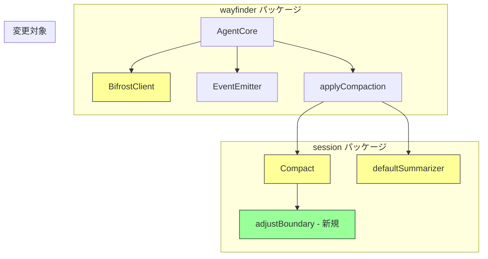

# 047: Compaction ツールペア保護と wayfinder ストリーミング対応

## 背景 (Background)

### 問題 1: Compaction がツール呼び出しペアを分断する

wayfinder エージェントの context compaction（コンテキスト圧縮）機能が、LLM API のメッセージ順序制約に違反するリクエストを生成し、Gemini API から 400 エラーが返される問題が発生している。

具体的には、`Compact()` のスライディングウィンドウが **メッセージ単位** で分割境界を決定するため、以下の状況が発生する:

1. `assistant` メッセージ（tool_use 付き）が「古いメッセージ」として要約される
2. 対応する `tool` メッセージ（tool_result）が「最近のメッセージ」として保持される
3. 結果として `function_call_output` が対応する `function_call` なしで LLM API に送信される

エラーメッセージ:
```
Please ensure that function response turn comes immediately after a function call turn.
```

### 問題 2: defaultSummarizer が要約ではなく文字列クリッピングをしている

`defaultSummarizer` は LLM による要約を行っておらず、単なる文字列の先頭200文字を切り出すクリッピング処理を行っている。これは以下の点で問題がある:

1. **文意の喪失**: 文章の途中で切断されるため、文脈や意図が失われる
2. **ツール呼び出し情報の喪失**: `ToolCalls` フィールドを完全に無視しており、エージェントがどのツールを使って何をしたかの情報が消える
3. **精度の極端な低下**: 圧縮後のコンテキストが断片的になり、後続の LLM 呼び出しの品質が著しく劣化する

真の要約とは、LLM に問い合わせて、可能な限り文意を残しながら文章を短くすることである。`AgentCore` は `ac.llm`（LLMClient）を保持しているため、summarizer 内から LLM を呼び出す構造は既に整っている。

### 問題 3: wayfinder の LLM 呼び出しが非ストリーミング

`BifrostClient.buildRequestBody()` がリクエストに `stream` フィールドを設定しておらず、常に non-stream パスで処理される。wayfinder は内部エージェントだが、`Send()` メソッドは既に goroutine 内で `core.Run()` を実行し、EventEmitter 経由でイベントをチャネルに流す設計になっている。LLM 呼び出し自体もストリーミング化すれば、テキスト応答をリアルタイムに配信でき、長時間のレスポンス待ちも解消される。

## 要件 (Requirements)

### 必須要件 (Must)

#### R1: Compaction スライディングウィンドウのツールペア保護

- `Compact()` のスライディングウィンドウ境界が、ツール呼び出しペア（`assistant` + tool_calls 付きメッセージと、直後の `tool` ロールメッセージ群）の間に入らないようにする
- 境界が `tool` ロールメッセージから始まる場合、そのメッセージの前にある対応する `assistant` メッセージ（tool_calls 付き）まで境界を前にずらす
- compaction 後のメッセージ列に、対応する `function_call` がない孤立した `function_call_output` が含まれないことを保証する

#### R2: defaultSummarizer の LLM ベース要約への置換

- `defaultSummarizer` を文字列クリッピングから **LLM を使った真の要約** に置き換える
- LLM に古いメッセージ列を渡し、文意を保持しながら簡潔に要約させる
- 要約プロンプトに以下の保護指示を含める:
  - ツール呼び出しの名前（Name）と結果の概要は必ず保持すること
  - ユーザーの要求とアシスタントの対応の因果関係を維持すること
  - 具体的なファイルパスや操作結果は可能な限り保持すること
- LLM 呼び出しが失敗した場合のフォールバック: ツール構造情報を付加した簡易フォーマット（文字列クリッピングではない構造化出力）を返す
- 要約に使用するモデルは `ac.config.LogicalModel`（メインの LLM と同じモデル）を使用する

#### R3: wayfinder BifrostClient のストリーミング対応

- `BifrostClient` に `stream: true` を指定したリクエストを送信するメソッドを追加する
- LLM レスポンスのテキストチャンクを受信するたびに、EventEmitter 経由で `EventText` イベントを即時発行する
- ストリーミング中に tool_use ブロックを検出した場合、完全に受信してから `ToolCall` として返す（tool 実行は全チャンク受信後）
- 既存の `GenerateMessage()` インターフェースとの後方互換性を維持する

### 任意要件 (Nice to Have)

#### R4: ストリーミングの設定可能性

- `AgentConfig` にストリーミング有効/無効の設定を追加し、設定で切り替え可能にする

## 実現方針 (Implementation Approach)

### コンポーネント概要



### Phase A: Compaction ツールペア保護 (R1)

#### `Compact()` 関数の修正

`Compact()` のスライディングウィンドウ境界を決定した後、以下のロジックで境界を調整する:

```
1. 初期境界 = len(unpinned) - windowSize
2. recentMessages の先頭メッセージを確認
3. もし先頭が tool ロール（ToolCallID 非空）の場合:
   a. 境界を1つ前にずらす
   b. ずらした位置のメッセージも tool ロールなら、さらにずらす（連続 tool 対応）
   c. ずらした位置が assistant（ToolCalls 非空）になるまで繰り返す
4. 調整後の境界で oldMessages / recentMessages を再分割
```

ヘルパー関数 `adjustBoundaryForToolPairs(unpinned []Message, boundary int) int` を新設する。

#### バリデーション

compaction 適用後に、結果メッセージ列をスキャンして:
- `tool` ロールのメッセージの直前に、対応する `assistant` (tool_calls 付き) が存在することを確認
- 違反があればログ警告を出し、compaction をスキップ（元のメッセージ列を返す）

### Phase B: defaultSummarizer を LLM ベースの要約に置換 (R2)

現在の `defaultSummarizer` は文字列クリッピング（先頭200文字で切断）であり、文意を破壊する。これを LLM を使った真の要約に置き換える。

#### 要約プロンプトの設計

古いメッセージ列を構造化テキストに変換し、LLM に要約を依頼する:

```go
func (ac *AgentCore) defaultSummarizer(msgs []session.Message) (string, error) {
    // 1. メッセージ列を構造化テキストに変換
    var conversationLog strings.Builder
    for _, m := range msgs {
        switch m.Role {
        case "user":
            conversationLog.WriteString(fmt.Sprintf("USER: %s\n", m.Content))
        case "assistant":
            conversationLog.WriteString(fmt.Sprintf("ASSISTANT: %s\n", m.Content))
            for _, tc := range m.ToolCalls {
                conversationLog.WriteString(fmt.Sprintf("  [TOOL CALL: %s (id=%s)]\n", tc.Name, tc.ID))
            }
        case "tool":
            conversationLog.WriteString(fmt.Sprintf("  [TOOL RESULT (id=%s): %s]\n", m.ToolCallID, m.Content))
        }
    }

    // 2. LLM に要約を依頼
    summaryPrompt := []ChatMessage{
        {
            Role: "system",
            Content: `You are a conversation summarizer. Summarize the following conversation concisely.
Rules:
- Preserve the meaning and intent of user requests and assistant responses.
- MUST preserve all tool call names and their outcomes (success/failure/key results).
- MUST preserve specific file paths, command outputs, and operation results.
- Keep causal relationships between user requests and assistant actions.
- Output in the same language as the conversation.
- Be concise but do not lose important facts.`,
        },
        {
            Role:    "user",
            Content: "Summarize this conversation:\n\n" + conversationLog.String(),
        },
    }

    resp, err := ac.llm.GenerateMessage(
        context.Background(),
        ac.config.LogicalModel,
        summaryPrompt,
        nil, // tools は不要
    )
    if err != nil {
        // フォールバック: LLM 失敗時は構造化フォーマットで返す
        return ac.structuredFallbackSummary(msgs), nil
    }
    return resp.Content, nil
}
```

#### フォールバック（LLM 呼び出し失敗時）

LLM が利用不可の場合、文字列クリッピングではなく構造化フォーマットで返す:

```go
func (ac *AgentCore) structuredFallbackSummary(msgs []session.Message) string {
    var summary strings.Builder
    for _, m := range msgs {
        switch m.Role {
        case "user":
            summary.WriteString("USER: " + truncateWithEllipsis(m.Content, 300) + "\n")
        case "assistant":
            summary.WriteString("ASSISTANT: " + truncateWithEllipsis(m.Content, 300) + "\n")
            for _, tc := range m.ToolCalls {
                summary.WriteString(fmt.Sprintf("  [TOOL: %s]\n", tc.Name))
            }
        case "tool":
            summary.WriteString("  [RESULT: " + truncateWithEllipsis(m.Content, 150) + "]\n")
        }
    }
    return summary.String()
}
```

フォールバックは文字列クリッピングに見えるが、現行版との違いは:
- ツール呼び出し構造（名前、結果）を明示的に保持する
- `tool` ロールのメッセージも含める（現行版は user/assistant のみ）
- メッセージのロールを明示して構造を維持する

### Phase C: BifrostClient ストリーミング対応 (R3)

#### LLMClient インターフェースの拡張

新しいメソッドを追加（既存の `GenerateMessage` はそのまま維持）:

```go
// StreamingLLMClient extends LLMClient with streaming support.
type StreamingLLMClient interface {
    LLMClient
    // GenerateMessageStream sends a streaming request and calls onDelta for each text delta.
    // Returns the final complete response (with tool calls if any).
    GenerateMessageStream(ctx context.Context, logicalModel string, messages []ChatMessage, tools []ToolDefinition, onDelta func(textDelta string)) (*LLMResponse, error)
}
```

#### BifrostClient の変更

1. `buildRequestBody` に `stream: true` を設定するオプションを追加
2. `GenerateMessageStream` メソッドを実装:
   - SSE レスポンスをパースし、テキストデルタを `onDelta` コールバック経由で配信
   - tool_use ブロックはバッファリングして完全受信後に ToolCall として返す
   - 最終的に完全な `LLMResponse` を返す

#### AgentCore の変更

`runSimple` の LLM 呼び出し部分で、LLM クライアントが `StreamingLLMClient` を実装している場合はストリーミングメソッドを使用:

```go
if streamClient, ok := ac.llm.(StreamingLLMClient); ok {
    onDelta := func(delta string) {
        ac.emitter.Emit(codingagent.StreamEvent{
            Type:    codingagent.EventText,
            Content: delta,
        })
    }
    resp, err = streamClient.GenerateMessageStream(ctx, ac.config.LogicalModel, ac.messages, toolDefs, onDelta)
} else {
    resp, err = ac.llm.GenerateMessage(ctx, ac.config.LogicalModel, ac.messages, toolDefs)
}
```

## 検証シナリオ (Verification Scenarios)

### シナリオ 1: Compaction ツールペア保護の検証

1. wayfinder セッションを作成し、MaxTurns=4 に設定する
2. ツール呼び出しを含むメッセージ履歴を構築する:
   - user -> assistant(tool_use: edit_file) -> tool(result) -> assistant(response) -> user -> assistant -> ...
3. compaction が発動する状態にする
4. compaction 後のメッセージ列を検証:
   - tool ロールのメッセージの直前に、対応する assistant(tool_calls 付き) が必ず存在する
   - 孤立した tool メッセージが存在しない
5. 圧縮後のリクエストを Gemini に送信してエラーが発生しないことを確認

### シナリオ 2: 複数ツール呼び出しのペア保護

1. assistant が複数のツール (edit_file + execute_command) を同時に呼び出すケース
2. 対応する tool 結果が2つ連続するケース
3. compaction 境界が最初の tool 結果に当たった場合、assistant まで含めて境界がずれることを検証

### シナリオ 3: LLM ベース要約の動作検証

1. ツール呼び出しを含むメッセージ列を LLM に要約させる
2. 要約結果にツール名と操作結果の概要が含まれていることを検証
3. ユーザーの要求とアシスタントの対応の因果関係が維持されていることを検証
4. LLM 呼び出しが失敗した場合、構造化フォールバック出力が返ることを検証
5. フォールバック出力にもツール名と結果が含まれることを検証

### シナリオ 4: ストリーミング LLM 呼び出し

1. BifrostClient でストリーミングリクエストを送信
2. テキストデルタが EventEmitter 経由で即時配信されることを検証
3. ツール呼び出しを含むレスポンスで、ToolCall が正しく収集されることを検証
4. 既存の非ストリーミング GenerateMessage が引き続き動作することを検証

### シナリオ 5: E2E 統合テスト

1. `ternctl run --agent wayfinder --prompt "..." --work-dir ./tmp` でツール呼び出しを伴うタスクを実行
2. WBS 実行でツール呼び出しの多いタスクを実行し、compaction が発動してもエラーが発生しないことを確認

## テスト項目 (Testing for the Requirements)

### 単体テスト

```bash
# compaction のツールペア保護テスト
./scripts/process/build.sh
```

対象テストファイル:
- `shared/libs/go/wayfinder/session/compaction_test.go` -- 新規テストケース追加
  - `TestCompact_ToolPairNotSplit` -- ツールペアが分断されないことの検証
  - `TestCompact_MultipleToolResultsNotSplit` -- 複数ツール結果の境界保護
  - `TestCompact_BoundaryAdjustmentShiftsCorrectly` -- 境界調整の正確性
- `shared/libs/go/wayfinder/agent_core_test.go` -- defaultSummarizer のテスト追加
- `shared/libs/go/wayfinder/bifrost_client_test.go` -- ストリーミングパースのテスト追加

### 統合テスト

```bash
./scripts/process/integration_test.sh --categories llm,taskengine
```

ストリーミングの E2E 動作確認は手動で `ternctl run` を実行する。
