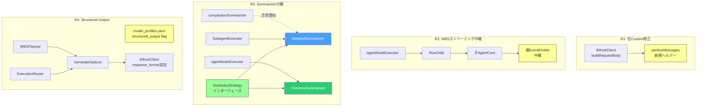

# 048: Wayfinder 安定性強化 -- 空Content修正・WBSストリーミング中継・Summarizer用途別分離・Structured Output

## 背景 (Background)

### 前提: 047 の実装完了状態

[047-Compaction-ToolPair-Protection-And-Streaming.md](file:///c:/Users/yamya/myprog/arctic-tern/work/feat-llm-backend/prompts/phases/000-foundation/branches/feat-llm-backend/ideas/047-Compaction-ToolPair-Protection-And-Streaming.md) で以下が実装済みである:

- R1: Compaction のツールペア保護 (`adjustBoundaryForToolPairs`, `validateToolPairIntegrity`)
- R2: `defaultSummarizer` の LLM ベース要約化 (`summarizationSystemPrompt`, `structuredFallbackSummary`)
- R3: BifrostClient のストリーミング対応 (`GenerateMessageStream`, `parseSSEStream`)

本仕様書は 047 の上に積むべき 4 つの問題を扱う。

### 問題 1: 空 Content メッセージによる Gemini API HTTP 400 エラー

`ternctl` 実行時に以下のエラーが継続的に発生している:

```
bifrost stream: HTTP 400: {"error":{"type":"api_error",
  "message":"* GenerateContentRequest.contents[21].parts[0].data:
  required oneof field 'data' must have one initialized field\n",
  "code":"upstream_error"}}
```

調査の結果、[bifrost_client.go:87-96](file:///c:/Users/yamya/myprog/arctic-tern/work/feat-llm-backend/shared/libs/go/wayfinder/bifrost_client.go#L87-L96) で `tool` メッセージの `content` フィールドが空文字列 `""` のまま送信されるケースがある。Bifrost SDK が Anthropic 形式から Gemini の `GenerateContentRequest` 形式に変換する際、空 content の `tool_result` を空の `parts[].data` に変換し、Gemini API が拒否する。

これが WBS ノード実行の失敗原因であり、間接的に「ファイルが書き出されない」問題を引き起こしている（WBS Node 2.1 が LLM 呼び出しで失敗し、write_file ステップまで到達しない）。

### 問題 2: WBS Planning モードでのストリーミング未中継

047-R3 で `runSimple` 内のストリーミングは実装済みだが、WBS Planning モードでは以下の問題がある:

1. `agentNodeExecutor.ExecuteNode` は `RunChild` でサブ AgentCore を作成するが、子 AgentCore の EventEmitter はセットされない
2. `agentNodeExecutorSimple` は `runSimple` を使うが、WBS 全体のストリーミングイベントは `node_start` / `node_complete` / `progress` のみで、**子セッション内のテキストデルタが親に中継されない**
3. 結果として、WBS 実行中はクライアント側にテキストのリアルタイム表示がされない

### 問題 3: Summarizer の用途不一致

コードベースに 3 つの要約処理が存在し、同じ `SummarizeForParent` を使い回しているが、消費者と要求が異なる:

| # | 名称 | 消費者 | 要求 |
|---|------|--------|------|
| A | `defaultSummarizer` | Compaction -> 親 LLM | ツール呼び出し構造と因果関係の保存 |
| B | `SummarizeForParent` (Tool Calling) | 親 LLM の次のアクション判断 | 具体的データの保存（ファイル名、エラーコード、出力構造） |
| C | `SummarizeForParent` (WBS Node) | Orchestrator の ResultSummary | 成否判定と概要のみ（文章量の大幅削減が可能） |

A と B は要求が類似するが、C は明確に異なる。WBS ノードの結果は `CollectResults` で `"[1.1] Name: summary"` 形式に結合されるだけであり、ツール呼び出しの詳細構造を保存する必要がない。

また、`defaultSummarizer` という名前は「何のデフォルトか」が不明確で、各 Summarizer の用途を識別できない。

### 問題 4: WBS Planner の LLM 出力依存性

[wbs_planner.go](file:///c:/Users/yamya/myprog/arctic-tern/work/feat-llm-backend/shared/libs/go/wayfinder/planning/wbs_planner.go) と [execution_router.go](file:///c:/Users/yamya/myprog/arctic-tern/work/feat-llm-backend/shared/libs/go/wayfinder/execution_router.go) が LLM の自由テキスト出力に依存し、`extractJSON` で JSON を抽出してパースしている。LLM が不安定な出力（マークダウンラッパー、不完全な JSON、スキーマ違反）を返した場合にパースが失敗する。

Bifrost SDK v1.5.18 の `ChatParameters` に `ResponseFormat *interface{}` フィールドが存在し、各プロバイダの Structured Output 機能（OpenAI `json_schema`、Gemini `json_object`）を利用可能である。ただし Anthropic は非対応のため、フォールバック設計が必要。

## 要件 (Requirements)

### 必須要件 (Must)

#### R1: 空 Content メッセージのサニタイズ

- `buildRequestBody` で `tool` メッセージの `content` が空文字列 `""` の場合、プレースホルダーテキスト（例: `"(no output)"`）を設定すること
- `assistant` メッセージの `content` が空で `ToolCalls` もない場合、プレースホルダーテキスト（例: `"(empty)"`）を設定すること
- サニタイズは `buildRequestBody` 内で行い、`ac.messages` の実データは変更しないこと（送信時のみの変換）
- ストリーミング用の `buildStreamRequestBody` にも同一のサニタイズを適用すること

#### R2: WBS Planning モードでのストリーミング中継

- `agentNodeExecutor.ExecuteNode` で作成する子 AgentCore に、親の EventEmitter を渡すこと
- 子セッション内のテキストデルタ（`EventText`）、ツール呼び出し（`EventToolUse`）、ツール結果（`EventToolResult`）が親の EventEmitter に中継されること
- WBS Orchestrator の `node_start` / `node_complete` イベントは維持し、子セッションのイベントはその間に挟まること
- `agentNodeExecutorSimple` では既存の `runSimple` がストリーミングを処理するため、追加変更は不要

#### R3: Summarizer の用途別分離

##### R3-1: SummaryStrategy インターフェースの導入

```go
// SummaryStrategy defines the summarization approach.
type SummaryStrategy interface {
    Summarize(ctx context.Context, hints *Hints, rawOutput string) (string, error)
}
```

##### R3-2: DetailedSummarizer の実装

- 現在の `SummarizeForParent` のプロンプトを引き継ぐ
- ツール呼び出しの具体的な結果（ファイルパス、エラーコード、コマンド出力の構造）を保存する
- 出力フォーマット: `Status: [SUCCESS/FAILURE]`, `Summary`, `Key Findings / Errors`
- 使用箇所:
  - `SubagentExecutor` (Tool Calling パス)

##### R3-3: OutcomeSummarizer の実装

- 成否判定と概要のみを出力する新しいプロンプトを使用する
- ツール呼び出しの詳細構造は不要。「何をしたか」「目的を達したか」のみ
- 出力フォーマット: 1-3 文の自然文（Status/Key Findings 等の構造は不要）
- 文章量の目標: 元の出力の 20-30% 以下
- 使用箇所:
  - `agentNodeExecutor` (WBS Planning パス)

##### R3-4: CompactionSummarizer のリネーム

- `defaultSummarizer` を `compactionSummarizer` にリネームする
- 内部の方針は変更しない（現在の `summarizationSystemPrompt` を使い続ける）
- `applyCompaction` からの呼び出し箇所のみ更新する

#### R4: Structured Output による WBS Planner 安定化

##### R4-1: model_profiles.yaml への `structured_output` フラグ追加

- `ModelBehavior` 構造体に `StructuredOutput bool` フィールドを追加する
- `model_profiles.yaml` の各モデルエントリに `structured_output: true/false` を設定可能にする

```yaml
models:
  - name: gemini-2.5-flash
    behavior:
      structured_output: true
  - name: claude-sonnet-4-20250514
    behavior:
      structured_output: false  # Anthropic は非対応
```

##### R4-2: LLMClient インターフェースへの GenerateOptions 追加

```go
type GenerateOptions struct {
    ResponseFormat *ResponseFormat
}

type ResponseFormat struct {
    Type       string // "json_object" or "json_schema"
    JSONSchema any    // JSON Schema definition (optional)
}
```

- `GenerateMessage` のシグネチャに可変長引数 `opts ...GenerateOptions` を追加する
- 既存の呼び出し元はオプション引数なしで動作し、後方互換性を維持する

##### R4-3: WBS Planner での Structured Output 活用

- `structured_output` フラグが `true` のモデルの場合、`response_format` を設定して LLM を呼び出す
- `false` の場合は現在のプロンプトベース + `extractJSON` にフォールバックする
- WBS Tree の JSON Schema を `ResponseFormat.JSONSchema` として提供する

##### R4-4: ExecutionRouter での Structured Output 活用

- 同様に `structured_output` フラグに基づいて `response_format` を条件付きで設定する
- フォールバックは現在の `extractRouterJSON` を使用する

### 任意要件 (Nice to Have)

#### R5: `buildRequestBody` の Gemini 互換性強化

- `tool_result` の `content` フィールドを Gemini が受け入れる形式に変換するヘルパー関数を追加する
- ストリーミング・非ストリーミングの両方に適用する

## 実現方針 (Implementation Approach)

### 全体アーキテクチャ



### Phase 1: R1 空 Content 修正

#### 対象ファイル

- [bifrost_client.go](file:///c:/Users/yamya/myprog/arctic-tern/work/feat-llm-backend/shared/libs/go/wayfinder/bifrost_client.go)

#### 変更内容

`buildRequestBody` 内のメッセージ変換ループで、送信前にサニタイズを適用する:

```go
// tool メッセージの content が空の場合
if msg.Role == "tool" {
    content := msg.Content
    if content == "" {
        content = "(no output)"
    }
    apiMsg["content"] = []map[string]any{
        {
            "type":        "tool_result",
            "tool_use_id": msg.ToolCallID,
            "content":     content,
        },
    }
}
```

`else` ブランチ（L115-116、ToolCalls なしの通常メッセージ）でも同様に空チェック:

```go
} else {
    content := msg.Content
    if content == "" {
        content = "(empty)"
    }
    apiMsg["content"] = content
}
```

### Phase 2: R2 WBS ストリーミング中継

#### 対象ファイル

- [agent_core.go](file:///c:/Users/yamya/myprog/arctic-tern/work/feat-llm-backend/shared/libs/go/wayfinder/agent_core.go) -- `agentNodeExecutor` 構造体
- [agent_runner.go](file:///c:/Users/yamya/myprog/arctic-tern/work/feat-llm-backend/shared/libs/go/wayfinder/agent_runner.go) -- `RunChild` メソッド
- [subagent/subagent_executor.go](file:///c:/Users/yamya/myprog/arctic-tern/work/feat-llm-backend/shared/libs/go/wayfinder/subagent/subagent_executor.go) -- `AgentRunner` インターフェース

#### 変更内容

1. `AgentRunner.RunChild` のシグネチャは変更せず、`AgentRunnerConfig` に `Emitter` フィールドを追加する
2. `AgentRunnerImpl.RunChild` で子 AgentCore に `SetEmitter` を呼び出す
3. `agentNodeExecutor` 構造体に `emitter *EventEmitter` フィールドを追加し、`runWithWBSTree` から親 emitter を渡す

### Phase 3: R3 Summarizer 用途別分離

#### 対象ファイル

- [subagent/summarizer.go](file:///c:/Users/yamya/myprog/arctic-tern/work/feat-llm-backend/shared/libs/go/wayfinder/subagent/summarizer.go) -- Strategy インターフェース + 2 実装
- [subagent/subagent_executor.go](file:///c:/Users/yamya/myprog/arctic-tern/work/feat-llm-backend/shared/libs/go/wayfinder/subagent/subagent_executor.go) -- DetailedSummarizer を注入
- [agent_core.go](file:///c:/Users/yamya/myprog/arctic-tern/work/feat-llm-backend/shared/libs/go/wayfinder/agent_core.go) -- agentNodeExecutor に OutcomeSummarizer を注入、defaultSummarizer リネーム

#### SummaryStrategy インターフェース

```go
// SummaryStrategy defines the summarization approach.
type SummaryStrategy interface {
    Summarize(ctx context.Context, hints *Hints, rawOutput string) (string, error)
}
```

#### DetailedSummarizer

現在の `summarySystemPrompt` をそのまま使用:

```
Status: [SUCCESS/FAILURE]
Summary: [3-5 line summary of results]
Key Findings / Errors: [Important errors, stack traces, or key data points if any]
```

#### OutcomeSummarizer

新しいプロンプト:

```
You are summarizing the result of a subtask execution.
Describe what was done and whether the objective was achieved in 1-3 sentences.
Do not include tool call details, file listings, or raw command output.
Focus only on the outcome: what happened and whether it succeeded.
```

#### Compaction (リネームのみ)

`defaultSummarizer` -> `compactionSummarizer`。内部ロジックの変更なし。

### Phase 4: R4 Structured Output

#### 対象ファイル

- [config/model_profiles.go](file:///c:/Users/yamya/myprog/arctic-tern/work/feat-llm-backend/shared/libs/go/config/model_profiles.go) -- `ModelBehavior` に `StructuredOutput` 追加
- [wayfinder/llm_client.go](file:///c:/Users/yamya/myprog/arctic-tern/work/feat-llm-backend/shared/libs/go/wayfinder/llm_client.go) -- `GenerateOptions` 型追加
- [wayfinder/bifrost_client.go](file:///c:/Users/yamya/myprog/arctic-tern/work/feat-llm-backend/shared/libs/go/wayfinder/bifrost_client.go) -- `buildRequestBody` に `response_format` 追加
- [wayfinder/planning/wbs_planner.go](file:///c:/Users/yamya/myprog/arctic-tern/work/feat-llm-backend/shared/libs/go/wayfinder/planning/wbs_planner.go) -- Structured Output 利用
- [wayfinder/execution_router.go](file:///c:/Users/yamya/myprog/arctic-tern/work/feat-llm-backend/shared/libs/go/wayfinder/execution_router.go) -- Structured Output 利用
- [settings/demo/model_profiles.yaml](file:///c:/Users/yamya/myprog/arctic-tern/work/feat-llm-backend/settings/demo/model_profiles.yaml) -- フラグ追加
- [settings/example/model_profiles.yaml](file:///c:/Users/yamya/myprog/arctic-tern/work/feat-llm-backend/settings/example/model_profiles.yaml) -- フラグ追加

#### LLMClient インターフェース変更

```go
type LLMClient interface {
    GenerateMessage(ctx context.Context, model string, messages []ChatMessage,
        tools []ToolDefinition, opts ...GenerateOptions) (*LLMResponse, error)
}
```

可変長引数により後方互換性を維持する。

#### WBS Tree JSON Schema

```json
{
  "type": "object",
  "properties": {
    "root_nodes": {
      "type": "array",
      "items": {
        "type": "object",
        "properties": {
          "id": { "type": "string" },
          "name": { "type": "string" },
          "description": { "type": "string" },
          "status": { "type": "string", "enum": ["pending"] },
          "dependencies": { "type": "array", "items": { "type": "string" } },
          "sub_steps": { "type": "array", "items": { "type": "object" } }
        },
        "required": ["id", "name", "description", "status", "dependencies"]
      }
    }
  },
  "required": ["root_nodes"]
}
```

> **注意**: Gemini API で再帰的 `$ref` がサポートされない場合、`sub_steps` は depth 2-3 までの固定スキーマに展開する必要がある。実装時に確認する。

## 検証シナリオ (Verification Scenarios)

### シナリオ 1: 空 Content のサニタイズ (R1)

1. ツール実行結果が空文字列となるケース（例: `execute_command` で出力なし）を再現する
2. `buildRequestBody` で生成されるリクエストボディを検証し、`tool_result` の `content` が空でないことを確認する
3. Gemini API に送信して HTTP 400 エラーが発生しないことを確認する
4. `assistant` メッセージで `content` が空かつ `ToolCalls` もないケースでもプレースホルダーが設定されることを確認する

### シナリオ 2: WBS ストリーミング中継 (R2)

1. `ternctl run --agent wayfinder --prompt "ディレクトリ構造を解析してレポートを作成"` を実行する
2. WBS Planning モードが選択されることを確認する
3. 各 WBS ノード実行中に、テキストデルタがリアルタイムで表示されることを確認する
4. `node_start` -> (子セッションのテキスト/ツールイベント) -> `node_complete` の順序でイベントが流れることを確認する

### シナリオ 3: Summarizer の分離 (R3)

1. Tool Calling パスで `execute_command: go test ./...` を実行する
2. `DetailedSummarizer` による要約に、テストの成否、失敗テスト名、エラー行番号が含まれることを確認する
3. WBS Planning パスで同様のタスクを実行する
4. `OutcomeSummarizer` による要約が 1-3 文の自然文であり、ツール呼び出しの詳細を含まないことを確認する
5. `compactionSummarizer` がリネーム後も正常に動作することを確認する

### シナリオ 4: Structured Output (R4)

1. `gemini-2.5-flash` (structured_output: true) で WBS 生成を実行し、JSON が正しくパースされることを確認する
2. `claude-sonnet-4` (structured_output: false) で WBS 生成を実行し、`extractJSON` フォールバックが動作することを確認する
3. ExecutionRouter で同様に Structured Output の有無による分岐を確認する
4. `model_profiles.yaml` で `structured_output` フラグが未設定の場合、デフォルトで `false` として動作することを確認する

### シナリオ 5: E2E 統合テスト

1. `ternctl run --agent wayfinder --work-dir ./tmp --prompt "Create a hello.txt file with greeting"` を実行する
2. ファイルが正常に書き出されることを確認する（問題 1 の修正検証）
3. ストリーミングでテキストがリアルタイム表示されることを確認する（問題 2 の修正検証）
4. WBS 実行が完了し、エラーなく結果が返ることを確認する

## テスト項目 (Testing for the Requirements)

### 単体テスト

```bash
./scripts/process/build.sh
```

対象テストファイル:
- `shared/libs/go/wayfinder/bifrost_client_test.go`
  - `TestBuildRequestBody_EmptyToolContent` (新規) -- 空 tool content のサニタイズ
  - `TestBuildRequestBody_EmptyAssistantContent` (新規) -- 空 assistant content のサニタイズ
- `shared/libs/go/wayfinder/subagent/summarizer_test.go`
  - `TestDetailedSummarizer_PreservesStructure` (新規) -- 構造保存の検証
  - `TestOutcomeSummarizer_CompactOutput` (新規) -- 文意保存の検証
- `shared/libs/go/wayfinder/agent_core_test.go`
  - `TestCompactionSummarizer_Renamed` (既存テストのリネーム対応)
- `shared/libs/go/config/model_profiles_test.go`
  - `TestModelBehavior_StructuredOutput` (新規) -- フラグの読み込み検証
- `shared/libs/go/wayfinder/planning/wbs_planner_test.go`
  - `TestGenerateWBS_WithStructuredOutput` (新規) -- Structured Output パスの検証
  - `TestGenerateWBS_FallbackWithoutStructuredOutput` (新規) -- フォールバックパスの検証
- `shared/libs/go/wayfinder/execution_router_test.go`
  - `TestRoute_WithStructuredOutput` (新規)

### 統合テスト

```bash
./scripts/process/integration_test.sh --categories llm,taskengine
```

ストリーミングの E2E 動作確認は手動で `ternctl run` を実行する。
