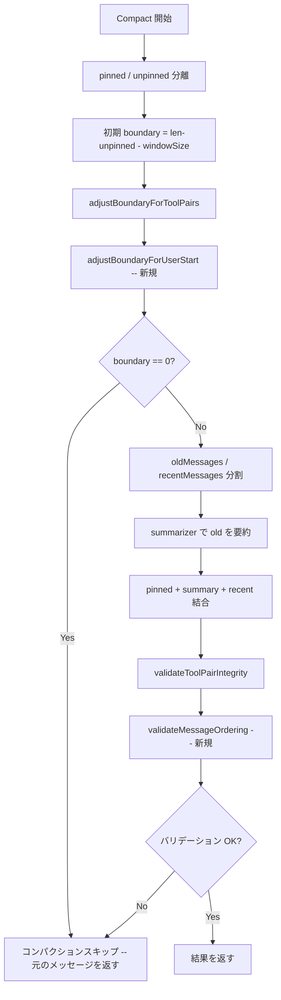

# 049: Compaction 境界調整 -- recentMessages の user 先頭保証

## 背景 (Background)

### 問題: コンパクション後のメッセージ順序が Gemini API の制約に違反する

047 仕様（Compaction ツールペア保護）で `adjustBoundaryForToolPairs` を導入し、`tool` メッセージの分断は防止された。しかし、コンパクション後の `recentMessages` が `assistant(tool_calls)` で始まるケースは考慮されておらず、Gemini API から HTTP 400 エラーが発生している。

具体的なエラー:
```
Please ensure that function call turn comes immediately after a user turn
or after a function response turn.
```

### 発生条件

コンパクションの `Compact()` 関数は以下の構造でメッセージ列を再構成する:

```
[pinned messages] + [system(要約)] + [recentMessages]
```

`adjustBoundaryForToolPairs` により `recentMessages` の先頭は `tool` にはならないが、`assistant(tool_calls)` で始まることは許容される。このとき:

```
[0] system (コンパクション要約)
[1] assistant + tool_calls  --> Bifrost変換 --> function_call
[2] tool                    --> Bifrost変換 --> function_call_output
...
```

Gemini は `function_call` が `user` ターンまたは `function_response` ターンの直後にしか配置できないため、`system` の直後に `function_call` が来ると HTTP 400 を返す。

### 影響範囲

- Gemini (Google) プロバイダのみで発生する
- Anthropic / OpenAI では `system` 後の `assistant(tool_calls)` は許容される
- WBS ノード子セッションで特に発生しやすい（ツール呼び出しの繰り返しがコンパクションを誘発）
- 現在のリクエストログで WBS ノード `1.1.4` で再現を確認済み

## 要件 (Requirements)

### 必須要件 (Must)

#### R1: コンパクション境界の user 先頭保証

- `Compact()` 後の `recentMessages` は **必ず `user` ロールのメッセージで始まる** ことを保証する
- 境界位置の `recentMessages` 先頭が `user` でない場合、先頭が `user` になるまで境界を前方（oldMessages 側）にずらす
- この調整は既存の `adjustBoundaryForToolPairs` と組み合わせて動作する（両方の制約を同時に満たす）
- boundary が 0 に達した場合（全メッセージが recentMessages に含まれる）は、コンパクションをスキップする

#### R2: バリデーション強化

- `validateToolPairIntegrity` に加えて、コンパクション後のメッセージ列が以下の条件を満たすことを検証する:
  - `system` メッセージの直後に `assistant(tool_calls)` が来ないこと
  - 非 pinned メッセージの先頭が `user` であること
- 違反時はフォールバック（元のメッセージ列を返す）

### 任意要件 (Nice to Have)

#### R3: 全プロバイダ安全なメッセージ正規化

- 将来的に他のプロバイダでも同様の制約が追加される可能性があるため、メッセージ列の正規化ルールを明文化しておく

## 実現方針 (Implementation Approach)

### 変更対象ファイル

| ファイル | 変更内容 |
|----------|----------|
| `shared/libs/go/wayfinder/session/compaction.go` | `adjustBoundaryForUserStart` 関数の追加、`Compact` の修正 |
| `shared/libs/go/wayfinder/session/compaction_test.go` | 新規テストケース追加 |

### 境界調整ロジック

既存の `adjustBoundaryForToolPairs` **の後** に、新しい調整関数を適用する:

```go
// adjustBoundaryForUserStart adjusts the boundary so that
// recentMessages starts with a "user" role message.
// This prevents system(summary) -> assistant(tool_calls) sequences
// that violate Gemini's function call ordering constraint.
func adjustBoundaryForUserStart(unpinned []Message, boundary int) int {
    if boundary <= 0 {
        return 0
    }
    if boundary >= len(unpinned) {
        return boundary
    }

    // If the boundary message is already "user", no adjustment needed.
    if unpinned[boundary].Role == "user" {
        return boundary
    }

    // Shift backward until we find a "user" message.
    for boundary > 0 && unpinned[boundary].Role != "user" {
        boundary--
    }

    // If we reached index 0 and it's not "user", compaction should be skipped.
    if boundary == 0 && unpinned[0].Role != "user" {
        return 0
    }

    return boundary
}
```

`Compact()` 関数での適用順序:

```go
boundary := len(unpinned) - windowSize
boundary = adjustBoundaryForToolPairs(unpinned, boundary)
boundary = adjustBoundaryForUserStart(unpinned, boundary)  // 新規追加
```

### バリデーション強化

`validateToolPairIntegrity` を拡張するか、新しいバリデーション関数 `validateMessageOrdering` を追加する:

```go
// validateMessageOrdering checks that the first non-pinned, non-system
// message after compaction summary is a "user" role message.
func validateMessageOrdering(messages []Message) bool {
    for _, m := range messages {
        if m.Pinned || m.Role == "system" {
            continue
        }
        // First non-pinned, non-system message must be "user".
        return m.Role == "user"
    }
    return true // No non-pinned messages (edge case).
}
```

### 処理フロー図



## 検証シナリオ (Verification Scenarios)

### シナリオ 1: recentMessages が assistant(tool_calls) で始まるケース

1. MaxTurns=4 で以下のメッセージ列を構築:
   - user -> assistant(tool_calls) -> tool -> assistant -> user -> assistant(tool_calls) -> tool -> assistant -> user -> assistant
2. 初期 boundary が assistant(tool_calls) の位置に設定される状況を作る
3. コンパクション後の recentMessages が user で始まることを検証
4. 要約に含まれるメッセージ数が適切であることを検証

### シナリオ 2: adjustBoundaryForToolPairs との組み合わせ

1. 初期 boundary が tool メッセージに設定される状況を作る
2. adjustBoundaryForToolPairs で assistant(tool_calls) まで戻る
3. さらに adjustBoundaryForUserStart でその前の user まで戻ることを検証
4. ツールペアが分断されず、かつ user で始まることを同時に保証

### シナリオ 3: boundary が 0 に達するケース

1. 全メッセージが assistant/tool のみで user が存在しないケース
2. adjustBoundaryForUserStart が 0 を返すことを検証
3. Compact がコンパクションをスキップして元のメッセージを返すことを検証

### シナリオ 4: 既に user で始まるケース（リグレッションなし）

1. 通常のケース（user -> assistant -> user -> ...）でコンパクションが正常動作することを検証
2. 調整なしで boundary がそのまま使用されることを検証

### シナリオ 5: validateMessageOrdering の検証

1. system(summary) + user + assistant + ... の正常なケースで true
2. system(summary) + assistant(tool_calls) + ... の異常なケースで false
3. pinned のみの場合に true（エッジケース）

## テスト項目 (Testing for the Requirements)

### 単体テスト

```bash
./scripts/process/build.sh
```

対象テストファイル:
- `shared/libs/go/wayfinder/session/compaction_test.go` -- 新規テストケース追加:
  - `TestAdjustBoundaryForUserStart_AssistantWithToolCalls` -- assistant(tool_calls) 先頭を user まで戻す
  - `TestAdjustBoundaryForUserStart_AlreadyUser` -- user 先頭の場合は調整なし
  - `TestAdjustBoundaryForUserStart_BoundaryReachesZero` -- boundary が 0 に達する
  - `TestAdjustBoundaryForUserStart_CombinedWithToolPairs` -- adjustBoundaryForToolPairs との連携
  - `TestCompact_RecentMessagesStartWithUser` -- Compact 全体での user 先頭保証
  - `TestValidateMessageOrdering_Valid` -- 正常なメッセージ順序
  - `TestValidateMessageOrdering_InvalidAssistantAfterSystem` -- 不正な順序の検出

### 統合テスト

```bash
./scripts/process/integration_test.sh
```

リグレッション確認のため全統合テストを実行する。
