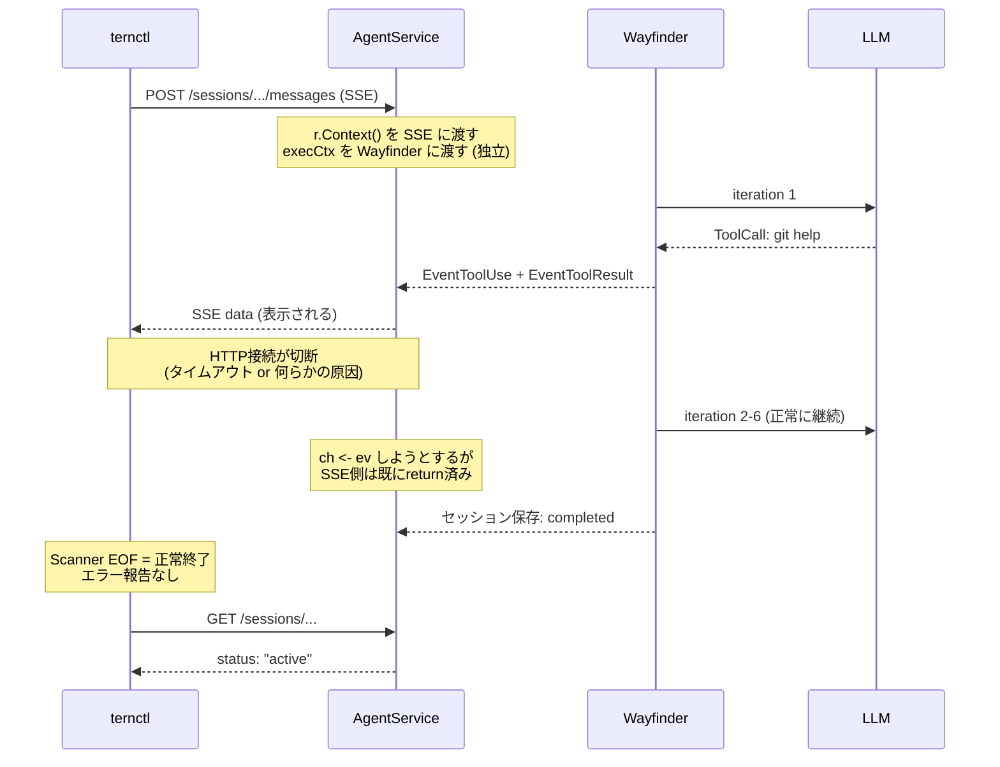
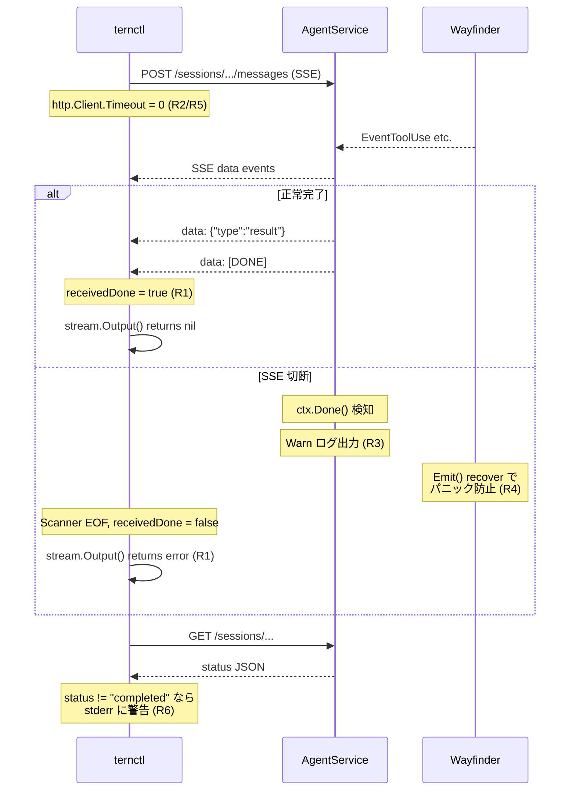

# 050: SSE ストリーミング信頼性向上

## 背景 (Background)

### 問題: ternctl が SSE ストリームの途中切断を検出できない

Wayfinder セッションを `ternctl run` で実行した際に、エージェントは LLM のツール呼び出しループを正常に完了したにもかかわらず、ternctl のターミナルには最初のツール結果しか表示されなかった。ternctl はエラーなく正常終了し、ユーザーにはエージェントが「Give up した」ように見えた。

### 発生メカニズム



### 根本原因の構造

| 層 | 問題 | 該当ファイル |
|---|------|------------|
| クライアント層 | `http.Client.Timeout: 30s` がSSEロングポーリングに対して短すぎる | `client/client.go` L19 |
| クライアント層 | `events()` が `[DONE]` なしの EOF をエラーとして報告しない | `client/stream.go` L148-182 |
| クライアント層 | `Scanner.Err()` をチェックしていない | `client/stream.go` L179 |
| サーバー層 | SSE 切断が `Debug` レベルでしかログ出力されない | `agentservice/handler.go` L287 |
| エージェント層 | `EventEmitter.Emit()` が閉じたチャネルに送信するとパニックする | `wayfinder/emitter.go` L21 |
| CLI層 | セッション最終ステータスが `active`/`error` でも警告なし | `features/ternctl/main.go` L188-197 |

### 影響範囲

- ternctl で Wayfinder を利用する全てのユースケース
- 特に LLM のレスポンス生成に時間がかかるケース(WBS プランニング、複数ツール呼び出し)で顕在化しやすい
- サーバー側の Wayfinder 自体は正常動作しており、セッション JSON には完全な結果が保存されている

---

## 要件 (Requirements)

### 必須要件 (Must)

#### R1: SSE ストリーム不完全終了の検出 (client/stream.go)

- `events()` メソッドが SSE ストリームの終了状態を正しく判別すること
  - `data: [DONE]` を受信して終了 = 正常終了
  - `[DONE]` を受信せずに Scanner が EOF = 異常終了 (不完全ストリーム)
  - `Scanner.Err()` が非 nil = 読み取りエラー
- 異常終了時は `EventError` をチャネルに送信すること
- `Output()` メソッドは異常終了時にエラーを返すこと

#### R2: SSE 対応の HTTP タイムアウト設定 (client/client.go)

- `http.Client.Timeout` は SSE ストリーミングには適用されないようにすること
  - `Timeout` はレスポンス全体の読み取り完了までの時間制限であり、SSE には不適切
- SSE 用に別の設定を提供するか、SSE リクエスト時のみ Timeout を無効化すること
- 個別リクエスト(health, agents, models, session)の短いタイムアウトは維持すること

#### R3: SSE 切断ログレベルの引き上げ (agentservice/handler.go)

- `streamSSE` のクライアント切断ログを `Debug` から `Warn` に変更すること
- 切断時に送信済みイベント数を含めること (既存の `eventCount`)

#### R4: EventEmitter のパニック防止 (wayfinder/emitter.go)

- `Emit()` が閉じたチャネルに送信した場合にパニックしないこと
- `recover` ガードまたはチャネル状態管理で安全性を確保すること
- パニック防止時はログ出力せず silent にドロップすること (チャネルクローズは正常フローの一部であるため)

#### R5: ternctl の SSE タイムアウト無効化 (features/ternctl/main.go)

- `ternctl run` コマンドで使用する `client.Client` の HTTP タイムアウトを SSE 接続に対して無効化すること
- 具体的には `client.New()` 呼び出し時に SSE 対応の設定を適用すること

#### R6: ternctl のセッション最終ステータス警告 (features/ternctl/main.go)

- セッション最終ステータスが `completed` 以外の場合 (特に `active`, `error`)、ternctl が警告メッセージを標準エラー出力に表示すること
- `status: "error"` の場合はエラーメッセージも表示すること

### 任意要件 (Nice to Have)

#### R7: SSE keepalive 間隔の設定可能化

- 現在ハードコードされている 15 秒の keepalive 間隔を設定可能にする
- デフォルト値は 15 秒のまま維持

---

## 実現方針 (Implementation Approach)

### 変更対象ファイル

| ファイル | 変更内容 | 要件 |
|----------|----------|------|
| `shared/libs/go/client/stream.go` | 不完全ストリーム検出 | R1 |
| `shared/libs/go/client/stream_test.go` | テスト追加 | R1 |
| `shared/libs/go/client/client.go` | SSE タイムアウト設定 | R2 |
| `shared/libs/go/client/client_test.go` | テスト追加 | R2 |
| `shared/libs/go/agentservice/handler.go` | ログレベル変更 | R3 |
| `shared/libs/go/wayfinder/emitter.go` | パニック防止 | R4 |
| `shared/libs/go/wayfinder/emitter_test.go` | テスト追加 | R4 |
| `features/ternctl/main.go` | SSE タイムアウト + ステータス警告 | R5, R6 |

### R1: 不完全ストリーム検出

`events()` メソッドを修正して `[DONE]` マーカーの有無を追跡し、正常終了と異常終了を区別する:

```go
func (s *Stream) events() <-chan Event {
    ch := make(chan Event, 8)
    go func() {
        defer close(ch)
        scanner := bufio.NewScanner(s.body)
        receivedDone := false
        for scanner.Scan() {
            line := scanner.Text()
            if !strings.HasPrefix(line, "data: ") {
                continue
            }
            data := strings.TrimPrefix(line, "data: ")
            if data == "[DONE]" {
                receivedDone = true
                return
            }
            // ... 既存のイベント解析 ...
        }
        // 異常終了の検出
        if err := scanner.Err(); err != nil {
            ch <- Event{
                Type:  EventError,
                Error: fmt.Sprintf("stream read error: %v", err),
            }
        } else if !receivedDone {
            ch <- Event{
                Type:  EventError,
                Error: "stream terminated unexpectedly without completion marker",
            }
        }
    }()
    return ch
}
```

### R2: SSE タイムアウト設定

`client.go` に SSE 用のタイムアウト無効化オプションを追加。`http.Client.Timeout = 0` は無制限を意味する:

```go
// WithNoTimeout disables the HTTP client timeout for SSE streaming.
func WithNoTimeout() ClientOption {
    return func(c *Client) {
        c.httpClient.Timeout = 0
    }
}
```

### R3: ログレベル変更

`handler.go` の `streamSSE` 内のクライアント切断ログを `Warn` に変更:

```go
case <-ctx.Done():
    if s.logger != nil {
        s.logger.Warn("client disconnected during SSE stream",
            "session_id", sessionID,
            "events_sent", eventCount)
    }
    return
```

### R4: EventEmitter パニック防止

`Emit()` に `recover` ガードを追加。チャネルクローズ後の送信はサイレントにドロップする:

```go
func (e *EventEmitter) Emit(ev codingagent.StreamEvent) {
    if e == nil || e.ch == nil {
        return
    }
    defer func() {
        recover() // Silently ignore send-on-closed-channel panic.
    }()
    e.ch <- ev
}
```

### R5: ternctl の SSE タイムアウト無効化

`features/ternctl/main.go` で `client.New()` に `WithNoTimeout()` を適用:

```go
c := client.New(serverURL, client.WithNoTimeout())
```

### R6: ternctl のセッション最終ステータス警告

`cmdRun()` のセッション最終ステータス表示部分に警告ロジックを追加:

```go
// Show final session status.
details, err := c.GetSession(ctx, session.ID)
if err == nil {
    out, _ := json.MarshalIndent(details, "", "  ")
    fmt.Println(string(out))

    // Warn if session did not complete successfully.
    if status, ok := details["status"].(string); ok && status != "completed" {
        fmt.Fprintf(os.Stderr, "\nWarning: session ended with status %q (expected \"completed\")\n", status)
        if errMsg, ok := details["error"].(string); ok && errMsg != "" {
            fmt.Fprintf(os.Stderr, "Error details: %s\n", errMsg)
        }
    }
}
```

### 処理フロー図 (修正後)



---

## 検証シナリオ (Verification Scenarios)

### シナリオ 1: 正常完了 (リグレッション確認)

1. `ternctl run --agent wayfinder --prompt "What is 1+1?" --work-dir ./tmp/` を実行
2. SSE ストリームが正常に `[DONE]` で終了する
3. `stream.Output()` が `nil` を返す
4. セッション最終ステータスが `completed` である
5. 警告メッセージが表示されない

### シナリオ 2: 不完全ストリーム検出

1. テストで SSE レスポンスボディを途中で閉じる (EOF)
2. `[DONE]` マーカーなしで Scanner がループを抜ける
3. `stream.Output()` が非 nil エラーを返す
4. エラーメッセージに "stream terminated unexpectedly" を含む

### シナリオ 3: Scanner 読み取りエラー

1. テストで SSE レスポンスボディの Read で error を返す
2. `Scanner.Err()` が非 nil を返す
3. `stream.Output()` が非 nil エラーを返す
4. エラーメッセージに "stream read error" を含む

### シナリオ 4: EventEmitter パニック防止

1. EventEmitter のチャネルを閉じた後に `Emit()` を呼ぶ
2. パニックが発生しない
3. `Emit()` がサイレントにリターンする

### シナリオ 5: ternctl セッションステータス警告

1. セッション最終ステータスが `active` の場合に stderr に警告が出力される
2. セッション最終ステータスが `error` の場合に stderr にエラー詳細が出力される
3. セッション最終ステータスが `completed` の場合に警告は出力されない

### シナリオ 6: HTTP タイムアウト無効化

1. `client.WithNoTimeout()` を適用した Client の `httpClient.Timeout` が `0` である
2. SSE ストリーミングが 30 秒以上継続しても接続が切断されない

---

## テスト項目 (Testing for the Requirements)

### 単体テスト

```bash
./scripts/process/build.sh
```

対象テストファイル:

**R1 テスト (`shared/libs/go/client/stream_test.go`)**:
- `TestStream_Output_IncompleteStream` -- `[DONE]` なしでEOFになった場合にエラーを返す
- `TestStream_Output_ScannerError` -- Scanner読み取りエラー時にエラーを返す
- `TestStream_Output` (既存) -- リグレッション確認: 正常な `[DONE]` 終了で nil を返す

**R2 テスト (`shared/libs/go/client/client_test.go`)**:
- `TestWithNoTimeout` -- `WithNoTimeout()` 適用後に Timeout が 0 になる

**R4 テスト (`shared/libs/go/wayfinder/emitter_test.go`)**:
- `TestEmitter_Emit_ClosedChannel` -- 閉じたチャネルへの送信でパニックしない
- 既存テスト -- リグレッション確認

### 統合テスト

```bash
./scripts/process/integration_test.sh --categories common
```

影響範囲は client/agentservice/wayfinder/ternctl の4層にまたがるが、外部インターフェース(API)の変更はないため、`common` カテゴリの既存テストでリグレッション確認を行う。
