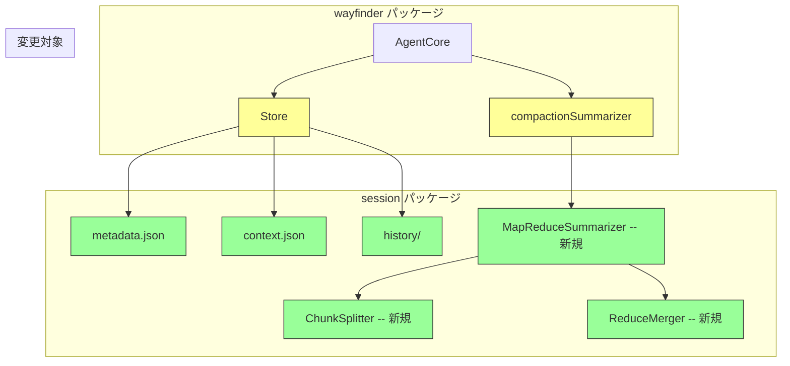
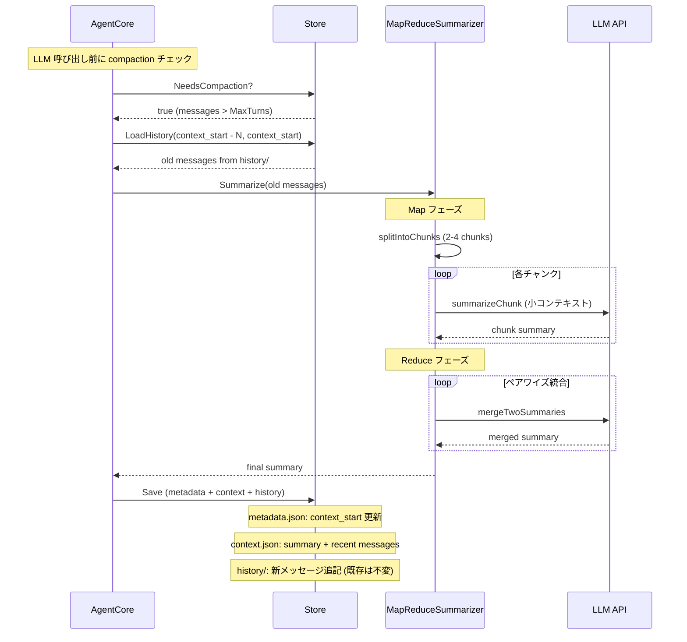

# 051: セッション履歴永続化と Map&Reduce Compaction

## 背景 (Background)

### 問題 1: Compaction の LLM 要約が連鎖的に失敗する

047 仕様で導入された LLM ベース要約 (`compactionSummarizer`) は、古いメッセージ列を丸ごと LLM に送信して要約する。しかし、この「要約用 LLM 呼び出し」自体のコンテキストサイズが LLM のコンテキストウインドウを超過すると、要約が失敗する。

失敗時のフローは以下の通り:

1. `applyCompaction()` が呼ばれる
2. `compactionSummarizer` が古いメッセージ列を LLM に送信
3. メッセージ列が大きすぎて LLM API がエラーを返す
4. フォールバック (`structuredFallbackSummary`) が使われるが、元のメッセージ列は縮小されない
5. 本体の LLM 呼び出しも大きなコンテキストで失敗する
6. `runSimple` がエラーを返し、セッションが中断する

この問題は特に WBS 実行モードの `agentNodeExecutorSimple` で顕著に発生する。全ノードが同一の `ac.messages` を共有するため、ノードが進むごとにメッセージが蓄積され、`git diff` や `git log --stat` など大きな出力を含むツール結果が積み重なり、コンテキスト長が爆発的に増加する。

実際にセッション `wf-1781409546602789700` で、WBS ステップ 4.3 の実行時にこの連鎖失敗が発生し、セッションが途中停止した。

### 問題 2: Compaction で元データが不可逆的に消失する

現在の `Compact()` は、古いメッセージを要約テキストに**置換**する。一度要約に変換されると:

- 元のメッセージは完全に失われる
- 要約の品質が悪くても後から改善できない
- 要約アルゴリズムを改善しても、過去のセッションには適用できない
- デバッグや監査のために過去の会話を遡ることができない

### 問題 3: セッションストレージが単一ファイル構造

現在のセッション管理 (`session/session_store.go`) は、セッション全体を `{session-id}.json` という単一ファイルに保存する。この構造では:

- 会話が長くなるとファイルサイズが膨大になる
- compaction で古いデータを捨てるしかない
- セッションのメタデータとメッセージ内容が混在している
- 会話ターン単位でのランダムアクセスができない

### 問題 4: LLM モデル変更時のコンテキストウインドウ不整合

大きいコンテキストウインドウを持つ LLM (例: 200K tokens) から小さいモデル (例: 8K tokens) に切り替えた場合、既存の要約が新しいモデルのウインドウに収まらない可能性がある。現在の一括要約方式では、このケースに対応できない。

## 要件 (Requirements)

### 必須要件 (Must)

#### R1: セッションフォルダ構成の階層化

セッション管理を単一ファイルからフォルダ構造に移行する:

```
.wayfinder/
  {session-id}/
    metadata.json           # セッションメタデータ
    context.json            # 現在の LLM コンテキスト (compaction 済み)
    history/                # 会話履歴の永続記録
      000000001.json        # 個別の会話ターン
      000000002.json
      ...
```

- **metadata.json**: セッション ID、ステータス、タイムスタンプ、最新の会話履歴番号 (`latest`)、コンテキスト化された範囲 (`context_start`)、WBS ツリーの状態、トラッキング情報などを格納する
- **context.json**: 現在 LLM に送信するためのメッセージ列 (compaction 済み要約 + 最近のメッセージ)
- **history/**: 会話の全ターンを個別ファイルとして永続保存する。compaction の有無に関わらず、全データが保持される

#### R2: 会話履歴の永続記録 (History)

- 各会話ターン (user/assistant/tool メッセージ) を個別の JSON ファイルとして `history/` に記録する
- ファイル名は連番 (9桁ゼロパディング) で、時系列順序を保証する
- 1ファイルには1つのメッセージを記録する (role, content, tool_calls, tool_call_id, timestamp)
- compaction が実行されても、history 内のファイルは一切削除・変更しない
- history は「事実の記録」であり、read-only (append-only) として扱う

#### R3: Map&Reduce Compaction アルゴリズム

現在の「一括要約」を「分割 → 個別要約 → 統合」に変更する:

1. **Map フェーズ**: 要約対象のメッセージ列を 2~4 個のチャンクに分割する
   - チャンクサイズは設定可能とする (デフォルト: `MaxChunkMessages = 20`)
   - 分割境界は既存の `adjustBoundaryForToolPairs` と `adjustBoundaryForUserStart` の制約を守る
   - 各チャンクは独立して LLM に要約を依頼する (新規セッション/コンテキストで実行)
2. **Reduce フェーズ**: 個別の要約結果を統合する
   - 2つの要約を1つにまとめる LLM 呼び出しを繰り返す (ペアワイズ reduce)
   - 最終的に1つの要約テキストにまとめる
3. **フォールバック**: 任意の段階で LLM 呼び出しが失敗した場合
   - 既存の `structuredFallbackSummary` を各チャンクに適用する
   - フォールバック結果を連結して返す (LLM reduce なし)

各 LLM 呼び出しは独立した小さなコンテキストで実行されるため、メッセージ量が膨大でも連鎖失敗しない。

#### R4: metadata.json によるコンテキスト管理

`metadata.json` で以下の情報を管理する:

- `session_id`: セッション識別子
- `status`: セッションステータス (active/completed/failed)
- `latest`: 最後の会話履歴番号
- `context_start`: コンテキスト化されたメッセージの開始番号 (これより前は要約済み)
- `created_at`: セッション作成日時
- `updated_at`: 最終更新日時
- `wbs_tree`: WBS ツリーの状態 (JSON)
- `created_files`: トラッキング中のファイルリスト
- `running_processes`: 実行中のプロセスリスト

#### R5: 既存 API の後方互換性

- `Store` の `Load` / `Save` インターフェースは維持する
- 旧フォーマット (単一 JSON ファイル) からの自動マイグレーションを実装する
- 外部コンポーネント (`AgentCore`, `WBSOrchestrator` 等) の変更を最小限にする

### 任意要件 (Nice to Have)

#### R6: 履歴からの再要約 (Re-summarization)

- `metadata.json` の `context_start` を巻き戻し、history のデータから新しい要約を生成する機能
- モデル変更時や要約アルゴリズム改善時に有用

#### R7: 履歴の検索・参照

- 特定のターン番号の会話を直接参照する API
- 将来的に「過去の会話で何をしたか」を検索するための基盤

#### R8: WBS ノードごとのメッセージスコープ分離

- `agentNodeExecutorSimple` 使用時に、WBS ノード開始時のメッセージ状態を記録し、ノード終了後に要約して元のスコープに戻す仕組み
- これにより、子セッションモードを使わなくてもメッセージ蓄積問題を軽減できる

## 実現方針 (Implementation Approach)

### コンポーネント概要



### Phase A: セッションフォルダ構成の階層化 (R1, R4, R5)

#### 新しい Store の実装

`session_store.go` を改修し、フォルダベースの保存に移行する:

```go
// Store manages session state persistence on the filesystem.
type Store struct {
    rootDir string // .wayfinder/ ルートディレクトリ
}

// sessionDir returns the directory path for a session.
func (s *Store) sessionDir(sessionID string) string {
    return filepath.Join(s.rootDir, sessionID)
}

// Save writes session state to the folder structure.
func (s *Store) Save(state *SessionState) error {
    dir := s.sessionDir(state.SessionID)
    os.MkdirAll(filepath.Join(dir, "history"), 0755)

    // 1. 新しいメッセージを history/ に追記
    //    (前回保存時以降の新しいメッセージのみ)
    // 2. metadata.json を更新
    // 3. context.json を更新 (compaction 済みメッセージ)
}

// Load reads session state from the folder structure.
func (s *Store) Load(sessionID string) (*SessionState, error) {
    // metadata.json + context.json を読み込み、SessionState を再構成
}
```

#### 旧フォーマットからのマイグレーション

```go
func (s *Store) Load(sessionID string) (*SessionState, error) {
    dir := s.sessionDir(sessionID)

    // 新フォーマットが存在するか確認
    if _, err := os.Stat(filepath.Join(dir, "metadata.json")); err == nil {
        return s.loadFromFolder(sessionID)
    }

    // 旧フォーマット (単一 JSON) を試行
    legacyPath := filepath.Join(s.rootDir, sessionID+".json")
    if state, err := s.loadLegacy(legacyPath); err == nil && state != nil {
        // マイグレーション: 新フォーマットに変換して保存
        s.migrateToFolder(state)
        return state, nil
    }

    return nil, nil
}
```

#### metadata.json の構造

```json
{
  "session_id": "wf-1781409546602789700",
  "status": "active",
  "latest": 42,
  "context_start": 30,
  "created_at": "2026-06-14T12:59:06Z",
  "updated_at": "2026-06-14T13:01:13Z",
  "wbs_tree": { "root_nodes": [...] },
  "created_files": [...],
  "running_processes": [...]
}
```

#### history ファイルの構造 (1ファイル = 1メッセージ)

```json
{
  "seq": 1,
  "role": "user",
  "content": "Let me explain what the latest github PR is using git command.",
  "timestamp": "2026-06-14T12:59:06Z",
  "tool_calls": null,
  "tool_call_id": ""
}
```

### Phase B: Map&Reduce Compaction (R3)

#### MapReduceSummarizer

```go
// MapReduceSummarizer implements chunked summarization.
type MapReduceSummarizer struct {
    llm             LLMClient
    model           string
    maxChunkMsgs    int    // チャンクあたりの最大メッセージ数 (default: 20)
    fallbackSummary func([]Message) string
}

func (s *MapReduceSummarizer) Summarize(msgs []Message) (string, error) {
    // 1. Map: メッセージをチャンクに分割
    chunks := s.splitIntoChunks(msgs)

    // 2. Map: 各チャンクを独立して要約
    summaries := make([]string, len(chunks))
    for i, chunk := range chunks {
        summary, err := s.summarizeChunk(chunk)
        if err != nil {
            // フォールバック: このチャンクだけ構造化要約
            summaries[i] = s.fallbackSummary(chunk)
        } else {
            summaries[i] = summary
        }
    }

    // 3. Reduce: 要約をペアワイズで統合
    return s.reduceSummaries(summaries)
}
```

#### チャンク分割ロジック

```go
func (s *MapReduceSummarizer) splitIntoChunks(msgs []Message) [][]Message {
    // メッセージ数ベースで均等分割
    // ただし分割境界はツールペア制約を守る
    chunkCount := (len(msgs) + s.maxChunkMsgs - 1) / s.maxChunkMsgs
    if chunkCount < 2 {
        chunkCount = 1
    }
    if chunkCount > 4 {
        chunkCount = 4
    }

    // 均等分割後、各境界を adjustBoundaryForToolPairs で調整
    // ...
}
```

#### Reduce (ペアワイズ統合)

```go
func (s *MapReduceSummarizer) reduceSummaries(summaries []string) (string, error) {
    if len(summaries) == 1 {
        return summaries[0], nil
    }

    // ペアワイズ reduce: [A, B, C, D] -> [merge(A,B), merge(C,D)] -> [merge(AB, CD)]
    for len(summaries) > 1 {
        var next []string
        for i := 0; i < len(summaries); i += 2 {
            if i+1 < len(summaries) {
                merged, err := s.mergeTwoSummaries(summaries[i], summaries[i+1])
                if err != nil {
                    // フォールバック: 単純連結
                    merged = summaries[i] + "\n---\n" + summaries[i+1]
                }
                next = append(next, merged)
            } else {
                next = append(next, summaries[i])
            }
        }
        summaries = next
    }
    return summaries[0], nil
}
```

### Phase C: 会話履歴の永続記録 (R2)

#### 履歴の書き込み

`Save` メソッド内で、新しいメッセージを history/ に追記する:

```go
func (s *Store) appendHistory(dir string, msgs []Message, startSeq int) error {
    histDir := filepath.Join(dir, "history")
    for i, msg := range msgs {
        seq := startSeq + i + 1
        entry := HistoryEntry{
            Seq:        seq,
            Role:       msg.Role,
            Content:    msg.Content,
            Timestamp:  msg.Timestamp,
            ToolCalls:  msg.ToolCalls,
            ToolCallID: msg.ToolCallID,
        }
        data, _ := json.MarshalIndent(entry, "", "  ")
        filename := fmt.Sprintf("%09d.json", seq)
        atomicWrite(filepath.Join(histDir, filename), data)
    }
    return nil
}
```

#### 履歴の読み込み (Re-summarization 用)

```go
func (s *Store) LoadHistory(sessionID string, fromSeq, toSeq int) ([]Message, error) {
    histDir := filepath.Join(s.sessionDir(sessionID), "history")
    var msgs []Message
    for seq := fromSeq; seq <= toSeq; seq++ {
        filename := fmt.Sprintf("%09d.json", seq)
        data, err := os.ReadFile(filepath.Join(histDir, filename))
        if err != nil {
            continue
        }
        var entry HistoryEntry
        json.Unmarshal(data, &entry)
        msgs = append(msgs, entryToMessage(entry))
    }
    return msgs, nil
}
```

### 処理フロー全体図



## 検証シナリオ (Verification Scenarios)

### シナリオ 1: フォルダ構成の基本動作

1. 新規セッションを作成する
2. 数ターンのメッセージを送受信する
3. `.wayfinder/{session-id}/` フォルダに以下が存在することを検証:
   - `metadata.json` が正しいフィールドを持つ
   - `context.json` が現在のメッセージ列を含む
   - `history/` に各ターンのファイルが存在する
4. `metadata.json` の `latest` が history のファイル数と一致することを検証

### シナリオ 2: 旧フォーマットからのマイグレーション

1. 旧フォーマット (`{session-id}.json`) のセッションファイルを配置する
2. `Load` を呼び出す
3. 新フォーマット (フォルダ構造) に自動変換されることを検証
4. 変換後のデータが元のデータと一致することを検証
5. 旧フォーマットのファイルが残っている場合の挙動を検証

### シナリオ 3: Map&Reduce Compaction の動作

1. MaxTurns=8, MaxChunkMessages=10 に設定する
2. 20 ターン以上のメッセージ列を構築する (ツール呼び出し含む)
3. compaction が発動する
4. メッセージ列が 2~4 チャンクに分割されることを検証
5. 各チャンクが独立して要約されることを検証
6. reduce で統合されて1つの要約になることを検証
7. compaction 後のメッセージ列がツールペア制約と user 先頭制約を満たすことを検証

### シナリオ 4: Map&Reduce のフォールバック

1. LLM 呼び出しが失敗する状況を模擬する (mock)
2. 一部のチャンクの要約が失敗した場合、そのチャンクのみフォールバック要約が使われることを検証
3. reduce の LLM 呼び出しが失敗した場合、単純連結にフォールバックすることを検証
4. 全ての LLM 呼び出しが失敗しても、セッションが中断しないことを検証

### シナリオ 5: 履歴データの永続性

1. セッションで複数回の compaction を実行する
2. compaction 前後で history/ のファイル数が減っていないことを検証
3. history/ の既存ファイルの内容が変更されていないことを検証
4. `metadata.json` の `context_start` が更新されていることを検証

### シナリオ 6: 大量メッセージでの耐性テスト

1. 50 ターン以上のメッセージ列を構築する (大きなツール出力を含む)
2. compaction が複数回発動する
3. セッションが中断せずに完了することを検証
4. 最終的な context.json のサイズが制御されていることを検証

### シナリオ 7: WBS 実行モードでの安定性

1. `ternctl run --agent wayfinder` で WBS 実行を伴うタスクを実行する
2. 複数の WBS ノードを経て大量のメッセージが蓄積される
3. compaction が発動しても Map&Reduce で正常に要約される
4. セッションが途中停止せず最後まで完了することを検証

## テスト項目 (Testing for the Requirements)

### 単体テスト

```bash
./scripts/process/build.sh
```

対象テストファイル:
- `shared/libs/go/wayfinder/session/session_store_test.go` -- Store のフォルダ構成テスト
  - `TestStore_SaveAndLoad_FolderStructure` -- 新フォーマットでの保存と読み込み
  - `TestStore_MigrateLegacy` -- 旧フォーマットからのマイグレーション
  - `TestStore_AppendHistory` -- 履歴ファイルの追記
  - `TestStore_LoadHistory` -- 範囲指定での履歴読み込み
- `shared/libs/go/wayfinder/session/compaction_test.go` -- Map&Reduce テスト
  - `TestMapReduceSummarizer_BasicSplit` -- チャンク分割の基本動作
  - `TestMapReduceSummarizer_ToolPairBoundary` -- ツールペア制約を守る分割
  - `TestMapReduceSummarizer_ReducePairwise` -- ペアワイズ reduce の動作
  - `TestMapReduceSummarizer_PartialFallback` -- 一部チャンクの LLM 失敗時フォールバック
  - `TestMapReduceSummarizer_AllFallback` -- 全 LLM 失敗時のフォールバック
- `shared/libs/go/wayfinder/agent_core_test.go` -- AgentCore との統合テスト

### 統合テスト

```bash
./scripts/process/integration_test.sh --categories common,taskengine
```

WBS 実行を伴う wayfinder の E2E テストで、大量メッセージ時の安定性を確認する。
