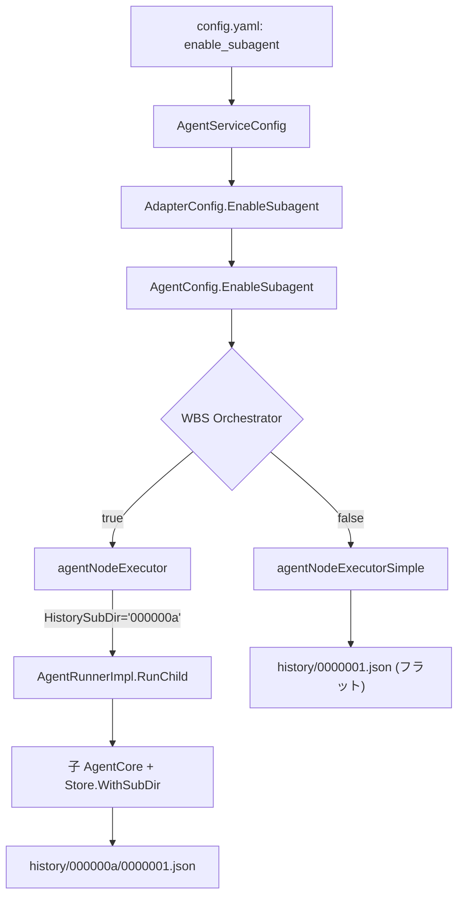

# 054: サブエージェント有効化とサブセッション階層ディレクトリ化

## 背景 (Background)

### サブエージェントの未有効化

WBS (Work Breakdown Structure) 実行時に、各ノードを独立した子セッションで実行する「サブエージェントモード」の実装は完了している (`agentNodeExecutor`, `AgentRunnerImpl.RunChild`)。しかし、`adapter.go` の `CreateSession` で `AgentConfig.EnableSubagent` を設定しておらず、Go のゼロ値 (`false`) のまま動作している。

結果として、全 WBS ノードが `agentNodeExecutorSimple` (親セッション内フォールバック) で実行され、以下の問題が発生している:

- **子セッションが作成されない**: サブエージェント用のセッションディレクトリや履歴が生成されない
- **コンテキスト爆発**: 全ノードのメッセージが親セッションに累積し、コンテキストが急速に膨張する (例: 187メッセージ/1セッション)
- **手動テストの無効化**: サブエージェント機能の検証が実質的にできていなかった

### サブセッション履歴のフラット格納問題

現在の `AppendHistory` はプレフィクスベース (ハイフン区切り) で履歴を格納する設計だが、これには以下の問題がある:

- **可読性が低い**: `000000a-0000001.json` のようなファイル名では親子関係が視覚的にわかりにくい
- **ディレクトリ操作が困難**: 特定のサブセッションの履歴だけを一覧・削除・バックアップしたい場合に grep が必要
- **深いネスト時のファイル名膨張**: 3階層以上のネストで `aaa-bbb-ccc.json` のようにファイル名が長大化する

## 要件 (Requirements)

### 必須要件

#### R1: サブエージェントの有効化

1. `config.yaml` の `agent_service` セクションに `enable_subagent` 設定を追加する
2. `config.AgentServiceConfig` に `EnableSubagent bool` フィールドを追加する
3. `tern/server.go` の `resolveAgentService` → `agentservice.New` → `AdapterConfig` のパスで `EnableSubagent` を伝播する
4. `codingagent.AdapterConfig` に `EnableSubagent bool` フィールドを追加する
5. `adapter.go` の `CreateSession` で `AdapterConfig.EnableSubagent` の値を `AgentConfig.EnableSubagent` に転写する
6. WBS ノード実行時に `agentNodeExecutor` (子セッションモード) が使われることを保証する
7. 子セッションディレクトリが `.wayfinder/{parentSessionID}-wbs-{nodeID}/` として作成される

設定例 (`config.yaml`):
```yaml
agent_service:
  port: 3100
  enable_subagent: true
```

#### R2: サブセッション履歴のディレクトリ階層化

現在のフラットなプレフィクスベース格納を、ディレクトリベースの階層構造に変更する。

**変更前** (フラットプレフィクス):
```
history/
  0000001.json          # ルートセッション Seq=1
  0000002.json          # ルートセッション Seq=2
  000000a-0000001.json  # サブセッション(親Seq=10) Seq=1
  000000a-0000002.json  # サブセッション(親Seq=10) Seq=2
```

**変更後** (ディレクトリ階層):
```
history/
  0000001.json          # ルートセッション Seq=1
  0000002.json          # ルートセッション Seq=2
  000000a/              # サブセッションディレクトリ (親Seq=10 → hex "000000a")
    0000001.json        # サブセッション Seq=1
    0000002.json        # サブセッション Seq=2
    0000005/            # 孫セッションディレクトリ (サブのSeq=5)
      0000001.json      # 孫セッション Seq=1
```

3階層以上のネストも同様にサブディレクトリで表現する:
```
history/
  {root_seq}.json
  {root_seq}/
    {sub_seq}.json
    {sub_seq}/
      {grandsub_seq}.json
```

#### R3: `Store.WithPrefix` のセマンティクス変更

`WithPrefix(prefix)` を `WithSubDir(subDir)` に改名し、`prefix` をファイル名のハイフン接頭辞ではなく、`history/` 以下のサブディレクトリパスとして扱う。

- `Store.WithSubDir("")` → ルート: `history/{seq}.json`
- `Store.WithSubDir("000000a")` → 子: `history/000000a/{seq}.json`
- `Store.WithSubDir("000000a/0000005")` → 孫: `history/000000a/0000005/{seq}.json`

#### R4: AppendHistory のインターフェース変更

`AppendHistory(histDir, msgs, prefix)` の `prefix string` パラメータを削除し、代わりにサブディレクトリパスを `histDir` に含める形に変更する。

- **変更前**: `AppendHistory("history/", msgs, "000000a")`
- **変更後**: `AppendHistory("history/000000a/", msgs)`

### 任意要件

#### O1: 子セッションのセッションディレクトリ構造

子セッションの `.wayfinder/` ディレクトリも、可能であれば親セッションのサブディレクトリとして配置することを検討する (ただし、現在の `{parentSessionID}-wbs-{nodeID}` 形式がそのまま動作しているため、優先度は低い)。

## 実現方針 (Implementation Approach)

### 1. 設定パスの追加 (config.yaml → adapter.go)

設定値の伝播パス:

```
config.yaml (agent_service.enable_subagent)
  → config.AgentServiceConfig.EnableSubagent
    → tern/server.go: resolveAgentService()
      → agentservice.New() の引数経由
        → codingagent.AdapterConfig.EnableSubagent
          → wayfinder.Adapter.CreateSession()
            → wayfinder.AgentConfig.EnableSubagent
```

#### 1a. `config/config.go` に追加

```go
type AgentServiceConfig struct {
    Port           int  `yaml:"port"`
    DisableSandbox bool `yaml:"disable_sandbox"`
    EnableSubagent bool `yaml:"enable_subagent"` // 追加
}
```

#### 1b. `codingagent/adapter_config.go` に追加

```go
type AdapterConfig struct {
    // ... 既存フィールド ...
    EnableSubagent bool // 追加
}
```

#### 1c. `tern/server.go` で伝播

`resolveAgentService` 内で `AdapterConfig` に設定を反映:

```go
adapterCfg := &codingagent.AdapterConfig{
    // ... 既存の設定 ...
    EnableSubagent: cfg.AgentService.EnableSubagent, // 追加
}
```

#### 1d. `adapter.go` で転写

```go
agentCfg := &AgentConfig{
    WorkDir:        cfg.WorkDir,
    SessionDir:     cfg.SessionDir,
    LogicalModel:   cfg.Model,
    EnableSubagent: a.adapterCfg.EnableSubagent, // AdapterConfig から転写
}
```

### 2. session/history.go の修正

`AppendHistory` のシグネチャを変更:

```go
// 変更前
func AppendHistory(histDir string, msgs []Message, prefix string) error

// 変更後
func AppendHistory(histDir string, msgs []Message) error
```

サブディレクトリの `MkdirAll` を呼び出し元 (`session_store.go`) で行う。

### 3. session/session_store.go の修正

`WithPrefix` を `WithSubDir` に改名:

```go
// 変更前
func (s *Store) WithPrefix(prefix string) *Store {
    return &Store{rootDir: s.rootDir, prefix: prefix}
}

// 変更後
func (s *Store) WithSubDir(subDir string) *Store {
    return &Store{rootDir: s.rootDir, subDir: subDir}
}
```

`Save` メソッドで `subDir` をサブディレクトリパスとして使用:

```go
histDir := filepath.Join(dir, "history", s.subDir)
os.MkdirAll(histDir, 0755)
AppendHistory(histDir, newMsgs)
```

### 4. agent_core.go の子セッション Store 連携

`agentNodeExecutor.ExecuteNode` 内で、子セッションの `Store` にサブディレクトリ情報を渡すフローを具体化する。

#### 4a. `subagent.AgentRunnerConfig` にサブディレクトリフィールド追加

```go
// subagent/config.go (または types.go)
type AgentRunnerConfig struct {
    // ... 既存フィールド ...
    HistorySubDir string // 子セッション履歴のサブディレクトリパス
}
```

#### 4b. `agentNodeExecutor.ExecuteNode` でサブディレクトリを設定

`agent_core.go` の `agentNodeExecutor.ExecuteNode` で、WBS ノード実行直前に親セッションの現在の `nextSeq` を取得し、それをサブディレクトリパスとして子セッションに渡す:

```go
func (e *agentNodeExecutor) ExecuteNode(ctx context.Context, node planning.WBSNode) (string, error) {
    prompt := fmt.Sprintf("[WBS Step %s: %s]\n%s", node.ID, node.Name, node.Description)
    childSessionID := fmt.Sprintf("%s-wbs-%s", e.parentSessionID, node.ID)

    // 親セッションの現在 Seq を 7桁 hex に変換し、サブディレクトリパスとする
    childCfg := *e.childConfig
    childCfg.HistorySubDir = fmt.Sprintf("%07x", currentParentSeq)

    childResult, err := e.runner.RunChild(ctx, &childCfg, childSessionID, e.llm, e.logger, prompt)
    // ...
}
```

#### 4c. `agent_runner.go` の `RunChild` でサブディレクトリ Store を注入

```go
func (r *AgentRunnerImpl) RunChild(...) (string, error) {
    // ... 既存のchildCfg, wrappedLLM, child 作成 ...

    // サブディレクトリ付き Store を子 AgentCore に注入
    if cfg.HistorySubDir != "" {
        childStore := session.NewStore(childCfg.SessionDir).WithSubDir(cfg.HistorySubDir)
        child.SetStore(childStore)  // 新メソッド追加が必要
    }

    return child.Run(ctx, prompt)
}
```

#### 4d. 結果としての履歴ディレクトリ構造

親セッション `wf-123` が WBS ノードを Seq=10 で開始した場合:

```
.wayfinder/wf-123/history/
  0000001.json          # 親のシステムプロンプト等
  ...
  000000a.json          # 親の WBS ノード開始メッセージ (Seq=10)
  000000a/              # 子セッションのサブディレクトリ
    0000001.json        # 子セッションの最初のメッセージ
    0000002.json        # 子セッションの2番目のメッセージ
    ...
```

### アーキテクチャ図



## 検証シナリオ (Verification Scenarios)

1. `ternctl run --agent wayfinder` で WBS を含むタスクを実行する
2. WBS ノードごとに子セッションディレクトリが `.wayfinder/{parentID}-wbs-{nodeID}/` として作成されることを確認する
3. 親セッションの `history/` ディレクトリに:
   - ルートレベルのメッセージファイル (`0000001.json` 等) が存在する
   - WBS ノード開始時のシーケンス番号に対応するサブディレクトリ (`000000a/` 等) が作成される
   - サブディレクトリ内に子セッションのメッセージファイルが存在する
4. 3階層以上のネストが発生した場合、孫ディレクトリが正しく作成されることを確認する
5. コンパクション後も既存の履歴ファイル/ディレクトリが保護されることを確認する

## テスト項目 (Testing for the Requirements)

### 単体テスト

- `history_test.go`: `AppendHistory` のシグネチャ変更に伴うテスト更新
- `history_test.go`: サブディレクトリ作成のテスト追加
- `session_store_test.go`: `WithSubDir` のテスト追加
- `tools_test.go`: 既存テストが11ツール登録を確認していることを保証

### ビルド検証

```bash
./scripts/process/build.sh
```

### 統合テスト (手動確認が中心)

```bash
./bin/ternctl run --agent wayfinder --work-dir ./tmp/ --prompt "create a simple hello world go program"
```

実行後に `.wayfinder/` ディレクトリ構造を確認する。
