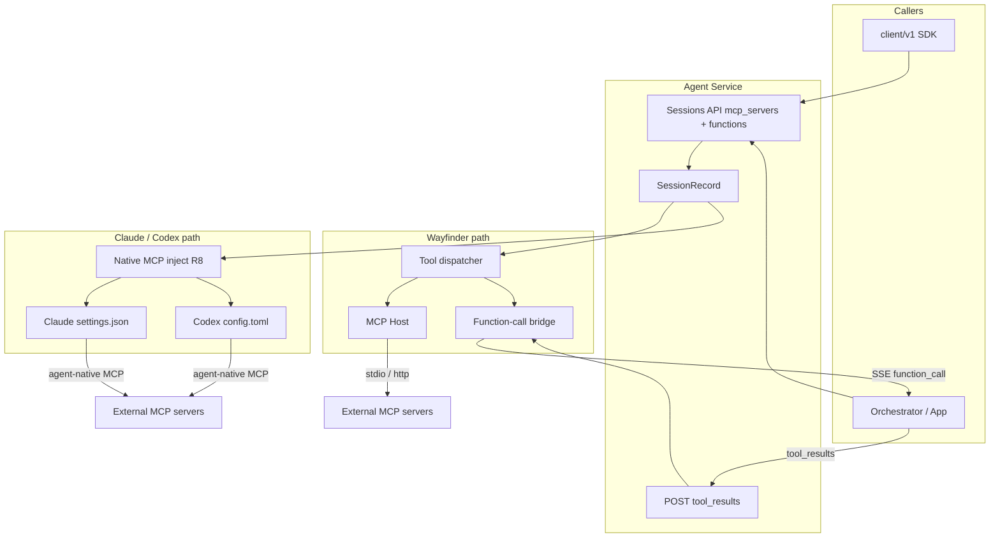

# 000: Tern への MCP / Function Calling 設定機能

## 背景 (Background)

Tern は Coding Agent と LLM の相互運用レイヤを提供している。呼び出し側の主インターフェースは **CAWA Client API** (`/api/v1/...` および Go SDK `client/v1`) である。ロードマップ Phase 2 では MCP 対応が掲げられているが、現状は次のとおりである。

- **Artifact MCP** (`shared/libs/go/artifact/mcp`) は、ユーザー Artifact 操作用の **in-process ツールディスパッチ**のみを提供する。stdio / HTTP(S) トランスポートは持たない。
- 外部 MCP サーバを登録・接続し、セッション実行から利用する経路は未整備である。
- Wayfinder は in-process の Function calling (Registry → LLM → Handler) を持つが、**Client API からツール定義を渡す手段はない**。
- Claude Code / Codex は各 CLI がツール実行を握っており、Tern 側でクライアント指定の関数を差し込む API もない。
- 既存の Client API は sessions / messages / agents / models / artifacts を扱うが、**MCP サーバやローカル関数を設定するエンドポイントはない**。

呼び出し側が求めるのは、単一の Client API から次を同じセッションに載せられることである。

1. **MCP サーバ** (stdio / HTTP(S)) — 外部プロセスまたはリモートエンドポイントのツール
2. **ローカル関数** — 呼び出し側が定義する Function calling 用の関数 (名前・説明・JSON Schema)
3. それらを LLM の **Function calling / tool_use** としてエージェント実行に参加させること

### なぜ config.yaml に置くのは不適切か

`config.yaml` は **サーバ運用者向け**の起動設定である。MCP やローカル関数の選択はジョブ / レーン / テナント依存であり、呼び出し側がセッション作成時に付け替えたい。設定の正は **Client API** とし、`config.yaml` へのツール定義追加は行わない。

### 既存資産との関係

| 既存 | 本仕様での扱い |
|------|----------------|
| CAWA Client API / `client/v1` | **ツール設定・照会・関数結果返却の主経路** |
| Session (`work_dir` / `session_dir` / `config_dir`) | ツール設定をセッションに紐づける土台 |
| Wayfinder `tools.Registry` | Function calling ループの先例。統合ディスパッチの接続点候補 |
| Artifact MCP (`CallTool`) | in-process ディスパッチの先例。外部 MCP / クライアント関数とは責務分離 |
| LLM Gateway tool sanitize / fallback | プロキシ互換層。ツール登録先にはしない |
| `config_dir` / セッションオーバーレイ | Claude / Codex への **MCP ネイティブ注入は必須** (R8)。既存の設定アセットオーバーレイと同系統 |

---

## 要件 (Requirements)

### 必須要件

#### R1: 統一ツール設定 (Client API)

- **R1-1**: 呼び出し側が Client API 経由で、セッションに紐づくツールを設定できること
- **R1-2**: ツール種別は少なくとも次の 3 つを同一セッションで混在指定できること
  - MCP `stdio`
  - MCP `http` (HTTPS 含む)
  - **ローカル関数** (`function`)
- **R1-3**: Go SDK (`client/v1`) からも同等操作ができること
- **R1-4**: 未指定時は現行どおり (ツール追加なし)。後方互換を壊さない

#### R2: 設定スキーマ

セッション作成・更新で渡す論理スキーマ例:

```json
{
  "mcp_servers": {
    "filesystem": {
      "transport": "stdio",
      "command": "npx",
      "args": ["-y", "@modelcontextprotocol/server-filesystem", "/workspace"],
      "env": { "NODE_ENV": "production" },
      "enabled": true
    },
    "remote-docs": {
      "transport": "http",
      "url": "https://mcp.example.com/mcp",
      "headers": { "Authorization": "Bearer ..." },
      "timeout_ms": 30000,
      "enabled": true
    }
  },
  "functions": {
    "lookup_ticket": {
      "description": "Look up a ticket by ID",
      "parameters": {
        "type": "object",
        "properties": {
          "ticket_id": { "type": "string" }
        },
        "required": ["ticket_id"]
      }
    }
  }
}
```

##### R2-A: MCP (`mcp_servers`)

- **R2-A-1**: `stdio` 必須: `transport`, `command`。任意: `args`, `env`, `cwd`, `enabled`
- **R2-A-2**: `http` 必須: `transport`, `url` (`http://` / `https://`)。任意: `headers`, `timeout_ms`, `enabled`
- **R2-A-3**: transport とフィールドの組み合わせを検証。不正時は `400`
- **R2-A-4**: サーバ名はセッション内で一意。空文字不可

##### R2-B: ローカル関数 (`functions`)

- **R2-B-1**: 各関数は少なくとも `description` と `parameters` (JSON Schema object) を持つ
- **R2-B-2**: 関数名はセッション内で一意。MCP 由来ツール名との衝突ルールを定義する (推奨: 衝突時は `400`、またはプレフィックスで隔離 — 実装計画で固定)
- **R2-B-3**: `parameters` は JSON Schema として構文検証する
- **R2-B-4**: ローカル関数の **実装本体 (ハンドラコード) は Client API に載せない**。定義 (スキーマ) のみを渡し、実行は R4 に従う

#### R3: API 形状

##### R3-1: CreateSession

- `POST /api/v1/sessions` に任意フィールド `mcp_servers`, `functions` を追加
- 検証失敗時はセッション未作成で `400`

##### R3-2: GetSession

- レスポンスに設定済みの `mcp_servers`, `functions` を含める
- MCP の `headers` / `env` はマスク (R6)

##### R3-3: PATCH Session

- `mcp_servers` / `functions` を更新可能
- 反映タイミングは **次のエージェント起動 (例: 次の SendMessage)** (`config_dir` と同様)
- 空オブジェクトでクリア可能。省略時の merge 規約は実装計画で固定

##### R3-4: Go SDK

```go
type MCPServerConfig struct {
    Transport string            `json:"transport"`
    Enabled   *bool             `json:"enabled,omitempty"`
    Command   string            `json:"command,omitempty"`
    Args      []string          `json:"args,omitempty"`
    Env       map[string]string `json:"env,omitempty"`
    Cwd       string            `json:"cwd,omitempty"`
    URL       string            `json:"url,omitempty"`
    Headers   map[string]string `json:"headers,omitempty"`
    TimeoutMS int               `json:"timeout_ms,omitempty"`
}

type FunctionConfig struct {
    Description string          `json:"description"`
    Parameters  json.RawMessage `json:"parameters"` // JSON Schema
}

type SessionRequest struct {
    Agent      string                     `json:"agent"`
    Model      string                     `json:"model,omitempty"`
    WorkDir    string                     `json:"work_dir"`
    SessionDir string                     `json:"session_dir,omitempty"`
    ConfigDir  string                     `json:"config_dir,omitempty"`
    MCPServers map[string]MCPServerConfig `json:"mcp_servers,omitempty"`
    Functions  map[string]FunctionConfig  `json:"functions,omitempty"`
}
```

##### R3-5: ドキュメント

- `docs/ReferenceManual-WebAPIs.md` にフィールド・エラー・Function calling イベントを追記する

#### R4: Function calling 実行モデル

Client API で指定したツールは、エージェント実行時に LLM の Function calling / tool_use として参加する。実行の担い手は種別で分ける。

| 種別 | 誰が実行するか | 結果の戻し方 |
|------|----------------|--------------|
| MCP (stdio / http) | **Tern ホスト**が `tools/call` | Tern がエージェントループへ直接供給 |
| ローカル関数 (`functions`) | **呼び出し側 (クライアント)** が実行 | Tern が呼び出し要求を通知 → クライアントが結果を API で返却 |

##### R4-1: ローカル関数の往復 (必須方針)

1. モデルがローカル関数を呼び出す
2. Tern はメッセージ SSE (または専用イベント) で `function_call` をクライアントへ通知する
   - 含める情報: `call_id`, `name`, `arguments` (JSON)
3. クライアントはローカルで関数を実行する
4. クライアントは結果を Tern へ返却する (例: `POST /api/v1/sessions/:id/tool_results` または messages の拡張)
5. Tern は結果をエージェント / LLM ループへ戻し、実行を継続する

##### R4-2: MCP の実行

- Tern がホストとして接続・呼び出し、結果をループへ戻す (クライアント往復は不要)
- クライアントには観測用イベントとして tool 実行を流してよい (任意だが推奨)

##### R4-3: タイムアウトとエラー

- ローカル関数の結果待ちにタイムアウトを設ける (値は実装計画で固定。設定可能が望ましい)
- タイムアウト / クライアントエラーはツールエラーとしてモデル側へ返し、セッション全体を必ず落とす必要はない
- MCP サーバ単位の失敗は他ツールを阻害しない

##### R4-4: エージェント対応範囲

| 対象 | MCP (`mcp_servers`) | ローカル関数 (`functions`) |
|------|---------------------|----------------------------|
| Wayfinder | 必須。Tern ホストが接続・実行しループへ供給 | 必須。クライアント往復 (R4-1) |
| Claude Code | **必須**。エージェントネイティブ設定へ MCP 注入 (R8) | 任意 (O1)。CLI がツールループを握るため別途検討 |
| Codex | **必須**。エージェントネイティブ設定へ MCP 注入 (R8) | 任意 (O1)。同上 |

#### R5: MCP ホスト ランタイム

- **R5-1**: セッションの `mcp_servers` に基づき外部 MCP へ接続する
- **R5-2**: `stdio` — 子プロセス + stdin/stdout
- **R5-3**: `http` — HTTP(S) MCP トランスポート (Streamable HTTP 第一候補。方言は実装計画で固定)
- **R5-4**: `tools/list` / `tools/call` 相当を提供
- **R5-5**: セッション終了・Terminate・Shutdown で stdio 子プロセスを確実に終了
- **R5-6**: 接続ライフサイクルはセッション単位
- **R5-7**: Wayfinder 向けの実行経路。Claude / Codex は R8 のネイティブ注入を主経路とし、同一 `mcp_servers` 定義を共有する

#### R8: Claude Code / Codex への MCP 注入 (必須)

Client API の `mcp_servers` を、各 Coding Agent が理解するネイティブ MCP 設定へ書き出し、エージェント起動時に利用可能にすること。

- **R8-1**: Claude Code — `{work_dir}/.mcp.json` の project-scope `mcpServers` へ、`mcp_servers` を注入する（Claude Code は `settings.json` の mcpServers を読まない）
- **R8-2**: Codex — セッション設定ルート (現行の `session_dir` / `CODEX_HOME` 配下) の MCP 設定 (例: `config.toml` の MCP サーバ定義) へ、`mcp_servers` を注入する
- **R8-3**: `stdio` と `http` (HTTPS 含む) の両方を、各エージェントがサポートする形式へマッピングする。エージェント側が非対応のフィールドがあれば、実装計画で明示し劣化方針を決める
- **R8-4**: 注入はエージェントプロセス起動前に行い、`config_dir` オーバーレイと同様に **次の起動から有効** とする。PATCH で `mcp_servers` を更新した場合も次回起動で再注入する
- **R8-5**: 注入先の既存 MCP 定義とのマージ方針を定義する (推奨: Tern 管理分は識別可能なキーで上書き、ユーザ固有定義は可能な範囲で保持 — 実装計画で固定)
- **R8-6**: Vault 参照 (`vault://`) は注入前にサーバ側で解決し、エージェントには解決後の値を渡す。平文シークレットをログに出さない
- **R8-7**: この経路では **エージェント自身が MCP クライアント** として接続・ツール実行する。Tern ホスト (R5) の二重接続は行わない (同じサーバを Tern と CLI の両方で起動しない)
- **R8-8**: `mcp_servers` が空 / 省略のときは注入を行わず現行互換とする

#### R6: シークレットとレスポンス衛生

- MCP の `env` / `headers` は平文または `vault://` 参照を許容
- ログ・エラー・GET レスポンスへ秘密を出さない (マスク)
- ローカル関数の `arguments` / `result` はアプリデータでありマスク必須ではないが、ログへの無制限ダンプは避ける

#### R7: 観測性

- セッション ID、ツール種別 (mcp/function)、サーバ名または関数名、成功/失敗を構造化ログへ
- MCP の command 全体・header/env 値はログに出さない

### 任意要件

#### O1: Claude Code / Codex へのローカル関数供給

- MCP 注入 (R8) は必須済み。こちらは `functions` (クライアント実行 Function calling) を CLI エージェントへ載せる場合の橋渡し
- CLI がツールループを握るため、実現可能性調査のうえ段階導入してよい

#### O2: セッション非依存のツールレジストリ API

- `/api/v1/mcp-servers` や `/api/v1/functions` のようなグローバル登録 + セッションは参照のみ

#### O3: サーバ内蔵ローカル関数の名前参照

- Tern プロセス内に事前登録した Handler を、Client API から名前だけで有効化する経路
  (本仕様の「クライアント実行ローカル関数」とは別物)

#### O4: MCP Resources / Prompts

- 初回は Tools のみ必須

#### O5: OAuth 等の高度なリモート認証

#### O6: config.yaml 既定ツール

- **採用しない**

---

## 実現方針 (Implementation Approach)

### アーキテクチャ概要



### 設計上の決定事項

| ID | 決定 | 理由 |
|----|------|------|
| D1 | 設定の正は **Client API** (`mcp_servers` + `functions`) | 呼び出し側がジョブ単位で混在指定できる |
| D2 | `config.yaml` にはツール定義を置かない | サーバ起動設定と関心事を分離 |
| D3 | MCP の実行主体はエージェント種別で分ける | Wayfinder は Tern ホスト (R5)。Claude / Codex はネイティブ注入後に CLI が実行 (R8)。二重接続しない |
| D4 | ローカル関数は **スキーマを API で渡し、実行はクライアント** | 「ローカル関数を直接指定」とハンドラ同梱の不可能性を両立 |
| D5 | Function calling 往復は SSE 通知 + tool_results API | 既存メッセージストリームモデルに載せる (主に Wayfinder) |
| D6 | Claude / Codex への **MCP 注入は必須** | 主要な Coding Agent 利用経路で Client API の `mcp_servers` が実効を持つ必要がある |
| D7 | トランスポートは stdio と http | ユーザー要件。注入時も両対応をマッピング |
| D8 | Go SDK 第一級対応 | 既存セッション API と同じ体験 |

### パッケージ配置 (案)

```
shared/libs/go/mcp/                    # MCP ホスト (Wayfinder 経路)
shared/libs/go/toolsession/            # セッションツールディスパッチ / FC ブリッジ (名称は実装時確定)
shared/libs/go/codingagent/claudecode/ # Claude 向け MCP 注入
shared/libs/go/codingagent/codex/      # Codex 向け MCP 注入
shared/libs/go/agentservice/           # API・SessionRecord・tool_results
shared/libs/go/wayfinder/              # Registry / ループへの接続
client/v1/                             # SDK 型・ヘルパ
docs/ReferenceManual-WebAPIs.md
```

### 非目標 (Non-Goals)

- Client API に実行コード (スクリプト本体) をアップロードしてサーバ実行すること
- `config.yaml` への mcp/functions 追加
- Tern を汎用 MCP サーバとして公開すること
- GUI 設定画面

---

## Client API 使用例

実装および `docs/ReferenceManual-WebAPIs.md` / `examples/mcp-session-tools/` の正本とする例。プレースホルダのパス・URL は環境に合わせて置換する。

### HTTP: セッション作成 (MCP + ローカル関数)

`POST /api/v1/sessions`

```http
POST /api/v1/sessions HTTP/1.1
Host: localhost:3100
Content-Type: application/json

{
  "agent": "wayfinder",
  "model": "qwen2.5-coder:7b",
  "work_dir": "/path/to/workspace",
  "session_dir": "/path/to/tern-sessions/job-1",
  "mcp_servers": {
    "filesystem": {
      "transport": "stdio",
      "command": "npx",
      "args": ["-y", "@modelcontextprotocol/server-filesystem", "/path/to/workspace"],
      "enabled": true
    },
    "remote-docs": {
      "transport": "http",
      "url": "https://mcp.example.com/mcp",
      "headers": {
        "Authorization": "vault://mcp/remote-docs/token"
      },
      "timeout_ms": 30000,
      "enabled": true
    }
  },
  "functions": {
    "lookup_ticket": {
      "description": "Look up a ticket by ID",
      "parameters": {
        "type": "object",
        "properties": {
          "ticket_id": { "type": "string" }
        },
        "required": ["ticket_id"]
      }
    }
  }
}
```

成功時 (例):

```json
{
  "session_id": "a95db64cb646901efb395a18d817a37d",
  "status": "active"
}
```

### HTTP: セッション取得 (シークレットはマスク)

`GET /api/v1/sessions/{session_id}`

```json
{
  "id": "a95db64cb646901efb395a18d817a37d",
  "agent_name": "wayfinder",
  "work_dir": "/path/to/workspace",
  "session_dir": "/path/to/tern-sessions/job-1",
  "mcp_servers": {
    "remote-docs": {
      "transport": "http",
      "url": "https://mcp.example.com/mcp",
      "headers": {
        "Authorization": "***"
      },
      "timeout_ms": 30000,
      "enabled": true
    }
  },
  "functions": {
    "lookup_ticket": {
      "description": "Look up a ticket by ID",
      "parameters": {
        "type": "object",
        "properties": {
          "ticket_id": { "type": "string" }
        },
        "required": ["ticket_id"]
      }
    }
  }
}
```

### HTTP: セッション更新 (MCP のみ置換、functions は維持)

`PATCH /api/v1/sessions/{session_id}`

```json
{
  "mcp_servers": {
    "filesystem": {
      "transport": "stdio",
      "command": "npx",
      "args": ["-y", "@modelcontextprotocol/server-filesystem", "/path/to/workspace"]
    }
  }
}
```

クリア例 (`mcp_servers` を空にする。省略とは意味が違う):

```json
{
  "mcp_servers": {}
}
```

### HTTP: ローカル関数結果の返却 (Wayfinder)

メッセージ SSE で `function_call` を受信したあと:

`POST /api/v1/sessions/{session_id}/tool_results`

```json
{
  "call_id": "call_01HXYZ",
  "content": "{\"title\":\"Bug: login fails\",\"status\":\"open\"}",
  "is_error": false
}
```

SSE `function_call` イベント例:

```json
{
  "type": "function_call",
  "call_id": "call_01HXYZ",
  "name": "lookup_ticket",
  "arguments": { "ticket_id": "T-123" }
}
```

### HTTP: Claude / Codex で MCP のみ付ける例

```json
{
  "agent": "claudecode",
  "work_dir": "/path/to/workspace",
  "session_dir": "/path/to/tern-sessions/claude-1",
  "mcp_servers": {
    "playwright": {
      "transport": "stdio",
      "command": "npx",
      "args": ["-y", "@playwright/mcp@latest"]
    },
    "docs": {
      "transport": "http",
      "url": "https://code.claude.com/docs/mcp"
    }
  }
}
```

起動前に Tern が `work_dir/.mcp.json` (Claude) または `session_dir/config.toml` (Codex) へ注入する。

### Go SDK (`client/v1`) 例

```go
package main

import (
	"context"
	"encoding/json"
	"fmt"
	"log"

	client "github.com/axsh/arctic-tern/client/v1"
	"github.com/axsh/arctic-tern/shared/libs/go/toolconfig"
)

func main() {
	ctx := context.Background()
	c := client.New("http://localhost:3100", client.WithNoTimeout())

	enabled := true
	sess, err := c.CreateSession(ctx, client.SessionRequest{
		Agent:      "wayfinder",
		WorkDir:    "/path/to/workspace",
		SessionDir: "/path/to/tern-sessions/job-1",
		MCPServers: map[string]toolconfig.MCPServerConfig{
			"filesystem": {
				Transport: "stdio",
				Command:   "npx",
				Args:      []string{"-y", "@modelcontextprotocol/server-filesystem", "/path/to/workspace"},
				Enabled:   &enabled,
			},
			"remote-docs": {
				Transport: "http",
				URL:       "https://mcp.example.com/mcp",
				Headers:   map[string]string{"Authorization": "vault://mcp/remote-docs/token"},
				TimeoutMS: 30000,
				Enabled:   &enabled,
			},
		},
		Functions: map[string]toolconfig.FunctionConfig{
			"lookup_ticket": {
				Description: "Look up a ticket by ID",
				Parameters:  json.RawMessage(`{"type":"object","properties":{"ticket_id":{"type":"string"}},"required":["ticket_id"]}`),
			},
		},
	})
	if err != nil {
		log.Fatal(err)
	}

	info, err := c.GetSession(ctx, sess.ID)
	if err != nil {
		log.Fatal(err)
	}
	fmt.Println("mcp servers:", len(info.MCPServers), "functions:", len(info.Functions))

	// PATCH: replace mcp_servers only (functions unchanged)
	fsOnly := map[string]toolconfig.MCPServerConfig{
		"filesystem": {
			Transport: "stdio",
			Command:   "npx",
			Args:      []string{"-y", "@modelcontextprotocol/server-filesystem", "/path/to/workspace"},
		},
	}
	if _, err := c.PatchSession(ctx, sess.ID, client.SessionPatch{MCPServers: &fsOnly}); err != nil {
		log.Fatal(err)
	}

	stream, err := sess.SendMessage(ctx, []client.ContentPart{
		client.TextPart("Look up ticket T-123 using lookup_ticket, then summarize."),
	})
	if err != nil {
		log.Fatal(err)
	}
	defer stream.Close()

	for stream.Next() {
		ev := stream.Event()
		// When type == function_call, run the local function and:
		// _ = sess.SubmitToolResult(ctx, client.ToolResultRequest{
		//     CallID: ev.CallID, Content: resultJSON, IsError: false,
		// })
		fmt.Printf("%v\n", ev)
	}
	if err := stream.Err(); err != nil {
		log.Fatal(err)
	}
}
```

実行可能なサンプルは実装時に `examples/mcp-session-tools/` へ置く (実装計画 Part 1 / Part 3)。

---

## 検証シナリオ (Verification Scenarios)

### VS1: stdio MCP

1. CreateSession に `mcp_servers` (stdio) を付ける
2. Tern がプロセス起動・tools/list・tools/call できる
3. セッション終了後に子プロセスが残らない

### VS2: HTTP(S) MCP

1. CreateSession に `transport: http` を付ける
2. リモートへ接続し list/call できる

### VS3: ローカル関数の Function calling

1. CreateSession に `functions.lookup_ticket` を付ける
2. エージェント実行で当該関数が呼ばれる
3. クライアントが SSE で `function_call` を受け取る
4. `tool_results` を返すと実行が継続し、最終応答に結果が反映される

### VS4: MCP とローカル関数の混在

1. 同一セッションに両方を設定する
2. MCP ツールは Tern が実行し、ローカル関数はクライアント往復になる

### VS5: SDK

1. `client/v1` で `MCPServers` / `Functions` を渡せること
2. Get / PATCH / tool_results 相当が使えること

### VS6: 不正設定・後方互換・部分障害

1. 不正 MCP / 不正 JSON Schema は `400`
2. 両フィールド省略時は現行動作
3. MCP 1 台失敗でも他ツールとセッションは継続可能

### VS7: Claude Code への MCP 注入

1. `agent=claudecode` (実装上のエージェント名に合わせる) で CreateSession し `mcp_servers` に stdio と http を含める
2. 起動前にネイティブ設定へ注入されている
3. エージェント実行中に当該 MCP ツールを利用できる (観測可能な tool イベントまたは同等の検証)

### VS8: Codex への MCP 注入

1. `agent=codex` で同様に CreateSession する
2. ネイティブ設定へ注入され、エージェント実行中に MCP ツールを利用できる

---

## テスト項目 (Testing)

手動確認のみ禁止。

### 単体テスト

| 対象 | 内容 |
|------|------|
| リクエスト検証 | MCP フィールド、function schema、名前衝突 |
| SessionRecord | 保存・更新・クリア |
| マスク | MCP headers/env |
| MCP Manager | list/call、部分障害、クリーンアップ |
| FC ブリッジ | function_call 通知、tool_results 適用、タイムアウト |
| Wayfinder 接続 | 定義の Registry 載荷とディスパッチ分岐 |
| Claude / Codex 注入 | `mcp_servers` → settings.json / config.toml へのマッピング、マージ、Vault 解決 |
| client/v1 | マーシャリングとヘルパ |

### 統合テスト

```bash
./scripts/process/build.sh

./scripts/process/integration_test.sh --categories common --specify mcp
./scripts/process/integration_test.sh --categories common --specify function_calling
./scripts/process/integration_test.sh --categories common --specify mcp_inject
```

(`--specify` の具体名は実装計画でテストファイルに合わせて更新。Claude / Codex 実プロセスが必要なケースは既存 gui/common の慣例に従う)

### 受け入れ対応

| シナリオ | 主な担保 |
|----------|----------|
| VS1–VS2 | 統合 mcp + fixture/httptest |
| VS3–VS4 | 統合 function_calling |
| VS5 | client/v1 単体 + 統合 |
| VS6 | 単体検証 + リグレッション |
| VS7–VS8 | 統合 mcp_inject (Claude / Codex) |

---

## オープン論点 (レビュー時に確定したいこと)

1. **ローカル関数の実行モデル (D4) でよいか**
   クライアント実行 + tool_results 往復を必須方針とした。サーバ内蔵 Handler の名前参照 (O3) を初回に含める必要はあるか
2. **tool_results の API 形状**
   専用 `POST .../tool_results` か、messages API の拡張か
3. **注入先ファイルの正式パスとマージ方針** (R8-1 / R8-2 / R8-5)
   Claude / Codex の現行バージョンにおける MCP 設定キーを実装計画で確定する
4. **HTTP トランスポート方言** (Streamable HTTP only / SSE も) — Tern ホスト経路と、CLI ネイティブが受け付ける形式の差分
5. **ツール名衝突時のルール** (400 vs プレフィックス)

確定済み: Client API が正 / MCP (stdio・http) とローカル関数の混在 / Function calling (Wayfinder) / **Claude・Codex への MCP 注入は必須**。上記残論点の回答があれば仕様へ即反映する。
