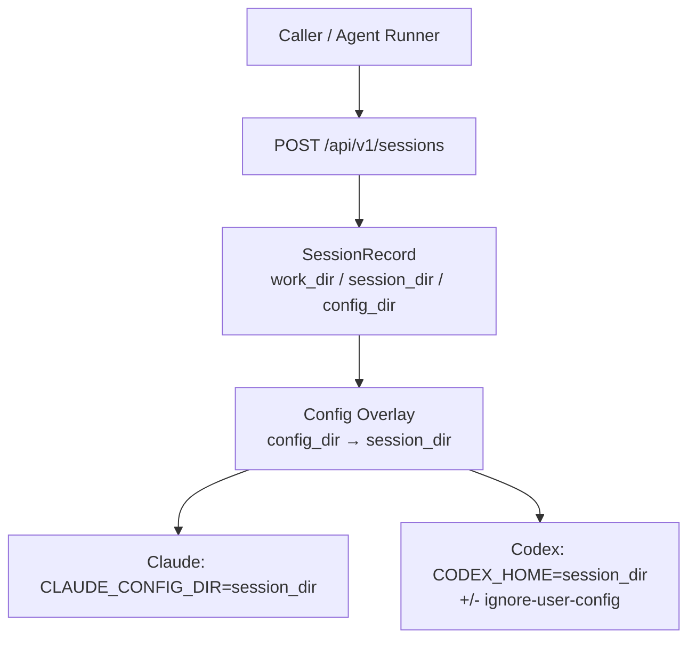

# 000: CreateSession における config_dir と session_dir の分離

- 関連 Issue: [axsh/arctic-tern#30](https://github.com/axsh/arctic-tern/issues/30)
- 先行設計: `feat-llm-backend/ideas/019-SessionPersistence-DirectoryConfig.md`
- 結論 (現実性): **API としての追加は現実的**。ただし Claude Code / Codex とも「設定ルート」と「セッション永続化ルート」を公式に分ける単一の環境変数は持たないため、**Tern が `config_dir` を解釈し、各アダプタ向けにオーバーレイ (コピー / シンボリックリンク / 設定注入) する**方式が必要。単純に `CODEX_HOME` / `CLAUDE_CONFIG_DIR` を `config_dir` に差し替えるだけでは要件を満たせない。

## 背景 (Background)

### Issue が求めること

Kanban 駆動のオーケストレーション (sysnavi Agent Runner → Tern CAWA) では、次の3関心事が独立に扱える必要がある。

| 関心事 | 既存ハンドル | 状態 |
|---|---|---|
| コードワークスペース | `work_dir` | あり |
| カード / ジョブ単位の会話再開 | `session_dir` | あり |
| レーン / プロファイル単位の rules・skills | **なし** | Issue #30 で要望 |

現状 `POST /api/v1/sessions` の `session_dir` は、アダプタ側で次のように **設定ルート兼セッションルート** へ直結している。

| エージェント | 環境変数 | 値の由来 |
|---|---|---|
| Claude Code | `CLAUDE_CONFIG_DIR` | `session_dir` |
| Codex CLI | `CODEX_HOME` | `session_dir` |

そのため、共有の rules / skills を使うには呼び出し側が各 `session_dir` へ設定を実体化 / シンボリックリンクする必要があり、寿命管理や並列レーン運用が複雑になる。

### 現状実装の要点

- `SessionConfig.SessionDir` / `SessionRecord.SessionDir` / `client/v1.SessionRequest.SessionDir` は既に存在する。
- Codex アダプタは `codex exec --json --ignore-user-config` に加え `-c` で gateway 向け設定を注入する。`CODEX_HOME` は主にセッション / 認証データの置き場として使われる。
- Claude Code アダプタは `CLAUDE_CONFIG_DIR=session_dir` を渡し、ユーザ設定・skills・会話 transcript を同一ルート配下に置く。
- 019 設計は「環境変数でルートを切り替える」こと自体を正しく導入したが、**設定と会話永続化の分離はスコープ外**だった。本仕様はその分割を CAWA 境界で行う。

### 製品側制約 (調査結果)

#### Claude Code

- `CLAUDE_CONFIG_DIR` は `~/.claude` 相当の **全体ルート置換**であり、settings / skills / rules と `projects/<hash>/*.jsonl` の transcript が同居する ([Sessions](https://code.claude.com/docs/en/sessions.md), [claude-directory](https://code.claude.com/docs/en/claude-directory))。
- セッション保存先だけを別ディレクトリへ向ける公式スイッチは見当たらない。
- プロジェクトスコープの `.claude/` (work_dir 配下) は別レイヤとして読み込まれる。`CLAUDE_CONFIG_DIR` と cwd 上の `.claude` が衝突する既知問題もあるため、work_dir への安易な注入は避ける。
- `CLAUDE_CONFIG_DIR` 配下のレイアウト (skills がルート直下か `.claude/` 配下か) に不整合報告があり、オーバーレイ時は実ディレクトリ規約を文書化する必要がある。

#### Codex CLI

- 状態ルートは `CODEX_HOME` (既定 `~/.codex`)。セッションもその配下 (`sessions/...`)。
- 設定レイヤ: user (`$CODEX_HOME/config.toml`) / project (`.codex/config.toml`) / CLI `-c` / profile (`--profile` → `$CODEX_HOME/<name>.config.toml`)。
- Tern 現行の `--ignore-user-config` により **`$CODEX_HOME/config.toml` は読まれない**。よって「`CODEX_HOME=config_dir` にすれば共有 config が効く」は現行フラグと矛盾する。
- project `.codex` は `--ignore-user-config` 後も読まれるが、lane プロファイルを work_dir に書くとリポジトリ内容と結合してしまう。
- Codex 純正の `--profile` は Tern が ignore-user-config している現状では実用的な横断スイッチにならない (Issue 指摘どおり)。

#### 結論

**「API 上の直交ハンドル」は実現可能**だが、**CLI ネイティブの完全分離はできない**。Tern が次を保証する。

1. `session_dir` → 会話 / エージェントセッション永続化のルート (現行どおり `CLAUDE_CONFIG_DIR` / `CODEX_HOME` の指す先)
2. `config_dir` → 共有またはレーン固有の rules / skills / 関連ファイルのソース
3. CreateSession (および同一レコードからの再開) 時に、アダプタが `config_dir` の内容をセッションルートへ適用する

呼び出し側は設定セットの配置・配布のみ担当し、カードごとの実体化は Tern に委譲できる。

## 要件 (Requirements)

### 必須要件

#### R1: CreateSession に任意フィールド `config_dir` を追加

- `POST /api/v1/sessions` リクエストに任意の `config_dir` (string, 絶対パス推奨) を追加する。
- 省略時は **v0.1.7 / 現行互換**: `session_dir` のみが `CODEX_HOME` / `CLAUDE_CONFIG_DIR` にマップされ、追加のオーバーレイは行わない。
- 相対パスが渡された場合は `WorkDir` / `SessionDir` と同様に絶対パスへ解決して記録する。
- 存在しないパス、またはディレクトリでない場合は `400 Bad Request` とする (メッセージで判別可能にする)。

#### R2: セッション記録と取得 API への永続化

- `SessionRecord` に `ConfigDir` を追加し、CreateSession 時の値を保存する。
- `GET /api/v1/sessions/:id` レスポンスに `config_dir` を含める。
- メッセージ送信・再開時はレコード上の `config_dir` を再利用する (呼び出しごとに上書きしない。上書きが必要なら別 Issue)。

#### R3: codingagent 層への伝播

- `SessionConfig` に `ConfigDir` を追加し、`WithConfigDir(dir string) SessionOption` を提供する。
- `ApplyDefaults` では `ConfigDir` の絶対パス化のみ行い、空の場合のフォールバックはしない (空 = 無効)。
- agentservice は CreateSession / 実行開始時に `WithConfigDir` を渡す。

#### R4: Claude Code アダプタの適用セマンティクス

- `CLAUDE_CONFIG_DIR` は **引き続き `session_dir`** を指す (会話永続化を壊さない)。
- `config_dir` 指定時、起動前に `config_dir` から `session_dir` へ **設定アセットをオーバーレイ**する。
  - 対象 (初期スコープ): `skills/`, `rules/`, `CLAUDE.md`, `settings.json` (および実装時に確認できる同等のユーザ設定ファイル)
  - 方式: シンボリックリンク優先、非対応環境 (例: 権限不足) ではコピーにフォールバック
  - 既存のセッション固有データ (`projects/`, transcript 等) は上書き・削除しない
- プロジェクトスコープ注入 (work_dir 配下への `.claude` 書き込み) は **行わない** (リポジトリ汚染と設定優先順位の衝突を避ける)。

#### R5: Codex アダプタの適用セマンティクス

- `CODEX_HOME` は **引き続き `session_dir`** を指す。
- `config_dir` 指定時:
  1. `config_dir` 内の skills / rules / 関連アセットを `session_dir` (CODEX_HOME) 配下へオーバーレイする
  2. Tern が gateway 接続に必要な `-c` オーバーライドは維持する
  3. 共有設定を効かせるため、`config_dir` 指定時は `--ignore-user-config` の扱いを見直す
     - 推奨: `config_dir` 未指定時は現行どおり `--ignore-user-config` を付与
     - `config_dir` 指定時は、オーバーレイ後の `$CODEX_HOME/config.toml` (または skills パスを含む同等設定) を読めるようにする。ただし model / provider / base_url 等の Tern 管理キーは `-c` が優先されることをテストで保証する
- Codex 純正 `--profile` フラグへの直接依存はしない (クロスエージェント統一のため)。

#### R6: クライアントライブラリとドキュメント

- `client` および `client/v1` の `SessionRequest` に `ConfigDir` (`json:"config_dir,omitempty"`) を追加する。
- `docs/ReferenceManual-WebAPIs.md` にフィールド意味・省略時互換・エージェント別優先順位を追記する。
- `ternctl` に `--config-dir` を追加する (手動検証と E2E の利便性)。

#### R7: 直交性の保証

- 同一 `config_dir` + 異なる `session_dir` で2セッションを作成できる。
- 同一 `session_dir` 方針を維持したまま `config_dir` のみ差し替えるケースは、オーバーレイ更新の定義をドキュメント化する (初期実装では「起動のたびにオーバーレイを再適用。セッション固有データは保持」)。

### 任意要件

#### O1: 名前付き profile 解決

- サーバ設定 (例: `agent_profiles` / `config_profiles`) で名前 → ディレクトリを解決し、リクエストの `profile` 文字列でも指定可能にする。
- 明示的 `config_dir` が渡された場合はそちらを優先する。
- MVP では必須としない。Issue の「directory 明示」を先に満たす。

#### O2: Wayfinder

- `config_dir` をレコードに保存するが、Wayfinder 本体への適用は初期スコープ外 (no-op + ログ) でよい。将来の拡張ポイントとしてフィールドだけ揃える。

#### O3: オーバーレイ戦略の設定

- コピー固定 / シンボリックリンク固定をサーバ設定やリクエストで選択可能にする。初期は「symlink 優先、失敗時 copy」の自動選択でよい。

### 非要件 (Out of Scope)

- 設定セット自体のオーサリング・配布 (Git / EBS / manifest) — 呼び出し側の責任
- CreateSession 以外のサイド Web API による agent home 書き換え
- Claude / Codex 本体へのパッチ (公式にセッションと設定ルートが分離されるまでの暫定は Tern 側オーバーレイ)
- work_dir 内プロジェクト設定 (`.claude` / `.codex`) の自動生成

## 実現方針 (Implementation Approach)

### 設計判断



1. **API フィールド名は `config_dir`** とする (明示ディレクトリが主契約。`profile` は O1)。
2. **永続化ルートは変えず、設定ソースを追加する**。CLI 制約を吸収する責任は Tern アダプタ層に置く。
3. **オーバーレイはアダプタ固有モジュール** (`claudecode/config_overlay.go`, `codex/config_overlay.go` など) に閉じ、共通インターフェース (例: `ApplyConfigDir(sessionDir, configDir string) error`) を codingagent に置いてもよい。
4. **破壊的変更を避ける**: `config_dir` 省略時はバイナリ互換・挙動互換を維持 (`--ignore-user-config` 含む)。
5. **絶対パス化**は `SessionDir` / `WorkDir` と同じく handler + `ApplyDefaults` で一貫させる。

### 変更対象 (概略)

| 層 | 主なファイル |
|---|---|
| API / service | `shared/libs/go/agentservice/handler.go` |
| ドメイン | `shared/libs/go/codingagent/options.go`, `session_store.go` |
| Claude | `shared/libs/go/codingagent/claudecode/process.go` (+ overlay) |
| Codex | `shared/libs/go/codingagent/codex/process.go`, `adapter.go`, `config.go` (+ overlay) |
| Client | `client/session.go`, `client/v1/session.go` |
| CLI | `features/ternctl/main.go` |
| Docs | `docs/ReferenceManual-WebAPIs.md` |
| Tests | `tests/agentservice_*`, adapter unit tests, 必要なら E2E |

### 優先順位 (エージェント内)

ドキュメントに明記する想定:

**Claude Code** (高い順): CLI flags > project `.claude` (work_dir) > `CLAUDE_CONFIG_DIR` (= session_dir, オーバーレイ済み user 設定)

**Codex**: CLI `-c` > (config_dir 有効時) `$CODEX_HOME` user 設定 / skills > project `.codex` > その他。`config_dir` 無効時は現行 (`--ignore-user-config` + `-c`) を維持。

### リスクと緩和

| リスク | 緩和 |
|---|---|
| Windows で symlink に管理者権限が必要 | copy フォールバック、CI で両方式をカバー |
| オーバーレイがセッション固有ファイルを壊す | 許可リスト方式。`projects/` 等は触れない |
| Codex で ignore-user-config 解除により意図しない user config が混入 | オーバーレイ先はカード専用 `session_dir` のみ。ホスト `~/.codex` は指さない |
| Claude の config レイアウト差異 | 実装前にアダプタテスト用フィクスチャで skills 解決パスを固定し文書化 |
| 並行セッションが同一 `config_dir` を読む | ソースは read-only 前提。書き込みは `session_dir` 側のみ |

## 検証シナリオ (Verification Scenarios)

Issue #30 の Acceptance ideas を転記・具体化する。

### シナリオ1: 省略時互換

1. `config_dir` なしで CreateSession する (`work_dir` / 任意で `session_dir` のみ)。
2. 従来どおり Claude なら `CLAUDE_CONFIG_DIR=session_dir`、Codex なら `CODEX_HOME=session_dir` かつ `--ignore-user-config` 付きで起動することを確認する。
3. GET session の `config_dir` は空または欠落でよい (omitempty)。

### シナリオ2: 共有 config + 別 session

1. 事前に `config_dir=/tmp/config-sets/alpha` に skills (または rules) を配置する。
2. セッション A: `session_dir=/tmp/sessions/card-1`, `config_dir=.../alpha`
3. セッション B: `session_dir=/tmp/sessions/card-2`, `config_dir=.../alpha`
4. 双方のプロセス環境では永続化ルートがそれぞれの `session_dir` であること、かつ alpha の skill / rule が各セッションから参照可能であることを確認する。

### シナリオ3: レーン別 config

1. lane A → `config_dir=.../alpha`, lane B → `config_dir=.../beta`
2. それぞれ別 `session_dir` で CreateSession する。
3. エージェントが参照する設定内容がレーンごとに異なることを確認する (skill 名やマーカーファイルで検証)。

### シナリオ4: 再開継続

1. `config_dir` 付きでセッションを作成し、メッセージを送って agent_session_id を得る。
2. 同一 session レコードで再開 (追加メッセージ) する。
3. 同じ `config_dir` が再適用され、会話が継続できることを確認する。

## テスト項目 (Testing)

手動確認のみは禁止。単体 + 統合を自動化する。

### 単体テスト

- `options_test.go`: `WithConfigDir`, 絶対パス化
- `agentservice` handler: リクエスト受理、レコード保存、不正パスで 400
- `claudecode` / `codex`: BuildEnv が session_dir を維持すること、overlay が許可リストのみ同期すること
- Codex: `config_dir` なしでは `--ignore-user-config` 維持、ありでは共有 skill が解決され gateway `-c` が勝つこと

### 統合テストコマンド

```bash
# API / レコードまわり
./scripts/process/integration_test.sh --specify "TestAgentService.*ConfigDir|TestE2E_.*ConfigDir"

# 既存 session_dir 互換のリグレッション
./scripts/process/integration_test.sh --specify "TestE2E_SessionDirFallback"

# アダプタ寄り E2E (環境に CLI がある場合)
./scripts/process/integration_test.sh --specify "TestE2E_.*ConfigDir.*Claude|TestE2E_.*ConfigDir.*Codex"
```

実装計画フェーズでテスト関数名を確定し、上記 `--specify` を計画書に合わせて更新する。

### ビルド検証

```bash
./scripts/process/build.sh
```

(Windows / Git Bash 想定。Linux / Remote-SSH Linux の場合は `--skip-etc` を付与。)
