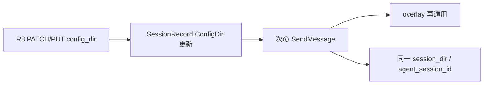

# 001: config_dir 切替継続 (同一 session_id) とテスト充実

- 親仕様: [000-ConfigDir-Separate-From-SessionDir.md](file://prompts/phases/000-foundation/branches/feat-profiles/ideas/000-ConfigDir-Separate-From-SessionDir.md)
- 関連 Issue: [axsh/arctic-tern#30](https://github.com/axsh/arctic-tern/issues/30)
- 目的: (1) 同一 `session_id` で `config_dir` を切り替えて会話継続する命題の Web API / 挙動を完成させること、(2) Claude / Codex の実 API キー E2E を含むテストでそれを証明すること
- **レビュー決定 (2026-08-05)**:
  - 最終受け入れは **vault 等の実 API キー** + 実 Claude / 実 Codex。課金許容。mock のみでは完了としない
  - **命題 B (必須)**: 同一 session_id を使い回し、`config_dir` 切替後も違うスキルが効きつつ会話継続。対応 Web API 必須 (親仕様 R8)

## 背景 (Background)

### 命題との対応

ユーザー命題:

1. Claude を使う
2. 同 session_id を使い回す
3. `config_dir` を切り替え、違うスキルなどが適用されつつも同じセッションが継続した会話ができる
4. 問題なければ Codex でも同じ

| # | 現行実装 (000 実装済み部分) | 本仕様での扱い |
|---|---|---|
| 1 | Create 時 `config_dir` + Claude overlay | 維持 + LIVE |
| 2 | SendMessage で同一 session_id | 維持 |
| 3 | **未実装** (Create 時固定のみ) | **親仕様 R8 更新 API + 本仕様の必須テスト** |
| 4 | Codex は単体 overlay のみ | integration + LIVE で Claude と対称 |

### 現状ギャップ

- Create 時の `config_dir` は実装済みだが、**同一 session_id での切替 API は未実装**
- 既存テストは「固定」や「別 session」中心で、命題 3 を証明できない
- E2E の一部が `ApplyClaudeConfigDir` 直接呼び出しに依存している

## 要件 (Requirements)

### 必須要件

#### R1: 同一 session_id での config_dir 切替 + 会話継続 (命題)

親仕様 R8 に対応する。次を自動テストで保証する。

1. Create (`config_dir=alpha`) → メッセージ1 (alpha マーカーが効く)
2. 更新 API で `config_dir=beta` → GET が beta。`session_id` / `session_dir` / `agent_session_id` は維持
3. メッセージ2 (beta マーカーが効く)。会話が同一セッションとして継続
4. Claude と Codex の両方 (integration は mock 可、最終は R7 LIVE)

#### R2: 同一 config_dir のまま複ターン継続

同一 `session_id` + 同一 `config_dir` で 2 メッセージ成功、overlay 再適用、保護ディレクトリ保持。

#### R3: config_dir 差の証明

併用必須:

1. **ファイルシステム**: overlay 後のレーン固有マーカー
2. **API レコード**: GET の `config_dir`
3. **命題経路**: 同一 session_id で alpha→beta 更新後、マーカーが beta に切り替わる

禁止: テストから `Apply*ConfigDir` を本番経路の代替として唯一の証明にすること。

#### R4: Claude Code

| ID | 内容 |
|---|---|
| C-IT-1 | Create + GET 永続化 |
| C-IT-2 | 同一 config で 2 メッセージ + overlay 再適用 |
| C-IT-3 | **同一 session_id で更新 API → 2 通目 beta overlay** (R1) |
| C-IT-4 | 省略時互換 |
| C-LIVE | R7 |

#### R5: Codex (Claude と対称)

| ID | 内容 |
|---|---|
| X-UT-1 | 既存 overlay / BuildArgs |
| X-IT-1〜3 | overlay・ignore-user-config・レーン分離 |
| X-IT-4 | **同一 session_id で更新 API** (R1) |
| X-LIVE | R7 |

Codex mock は Claude allowlist の流用のみで「カバーした」ことにしてはならない。

#### R6: 更新 API・クライアント・ドキュメント

- 親仕様 R8 エンドポイントを実装
- `client` / `client/v1` / `ternctl` / Reference Manual に反映
- 文言: 「同一 session_id で config_dir を更新できる。次のメッセージから新 config が overlay される。session_dir / 会話 ID は維持」

#### R7: 実 API キー最終確認 (必須・課金許容)

| ID | 内容 |
|---|---|
| LIVE-1 | `config_dir=alpha` で Create (Claude / Codex 各々) |
| LIVE-2 | SendMessage で alpha マーカーを読ませる / 短い成功応答 |
| LIVE-3 | **同一 session_id で更新 API → beta**。GET で確認 |
| LIVE-4 | SendMessage で beta が効き、`agent_session_id` 維持で会話継続 |
| LIVE-5 | overlay 痕跡が beta 側であること |

skip のみは受け入れ未完了。レート制限は再実行可。

### 任意要件

#### O1: 別 session_id でのレーン並列回帰

既存の SharedAcrossSessions 系は残してよい。

### 非要件 (Out of Scope)

- 名前付き profile (親仕様 O1)
- Wayfinder への config 適用
- 設定セット配布基盤

## 実現方針 (Implementation Approach)



1. **機能**: 親仕様 R8 の更新 API を実装 (本仕様の前提)。既存 Create/overlay を再利用。
2. **二段構え**: (A) integration mock で API・overlay・切替継続。(B) R7 LIVE で Claude / Codex 最終受け入れ。
3. **E2E**: helper 直接呼び出し禁止。SendMessage → 実アダプタ経由のみ。
4. **課金抑制**: 短文プロンプト、最小ターン。

### 変更対象 (想定)

| 種別 | パス |
|---|---|
| NEW/MODIFY | `shared/libs/go/agentservice/handler.go` (R8 更新 API) |
| MODIFY | `client/*`, `features/ternctl`, `docs/ReferenceManual-WebAPIs.md` |
| MODIFY | `tests/agentservice_integration_test.go`, `tests/agentservice_e2e_test.go` |

## 検証シナリオ (Verification Scenarios)

### シナリオ P: 命題 (同一 session_id 切替継続) — Claude 後に Codex

1. Claude で `config_dir=alpha` Create
2. メッセージ1: alpha マーカー確認
3. 更新 API で beta。GET・session_id / session_dir / agent_session_id 維持を確認
4. メッセージ2: beta マーカー確認、会話継続
5. 手順 1〜4 を Codex でも繰り返す

### シナリオ A: 同一 config 複ターン

更新なしで 2 メッセージ、overlay 再適用、保護ディレクトリ保持。

### シナリオ B: 別 session レーン並列 (回帰)

alpha / beta を別 session_id で Create する既存系。

### シナリオ C: 実 API キー LIVE (R7)

シナリオ P を実キーで実行。skip は受け入れ未完了。

## テスト項目 (Testing)

```bash
./scripts/process/build.sh

./scripts/process/build.sh && ./scripts/process/integration_test.sh --specify "TestAgentService_ConfigDir|TestAgentServiceCreateSession_ConfigDir|TestApplyClaudeConfigDir|TestApplyCodexConfigDir|TestCodexBuildArgs"

# 命題 + 実キー (課金あり・必須)
./scripts/process/integration_test.sh --specify "TestE2E_ConfigDir_Live|TestAgentService_ConfigDir_Switch"
```

(Linux / Remote-SSH Linux では `build.sh --skip-etc`、integration は `xvfb-run -a` ラップ。)

### 受け入れ基準

- [ ] 親仕様 R8 更新 API が実装されドキュメント化されている
- [ ] 命題シナリオ P が Claude / Codex の integration で通る
- [ ] **R7 LIVE が Claude / Codex で成功** (skip のみ不可、課金許容)
- [ ] E2E が helper 直接呼び出しのみに依存していない
- [ ] 上記 `--specify` が成功する
